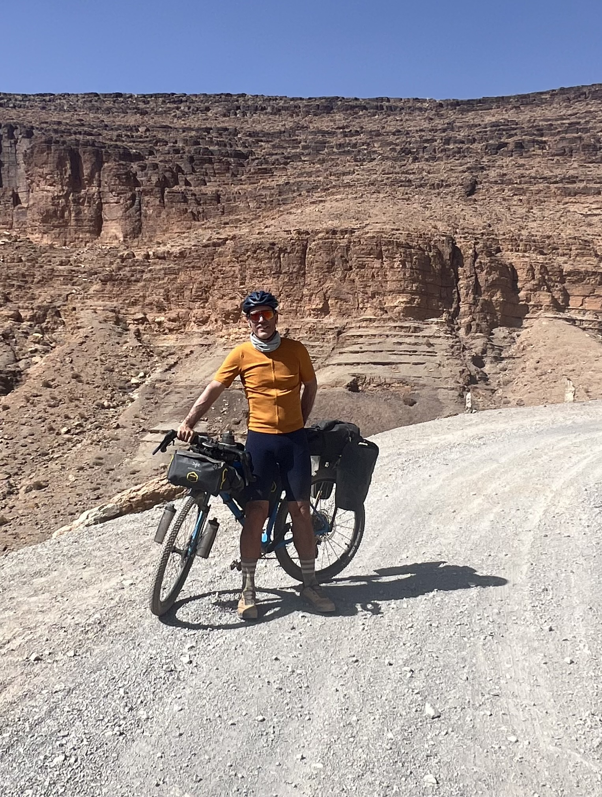

# Mobile Test Day 0

This is the intro sections. It should be a teaser.
Here I am trying to figure out how to create a blog.
sitting in my virtual test. It should have a nice highlight picture.

Testing if it looks better by embedding it into a card?
Or it could also be a tabbed pic.
Or just a resized/small pic with a defined width.

!!! tip "Morocco inspiration"
    Today I decided that I could make the tour divide!

    === "yes let's go for it"
    

::cards:: image-bg

- title: Day 0
  url: https://bikepacking.com/routes/great-divide-mountain-bike-route-gdmbr/
  content: Lorem ipsum dolor sit amet.
  image: day0/MarocSelfie.jpg

- title: 
  content: Lorem ipsum dolor sit amet.
  image: day0/MarocSelfie.jpg

::/cards::

<!-- more -->
The simplest form :

Image with Glightbox commenting.
{ data-title="My Proud OpenUP." data-description="It started beginning 2023 when I purchased my Gravel from Open Cycle, kudos to Andy Kessler and Gerard Vroomen for their vision." }

Image leveraging the figure meta-data (title is removed).
{ data-description="It started beginning 2023 when I purchased my Gravel from Open Cycle, kudos to Andy Kessler and Gerard Vroomen for their vision." }

Image with all data- removed. But added as caption.

<figure markdown>

{ width="500px" }
<figcaption>The journey actually started beginning 2023 when I purchased my Gravel from Open Cycle, kudos to Andy Kessler and Gerard Vroomen for their vision.</figcaption>

</figure>

Working copy looks more promising…

<figure markdown>

{ width="300" }
<figcaption markdown>Part of my Tour Divide project</figcaption>

{ width=“300” }
<figcaption markdown>Where decisions are getting matured</figcaption>

</figure>

Ces quelques lignes visent à tester un blog qui puisse m'accompagner dans mon
Maybe I could write in my notebook.
and then copy over to repo...?
need also a workflow for pictures...
realistic?
