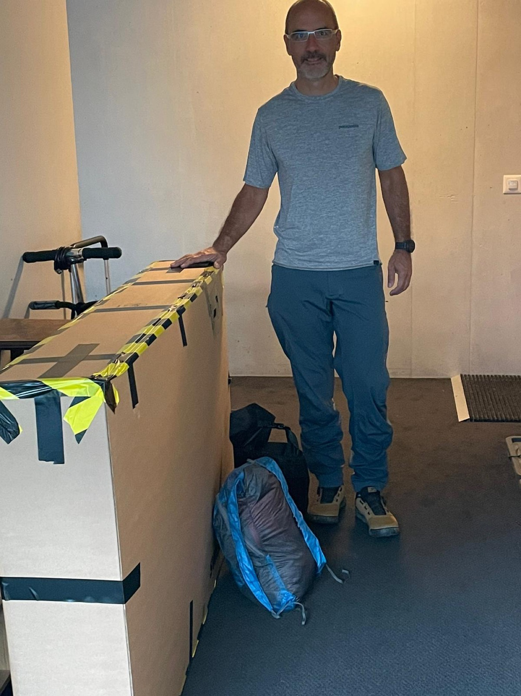
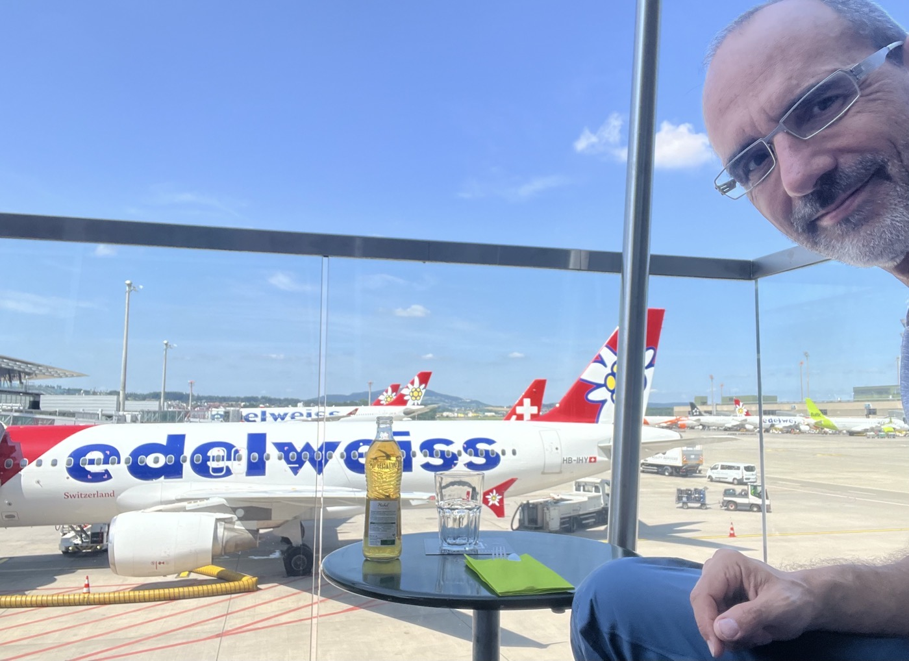

# Take-off

<figure markdown>
{ width=“300†}
</figure>

Buckle-up! It's getting serious. Biggest learning of the day : don't plan too much ahead, let the way guide you as well.

<!-- more -->

After a stressful packing, it finally had a happy end and check-in went fine once at Geneva airport. Close though (400g left out of 23Kg allowance) ⚖️.

With Valérie we could then enjoy some quality time (incl. a nice cappuccino with a nice drawing on it ❤️).

I also was able to enjoy Zürich Kloten airport a bit longer : connection to Calgary got delayed by 1h30. Hello terrasse ☕️ again.

Then I learnt that Jasper is in flames. Terrible news, apparently the fire is in the city 🔥🔥🔥🔥. It's been too hot: 40Deg Celsius. Jasper national park is closed, the famous Icefields Parkway between Lake Louise/Banff and Jasper is also closed mid way. Well - I was planning to start from Jasper... 🧐 what now?

Let's see once in Calgary. I envisage first unboxing/gearing up the bike and take a room close to Calgary airport. I also saw that the Trans-Canadian Trail (TCT) could take me to Banff. And probably I would then head south... leaving the parkway 93 behind me and hoping fire will be under control soon though.

Update : [the news for Jasper made it home](https://www.rts.ch/info/monde/2024/article/au-canada-un-feu-de-foret-a-ravage-la-ville-touristique-de-jasper-laissant-un-spectacle-de-desolation-28581173.html). I am definitely going to head to Banff. Quite sad about the devastation...

<figure markdown>
{ width=“300†}
{ width=“300†}
{ width=“300†}
</figure>

