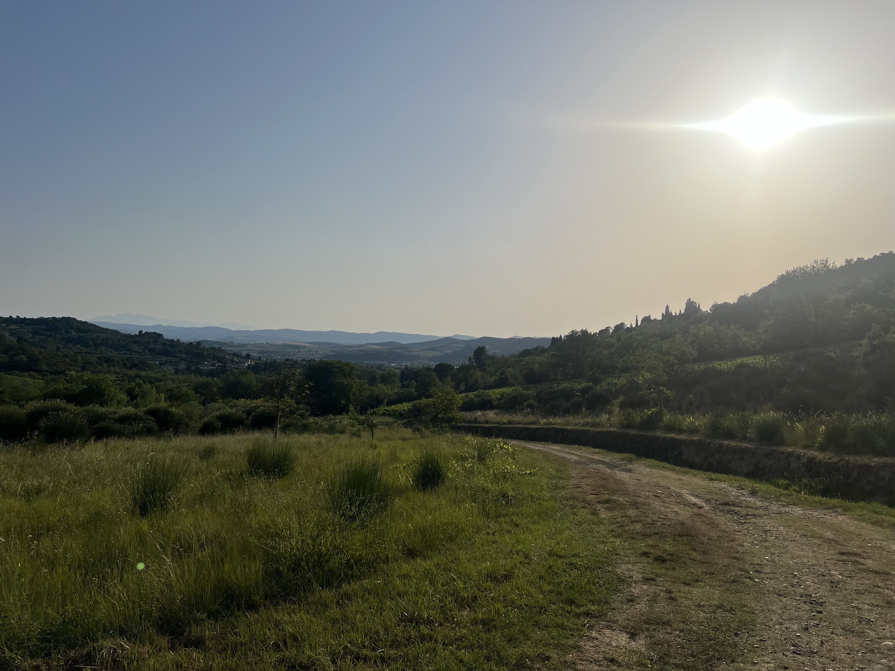

# On fait pas le malin le 1er jour

<figure markdown>
{ width=“300” }
</figure>

A cause des feux de forêts sur Jasper, j'ai décidé de rejoindre Banff en vélo. Mais la période de rodage et d'acclimatation est taquine. **30km/h** de vent de face toute la journée... Pour arriver dans les premiers parcs et découvrir les camping canadiens.

<!-- more -->

# Un autre monde

Banff est en fait la ville de depart que je visais, celle qui donne aussi le "Grand Départ" à la [Tour Divide](https://fr.wikipedia.org/wiki/Tour_Divide?wprov=sfti1) (la version course de ma trace GDMBR). Le départ se fait le 2ème vendredi de juin. Il n'y a pas de logistique particulière, autrement que de s'enregistrer sur TrackLeader avec un traceur GPS et respecter les règles de course (en autonomie, toute assistance doit être accessible à tout participant). Les meilleurs roulent jour et nuit.

En principe - 140km sur la route - cela me paraissait jouable. Mais que nenni!

D'abord : quitter Calgary était un peu (...) difficile. Au Canada, les vélos sont catégorisé piétons. Donc la trace Komoot me fait suivre les chemins pédestres. Les passages piétons etc... bon au début on fait pas le malin hein.

Ensuite - j'attaque l'autoroute. Car au Canada, les vélos roulent sur la bande d'arrêt d'urgence (comment on passe de piéton à voiture est assez transparent dans l'histoire). Et il faut voir le gabarit de ce qui passe à côté à 100km/h, un vendredi soir. D'ailleurs les distances sont en km sur les panneaux?

Bref : me voilà sur l'autoroute et : j'avance pas. Déjà que mon vélo pèse une tonne (je m'étais pas trop entraîné avec du lest). Alors le vent de face (et rafales) est assez terrible. En fait je dois pédaler dans les descentes pour avancer. Et dans ma tête je vois l'objectif Banff de plus en plus éloigné.

Pas de problème, il y a des camping sur la route. Mais aussi beaucoup de panneaux [Stoney Nation](https://fr.wikipedia.org/wiki/Stoneys?wprov=sfti1) et First Nation. Accès prohibé, drogues interdites. Charmant.

Je m'accroche et m'accorde une pause à 14h. C'est la cérémonie des jeux olympique : je regarde vite le direct en ayant des Pad Thaï et je vois un homme-schtroumpf (donc peint en bleu) qui chante couché. J'ai pas insisté - j'ai changé de monde. Mais Valérie me dit que la cérémonie est bien surtout le final.

Pour finir - je découvre que tous les campings sont "complets". Enfin souvent. Même pour un vélo avec une tente 1 place. La chasse à la place de camping est ouverte! Finalement je découvre la formule "first come / first serve". On se cherche une place, on s'enregistre (stylo et formulaire), on donne son numéro de carte de crédit. Et le responsable passe en voiture et valide tout.

# Anecdote du jour

J'avais la place 100. Les campings sont en fait immenses, les places immenses, les voitures immenses etc... moi je devais occuper 10% de ma place (sans exagérer. 

Je rentre de sanitaires et là une dame avec 2 enfants que je croise me dit : "juste que vous sachiez, on vient de voir un ours à la place 96". Donc à 4 places de ma tente! Je demande s'il y a des consignes dans ce cas. La réponse est crier et avoir du spray anti-ours. Ben justement : moi j'étais venu au camping parce que je n'avais pas (encore) mon spray!

Fin de l'histoire: les gardes du camping passent, vérifient l'enregistrement de ma place et me glissent qu'il y a un ours qui se promène. Et ils me vendent un spray. Avec terminal de paiement dans la voiture... ils sont redoutables quand même.

Je m'endors à 1300m - les températures sont fraîches.

<figure markdown>
{ width=“300” }
{ width=“300” }
{ width=“300” }
{ width=“300” }
{ width=“300” }
{ width=“300” }
{ width=“300” }
 { width=“300” }
{ width=“300” }
{ width=“300” }
{ width=“300” }
{ width=“300” }
</figure>

