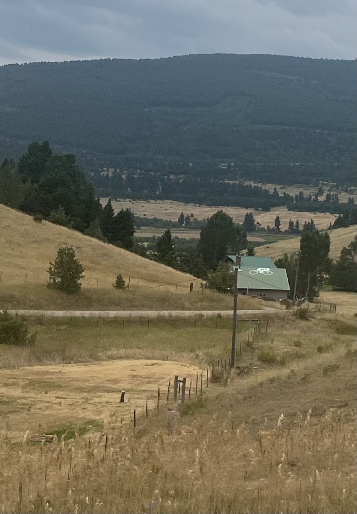
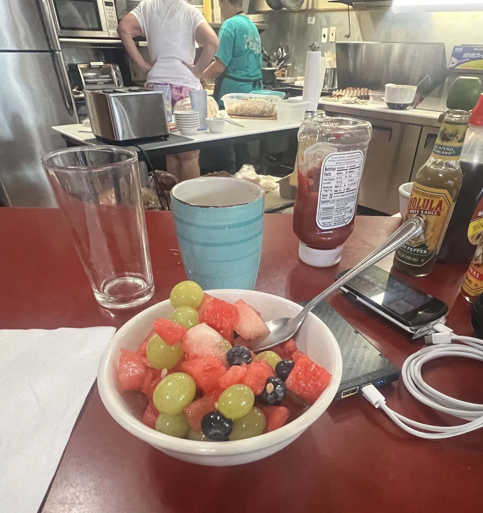
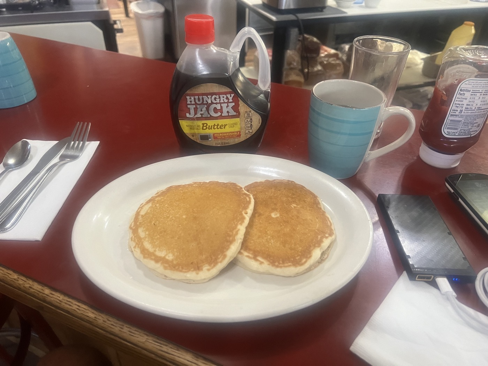
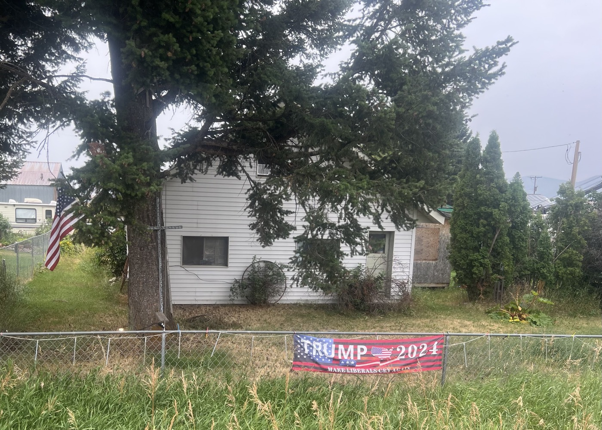
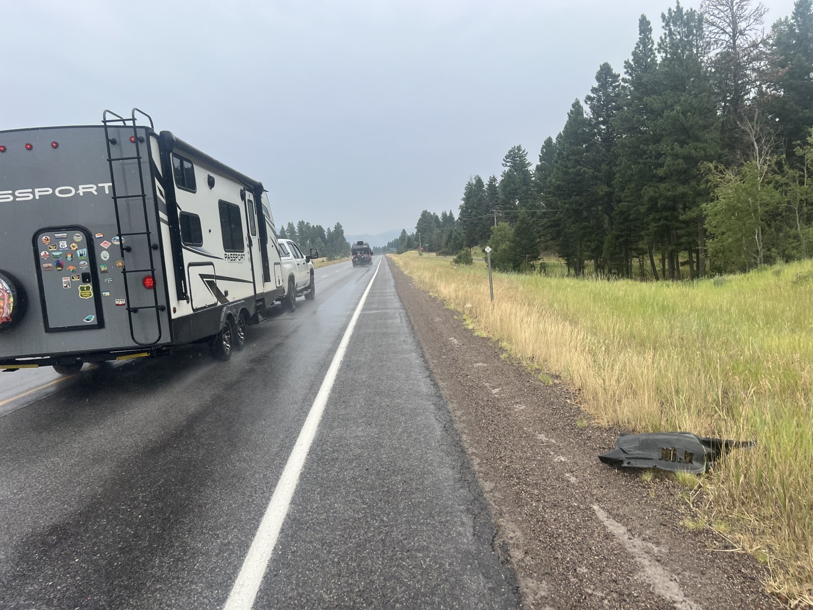
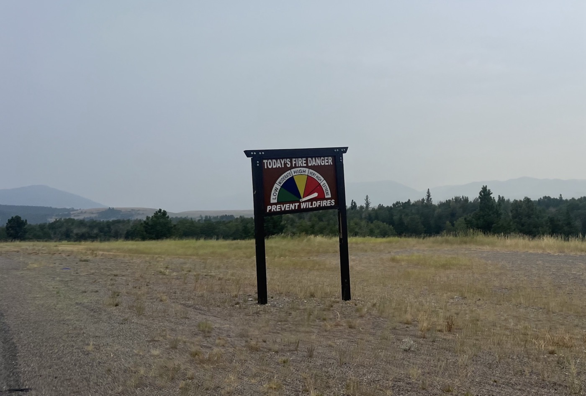
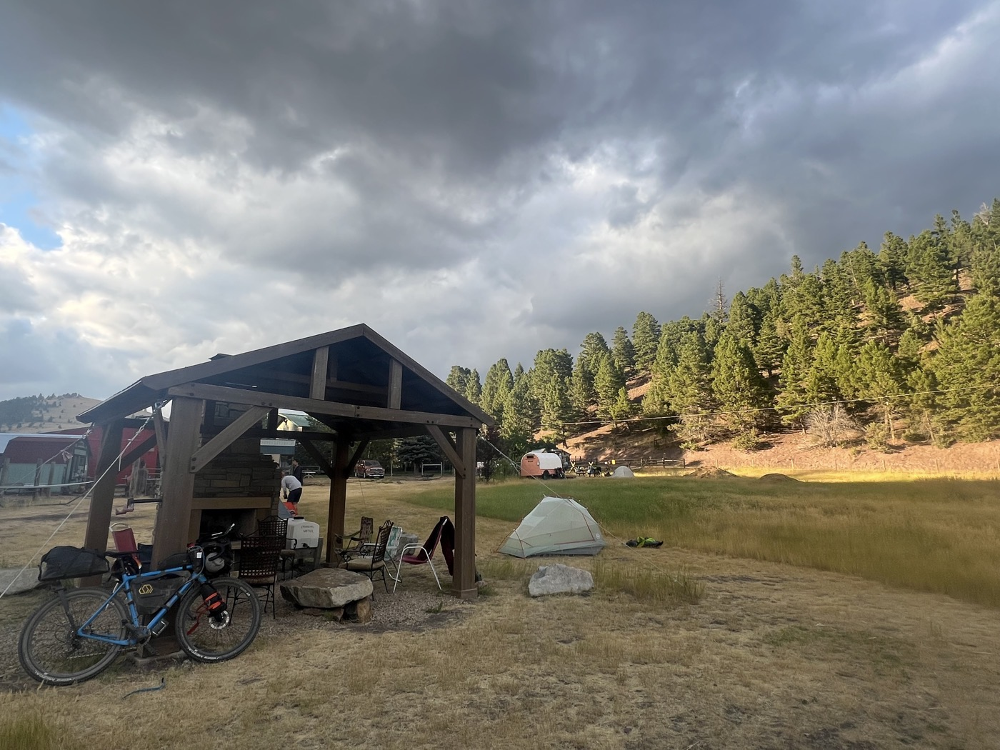

# Alpaca Farm 

<figure markdown>
{ width=“300” }
</figure>

Je pars à 9h03 ☺️ et je vise le Lama Ranch - un passage obligé sur la Divide. Je pense y passer une journée de repos. Pour y arriver je dois contourner le feu par un détour sur autoroute. Puis une dernière grosse montée peu après Lincoln, sur gravier bien sûr.

<!-- more -->

Je profite d'un 1er arrêt à Ovando pour pendre un vrai breakfast. Omelette, saucisses, bol de fruit, pancakes. Incroyable comment ça creuse le vélo, les dames au services font les grands yeux. En plus l'endroit est typique, je vois les 1ers chapeaux de cow-boy. Tout le village se retrouve après l'église. En même temps il pleut un peu.

J'enchaîne par l'autoroute sous la pluie, 40km. C'est chaud, les gros trucks passent à 70mph / 110kmh. Parfois ça passe près. Surtout quand il y a le rail de sécurité. Je me réconforte en me disant que j'ai bien fait de prendre mon feu rouge arrière pour être bien visible. J'appuie sur les pédales.

Après 3/4 du trajet je m'arrête pour boire. Je veux admirer mon beau feu arrière. Que nenni, il est mort. La batterie était à sec. Je me dis que parfois on fonde nos espoirs sur des illusions...

J'arrive à Lincoln, un grand campement est établi pour "les combattants du feu". Il mesure maintenant 73 hectares, il grossit. J'espère que la pluie va aider. La visibilité est pas bonne tous ces derniers jours mais la qualité de l'air reste ok.

J'appelle le Lama Ranch - maintenant Alpaca - pour m'annoncer. C'est un endroit très réputé. Ils offrent tout. Les cabines sont occupées mais je peux planter ma tente. Je mets les gaz pour une dernière montée (qui finit dans les 10%+), la descente est magnifique et j'arrive quasi sans pédaler chez Barbara et John. En 2023, ils ont accueilli 662 cyclistes de la Divide. Tout est offert, je vous raconte demain...

Je me retrouve en communauté, on parle vélo, café, astuces. L'endroit est 👍. Je suis pas loin de Helena, je vais donc bientôt quitter le Montana!

<figure markdown>
{ width=“300” }

{ width=“300” }

{ width=“300” }

{ width=“300” }

{ width=“300” }

{ width=“300” }

{ width=“300” }

{ width=“300” }

</figure>

