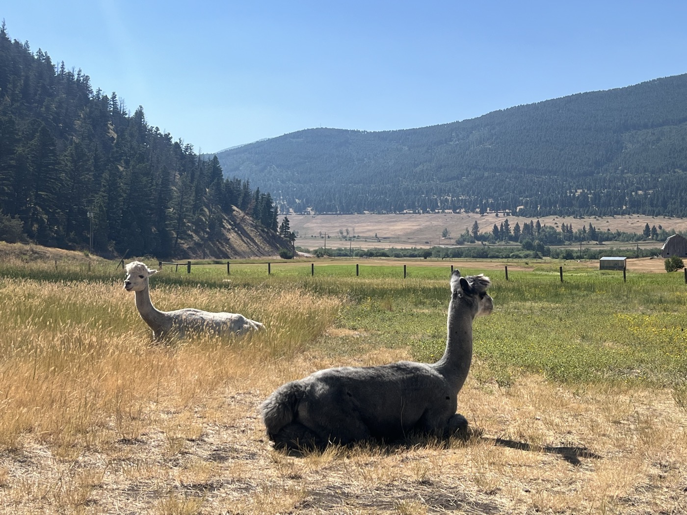
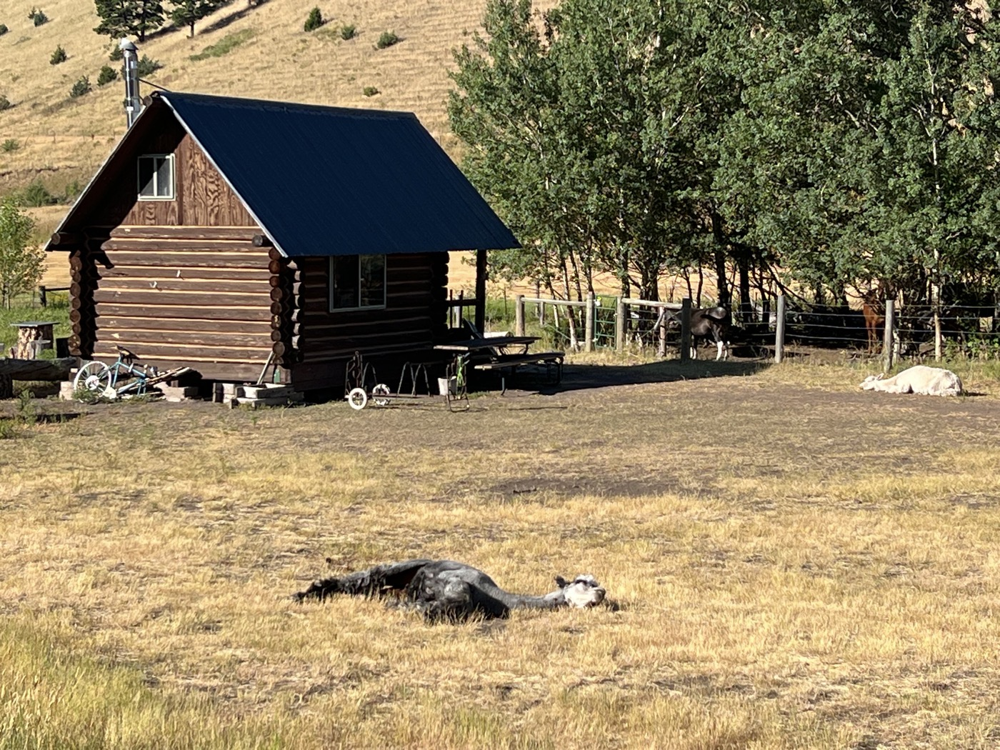
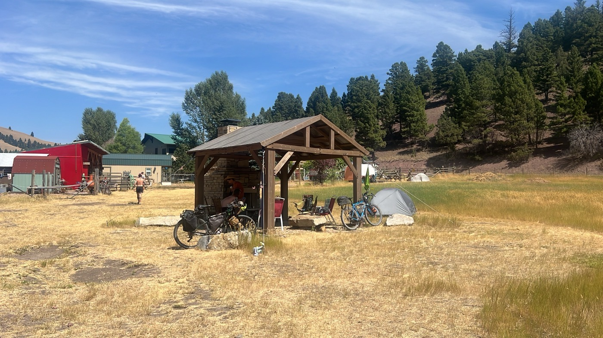
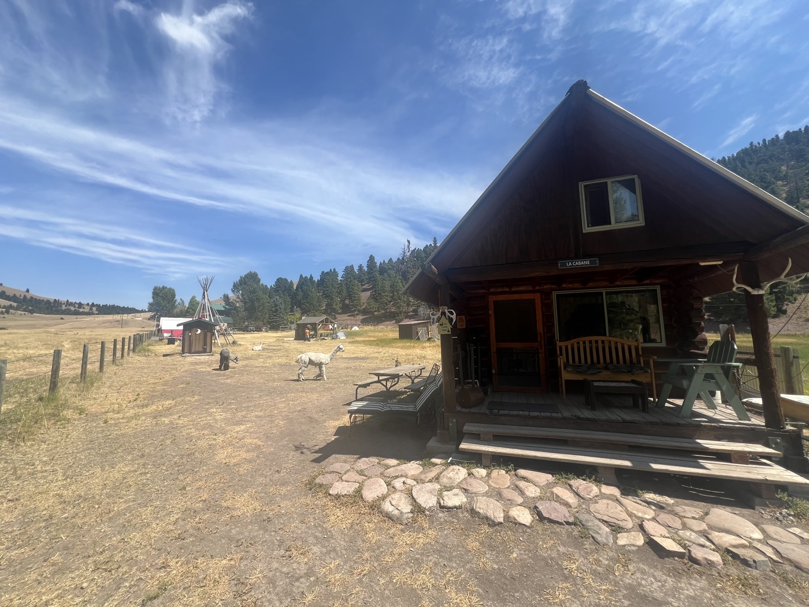
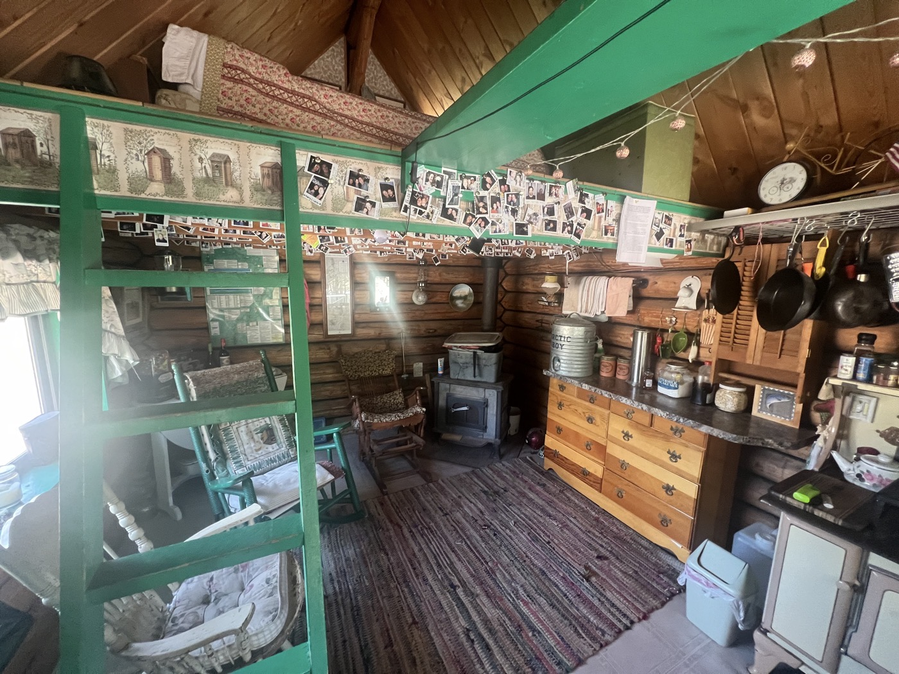
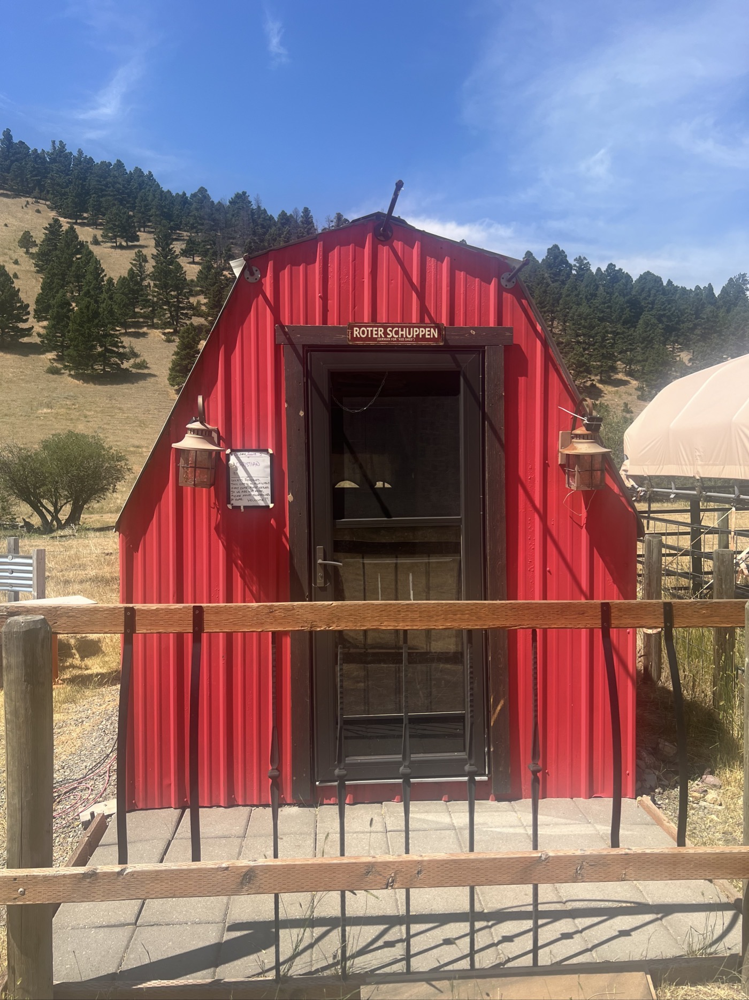
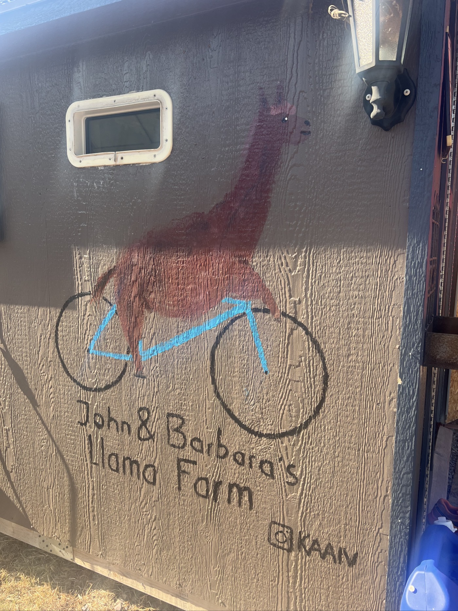

# Rest Day after my first 1'000km

<figure markdown>
{ width=“300” }
</figure>

Journée ensoleillée et super paisible. Temps d'échanges et de partages avec les autres cyclistes. L'accueil est génial, l'endroit magique. Mon compteur indique 1´046km depuis Calgary : j'ai passé les mille 💪! J'essaie de projeter les difficultés et les options qui sont devant moi. Entretien du vélo ✅. Et surtout récupération 😌 avant de reprendre la route direction Helena. Finalement il y a encore un long bout pour quitter le Montana...

<!-- more -->

Aujourd'hui je discute avec Gabriel (CH) Sam (USA), John (USA), Kai (NL), Claude (FR), Franklin (USA), Canny (USA), Cathy et Owen (USA). Nous sommes tous des "SoBo" c'est à dire des SouthBounders : on suit la trace du nord au sud. On fait donc tout à l'inverse des NoBo. Vous suivez le truc? 😜.

Il y a des chouettes témoignages. Bien sûr il y a le vélo. Mais aussi d'autres sujets. Avec John discussions sur les USA. La notion de liberté individuelle, le fait que les états puissent voter des lois différentes des lois fédérales. Même le maire peut encore se différencier localement. Cette flexibilité et diversité permet aujourd'hui à beaucoup d'Américains de se choisir un endroit qui convienne à leurs aspirations. Du coup ils déménagent beaucoup. Les états peu peuplés font beaucoup d'efforts pour être attractifs car plus de population signifie plus de poids fédéral. Cela ressemble à la Suisse mais en beaucoup beaucoup plus grand et une seule langue. Mieux vaut respecter la sphère privée: il y a beaucoup de panneaux "Private/no trespassing" qu'il faut respecter ici.

John, Kai et Claude m'impressionnent, ils sont nomades depuis plusieurs années. John m'explique qu'aux USA, beaucoup de personnes vivent dans leur "RV". Recreational Vehicle c'est à dire Camping Car taille USA. Wikipédia me confirme : 1 million d'Américains **habitent** dans leur RV. Sur 11 millions d'Américains propriétaires d'un RV. 1 million, c'est la population du Montana...

Revenons à nos Alpaca. Nous sommes chez John et Barbara. Ils se sont trouvés en 2015 lorsque John suivait la GDMBR en NoBo. Ils ont eu à cœur de créer cette dynamique d'accueil. Tout est super bien pensé - simple mais super quand on est à vélo. Il y a plusieurs cabines, petites maisonettes indépendantes (6) pouvant chacune héberger 2 à 4 personnes. Sinon il reste la camping. Chaque maisonette a une cuisine, des provisions. Toilettes sèches à l'extérieur et douche extérieure en face des chevaux ☺️. Les Alpacas se promener autour de nous. Ce matin il y a eu des départs, j'ai choisis de m'installer dans la cabine "Roter Schuppen" qui s'est libérée. La plus belle est "la Cabane". Je vous ai fait des photos.

Sur la véranda il y a un frigo avec choix de canettes et sandwichs. Tout le monde se fait la cuisine - esprit communautaire simple et chaleureux. On mange ensemble. Il y a de quoi bricoler le vélo, je tente le nettoyage par "sprinkler" c'est à dire un arroseur d'herbe qui tourne à 360•. Mon vélo est tout beau. Moi aussi au passage.

Kai a trouvé un set de peinture sur la piste il y a une semaine et a fait une peinture murale. Un peu du bleu de mon vélo restera pour la postérité. La vie est simple.

Claude travaille à un film sur son périple, j'espère vous partager le lien d'ici quelques jours. Il aime bien le café et les tatouages. Il maîtrise le vol de drones.

Chacun ici a son parcours et suit sa trace et il y a beaucoup de tolérance et de respect mutuels. Je trouve sain.

Je me suis bien reposé: demain c'est reparti 💪! Après une pause à Helena je pense continuer pour trouver un camping.

Ce soir il pleut mais j'ai un toit sur moi! Cela va se rafraîchir les prochains jours. Difficile de faire un bilan, il y a encore de grosses étapes devant moi. La suite demain!

<figure markdown>
{ width=“300” }

{ width=“300” }

{ width=“300” }

{ width=“300” }

{ width=“300” }

{ width=“300” }

{ width=“300” }

{ width=“300” }

</figure>

