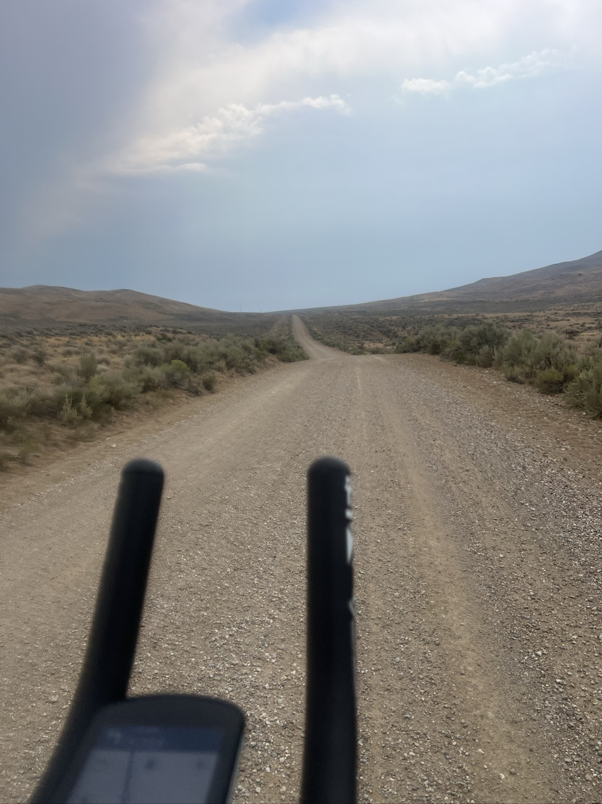
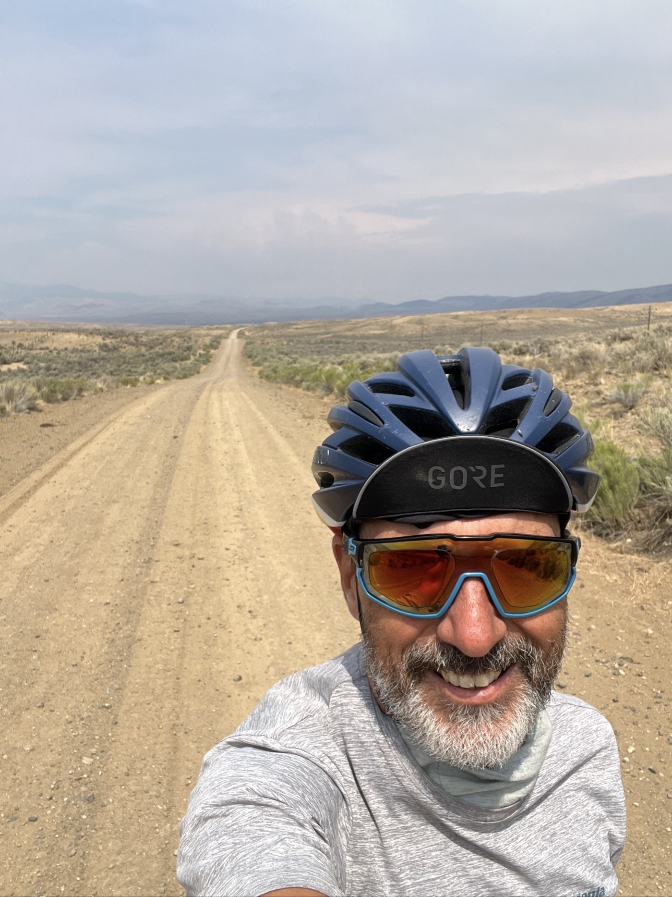

# Orages

<figure markdown>
{ width=“300†}
</figure>

Nuit agitée par l'orage, je fais sécher ma tente et me voilà parti. Je m'arrête chez Ma Barnes, une petite merveille. Après un bon bout sur route, c'est parti pour du gravier interminable. J'avance plutôt bien, il n'y a pas de grosse montée. Je plante la tente juste avant que la grêle ne tombe. Ouf!

<!-- more -->

# Nuit agitée 

Voir sa tente éclairée par la foudre avec des coups de tonnerre à faire trembler le matelas, ça réveille! Je compte les secondes, c'est tout proche. J'ai l'impression d'être au cœur de l'action. Pas super rassurant mais ma tente est bien étanche et je suis entouré d'arbres. Ça finit par passer.

# Ma Barnes

Comme prévu, je suis bien paumé et ce point de ravitaillement est bienvenu. C'est une mini-supérette mais il y a un choix incroyable en petite quantité. Je rattrape mon petit-déjeuner avec un jus, puis un lait chocolat. Pomme, flocons d'avoine, cela va relever le niveau. Malheureusement il n'y a plus de bonbonne à gaz, un autre divider a pris la dernière hier 🙃. La dame est super serviable, elle a vraiment (presque) tout dans un petit espace. Je note le premier drapeau israélien à l'extérieur.

# On the road again

La piste paraît interminable, mais le paysage a bien changé. On dirait pas que je suis toujours à 2'000m. C'est très sec, style garrigue. Parfois ça arrose, la différence est alors frappante. Je ne vois rien à part quelques vaches. C'est toujours orageux, mais très localisé. J'échappe souvent à la grosse pluie. Mais en fin de journée je prends mes précautions. Je plante la tente et mange devant un concert d'éclairs. Je finis sous la tente : il grêle à nouveau! La température chute vite 🥶.

<figure markdown>
{ width=“300†}

{ width=“300†}

{ width=“300†}

{ width=“300†}

{ width=“300†}

{ width=“300†}

{ width=“300†}

{ width=“300†}

{ width=“300†}

</figure>

