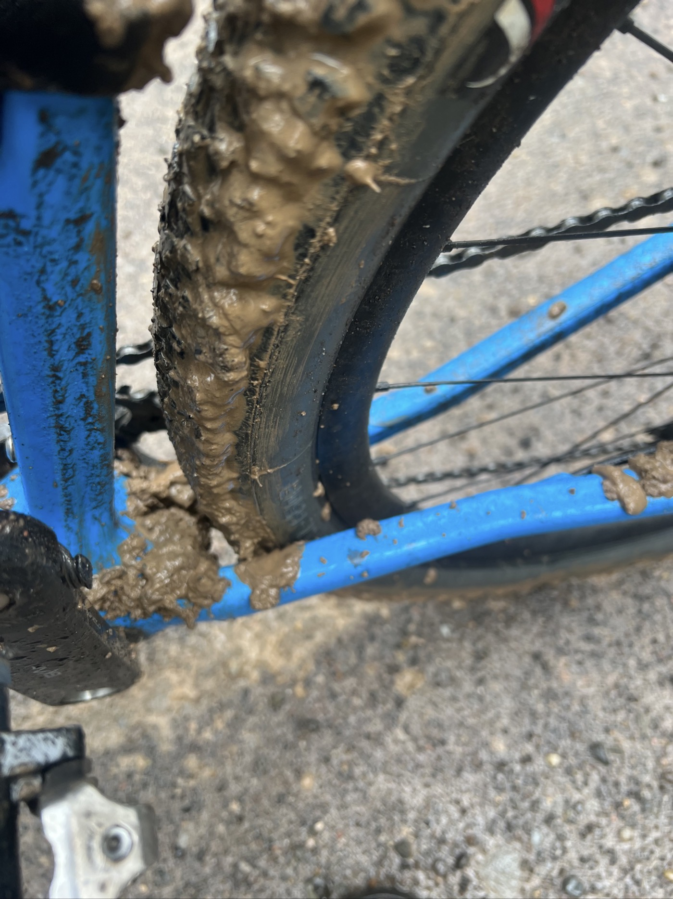
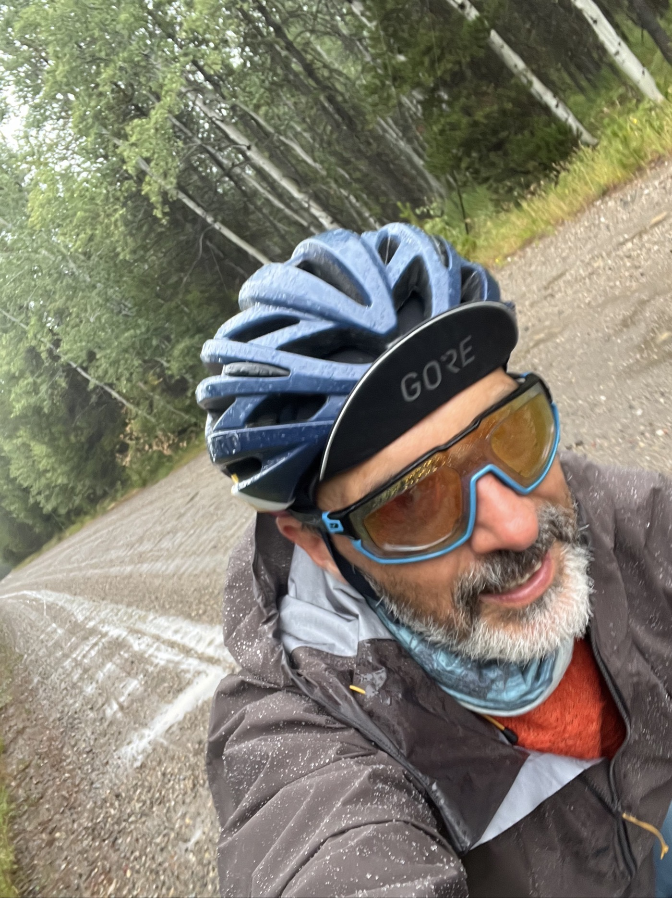
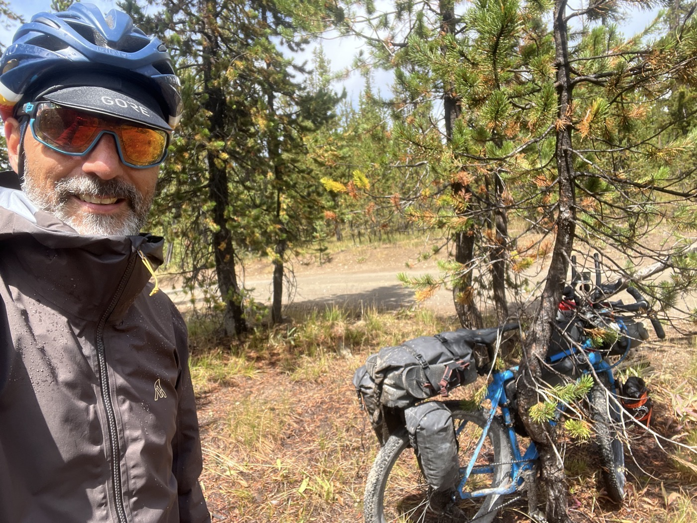
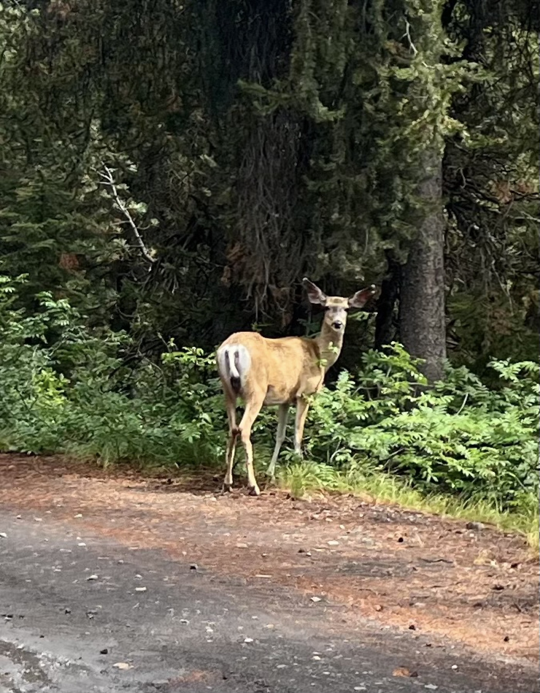
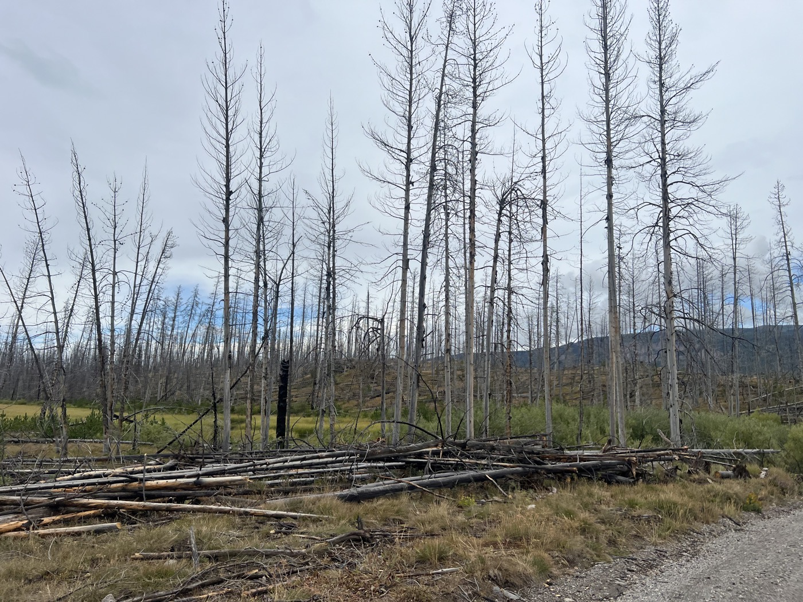
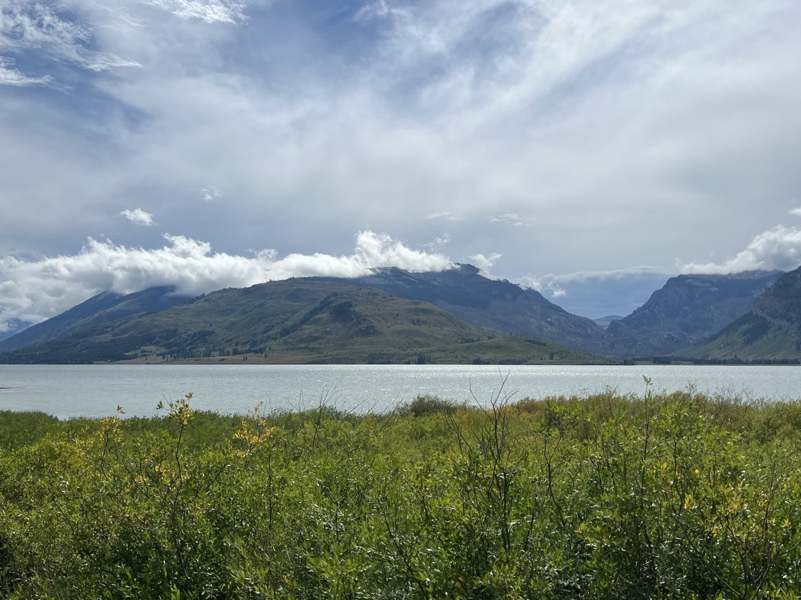
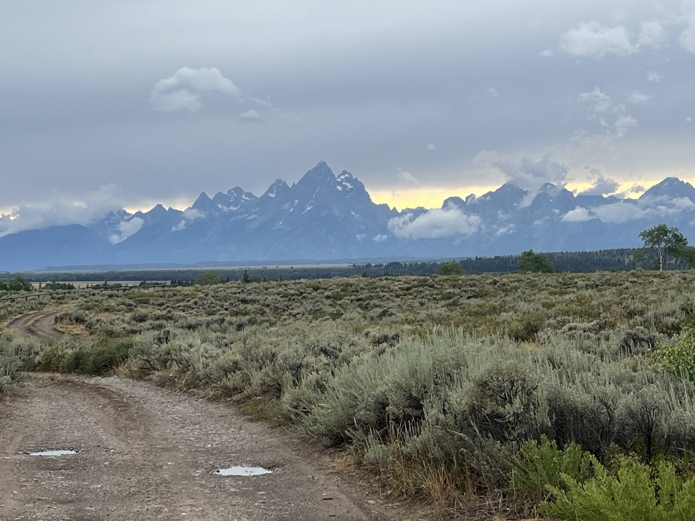
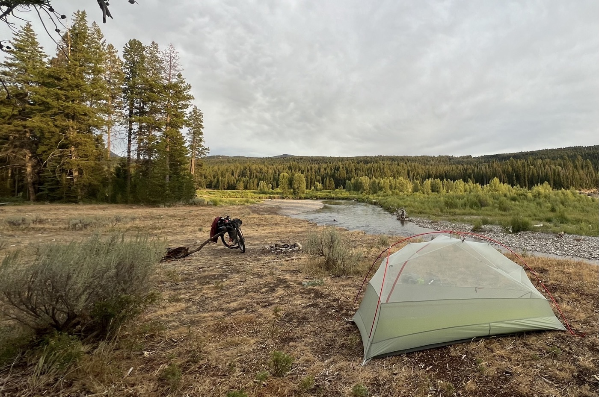
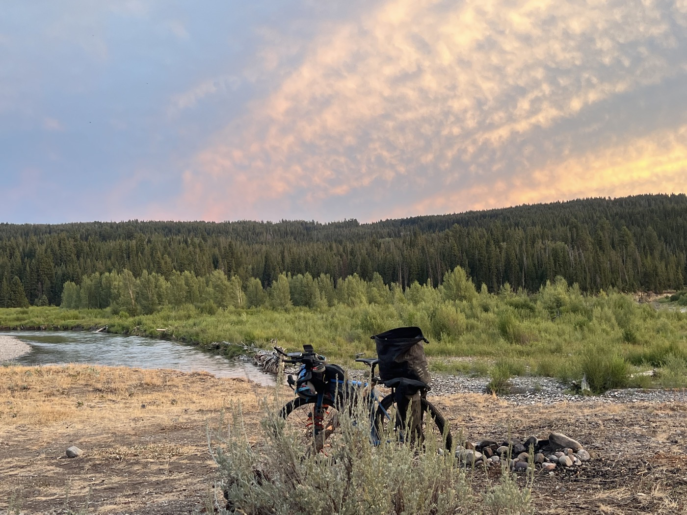
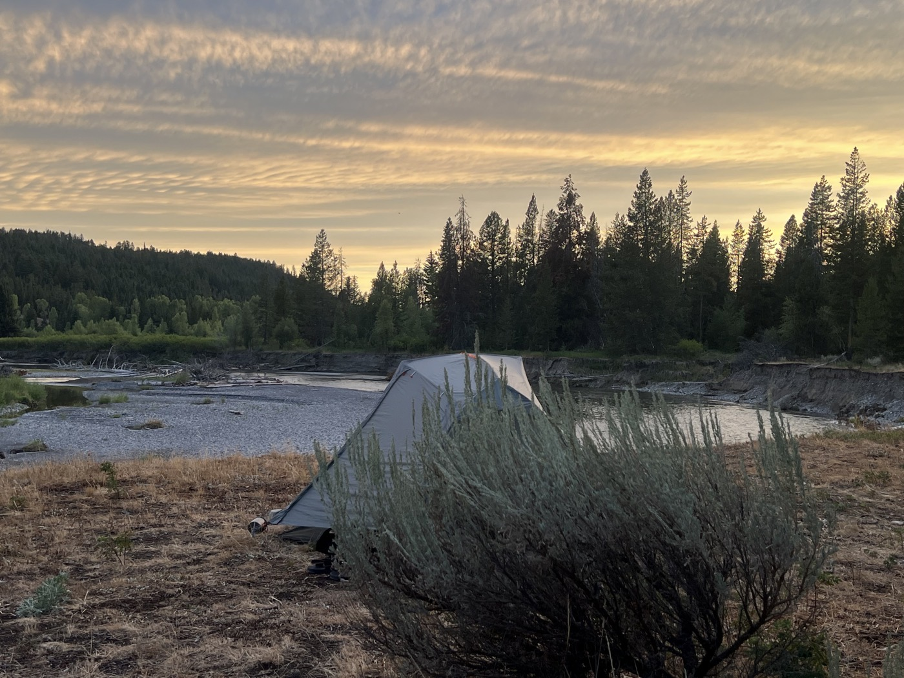

#  Welcome in Wyoming

<figure markdown>
{ width=“300” }
</figure>

Je quitte Warm River sous la grosse pluie. J'ai sorti le grand jeu pour les vêtements. Il pleut toute la matinée (50km et 900m de D+). J'arrive au sommet avec un brin de soleil. J'enchaine sur Grand Teton Park puis longe Buffalo Fork pour terminer en (...) bivouac de rêve.

<!-- more -->

# Au revoir Idaho

Je quitte Idaho sous la grosse pluie. C'est l'occasion de tester mon pantalon, la veste avec capuche englobant le casque et bien sûr les chaussettes étanches. Grosse montée, je commence par la boue. Ben ça veut pas avancer dis donc. Je pédale pourtant! La boue se met partout et je patine. Ça bouche aussi au niveau de ma roue. J'ai pris une photo pour vous montrer (une fois sorti de la gadoue). Je précise que je n'ai mis pied à terre!

Il n'empêche : c'est long la montée. Je garde mon sandwich pour l'arrivée en haut - ça me motive. Le soleil me fait même l'honneur d'une apparition mais globalement la journée restera très nuageuse.

# Hello Wyoming!

Je poursuis en changeant de parc: un court passage au John D. Rockefeller state parc (ça avance bien, mais ça a bien brûlé...). Puis j'arrive sur Colton Bay, Jackson Lake et les massifs montagneux cachés par les nuages. Dont Grand Teton qui donne son nom au parc. Sur la route, beaucoup de touristes, entre Grand Teton et Yellowstone il y a de quoi faire. Vu la météo, je décide de poursuivre et vise le début de la prochaine grosse montée pour bivouaquer. Les montagnes et le lac semblent très beaux - mais nous on peut régater avec le Leman et les Alpes 💪. N'empêche : ici tout est sauvage 😉.

# Robert 

J'arrive dans la zone pour m'arrêter et commence à chercher un spot. Un gros 4x4 s'arrête à côté de moi et on me demande si je cherche à dormir. Soi-disant il y aurait un spot de rêve à 300m. Peu pratiqué car pas accessible en voiture. On m'escorte en voiture et en effet la place est libre et (...) magnifique. On se sert la main avec Robert qui vient des Pays-Bas avec son épouse aussi dans la voiture. Les poignées de main ont une signification ici. C'est une marque de respect plus marquée que chez nous (après-tout on se connaît pas). Il m'invite à passer prendre une douche chaude chez lui demain matin. Je note les directions, je crois qu'une douche sera bienvenue. J'espère juste qu'il ne repleuve pas. En tout cas chapeau bas pour m'avoir amené à ce bivouac 🙏.

# Anecdote

Je me demandais comment vivaient ces grands ranch? Portails immenses, habitations immenses, terres sans fin. Quelques vaches et ? Comment ça tourne? On m'explique au camping qu'en fait une vache vaut dans les 2'000$. Et ils font reproduire leurs troupeaux puis les vendent. Souvent depuis plusieurs générations donc les propriétés ne sont plus ou peu endettées. Et les cheptels (que je n'ai jamais vraiment vu) peuvent compter plusieurs milliers de bêtes. Ces grands propriétaires sont donc effectivement bien nantis et leur ranchs le montrent bien.

# Demain

Douche si tout va bien 😉. Grosses et longues côtes pour changer. Ma prochaine ville devrait être Pinedale d'ici 2 jours avant de faire une traversée de désert (Grand Divide Basin). Un moment fort, on en reparlera. Du coup je continue le régime : bivouac et pas de réseau. J'essaie juste de synchroniser le blog quand je passe une zone couverte.

Ps. Les chaussettes waterproof ça fonctionne. Portées toute la journée dans les chaussures humides et les pieds sortent secs. Merci Maxime!

<figure markdown>

{ width=“300” }

{ width=“300” }

{ width=“300” }

{ width=“300” }

{ width=“300” }

{ width=“300” }

{ width=“300” }

{ width=“300” }

{ width=“300” }

{ width=“300” }

{ width=“300” }

</figure>

