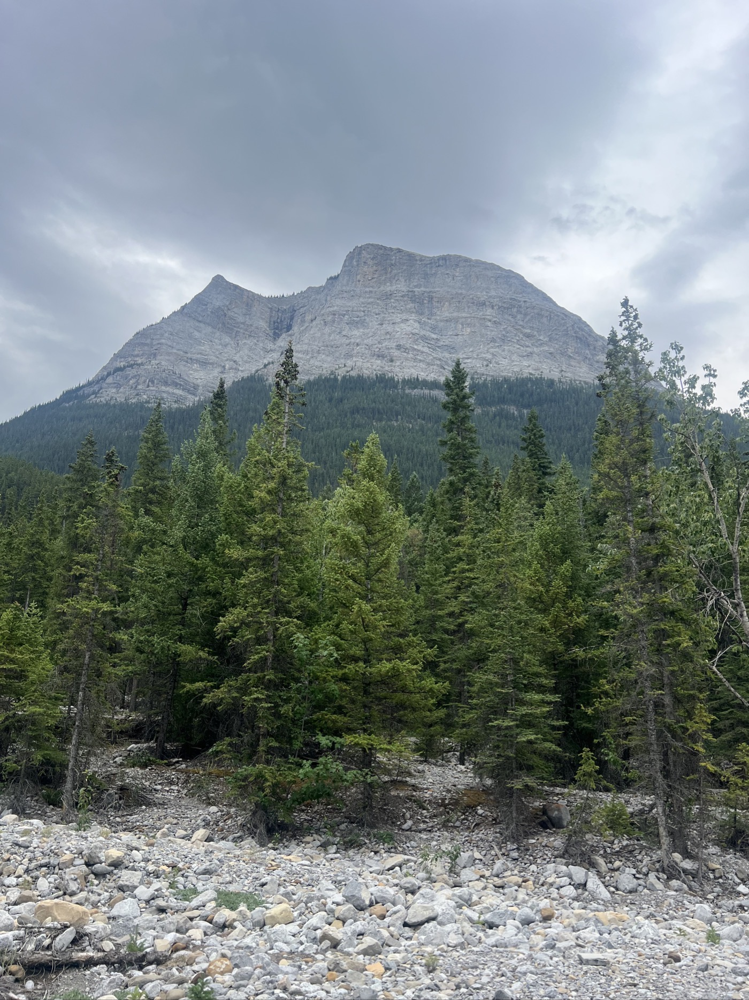
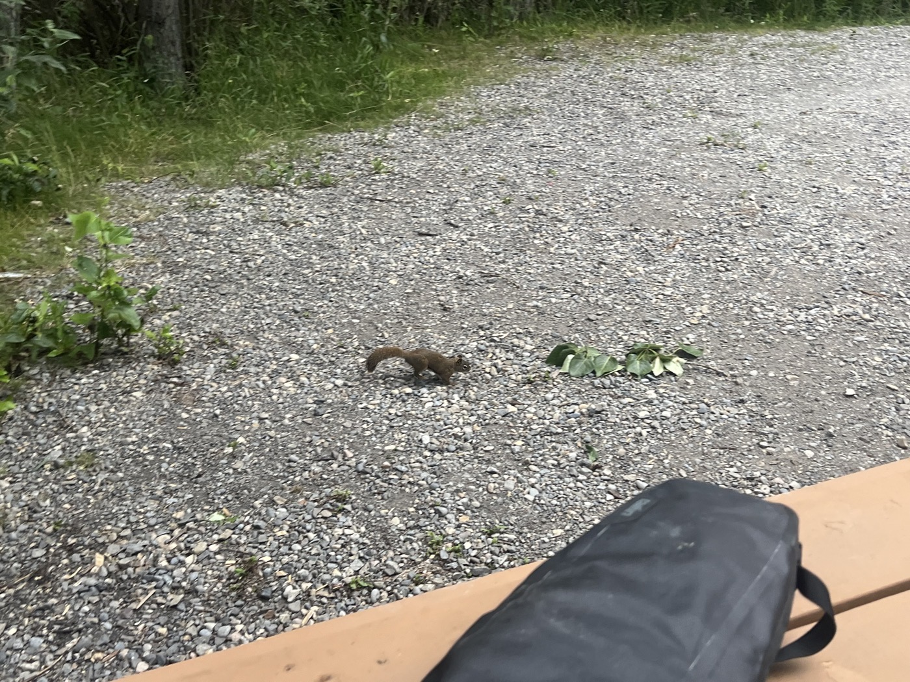
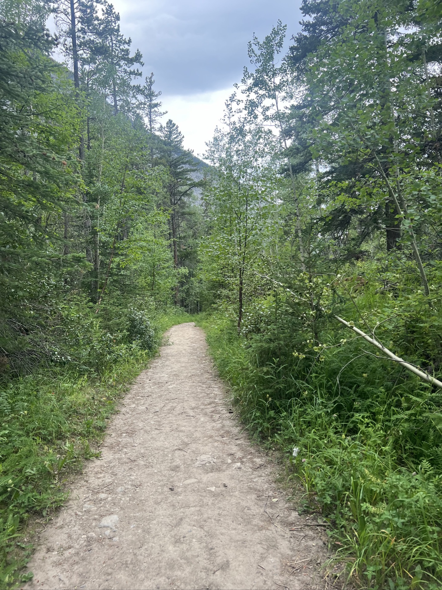
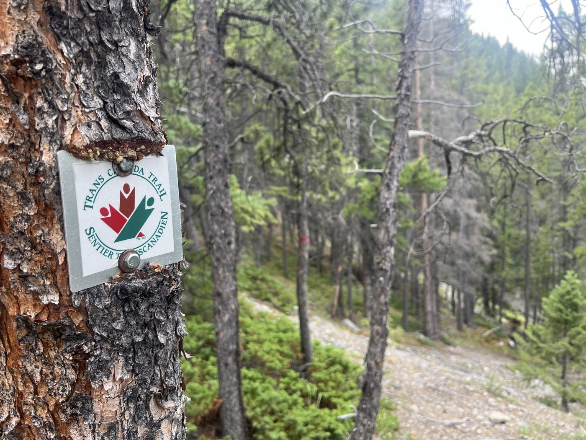
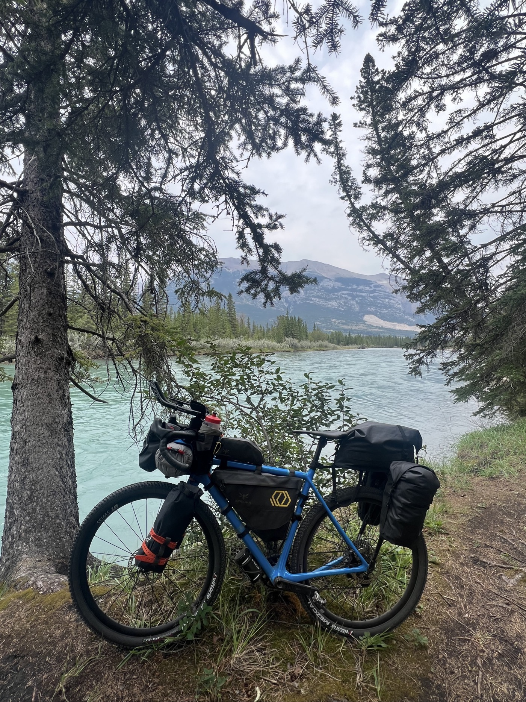
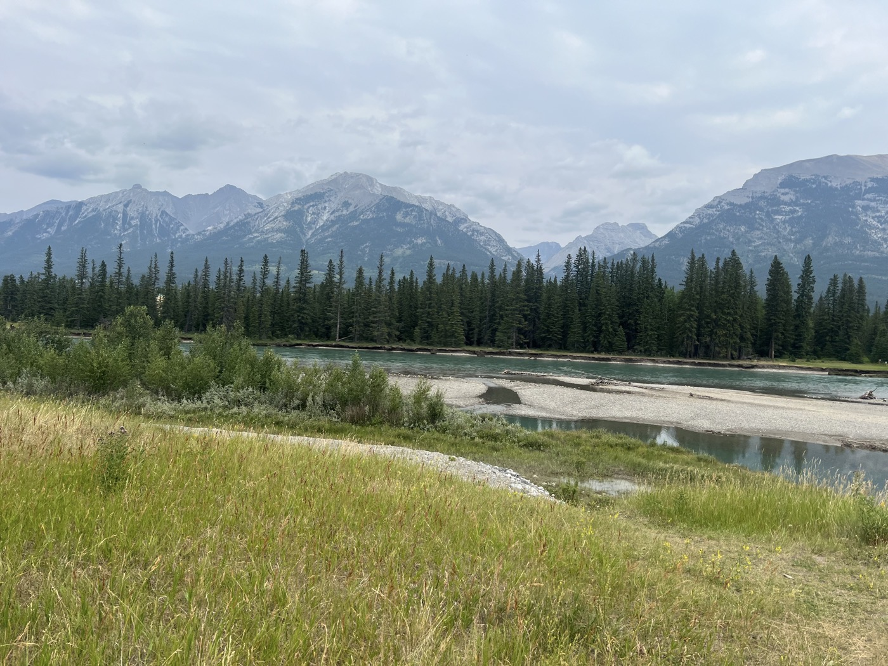
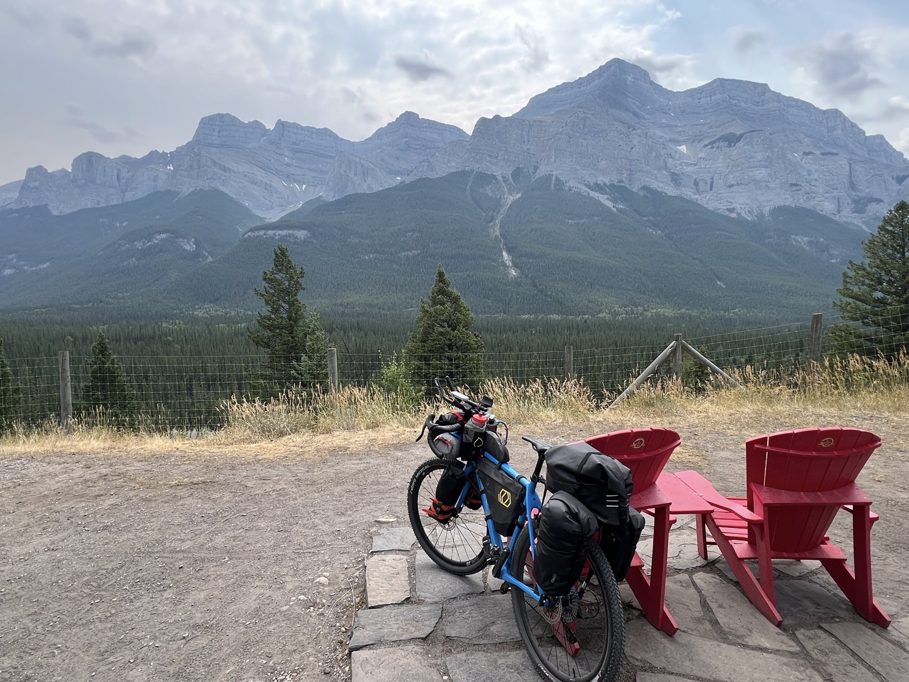
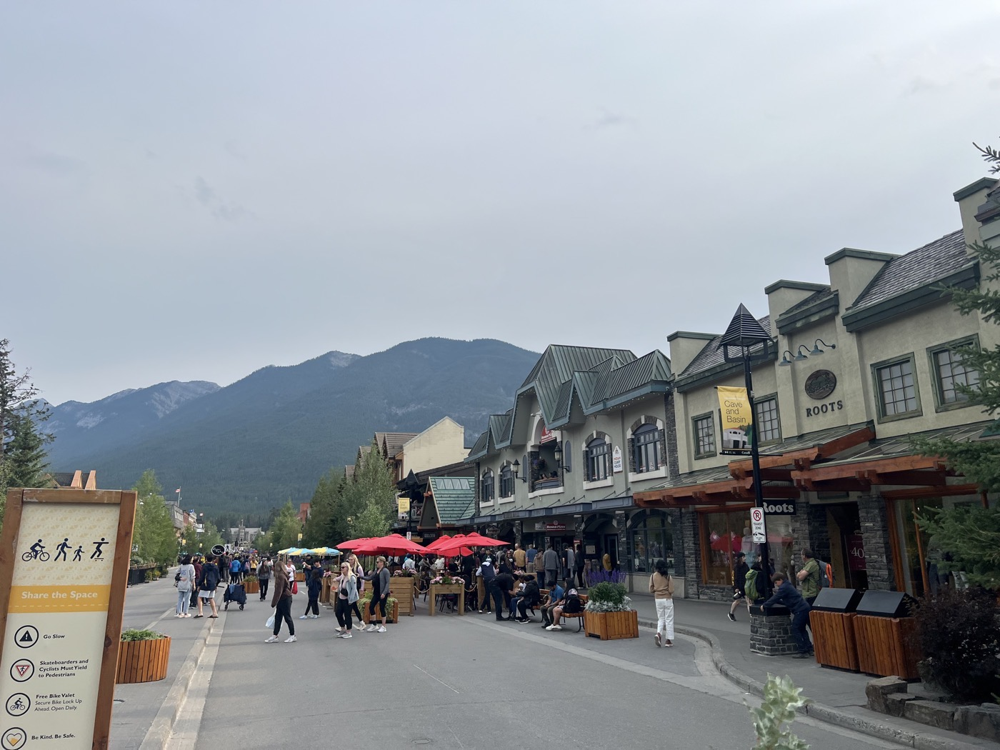

# Arrivée à Banff

<figure markdown>
{ width=“300” }
</figure>

Cette fois-ci j'arriverai à Banff! Mais avec du Gravel sérieux (style "hike-a-bike") pour éviter l'autoroute et le vent, puis piste cyclable top. Bon accueil à l'arrivée, du bol pour le camping.

<!-- more -->

Osons : je choisis le mode Gravel sur Komoot pour éviter la trace le long de l'autoroute et le vent. 10km plus long via la TCT. Du coup je me retrouve dans du dur. Panneaux aux ours (c'est la saison des mûres en plus) et chemin de rando. Je me retrouve à croiser des randonneurs pédestres (décidément) puis plus personne et des passages totalement impraticables. Je descends de vélo et pousse, porte, soulève, je monte même des escaliers! Et ça s'appelle le Transcontinental Canadian Trail (TCT)? Il y a même des panneaux avertissant pour cycliste. Mais ça doit dater 😅. C'est donc ça les passages "hike a bike" au pays de l'érable.

Trop content d'en sortir, ma moyenne a pris un gros coup. Mais la suite est magnifique (toujours TCT) cette fois c'est de la piste cyclable pavée.

Arrivée sur Banff - je commence à chercher une bonne âme à l'accueil des camping. "Tout est complet"... mais coup de fil et à 2km ils m'attendent pour une place - trop beau. Je vous dis pas le plaisir de la douche. À part ça j'ai dû faire pas loin d'1 km entre l'entrée et ma place... au milieu d'arbres. Les Canadiens qui viennent chez doivent quand même avoir un choc!

La journée m'a permis de prendre mes repères. Les routines se mettent en place. Je profite un peu de Banff, je voudrais un dernier Check du vélo. Ça a dû secouer dans l'avion, j'ai resserré le câble du dérailleur et le frein avant est un peu mou. Je préfère un avis d'expert aguerri avant de me lancer vers le sud et la piste.

Beaucoup de touristes à Banff, belle ville avec Canmore aussi. La visibilité est pas top - on me dit que c'est la fumée de Jasper.

À demain!

Ps: cliquez sur les photos pour voir aussi les commentaires 
<figure markdown>
{ width=“300” }
{ width=“300” }
{ width=“300” }
{ width=“300” }
{ width=“300” }
{ width=“300” }
{ width=“300” }
{ width=“300” }
{ width=“300” }
{ width=“300” }
{ width=“300” }
</figure>

