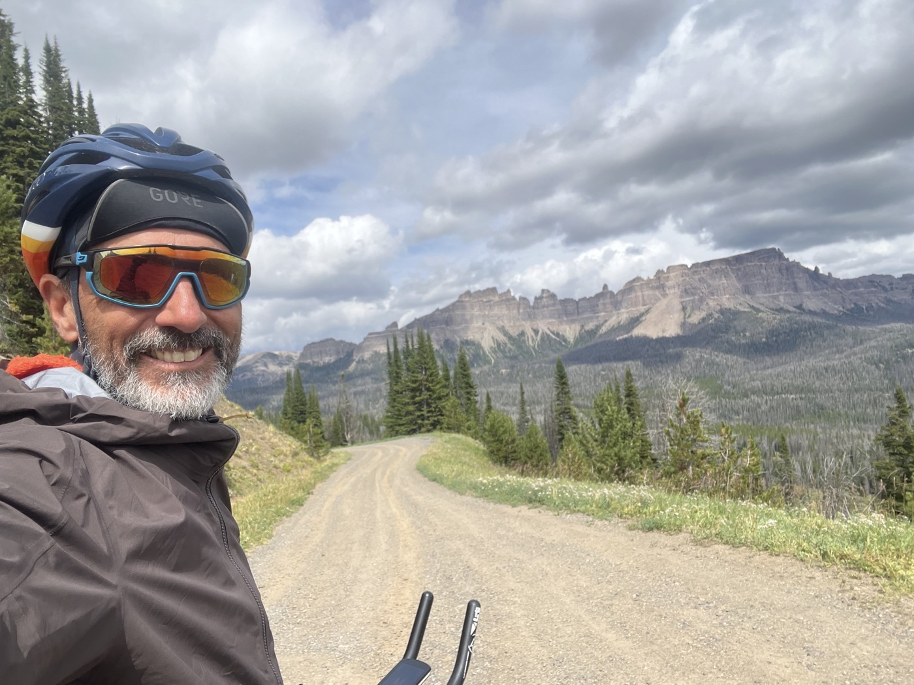

#  Togwotee et Union Pass

<figure markdown>
{ width=“300†}
</figure>

Après une bonne douche chaude, je m'élance pour gravir 2 cols dans la journée. J'arrive à 2'000m de dénivelé positif et passe la nuit à 2'900m. Ça caille!

<!-- more -->

# Une douche mémorable 

Après une nuit glacée, je retrouve Robert et Aagje (Agathe en néerlandais) ainsi qu'un ami qui est de passage, dans leur belle cabane avec vue sur les Grand Teton. Je profite de leur hospitalité: 1ere douche depuis 7 jours. Purée elle est bonne! Mais Robert prépare aussi un magnifique buffet tortillas œuf brouillés, bacon, tomates, salade, café, ananas: je suis dans un petit palace au milieu de la forêt. Très chouettes discussions et partages. Ils ont acheté la cabane (sur sol étatique) et viennent y passer 2 mois par année. C'est rustique mais ressourçant. A big thank you to Robert, Aagje and also visiting Robert. Il y a une communauté qui propose d'ailleurs cette mise en relation : [Warmshowers](https://www.warmshowers.org). Je repars après 2 heures, heureux. 

# Continental Divide 

La première montée me fait arriver à 2'900m à un point clé de la ligne de partage des eaux. Je vous mets le panneau explicatif pour les plus curieux. Ensuite belle descente, la falaises sont magnifiques. Vraiment de beaux paysages. Au milieu de nulle-part je capte du réseau, je peux vite appeler la famille: ça fait du bien 😌.

# CDT - Continental Divide Trail

Le parcours de la journée croise à plusieurs reprises la CDT. C'est un parcours pour randonneurs, mais qui suit la même logique. La CDT est réputée pour sa difficulté, à côté du Pacific Coast Trail ou bien Appalachian Trail. Durant la journée, je vois donc pas mal de ces randonneurs. Ils portent tout sur le dos et sont super équipé. Souvent ce sera fait par section mais ceux qui font l'intégrale : énorme respect.

# Union Pass

J'enchaîne avec cet autre col pour me rapprocher de Pinandale. Je réfléchis 🤔 comment faire la traversée du Great Divide Basin qui viendra ensuite, et décide de faire ce 2ème col pour laisser mes jambes un peu reposer le lendemain. Je suis content d'y arriver mais je monte la tente dans la nuit et je suis à 2'900m. Je me prépare à un froid de canard.

!!! hint ""
    cliquez sur les photos pour voir les commentaires

<figure markdown>

{ width=“300†}

{ width=“300†}

{ width=“300†}

{ width=“300†}

{ width=“300†}

{ width=“300†}

{ width=“300†}

{ width=“300†}

{ width=“300†}

{ width=“300†}

</figure>

<iframe src='https://connect.garmin.com/modern/activity/embed/16775278221' title='Day 13' width='405' height='500' frameborder='0'></iframe>

