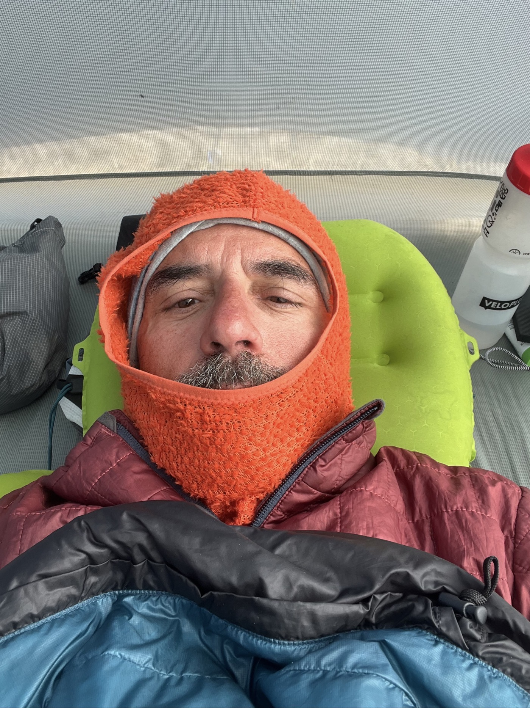
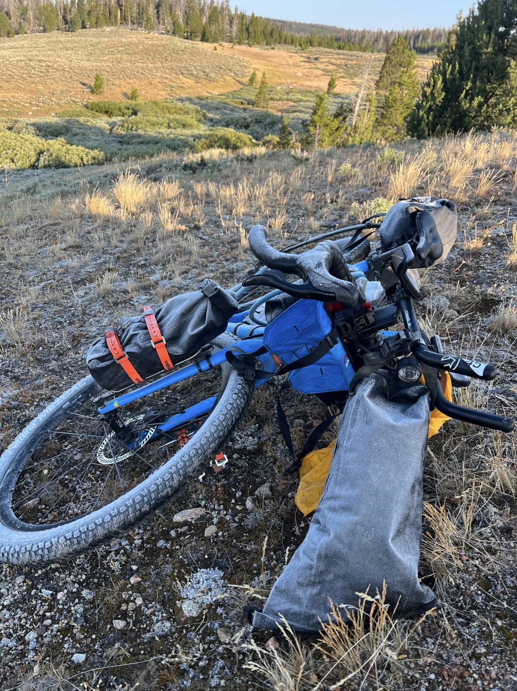

#  Pinendale

<figure markdown>
{ width=“300” }
</figure>

Après une nuit glaciale, il fait beau au réveil. Je dégivre le vélo et fait aussi sécher la tente et les habits qui ont un peu souffert ces derniers jours avec la pluie. Je m'élance ensuite pour prendre la direction de Pinendale. Aujourd'hui j'ai franchi la barre des 2'000km depuis mon départ de Genève le 25 juillet 💪. Trop content!

<!-- more -->

# Union Pass est interminable 

Je fais environs 60km de Gravel, bien caillouteux. Ouille, me revoilà sur du Paris-Roubaix... Et mes ambitions d'enchaîner directement en arrivant à Pinendale sont bien douchées aussi. C'est comme ça - il faut s'adapter. Les fesses prennent cher, je dois ralentir, finalement il y aura un peu de route aussi. Je termine à Pinendale et vais pouvoir me concentrer sur la logistique pour traverser cette forme de désert qu'est le Great Divide Basin. Il faut prévoir de l'eau et vérifier météo et vent. En gros il y aura 350km avec un point ravito d'eau au milieu. Et des fortes chaleurs... rouler de nuit? À voir : la suite au prochain post 😉. 

# Fidèle à la trace

J'ai une petite fierté car depuis Banff j'ai pu suivre la trace exacte de la GDMBR. À part l'exception du feu qui m'a obligé à un petit détour, je suis fidèle. Même si parfois, un raccourci par la route peut être tentant, je me tiens aux règles. Je me rends compte qu'en fonction de la météo ou des conditions, d'autres sont plus permissifs. J'espère pouvoir garder cette ligne. 

# Carton rouge

Une chose qui énerve un peu : ici tout ce qui est fromage cuit est appelé "Swiss cheese". C'est un gros raccourci et a tendance à m'énerver 😆. Ils pourraient être plus curieux quand même ! 

!!! hint ""
    cliquez sur les photos pour voir les commentaires

<figure markdown>

{ width=“300” }

{ width=“300” }

{ width=“300” }

</figure>

<iframe src='https://connect.garmin.com/modern/activity/embed/16775300014' title='Day 13' width='405' height='500' frameborder='0'></iframe>

