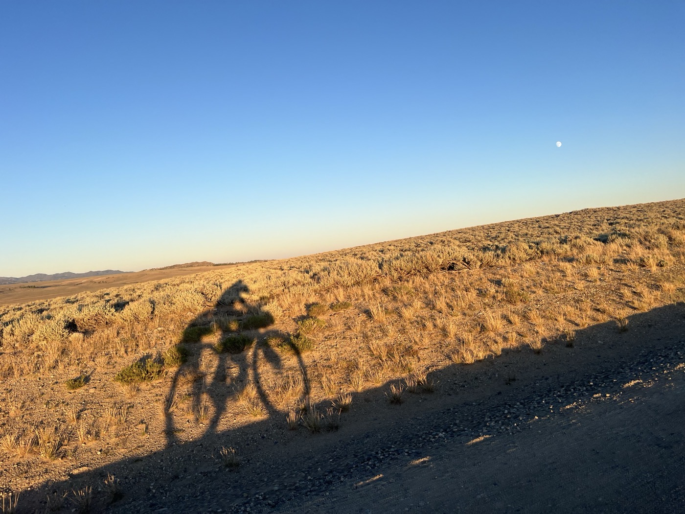
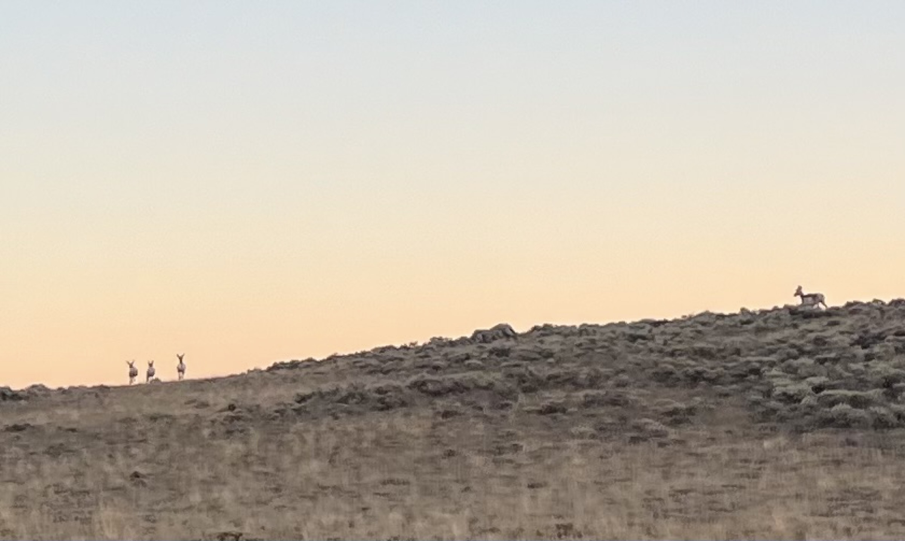

#  The Great Basin

<figure markdown>
{ width=“300†}
</figure>

Je profite de la matinée pour faire des courses et laisser mon vélo avoir un soin mécanique. Je veux traverser le Basin en 2 jours en roulant la nuit. 180 km pour rejoindre la 1ere source.

<!-- more -->

# Pinendale 

Matinée tranquille pour laisser un peu reposer les guibolles. Je vais au supermarché, je fais quelques boutiques avec du matériel camping. Le mécano vélo est embêté - il n'arrive pas à bien régler le dérailleur. Aurait-il pris un coup? Je réfléchis si et quand je pourrais le changer les prochains jours. Puis je m'élance...

# the Great Basin

Le Basin est un autre passage mythique. En gros, sur le partage des eaux, cette "bassine" est sur la crête. Donc l'eau qui tombe sur les bords de ce haut plateau s'écoule vers les océans. Mais ce qui tombe dedans va nulle-part. Et ce haut plateau est très désertique, plat et sans arbres. Juste ces buissons qui résistent à tout. Très aride, les points d'eau sont super rares. Il faut charger le vélo, je prends 5.5l avec moi. Autre difficulté: la météo. Les vents peuvent être très forts et un vent de face fatal au vu des distances. Bref vous l'avez compris - c'est un gros morceau 😳.

# Great Basin - 1ere partie

Je m'élance à 14h. A priori vents favorables, je vise minuit/1h du matin pour monter la tente à proximité d'une source d'eau. Ça avance bien, vent arrière, mais le dérailleur m'embête. Il y a pas beaucoup de montées, mais la 1ere vitesse (le gros pignon) veut pas passer. Je perds 1 heure à essayer de le régler, pas facile au milieu de nulle-part et le vélo chargé. Rien à faire... je continue. 

Le coucher du soleil est magnifique, ciel super clair et la lune très belle, quasi pleine. Je vois des Pronghorn (antilope d'Amérique), et de nuit je croise régulièrement des lièvres et des oiseaux de nuit. C'est magique mais à 2h de matin, j'arrive bien crevé. En plus je suis allé trop loin! Je reviens sur 2km, puis je cherche cette source...? Pas d'indication, rien. Je tourne en rond avec ma frontale. Marre, j'y verrai mieux le jour levé. Je plante la tente et dodo.

!!! hint ""
    cliquez sur les photos pour voir les commentaires

<figure markdown>

{ width=“300†}

{ width=“300†}

{ width=“300†}

{ width=“300†}

{ width=“300†}

{ width=“300†}

{ width=“300†}

{ width=“300†}

{ width=“300†}

{ width=“300†}

</figure>

<iframe src='https://connect.garmin.com/modern/activity/embed/16791857151' title='Day 13' width='405' height='500' frameborder='0'></iframe>

