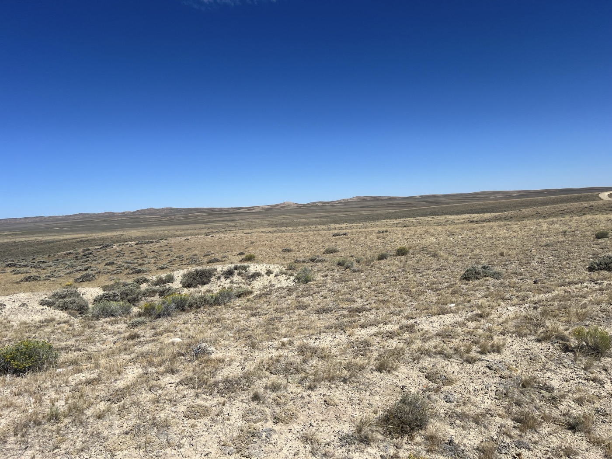

#  The Great Basin #2

<figure markdown>
{ width=“300†}
</figure>

Au matin, après une courte nuit, je vois des cyclistes s'arrêter à la source. J'étais à 100m 😆. Je repars à 10h, il me reste 180km pour arriver à la ville de Rawlins. Vais-je y arriver dans la journée?

<!-- more -->

# la source Diagnus 

C'est incroyable d'avoir de l'eau fraîche ainsi au milieu de ces étendues arides. Je plie la tente et prends un bon petit-déjeuner à la source. Je mets la tête dessous pour bien me rafraîchir et départ. Il fait déjà super chaud. 3 cyclistes sont partis devant.

# Vent facétieux 

Rouler dans le désert me fait réfléchir. C'est différent de la solitude. Je suis dans l'action je sais ce que je laisse derrière mais je ne sais pas encore ce que je vais trouver devant. Et pourtant je concentre tous mes efforts pour avancer. Le compteur égrène  lentement les kilomètres. Le vent est souvent de face ou latéral.  Il fait une chaleur torride. Je passe le premier cycliste, épuisé sur le bord de piste. Puis le couple un peu plus loin. Le vent forcit, je redouble d'efforts. Il est dejà 15h, il reste plus de 100km! 

# La main invisible 

La trace est longue, virage puis vent de face - 20km. Et je vois de gros nuages devant, l'orage arrive. Pluie et éclairs. Je roule autant que je peux, j'ai cet espoir d'arriver au bout de ma ligne droite, puis de virer à gauche pour avoir du vent arrière. Mais le ciel s'assombrit, le vent devient tempétueux. Les 5 derniers kilomètres je suis au max. Premières gouttes, pas envie de me retrouver dans les éclairs avec aucun arbre à l'horizon. J'exagère pas, les derniers 100m chaque coup de pédale était un tour de force. Un dernier coup, je suis dans la tempête, je peux tourner le guidon. Je retrouve de l'asphalte et le vent me pousse enfin! Je donne tout ce qui me reste et avec le vent je monte à 40 km/h. 40 km devant moi avec cette main invisible que je sens sur mon dos. Doucement mais sûrement je m'échappe de la tempête. La main me pousse jusqu'à 10km de Rawlins.

J'arrive sec en ville, je m'arrête au 1er motel suggéré par la carte. 80$ la nuit, prix spécial cycliste, accueil bienveillant. Je m'endors épuisé après un bon bain. Demain je me lève tôt : je dois m'occuper de ce dérailleur et planifier la suite. J'aurai traversé le Basin en 1 jour 1/2. Ça revient à faire 2 fois le tour du lac Léman en partant le samedi à 14h et arrivant dimanche à 20h. Gros effort 💪!

!!! hint ""
    cliquez sur les photos pour voir les commentaires

<figure markdown>

{ width=“300†}

{ width=“300†}

{ width=“300†}

{ width=“300†}

{ width=“300†}

{ width=“300†}

{ width=“300†}

{ width=“300†}

{ width=“300†}

</figure>

