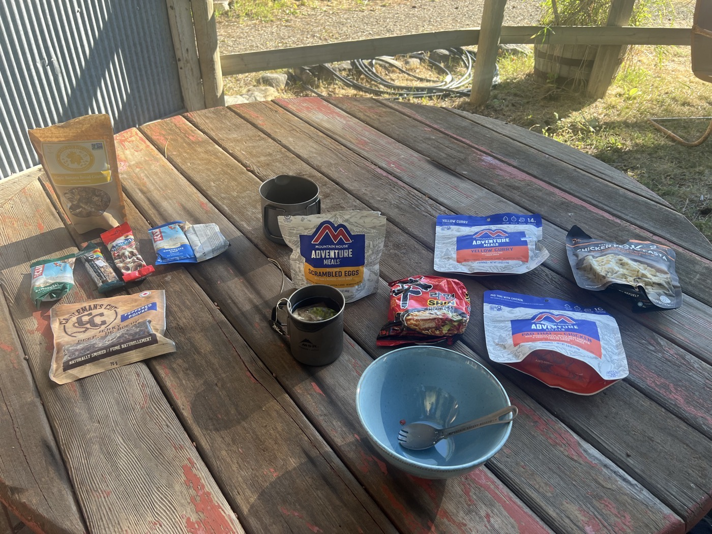

#  Ça déraille à Rawlins

<figure markdown>
{ width=“300” }
</figure>

Jamais été aussi bien dans mon lit. Mais il faut avancer, je commence à regarder la carte. Puis je veux régler mon dérailleur, après 30mn le câble lâche. Il faut réparer pour reprendre la route.

<!-- more -->

# Dérailleur 

À plus de 2'000km de Gravel, je vois que le vélo accuse aussi le coup. Sur mes 13 vitesses je n'arrive plus à passer la 1ere. Celle qu'il faut pour les côtes. Or le Colorado signifie altitude et petites montées raides, moins longues que dans le Montana. Va-t-il falloir remplacer le dérailleur? Je refais tous les réglages puis clac, plus de passage de vitesse du tout. Le câble a cassé dans sa gaine... Mince la tuile. Le prochain atelier vélo est à 200km.

# Réparation

Bon, sur les bons conseils de Tristan, un 2ème câble de dérailleur est à peu près le dernier achat que j'ai fait avant de partir. Je regarde l'heure, j'appelle Tristan. Et il me guide à distance pour changer le câble sur le parking de l'hôtel avec des bourrasques de vent. On y arrive après plus de 2h. Je vous passe les détails, mais j'avais jamais fait cette opération avant. Il y a ce petit moment de victoire quand le nouveau câble est en place et (...) que les 13 vitesses fonctionnent. Merci 🙏🙏🙏 Tristan (qui dirige l'atelier vélo de Bikeworld Gland).

Je suis aussi très reconnaissant que le câble n'ait pas lâché 24h avant! Que d'émotions!

# Nourriture 

Avec les jambes bien lourdes, je roule tranquille aujourd'hui. Du coup pas trop de photos. Mais je voulais une fois vous parler de ma nourriture. 

De base la journée j'ai des barres de céréales et énergétiques. J'essaie aussi de prendre un sandwich ou des restes de pizza avec moi. Et des fruits secs ou une pomme.

Le soir j'essaie les plats lyophilisés (pas facile à trouver et assez chers). Sinon purée. Tortilla Nutella au dessert.

Le matin, flocons d'avoine, omelette lyophilisée, tortillas. 

De temps en temps: hot dog, burger, pizza. Dans les stations d'essence ou les supérettes, je bois toujours un jus et un lait au goût de fruit. Je limite les quantités dans la journée, je préfère manger en plusieurs portions. De manière générale je supporte bien tout, y compris les barres énergétiques. J'ai mes préférences 😉.

J'essaie d'avoir une autonomie de 2-3 jours.

À bientôt!

!!! hint ""
    cliquez sur les photos pour voir les commentaires

<figure markdown>

{ width=“300” }

{ width=“300” }

</figure>

