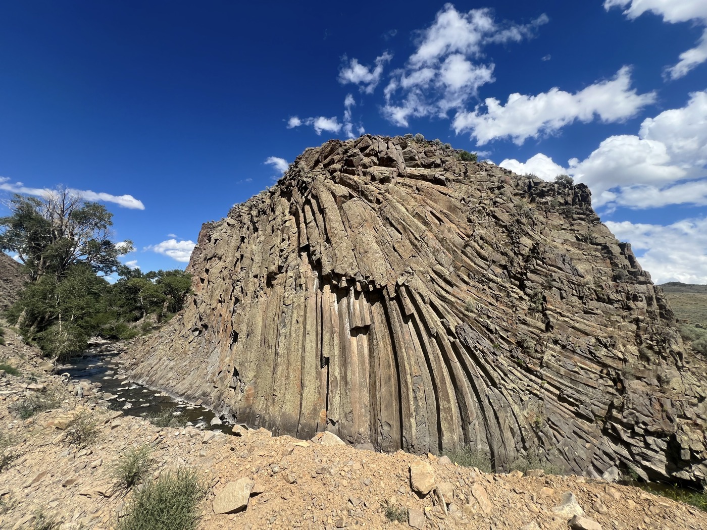
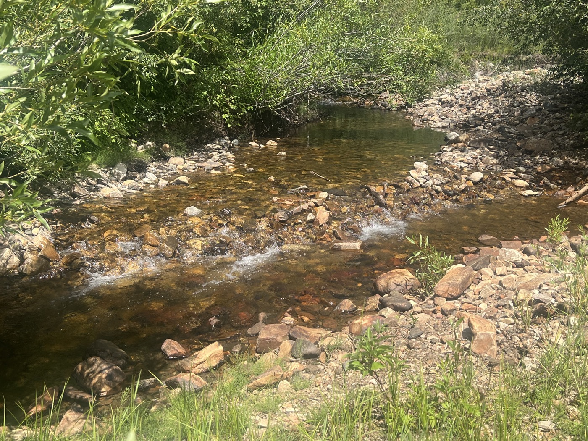
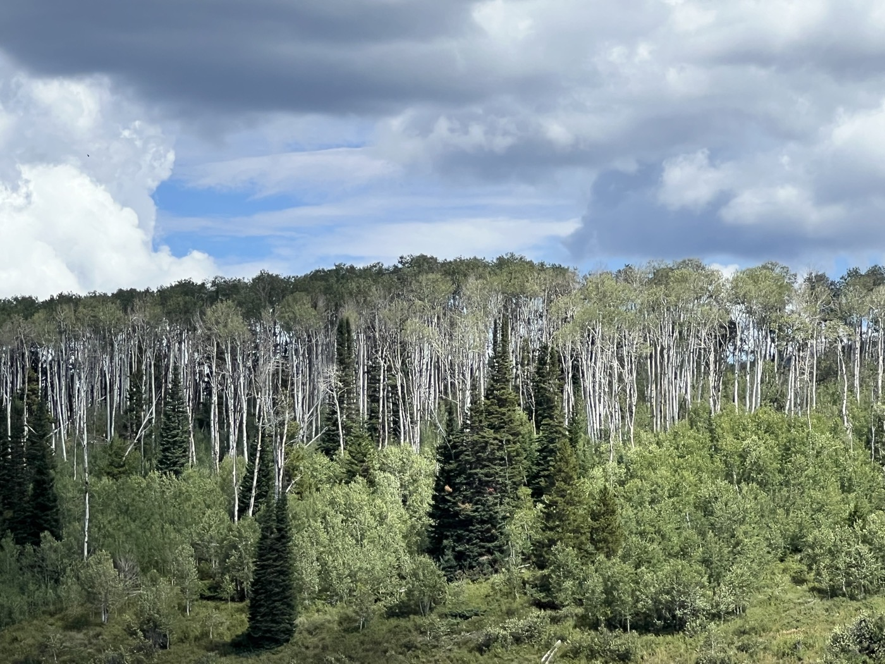
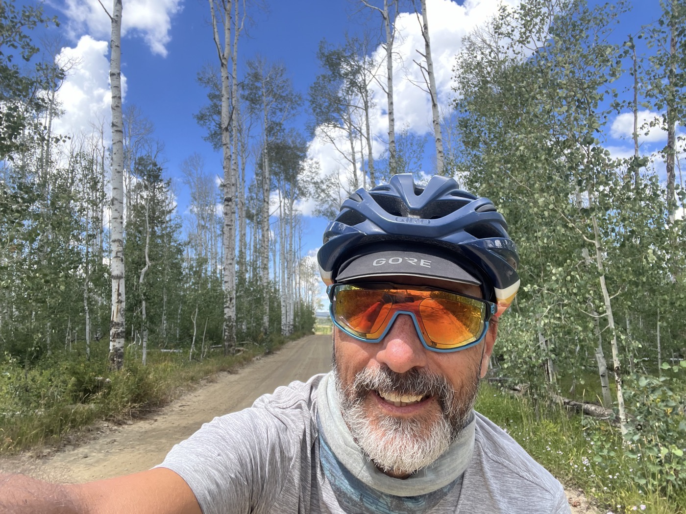
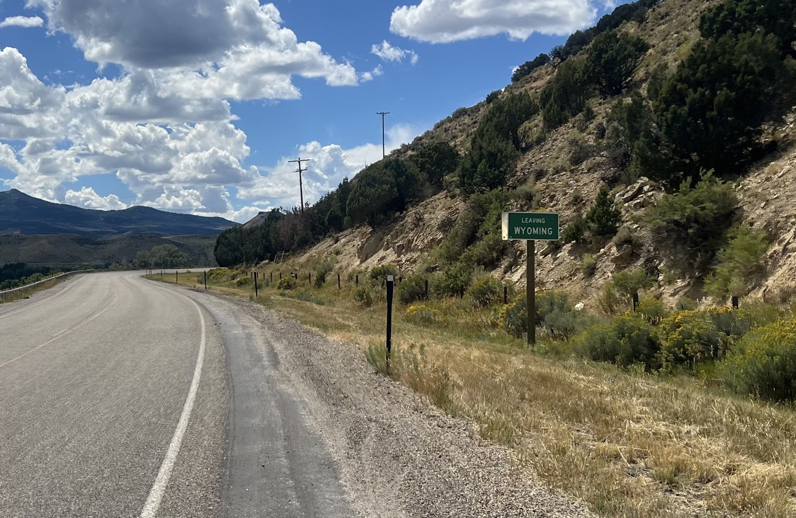
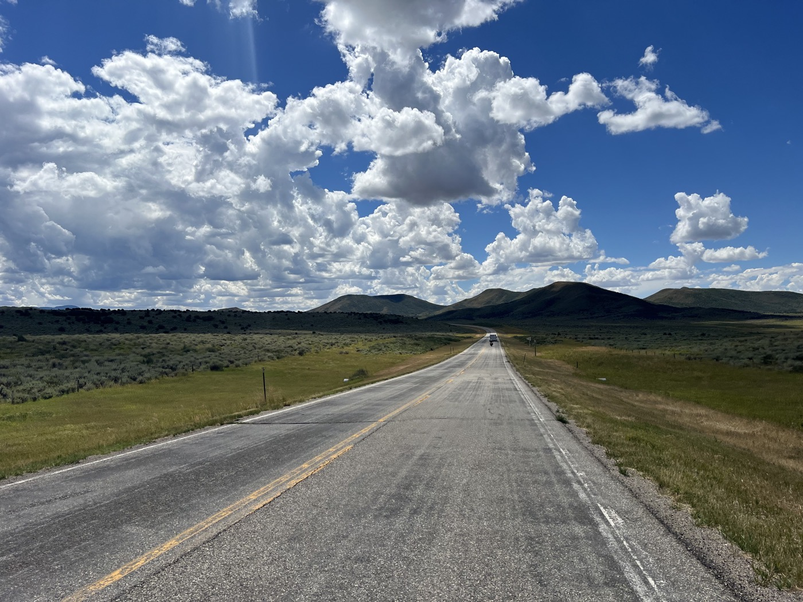
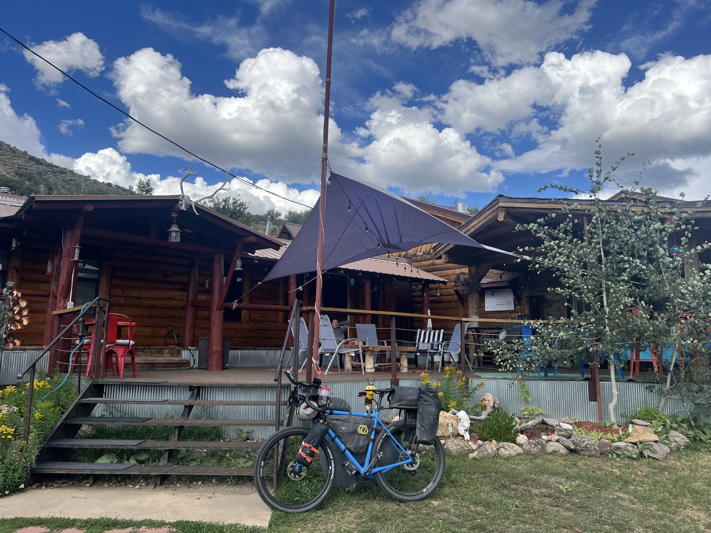
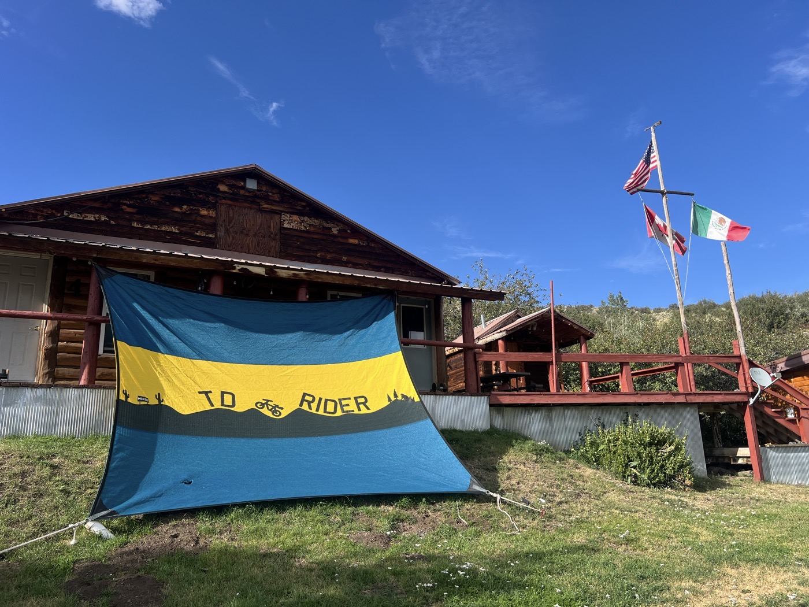
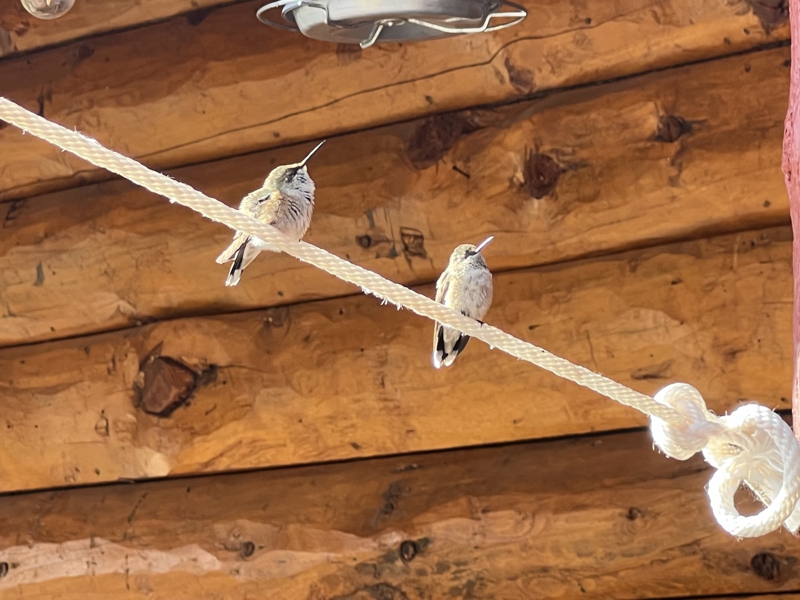
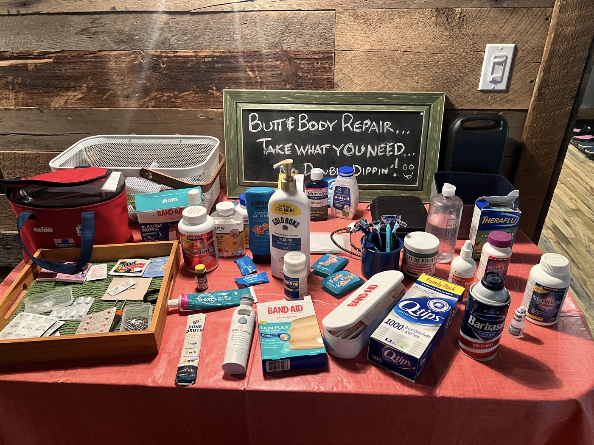

#  Hello Colorado!

<figure markdown>
{ width=“300” }
</figure>

Après une nuit orageuse je reprends la route. Aujourd'hui je quitte le Wyoming pour rejoindre le Colorado. Je m'arrête au Brush Mountain Lodge, un hébergement vraiment fait pour les Dividers. Sur le chemin, je retrouve de la végétation 👍.

<!-- more -->

# Aspen Valley 

Je poursuis cette route asphaltée (une succession de montées et descentes) pour finir par rejoindre du gravier. Et là je passe dans Aspen Valley. Aspen est un arbre (Peuplier non-tremble) qui m'accompagne depuis Calgary. Je trouve ces peupliers qui culminent à 25m très beaux et aujourd'hui je suis servi! Cet arbre est surtout canadien mais s'étend sur les USA jusque dans la vallée de Mexico. Il suit en quelque sorte la divide. Son bois est tendre et il sert à faire du papier.

# Au revoir Wyoming

Je quitte le Wyoming et ses vents forts qui m'ont bien fatigué 😉. Je retrouve du relief, des arbres, des rivières (enfin je peux filtrer de l'eau fraîche et réduire mes stocks/poids en eau). Le Colorado me fera traverser des petites stations de ski, comme par exemple Steam Boat. C'est l'avant-dernier état de mon périple (déjà!). Je passe aussi d'un état de 500'000 habitants à un état habité par près de 6 millions.

# Brush Mountain Lodge 

Magnifique accueil, tout est pensé vélo. Après cet arrêt - mes jambes auront sûrement récupérées! Je fais connaissance avec 2 autres Dividers qui font la GDMBR par étapes. Kirsten, la gérante, est aux petits soins. Je me réjouis déjà du petit déjeuner qui a grande réputation. J'en profite aussi pour faire une vraie lessive. 

Steam Boat est l'arrêt idéal pour faire réparer son vélo. Mais je suis plutôt content, les vitesses passent bien. J'espère pouvoir passer la ville. Ma prochaine grosse étape devrait être la bourgade de Salida d'ici quelques jour....

!!! hint ""
    cliquez sur les photos pour voir les commentaires

<figure markdown>

{ width=“300” }

{ width=“300” }

{ width=“300” }

{ width=“300” }

{ width=“300” }

{ width=“300” }

{ width=“300” }

{ width=“300” }

{ width=“300” }

{ width=“300” }

</figure>

<iframe src='https://connect.garmin.com/modern/activity/embed/16809149974' title='Day 25' width='405' height='500' frameborder='0'></iframe>

