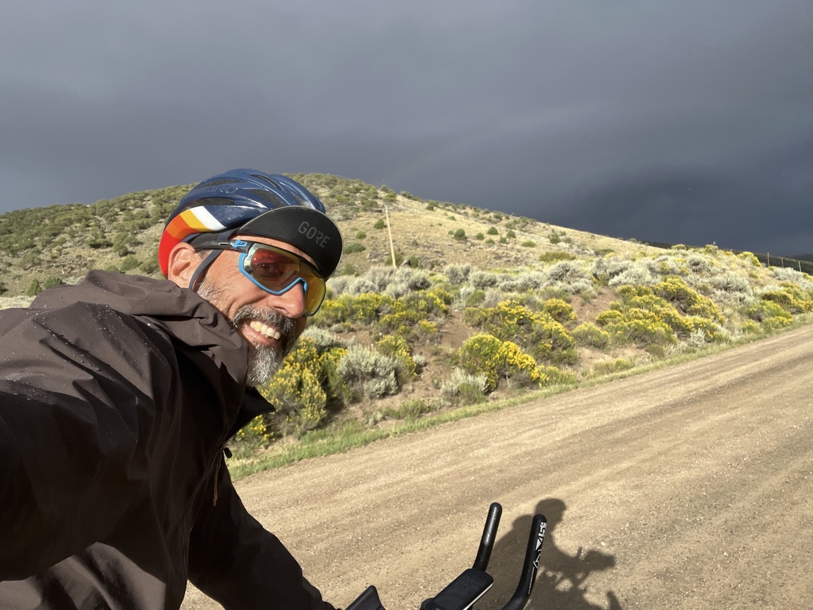
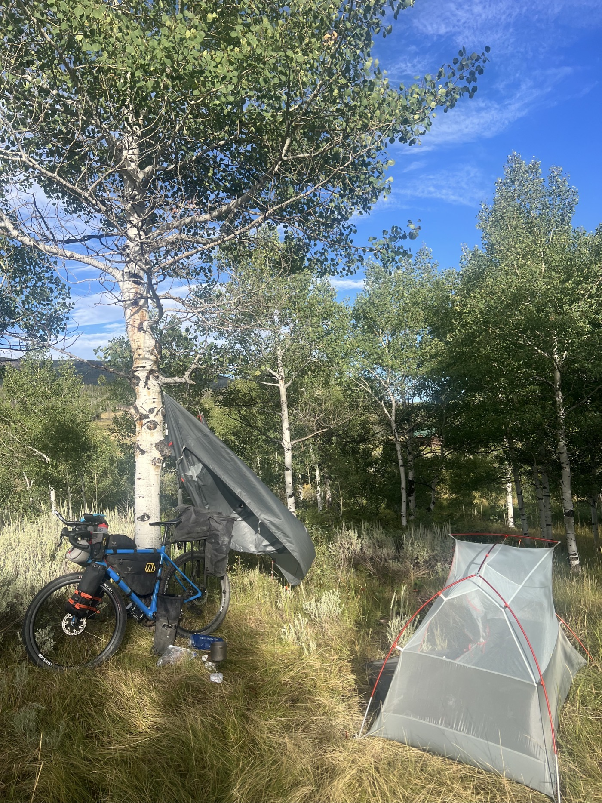
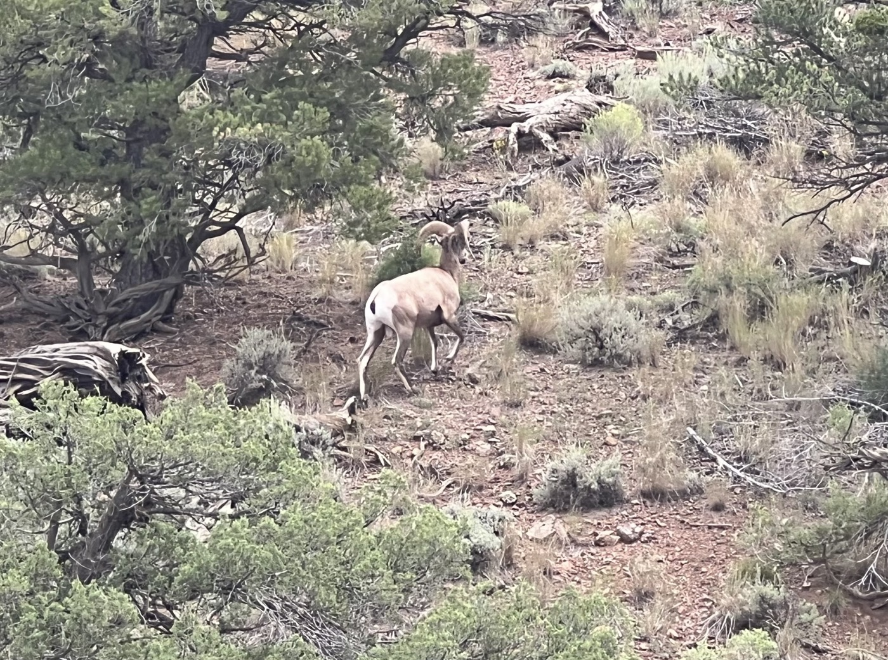
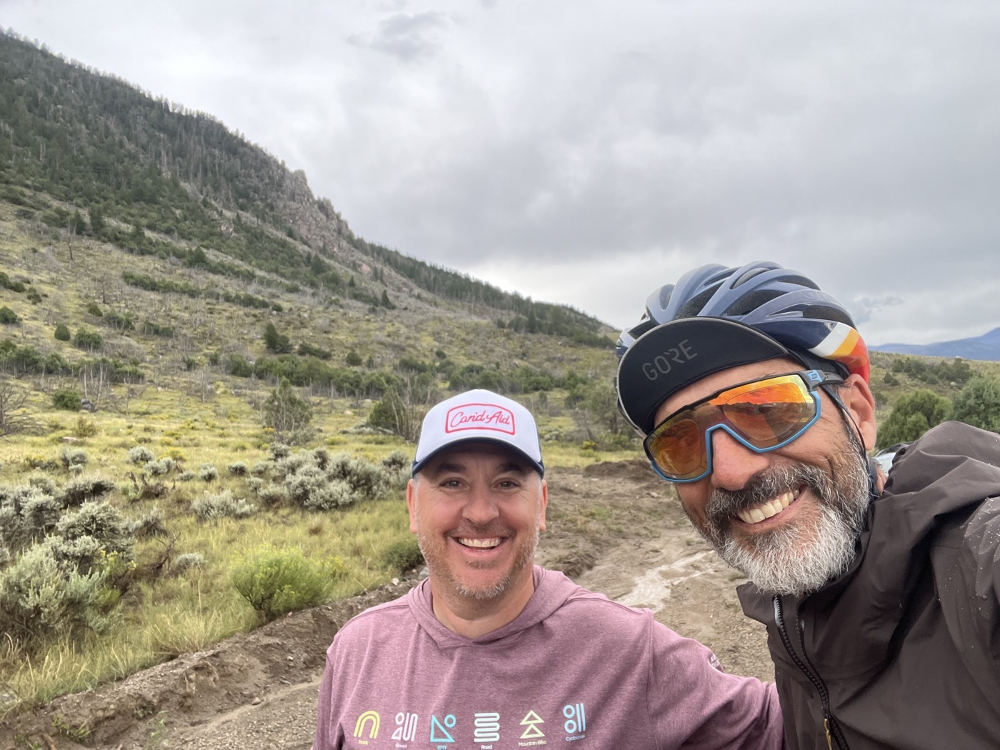
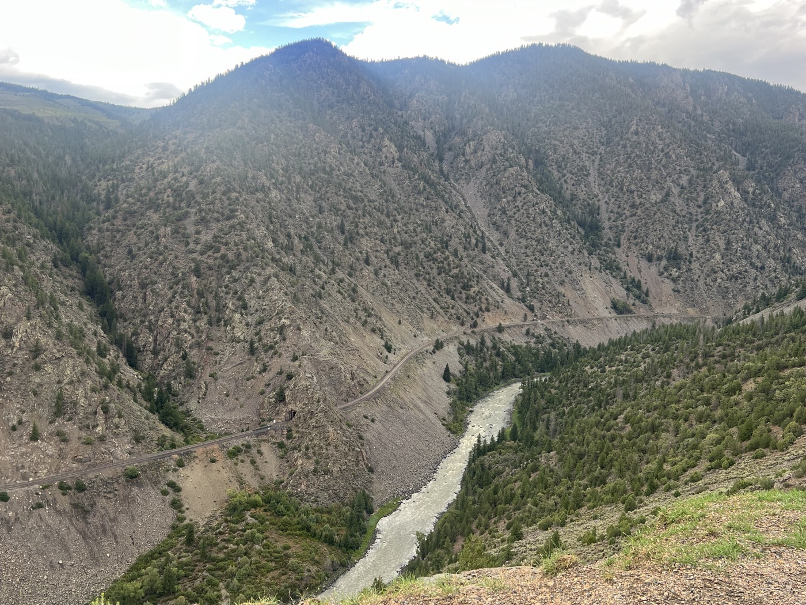
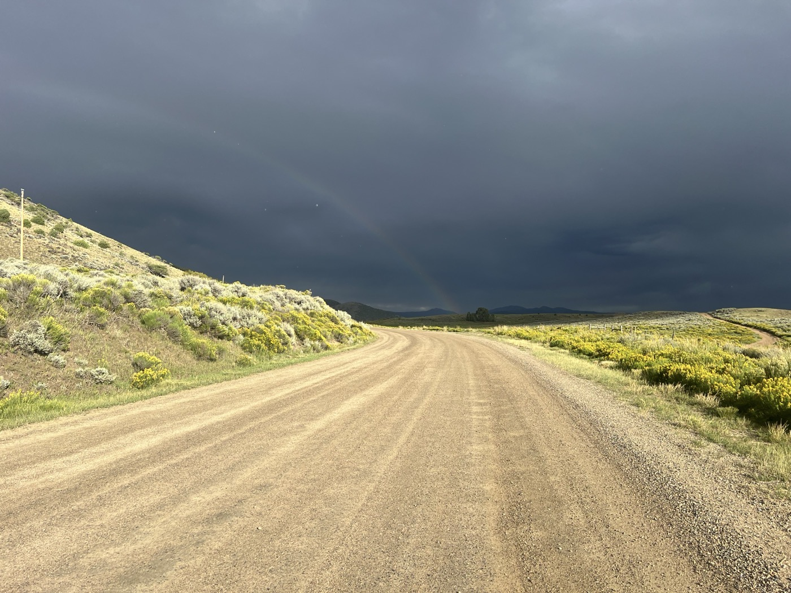
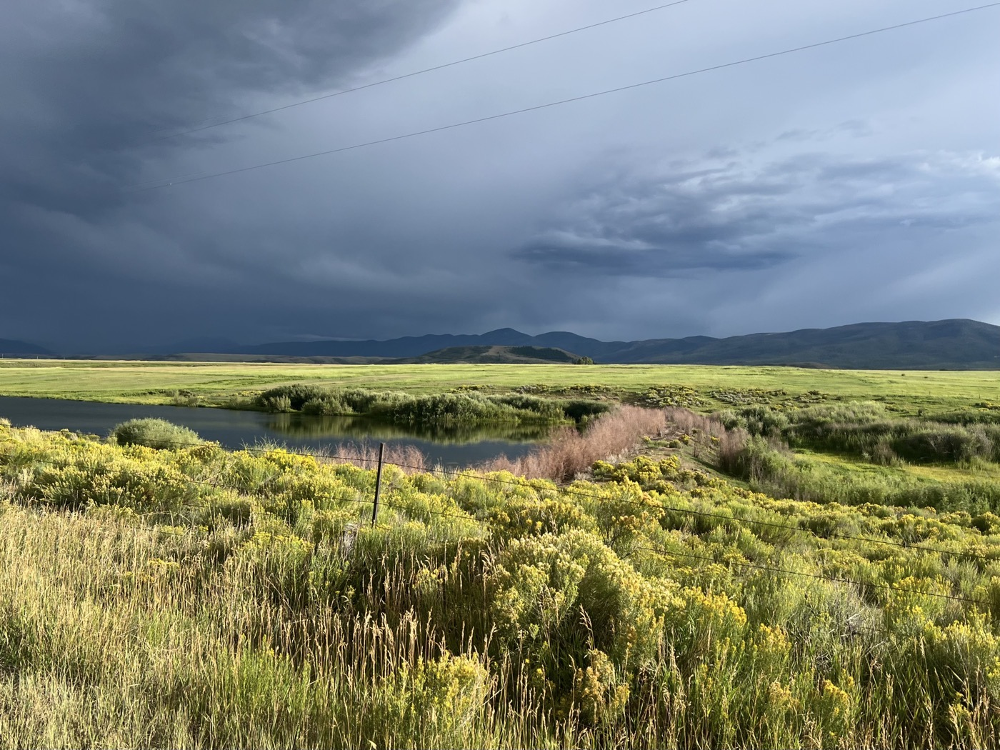
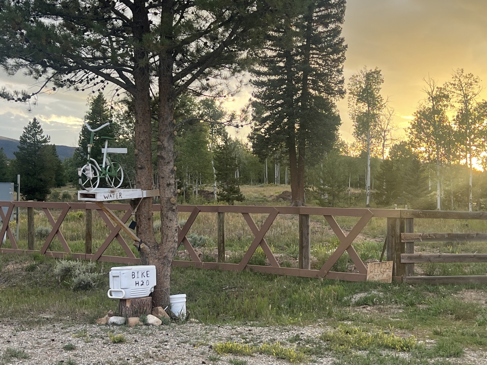

#  le Colorado a du relief!

<figure markdown>
{ width=“300” }
</figure>

Je repars du bivouac, mais perd du temps pour bricoler le vélo. Enfin j'enchaîne les montées. Presque toute la journée sur du gravier. Paysage typé montagne, parfois cela ressemble au Jura. Les roches ont de belles couleurs. Je m'arrête finalement pour entrer sur un terrain privé avec une pancarte 😉.

<!-- more -->

# Ça monte et ça descend... 

Il y a un air de Sisyphe.. j'attaque la montée mais la descente est trop raide pour bien récupérer que ça repart déjà en montée- zut! Autrement les paysages sont très vert, c'est beau.

# Rencontres

C'était je pense ma dernière chance pour voir un Moose ou un Elk. Autrement dit un Élan (Orignal) qui paraît-il est gigantesque. Mais voilà - pas vu. En revanche j'ai vu un Mouflon d'Amérique traverser juste devant moi. Trop rigolo de le voir faire ses bonds. Je n'ai pu le prendre que de dos malheureusement. 

# Salida

Mon prochain objectif est la bourgade de Salida. Elle a une bonne réputation chez les Dividers. Dernière occasion de réparer le vélo, après c'est le Nouveau Mexique et c'est assez sauvage. D'ici Salida j'enchaîne les stations de ski mais j'essaie de pas m'arrêter. Après Salida - c'est déjà un peu la fin qui approche mais je vois le verre à moitié plein 😉.

!!! hint ""
    cliquez sur les photos pour voir les commentaires

<figure markdown>

{ width=“300” }

{ width=“300” }

{ width=“300” }

{ width=“300” }

{ width=“300” }

{ width=“300” }

{ width=“300” }

{ width=“300” }

{ width=“300” }

{ width=“300” }

</figure>

<iframe src='https://connect.garmin.com/modern/activity/embed/16827976659' title='Day 27' width='405' height='500' frameborder='0'></iframe>

