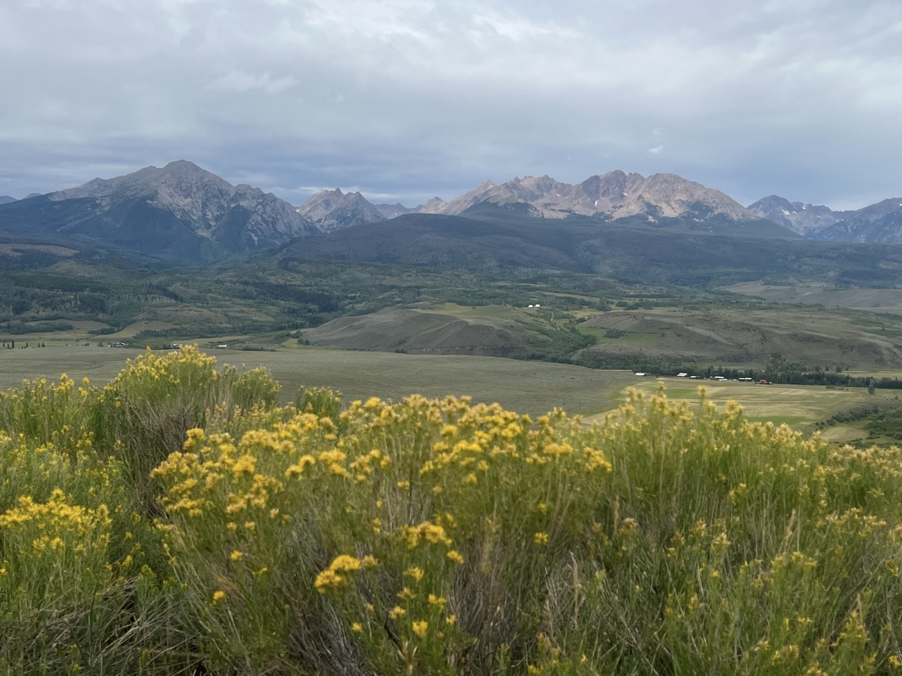
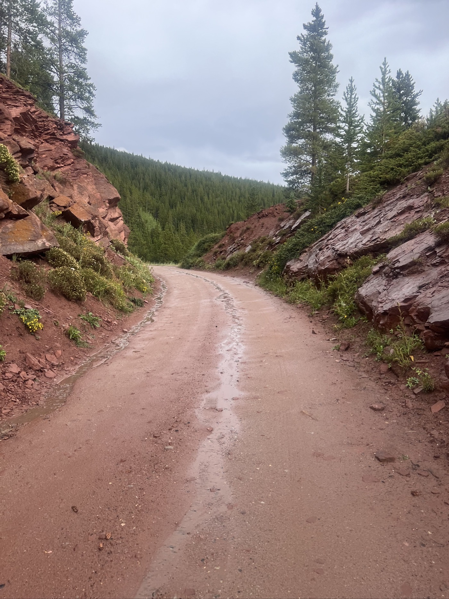
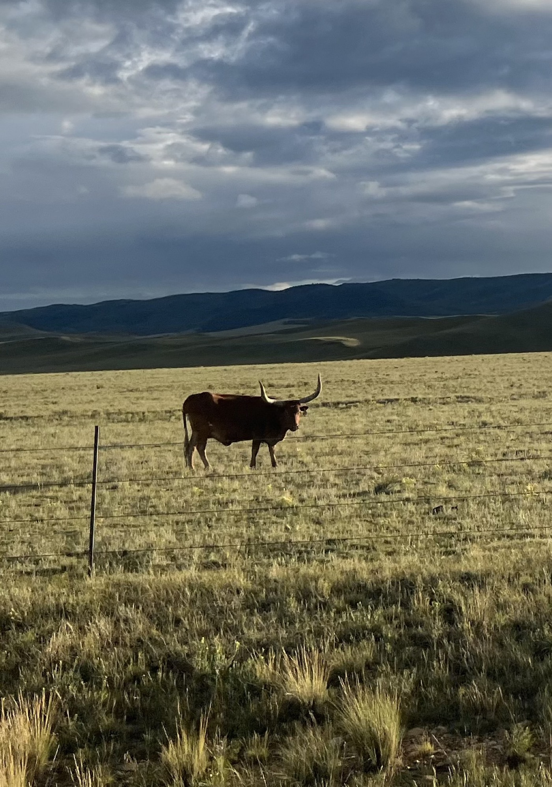
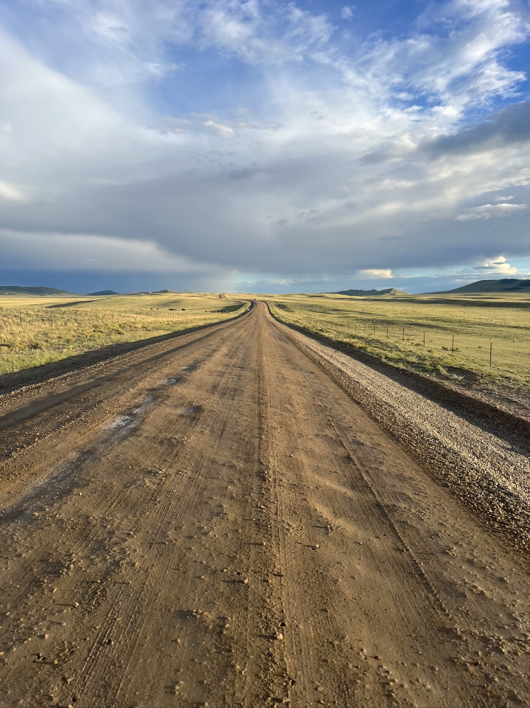
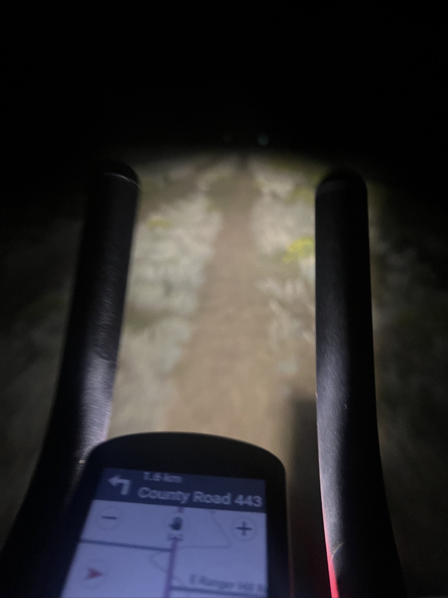

#  Boreas Pass 3'500m

<figure markdown>
{ width=“300” }
</figure>

Je quitte Steve qui s'est réveillé tout content avec ma tente dans son jardin. J'enchaîne Ute Pass puis Silverthorne, Frisco et Breckenridge, 3 stations de ski reliés par une piste cyclable. Je passe le col Boreas à 3'500m pour terminer à Hartsel, aussi près que possible de Salida (=repos). 150km, 1'800m D+, 10h en selle!
<!-- more -->

# le ski 🎿 

En gros il y a un duopole aux USA. Les stations sont soit regroupées sous le ski-pass Icon soit Epic. Le forfait annuel est de 1000$. Ils étendent leur couverture à l'international: Icon inclut Chamonix et Zermatt, Epic ouvre Crans-Montana en 2024/25. [Le choix est assez immense](https://www.ski.com/epic-vs-ikon). C'est du Magic Pass à l'échelle mondiale (au double prix). 

En revanche, même si Silverthorne et Breckenridge sont plutôt des villes moyennes (avec aucun immeuble), la neige tient jusqu'en mai. L'activité estivale est très peu développée (aucune remontée mécanique tournait). Breckenridge très touristique/beaucoup de magasins. Heureusement que je me suis pas arrêté 😅. Le ski est considéré comme une activité assez luxe/exclusive.

# La Divide

Revenons aux choses sérieuses. La piste cyclable est moyennement intéressante. Mais je passe certains beaux chalets. Et surtout j'attaque le col de Boreas sous la forte pluie. Hop, je remets mon équipement (chaussettes étanches incluses). C'est long (2h de montée) et frisquet. Content de passer le col. Très belle descente. Mais ensuite, c'est du gravier interminable. J'arrive dans la nuit à mon objectif et plante ma tente près de Hartsel. J'y ai repéré un café pour mon petit-déjeuner.

!!! hint ""
    cliquez sur les photos pour voir les commentaires

<figure markdown>

{ width=“300” }

{ width=“300” }

{ width=“300” }

{ width=“300” }

{ width=“300” }

{ width=“300” }

{ width=“300” }

{ width=“300” }

{ width=“300” }

{ width=“300” }

{ width=“300” }

{ width=“300” }

{ width=“300” }

{ width=“300” }

</figure>

<iframe src='https://connect.garmin.com/modern/activity/embed/16843044919' title='Day 28' width='405' height='500' frameborder='0'></iframe>

