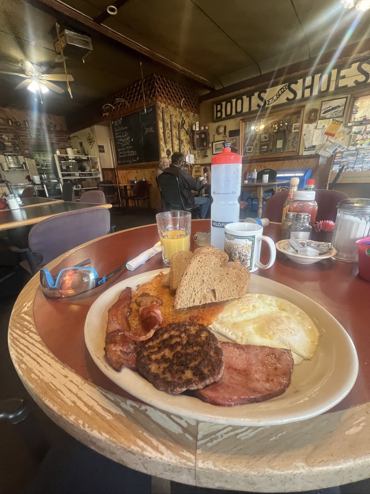
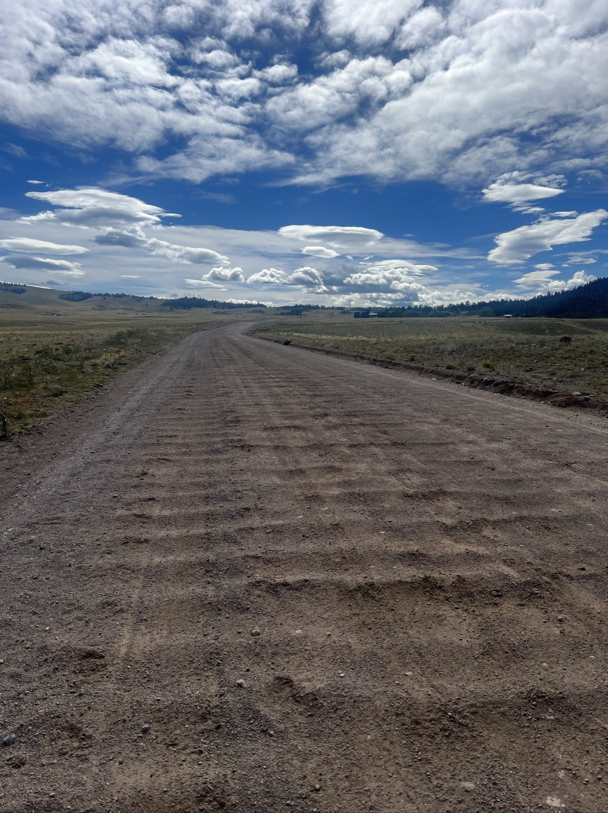
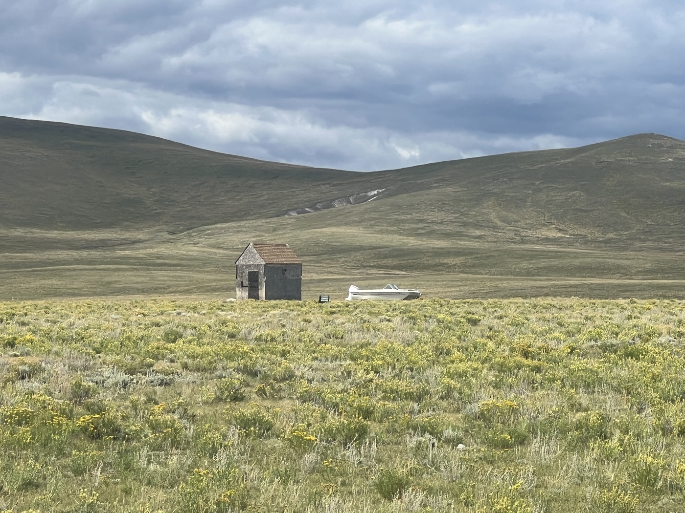
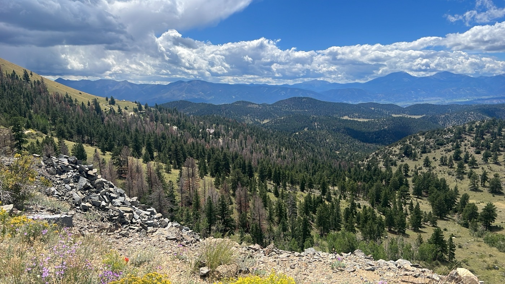
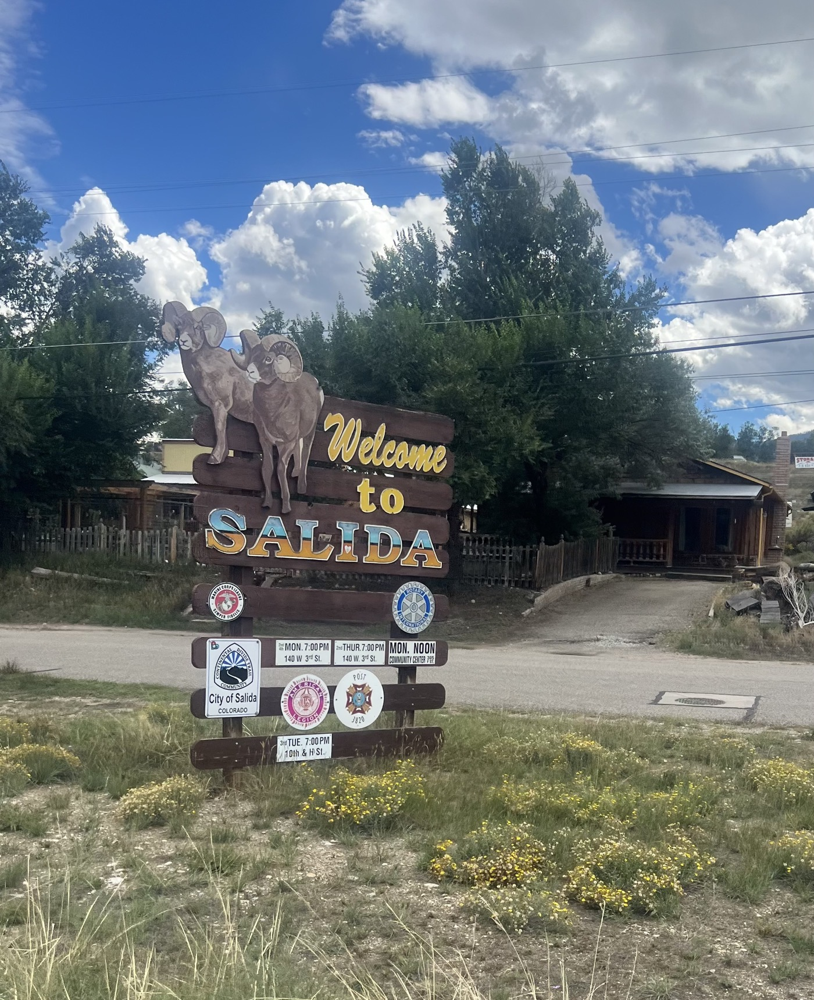
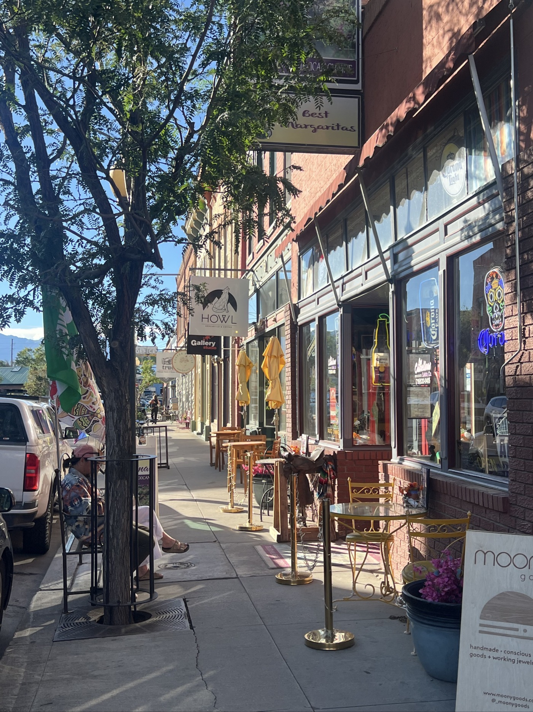
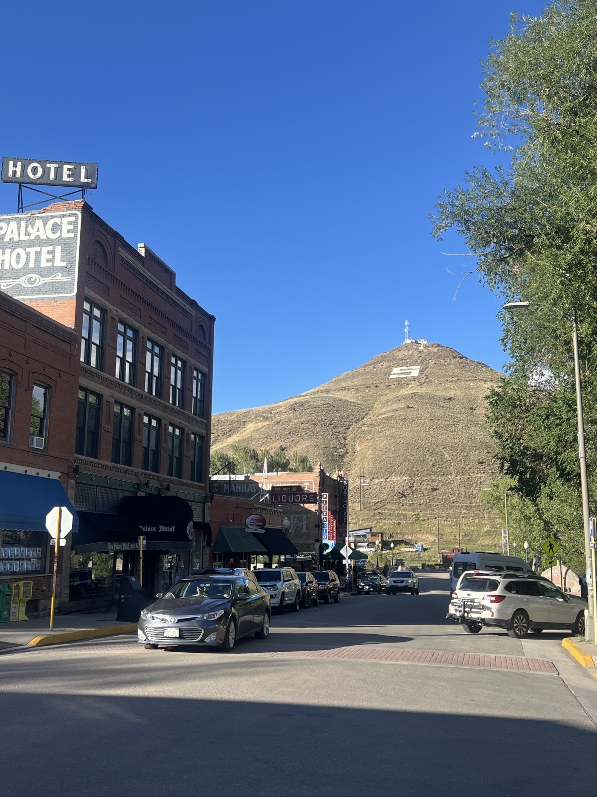
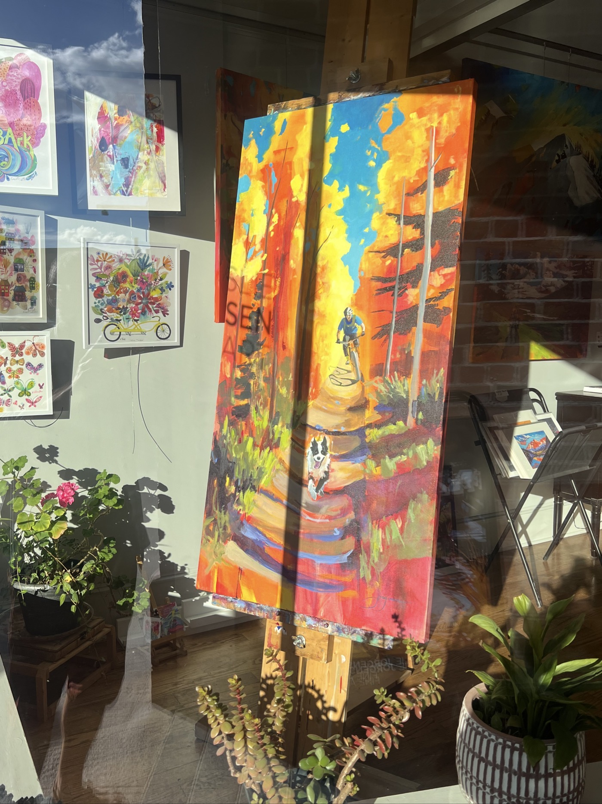
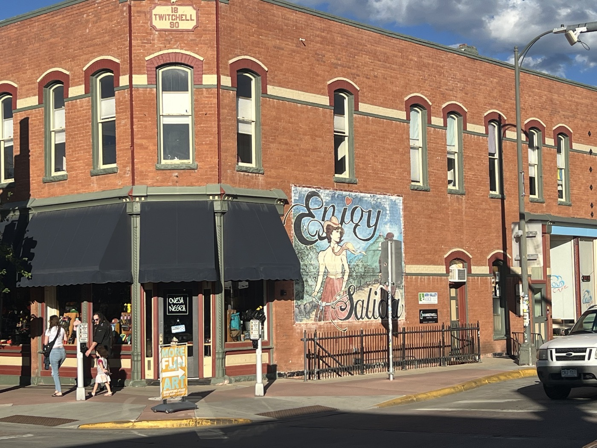
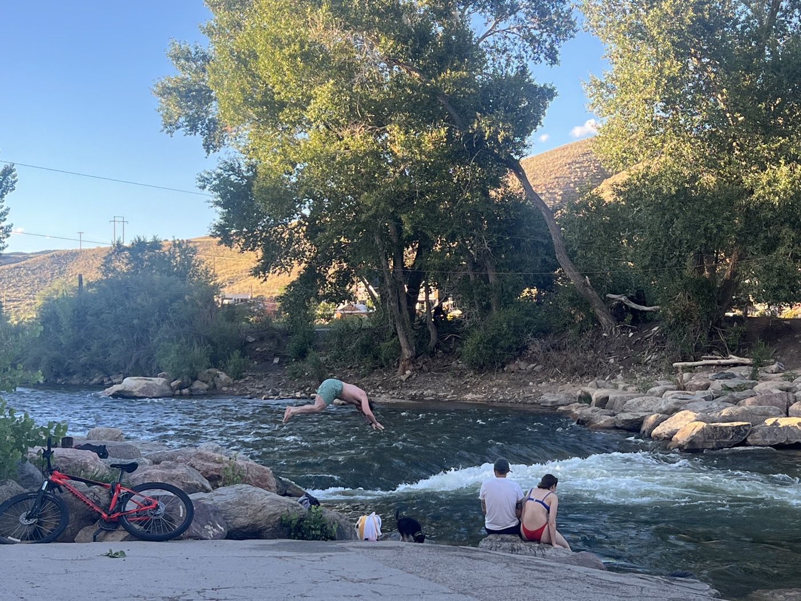

#  Salida et un peu de repos

<figure markdown>
{ width=“300” }
</figure>

Moment magique avec ce beau ~~petit-dejeuner~~ repas. Je m'élance car je veux rejoindre Salida. Aujourd'hui mon fils Loïc a 12 ans! Je tiens à avoir du signal pour lui parler. Et avoir du temps en ville. C'est sans compter sur le vent et la difficulté du terrain.

<!-- more -->

# Un moment en dehors du temps

Après une nuit sous tente, frisquette et humide, je découvre ce petit café qui sert des brunchs. Tout simple mais l'ambiance est magique. Un côté western, musique country, les hommes ont des chapeaux, la serveuse Abby chante (redoutable en karaoke à mon avis). J'utilise Shazam pour enrichir ma playlist divide à mon retour. Honnêtement je vous souhaite à tous un tel moment de paix au petit-déjeuner. Un défi pour ces prochains jours? Déguster et se laisser porter.

# en route pour Salida

Gonflé à bloc, j'attaque la route. Vent plein face et surtout le washboarding sur 30km. Horreur. Ma moyenne fond à toute vitesse. Je me bagarre comme je peux et commence à faire mes calculs pour passer le col au-dessus de Salida, moment où j'aurai du réseau. Je redouble d'efforts et me dit que tout mauvais moment n'est que passager. Les jambes répondent présent, un dernier effort et ouf on arrive à se voir. Très bon moment en famille et joyeux anniversaire à mon garçon 🥳🎂🎁. Difficile à vivre à distance malgré tout.

# Salida

La descente sur Salida est fantastique. Et la ville/bourgade est très très chouette. Beaucoup plus authentique que les stations de ski avec un côté alternatif. Le vélo se décline beaucoup au travers de restaurants et magasins d'art. J'aime beaucoup, bon choix pour traîner. Je fais faire un dernier service à mon vélo. Je mange 2 gros repas : j'ai jamais été aussi maigre malgré toutes les protéines que je m'enfile 🤔. J'ai mal au ventre ce soir tellement j'ai 🍽️😆.

!!! hint ""
    cliquez sur les photos pour voir les commentaires

<figure markdown>

{ width=“300” }

{ width=“300” }

{ width=“300” }

{ width=“300” }

{ width=“300” }

{ width=“300” }

{ width=“300” }

{ width=“300” }

{ width=“300” }

{ width=“300” }

{ width=“300” }

</figure>

<iframe src='https://connect.garmin.com/modern/activity/embed/16843057885' title='Day 29' width='405' height='500' frameborder='0'></iframe>

