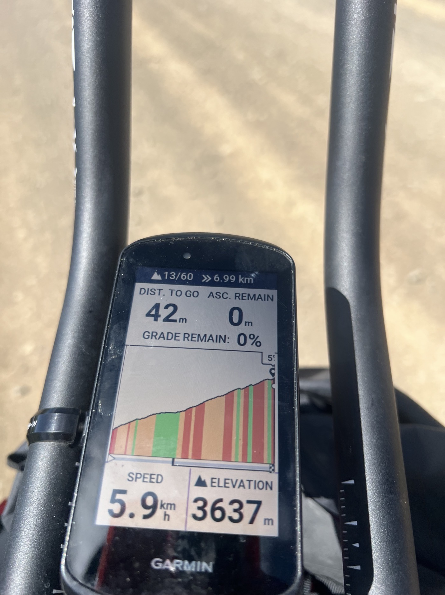
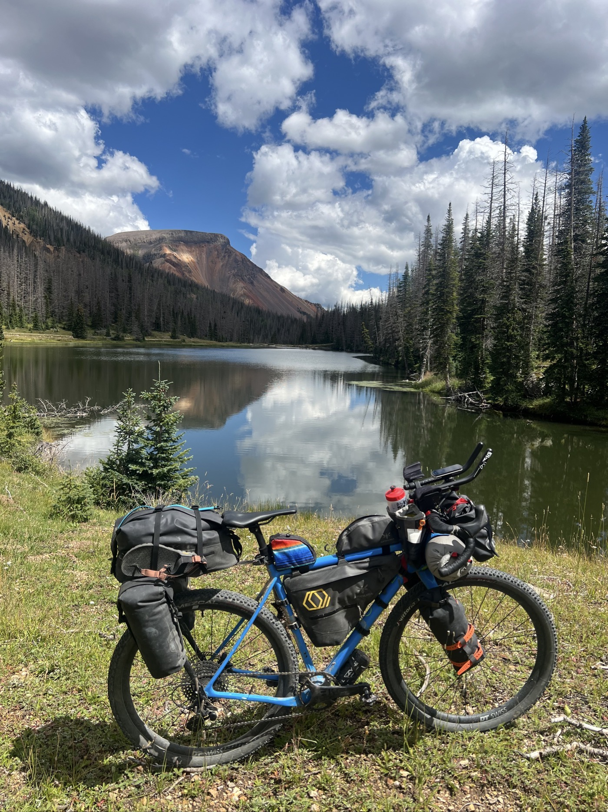
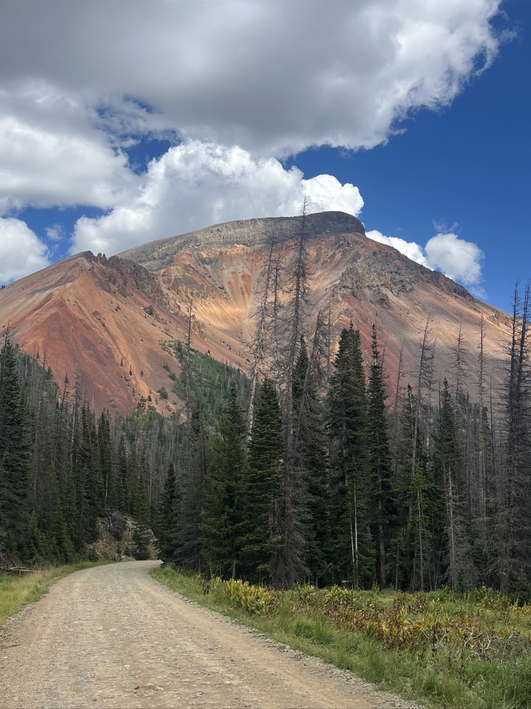
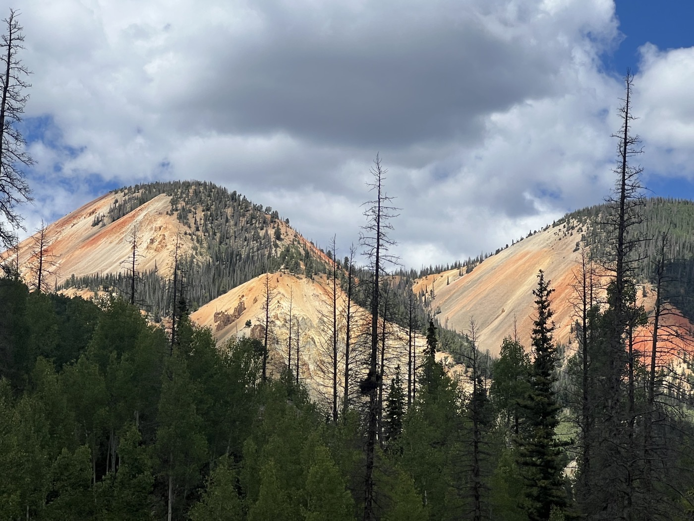
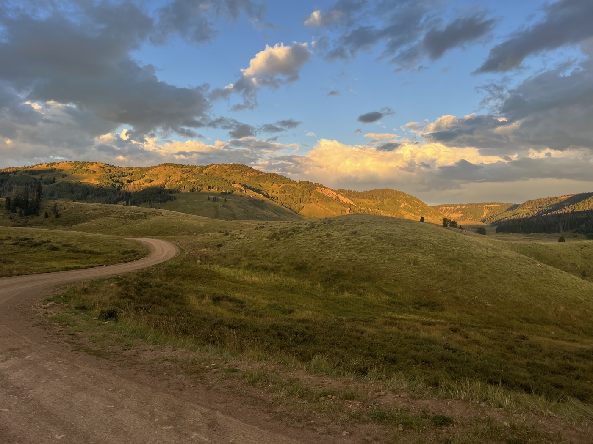
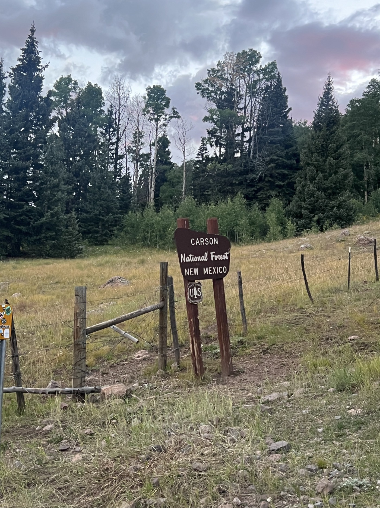

#  Altus Maximus

<figure markdown>
{ width=“300” }
</figure>

J'attaque l'Indiana Pass qui culmine les cols de la Divide. Longue montée mais il fait beau. Derrière ça plonge pour ensuite longer une belle rivière. Vue sur des flancs de montagne hauts en couleur (riches en fer). Pause à Platoro. Puis la Manga Pass: bivouac sur la frontière, je dors au Nouveau-Mexique!

<!-- more -->

# Indiana Pass

Ça grimpe! Aujourd'hui j'ai cumulé 2'200m de D+. Je me promène entre 2'500 et 3'500m. Même en étant acclimaté, c'est dur. Il faut s'accrocher dans les montées!

# Aventure, toujours

Je retrouve des sensations. Aujourd'hui la trace est plus sauvage, toujours pas de réseau (désolé pour le manque de news. Mais c'est ce qui me donne la banane: être nomade seul sur mon vélo, à me débattre avec l'aventure qui change chaque jour. Explorer et repousser mes limites. Apprécier l'environnement vivifiant, la nature brute. 💪!

# La suite

J'ai besoin de retrouver du réseau pour bien situer mes options. Entre Abiquiu, Cuba et Grants c'est compliqué. Au pire je prends la route, si la piste est pas praticable. Je vise El Rito et Abiquiu les prochaines 48h. Il me reste un peu plus de 1'000km jusqu'à la frontière. Mais c'est le dénivelé qui donnera le rythme. À suivre...

!!! hint ""
    cliquez sur les photos pour voir les commentaires

<figure markdown>

{ width=“300” }

{ width=“300” }

{ width=“300” }

{ width=“300” }

{ width=“300” }

{ width=“300” }

{ width=“300” }

</figure>

