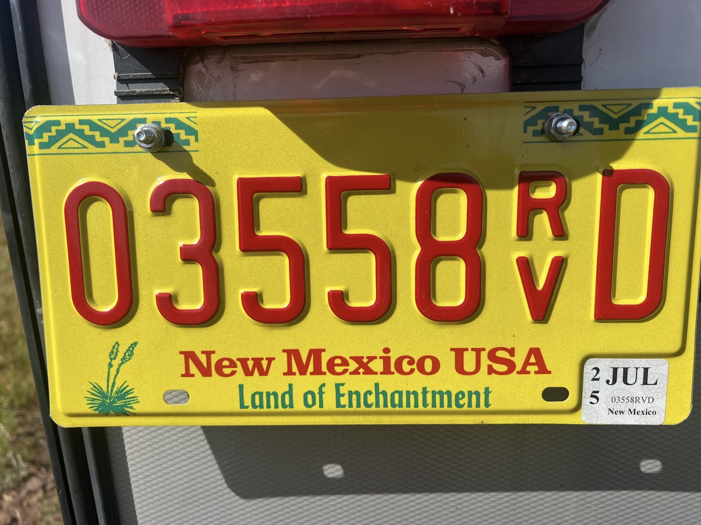
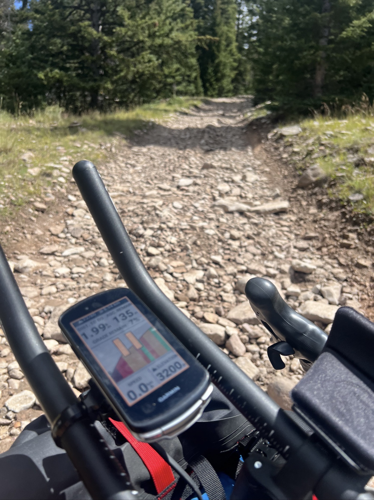
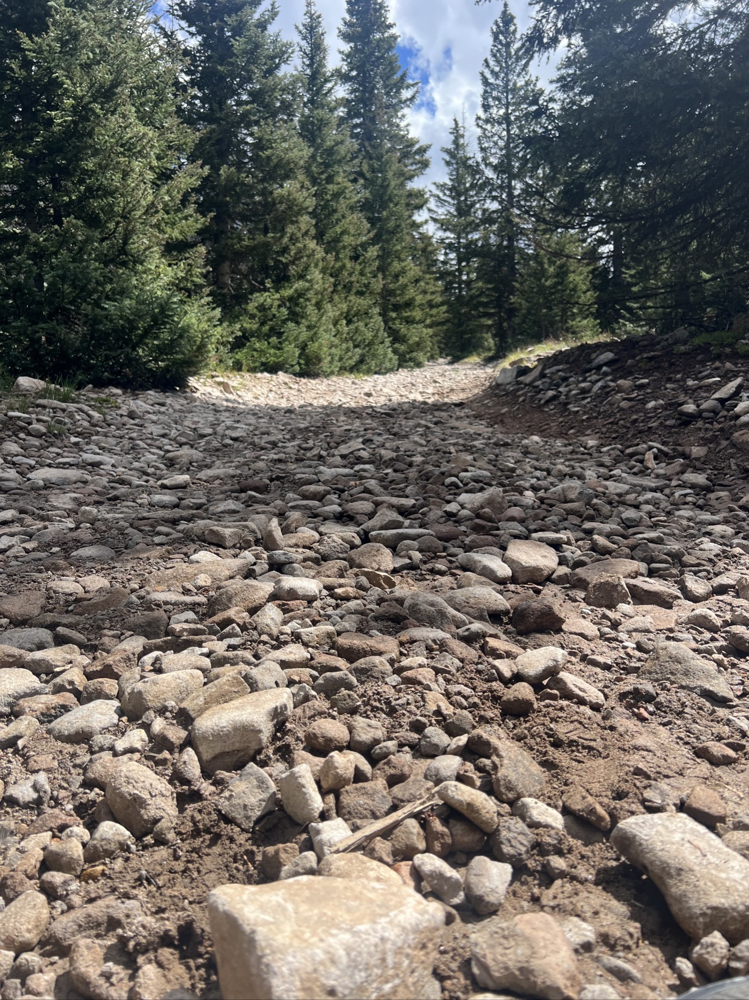
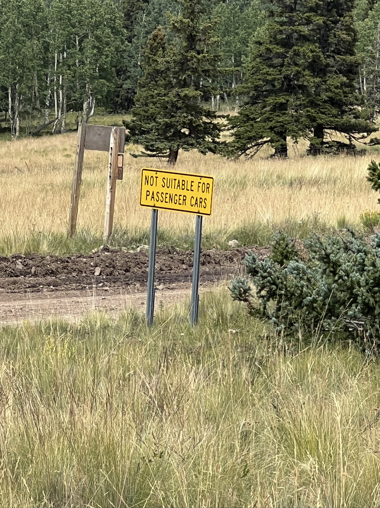
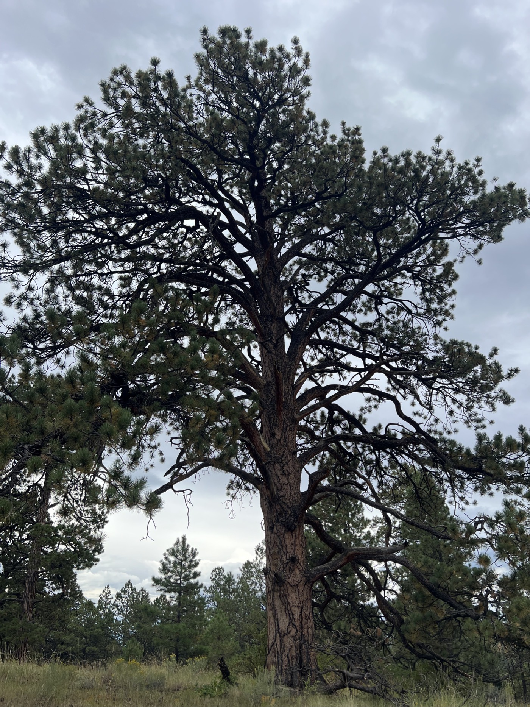
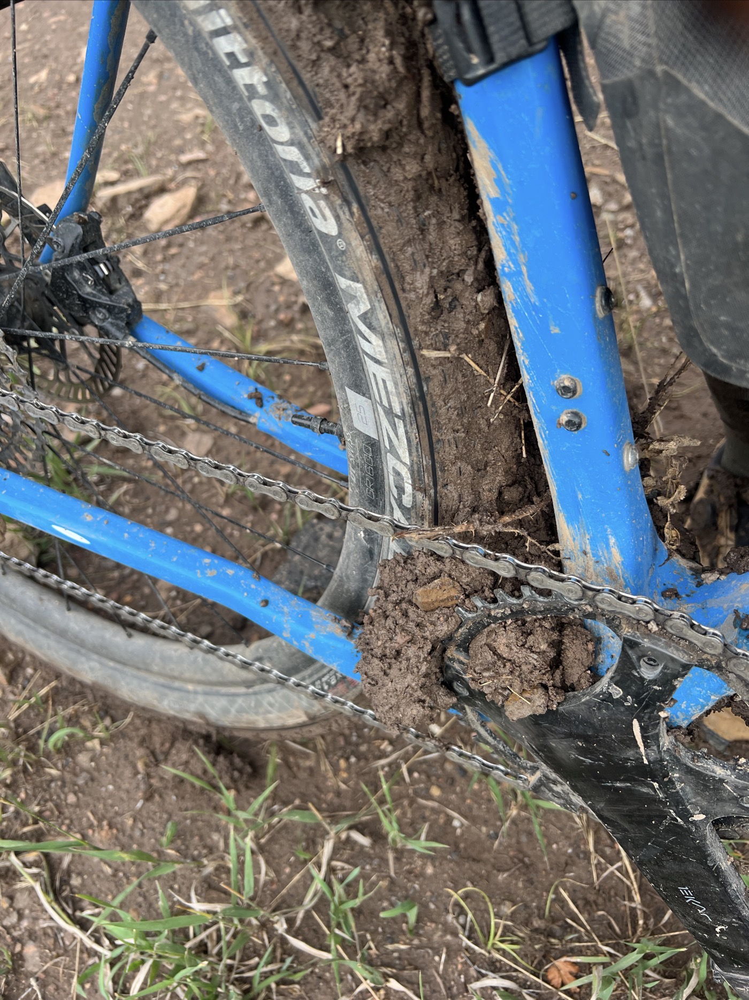

#  Land of enchantement - really?

<figure markdown>
{ width=“300” }
</figure>

Je suis dans le Land of Enchantment, mon dernier état américain avant la frontière 💪. Ça se corse - je goûte rapidement au relief particulier des Tusa Mountain. J'échappe à la pluie mais pas le terrain sur lequel passe ma trace. Je m'embourbe et perd un temps fou à dépasser le bourbier de la peanut butter. L'aventure et le défi sont au rendez-vous!

<!-- more -->

# Defiant

La piste est totalement impraticable! Beaucoup de caillasse, hop je suis souple et monte en danseuse. Le Gravel est stylé pour ça 🕺. Mais ça grimpe et bientôt je me trouve dans un lit de pierres. Je dois pousser. Dans la descente, mon vélo bondit dans tous les sens. C'est plutôt hard rock façon AC/DC en mode accéléré. On oublie la souplesse... je prie que rien ne casse.

# Lâcher prise

Impossible de contrôler aujourd'hui. Ma moyenne est ridicule. Mais c'est pas grave, mon esprit combatif me porte. Peu importe jusque quand et où, j'avance. Je fais le vide et prend les difficultés à
bras le corps. Je fais le fakir sur la selle, j'accélère en descente, je pousse quand ça avance plus. J'évite les flaques, la boue. 

# Peanut Butter

Je prends de la vitesse, tiens une trace de roue de vélo? Je me dis que je vais la rattraper. Et là, je vois rien venir, la surface avait l'air juste sablonneuse, mais ça colle aux roues, je fais un travers et patatra c'est la gamelle. Bon le genou est un peu écorché, j'aurais des bleus, rien de grave. Sauf que... le vélo repart pas. Je pousse 1m50 et la roue est bloquée. La boue colle à la roue et s'épaissit. Je vais sur le bord il y a quelques pierres. Ben les pierres se collent aussi à la roue! 😱. Je prends un bâton pour dégager cette boue. Je refais 1m. Bon là il faut réfléchir aux options... Bientôt la nuit, pas l'intention de m'éterniser. Je pousse/nettoie, je porte. C'est vraiment la galère et je mets 1h30 à m'en sortir. Mais je m'en suis sorti, c'est ce qui compte. Je roule un peu de nuit pour refaire un peu de mon retard.

Demain je vise un lodge à Abiquiu. La météo s'améliore pas assez, je vais probablement adapter mon parcours des prochains jours (Cuba, Grant). Inutile de persévérer avec la peanut butter, j'ai appris ma leçon 😉.

!!! hint ""
    cliquez sur les photos pour voir les commentaires

<figure markdown>

{ width=“300” }

{ width=“300” }

{ width=“300” }

{ width=“300” }

{ width=“300” }

{ width=“300” }

{ width=“300” }

{ width=“300” }

{ width=“300” }

</figure>

