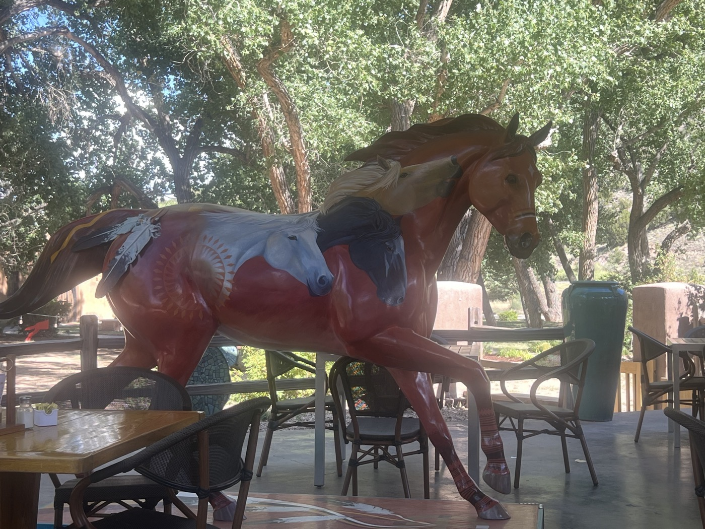
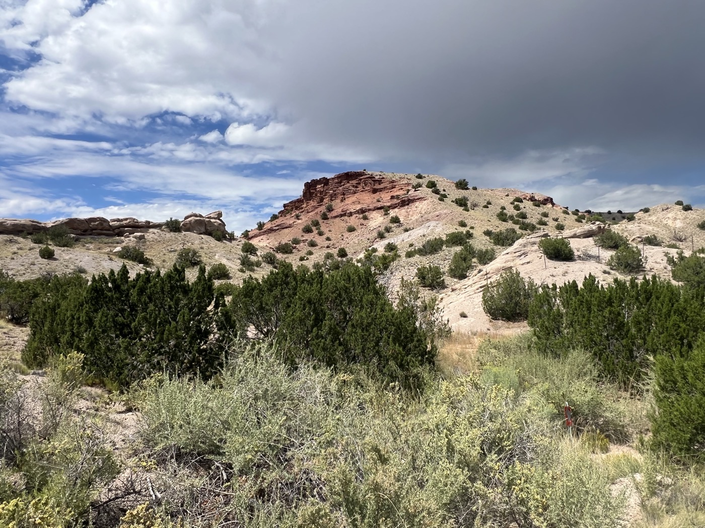
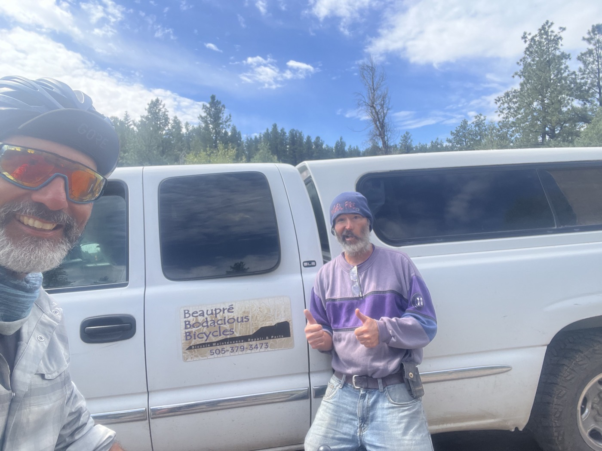
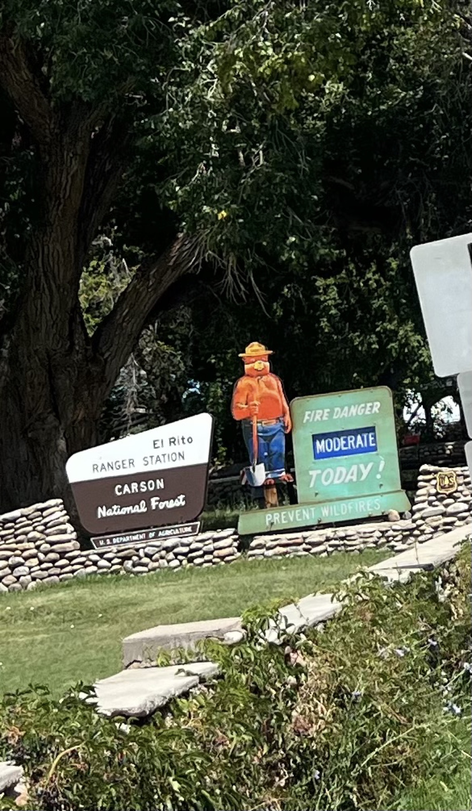
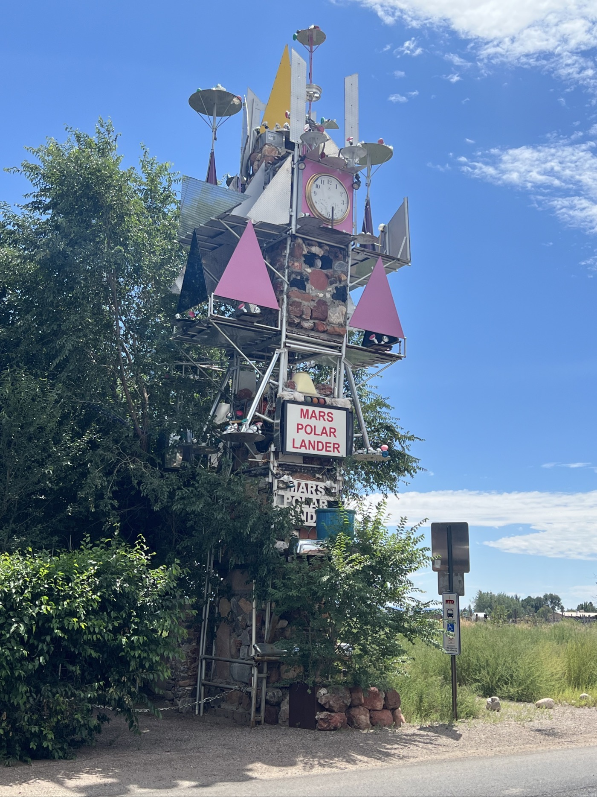
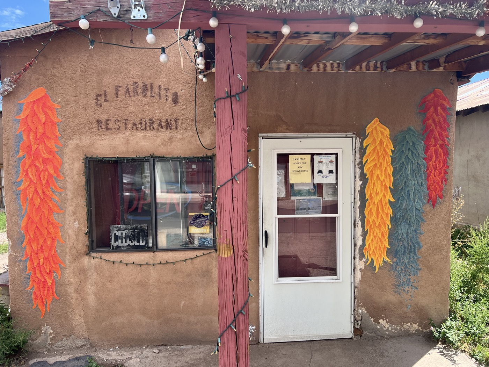
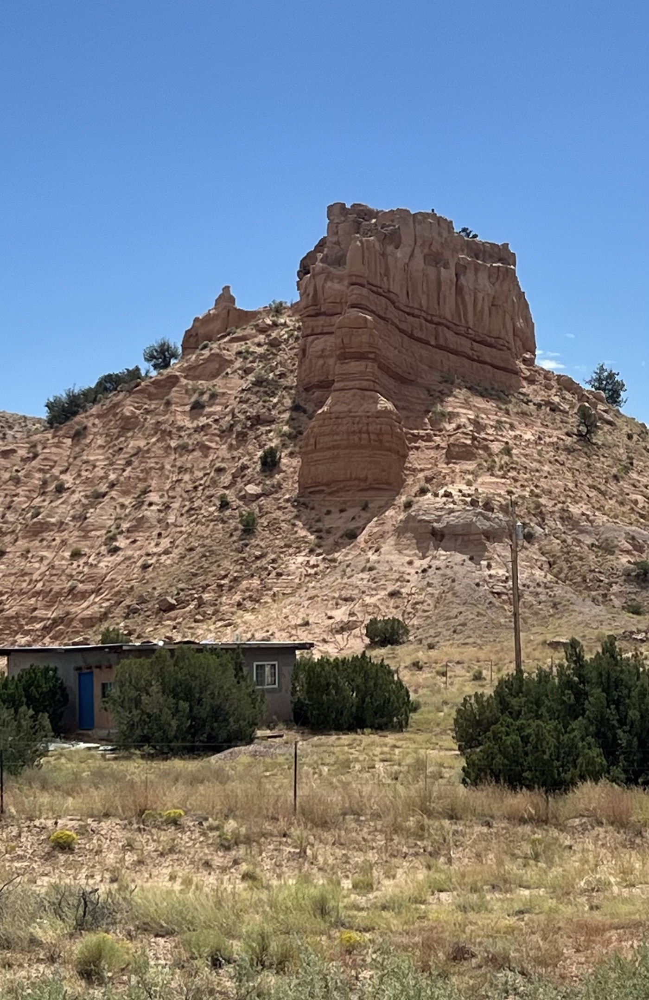
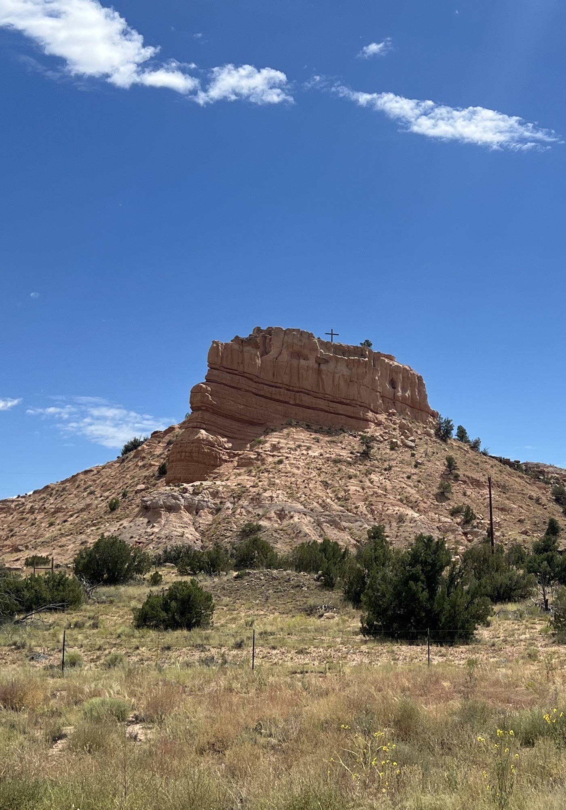
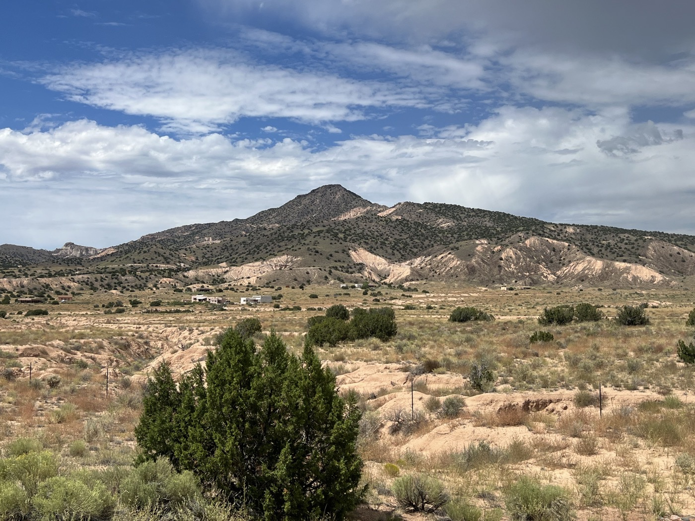
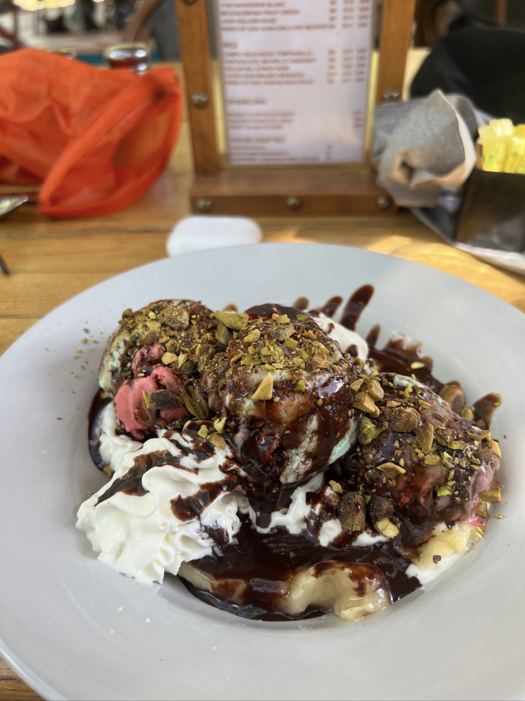

#  Abiquiu Lodge

<figure markdown>
{ width=“300” }
</figure>

Je repars du Hopewell Lake Campground et découvre les couleurs de New Mexico mais aussi le contraste avec le Colorado. Je passe El Rito et m'arrête à Abiquiu après un tronçon pavé et vent arrière sympa. Je prévois une fin d'après-midi reposant car demain sera un gros morceau. Je retrouve K.K et sa femme Gomathi, le vélo c'est aussi une communauté.

<!-- more -->

# New Mexico

La piste est roulante, je passe Cañon Plazza puis El Rito. Des villages où on voit un autre niveau de vie. D'ailleurs il y a personne ou quasi. Le restaurant où je pensais manger une morce ouvre à 13h30 et il est juste midi. Les paysages du sud se découvrent. J'arrive à Abiquiu le long du Rio Chama. En fait - ce village consiste en différents bâtiments et services qui se succèdent tous les 300m le long du Highway. Ça manque un peu de vie.

# Abiquiu Inn

Le lodge est super. Tarif cycliste si on appelle avant (pas dispo sur internet). Un tuyau de divider 😉. Je tombe sur un couple croisé avant Salida, ils ont raccourci de 2 jours et terminent leur parcours. Comme beaucoup, ils font la GDMBR par section sur plusieurs années.

# La communauté vélo

Il y a ces rencontres qui ont beaucoup de charme en vélo. Je l'ai déjà vécu au Lama Ranch. On se retrouve avec K.K. Et Gomitha au dîner, on partage nos expériences et on fait connaissance. Ils ont aussi un parcours dans les télécoms. Mais c'est surtout cette humilité face à un défi monumental comme la GDMBR qui crée aussi une complicité. K.K. connaît la trace et me pousse à partir au lever du jour (dur pour moi). Ils me donnent aussi une partie de la nourriture qui leur reste. Très chouette moment.

!!! hint ""
    cliquez sur les photos pour voir les commentaires

!!! question ""
    🇫🇷 si vous avez été fidèle jusqu'ici, un commentaire est bienvenu! 🇺🇸 if you followed me until here, a comment will be welcome! [>> Click here]
(https://forms.office.com/r/5TiedXLRaN)

<figure markdown>

{ width=“300” }

{ width=“300” }

{ width=“300” }

{ width=“300” }

{ width=“300” }

{ width=“300” }

{ width=“300” }

{ width=“300” }

{ width=“300” }

</figure>

