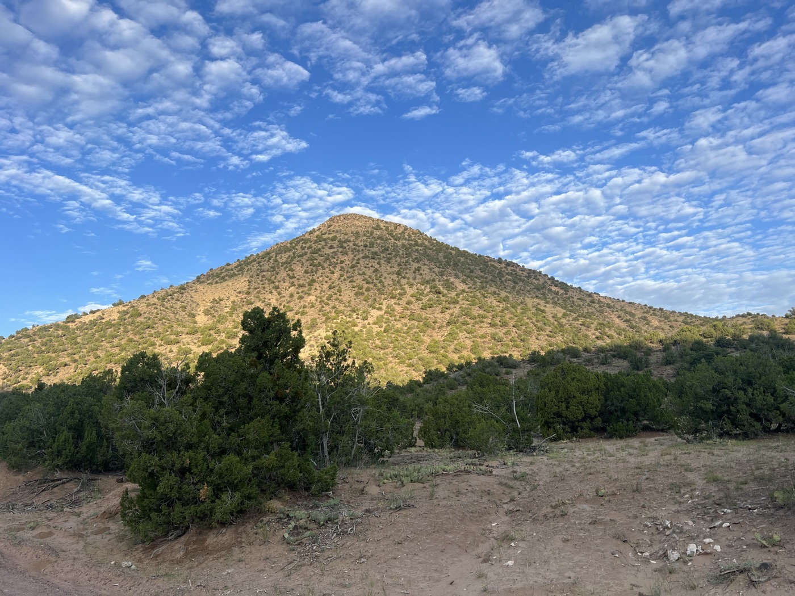
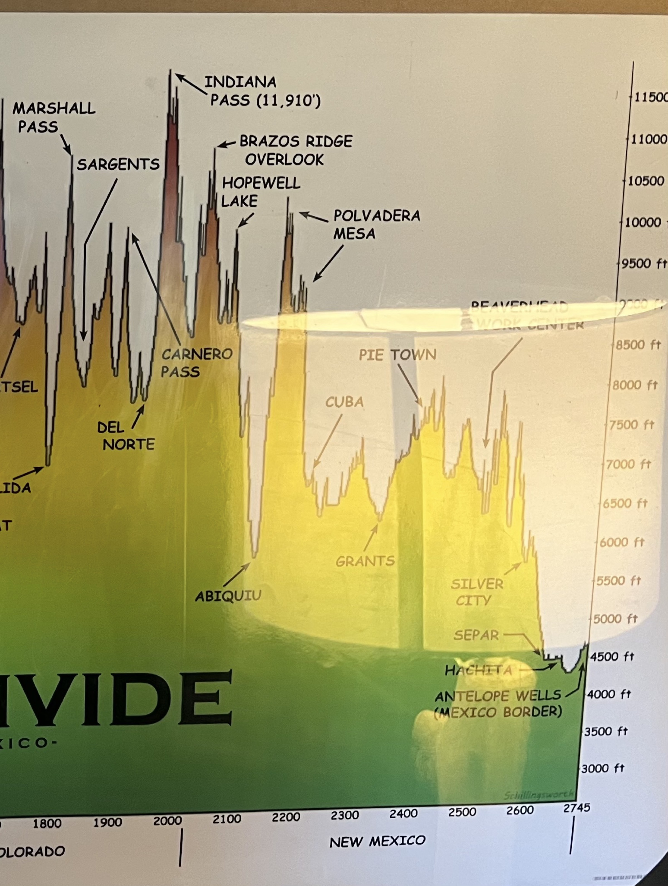
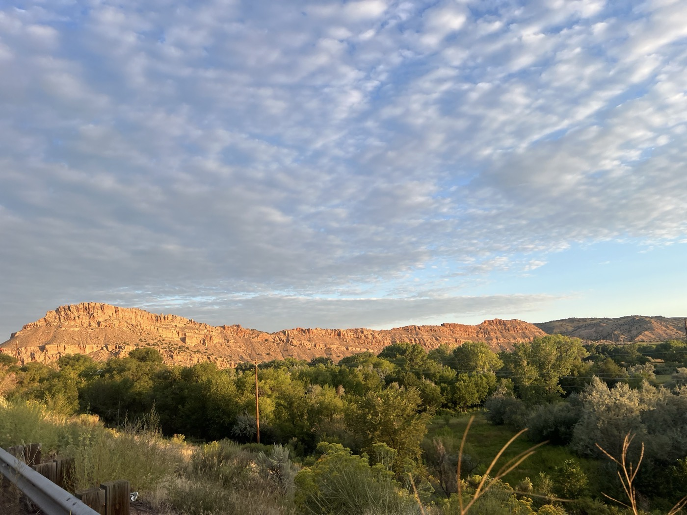
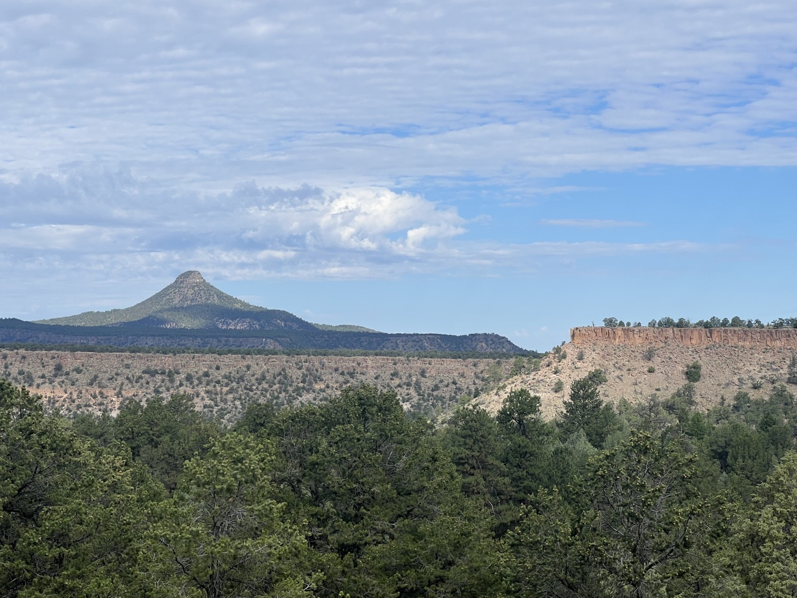
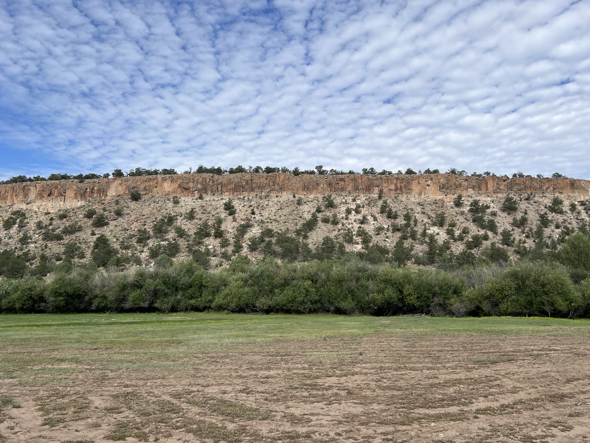
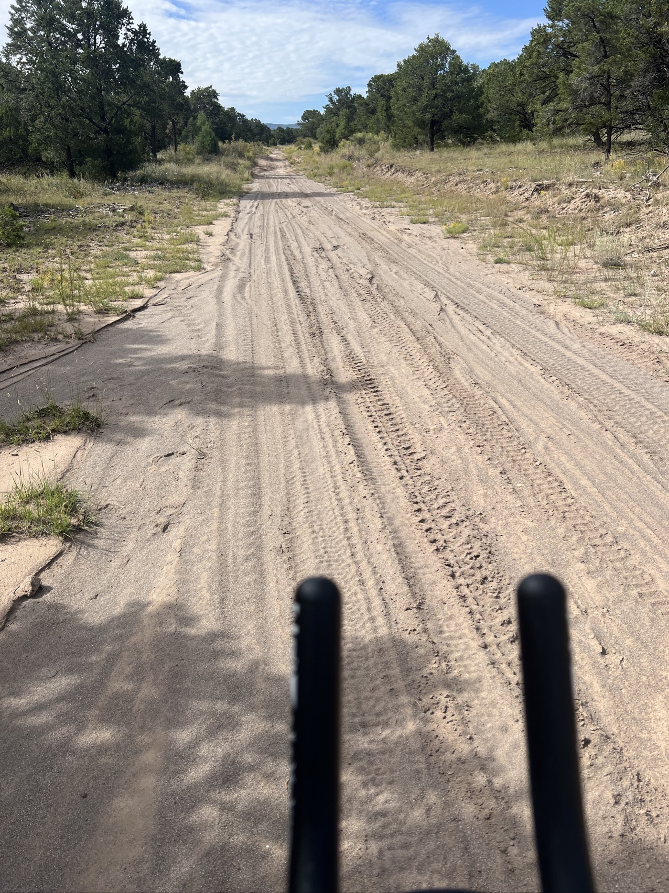
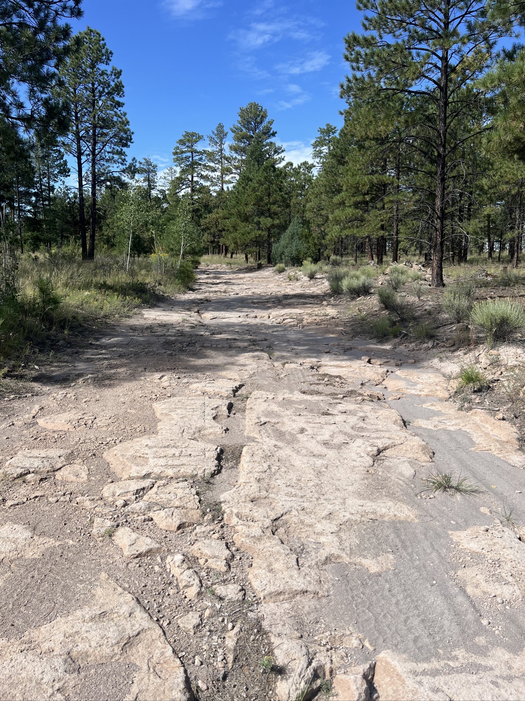
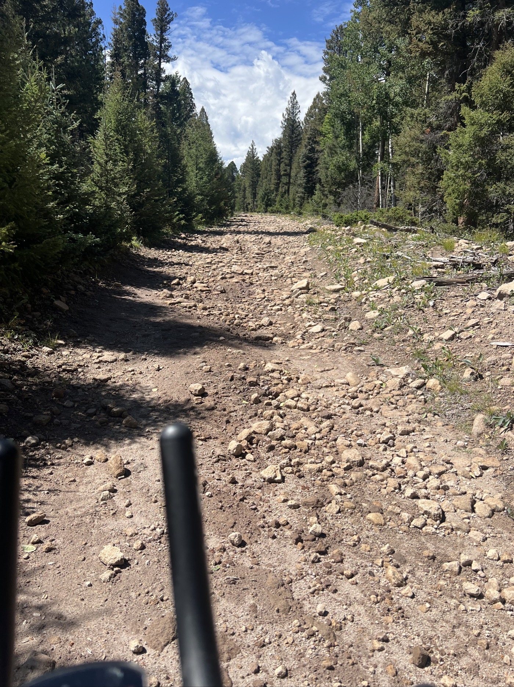
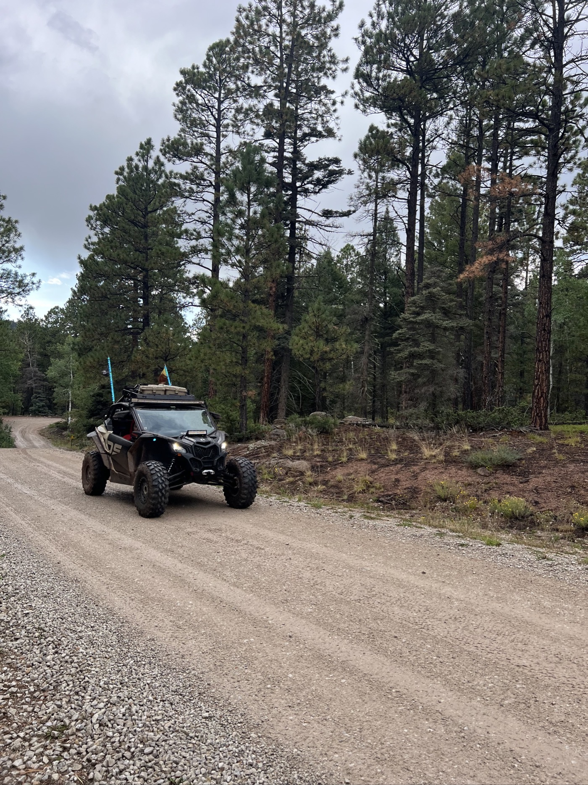
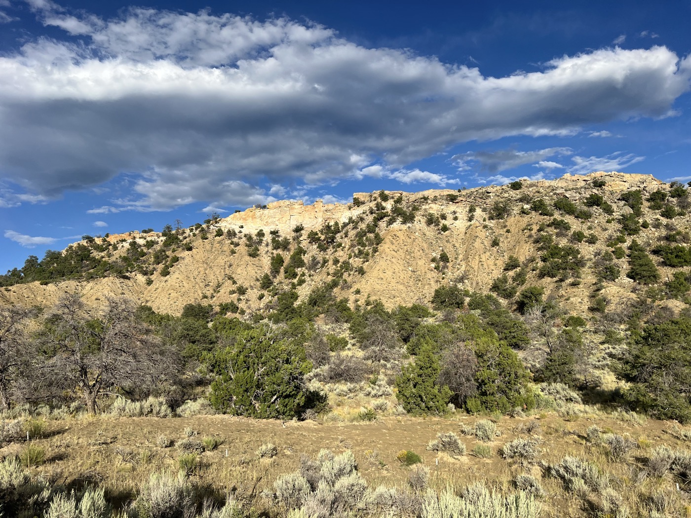

#  Abiquiu to Cuba

<figure markdown>
{ width=“300” }
</figure>

Finalement la météo semble tenir et je me lance sur la trace vers Cuba. Grosse étape (125km et 2'400m de montée) je décolle vers 6h30, record pour moi. La montée est réputée être la plus difficile (terrain, longueur) de la GDMBR. Super parcours, heureux de pas avoir fait le détour route comme d'autres. Au bout de la montée je lève les bras au ciel 💪.

<!-- more -->

# de Abiquiu à Cuba

Le début se passe bien, c'est assez roulant. Mais ensuite le terrain devient compliqué. Sable, pierres volcaniques (tranchantes), dalles de rocher. En tout il y a 25 miles de montée et j'arrive au bout à 12h30. C'est la dernière fois que je dépasse les 3'000m. Je serre les dents et ne lâche rien. Incroyable tout ce que le Gravel sait faire. Ils recommandent un vélo suspendu (fourche télescopique qui amortit et pneus larges) mais c'est passé 😅. A l'arrivée je lève les bras au ciel et pousse un cri de victoire. Je veux bien être humble mais là c'est mérité, en toute modestie ☺️.

L'après-midi est une succession de montées et de petites descentes. Il faut encore aller chercher 1'000m de dénivelé supplémentaire avant de profiter de la descente vers Cuba (sur route mais là ça fait 15km de plaisir). 

# La suite

Je continue de planifier. La météo m'ennuie. Pluie/orage en fin de journée. Depuis Cuba ils recommandent fortement la route pavée vers la réserve indienne Chico comme route alternative pour arriver à Grants. Le parcours par la piste a un fort enjeu peanut butter. Je vais décider à la dernière minute.

La frontière est en ligne de mire, après Grants il reste plus que 2 villes (Pie Town et Silver City). Mais ils annoncent aussi du vent d'Est (donc latéral pour moi) avec des rafales à 40km/h. Je sens que ça va être sport jusqu'au bout!

!!! hint ""
    cliquez sur les photos pour voir les commentaires

!!! question ""
    🇫🇷 si vous avez été fidèle jusqu'ici, un commentaire est bienvenu! 🇺🇸 if you followed me until here, a comment will be welcome! [>> Click here](https://forms.office.com/r/5TiedXLRaN)

<figure markdown>

{ width=“300” }

{ width=“300” }

{ width=“300” }

{ width=“300” }

{ width=“300” }

{ width=“300” }

{ width=“300” }

{ width=“300” }

{ width=“300” }

{ width=“300” }

{ width=“300” }

</figure>

