#  Deserticus

<figure markdown>
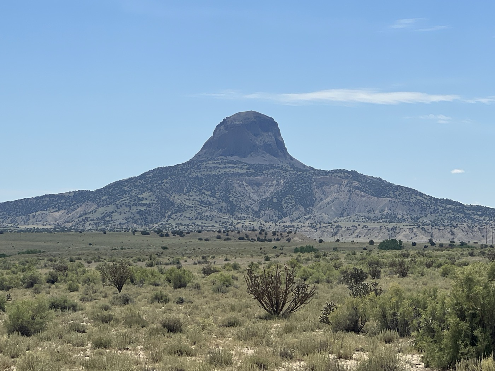{ width=“300” }
</figure>

Je quitte Cuba en faisant le pari qu'il ne pleuvra pas. Je pars fin de matinée pour aussi m'assurer que tout est sec. Le parcours est magnifiquement sauvage. Sable, roches, 🌵, personne. Juste une difficulté: pas assez d'eau, je la trouve qu'en fin de journée. Je pose mon bivouac en prévision de la montée qui m'amènera à Grants demain.

<!-- more -->

# Sauvage et beau

La piste est belle et je trace vite avec du vent de dos. Les paysages sont magnifiques. Je vous mets un max de photos, difficile de choisir. Essayez d'imaginer!

# Les défis du jour

D'abord, je me rends compte que les points d'eau sont très relatifs. L'eau est tout sauf claire. Ça donne pas envie mais finit par me stresser. Je me résigne en me disant que filtre+micropure+bouillir devrait aller. A la tombée de la nuit je trouve enfin de l'eau claire 🙏. 

Sinon, je me dis toujours que la vitesse est mon alliée. Sauf quand on arrive dans un tas de sable. Ou quand il y a une grosse crevasse en travers de la piste. Pas mal de gamelles (3-4) mais j'apprends à tomber sur le sable. Les cactus piquent un peu quand même.

# La surprise

Le soleil devient rasant et là j'entends un gros crissement sur ma droite. Je ralentis et regarde: gros serpent (rattlesnake, crotale, 🐍 à sonnette). J'étais pressé et il semblait bien occupé aussi, j'ai filé. Pas eu la présence d'esprit de prendre la photo. J'ai dormi sous tente du coup 👍 😁.

!!! hint ""
    cliquez sur les photos pour voir les commentaires

!!! question ""
    🇫🇷 si vous avez été fidèle jusqu'ici, un commentaire est bienvenu! 🇺🇸 if you followed me until here, a comment will be welcome! [>> Click here](https://forms.office.com/r/5TiedXLRaN)

<figure markdown>

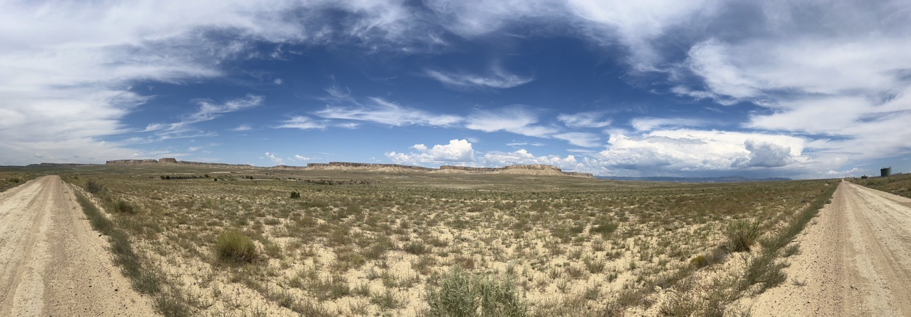{ width=“300” }

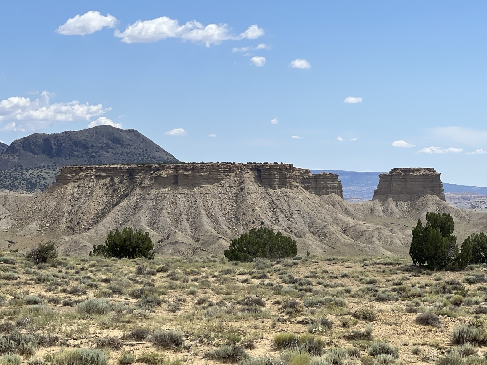{ width=“300” }

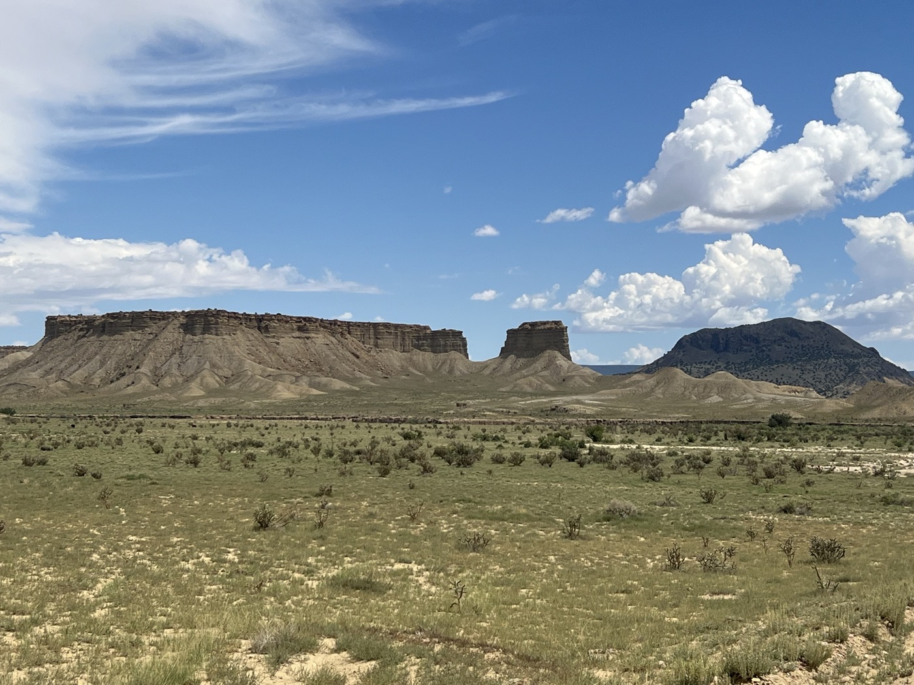{ width=“300” }

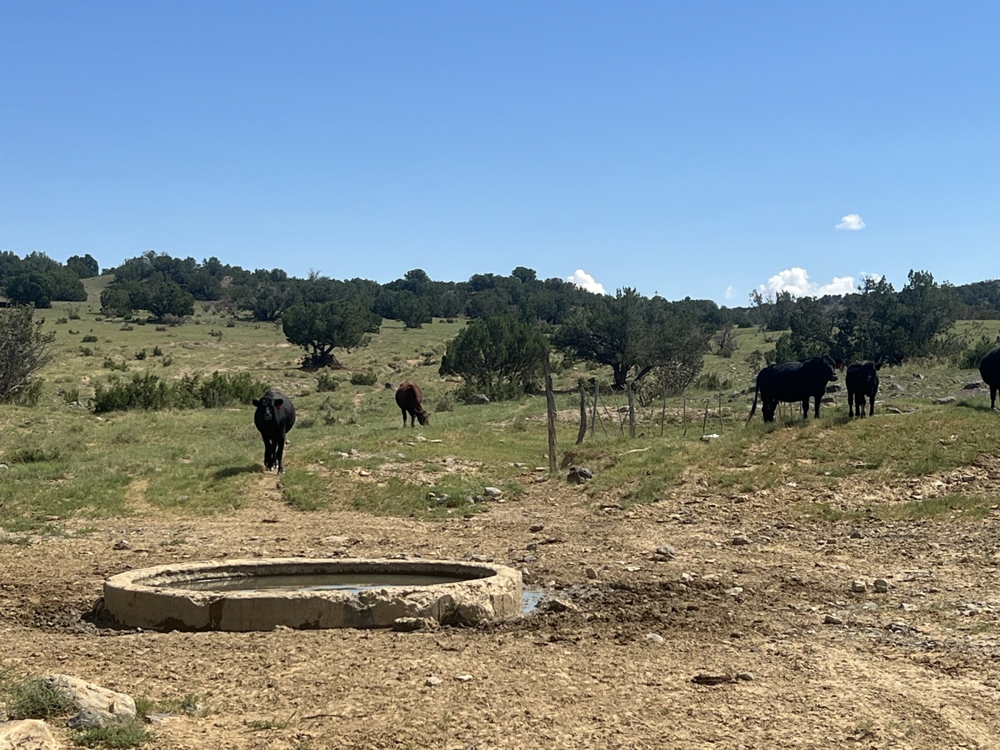{ width=“300” }

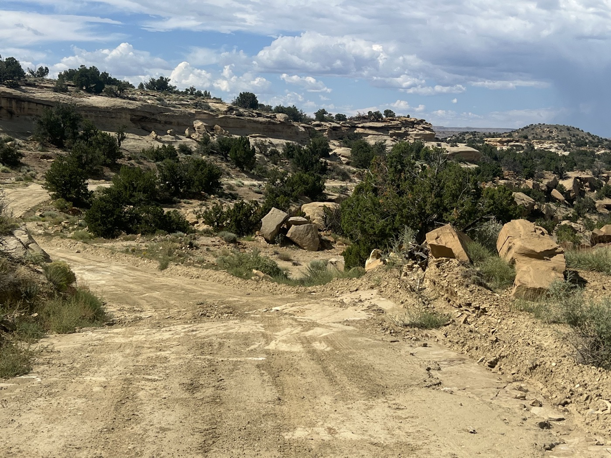{ width=“300” }

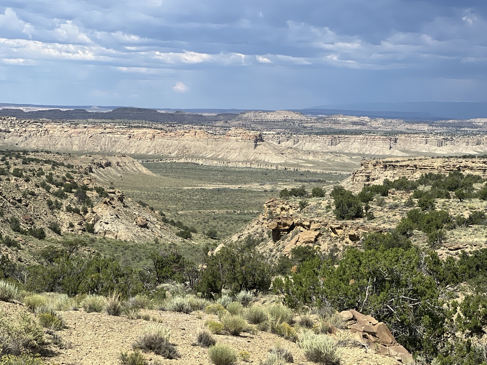{ width=“300” }

{ width=“300” }

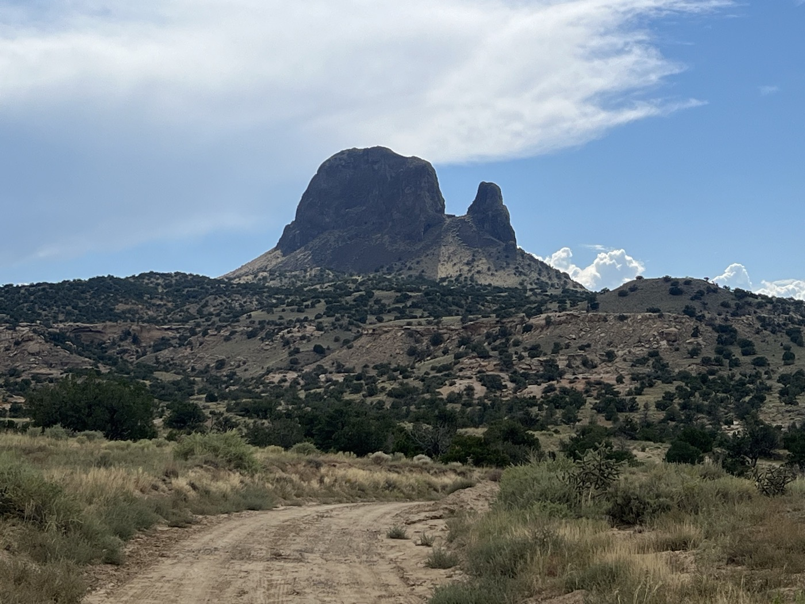{ width=“300” }

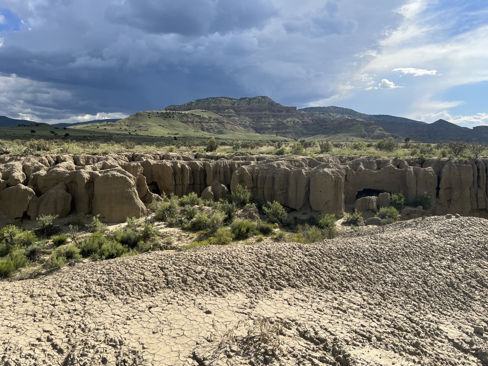{ width=“300” }

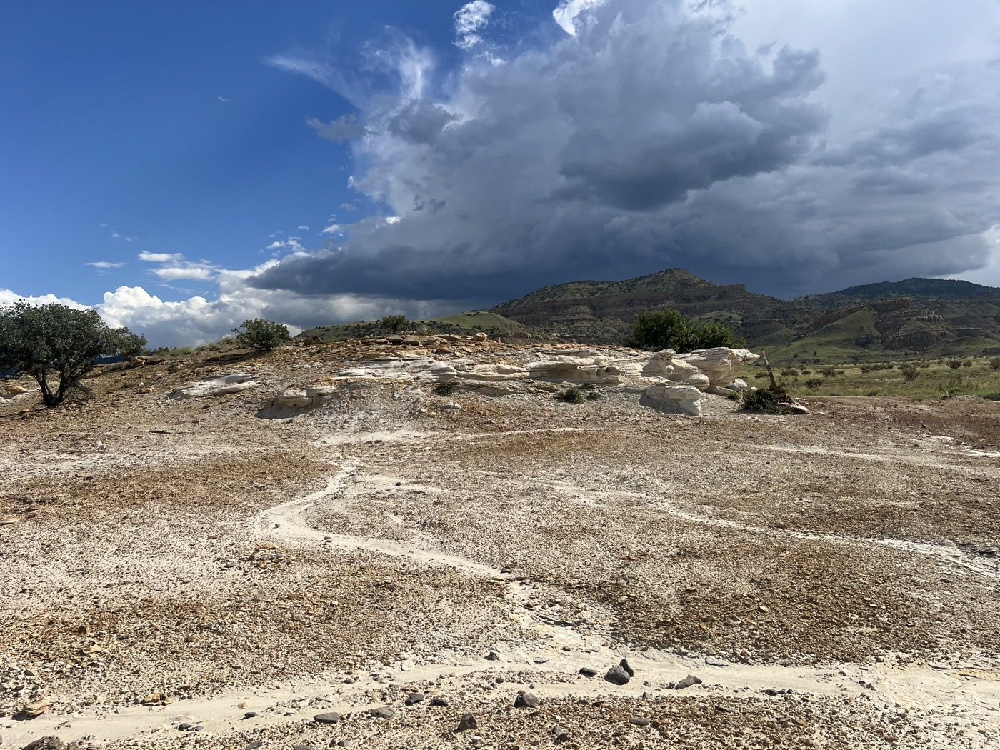{ width=“300” }

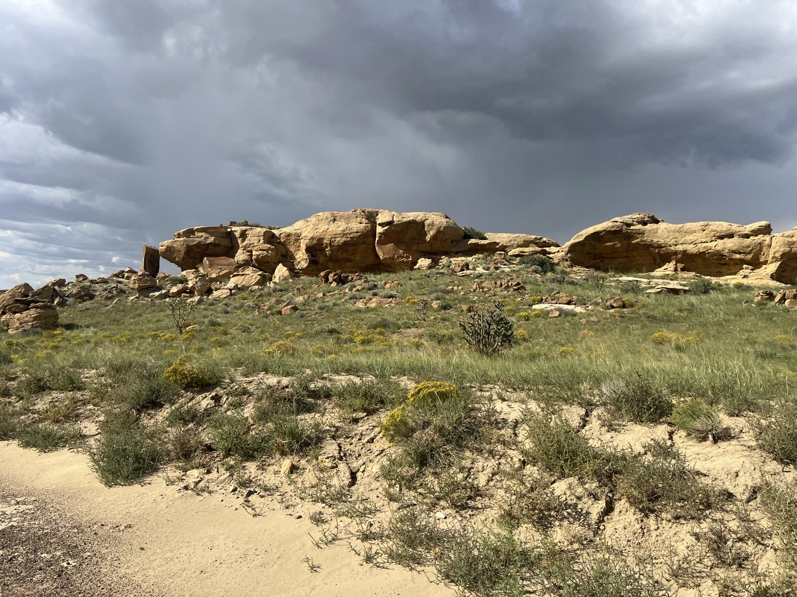{ width=“300” }

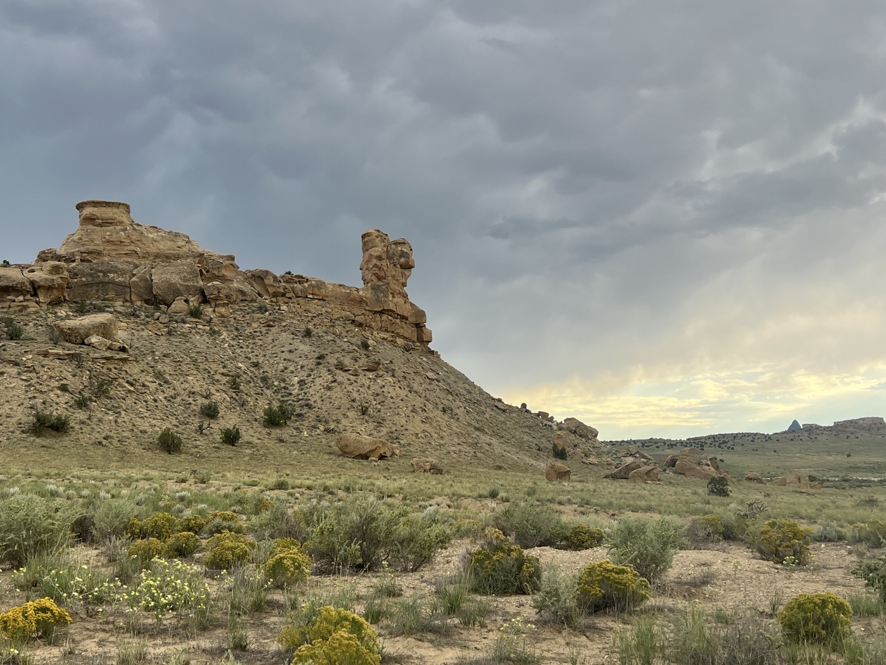{ width=“300” }

{ width=“300” }

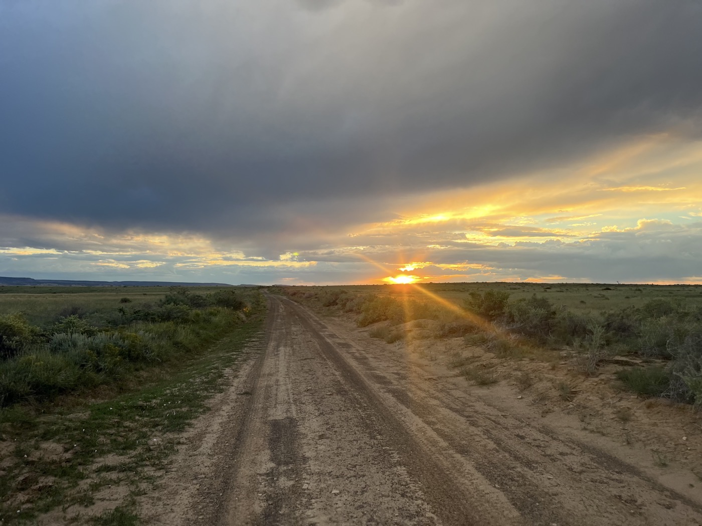{ width=“300” }

</figure>

