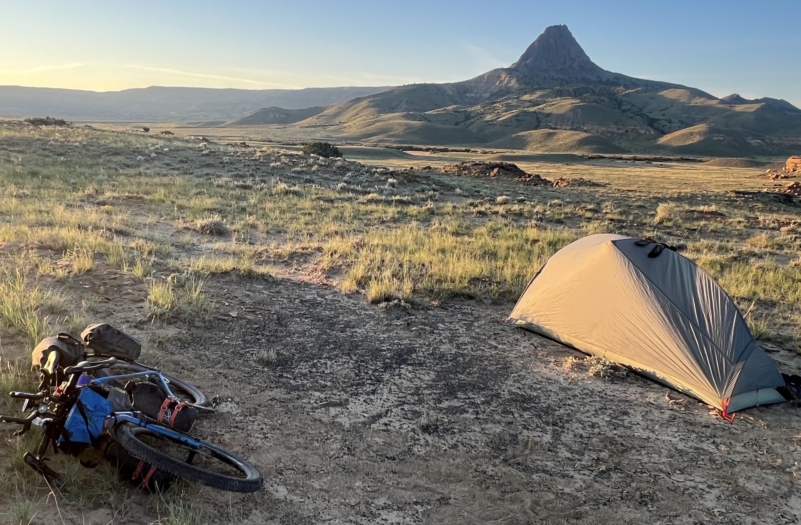
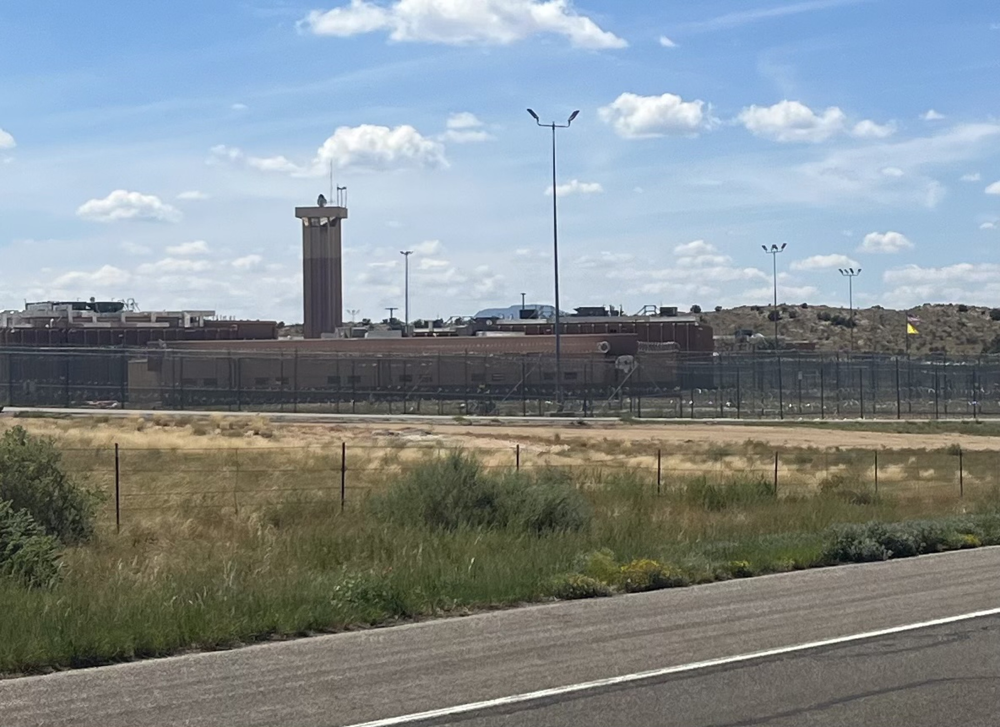
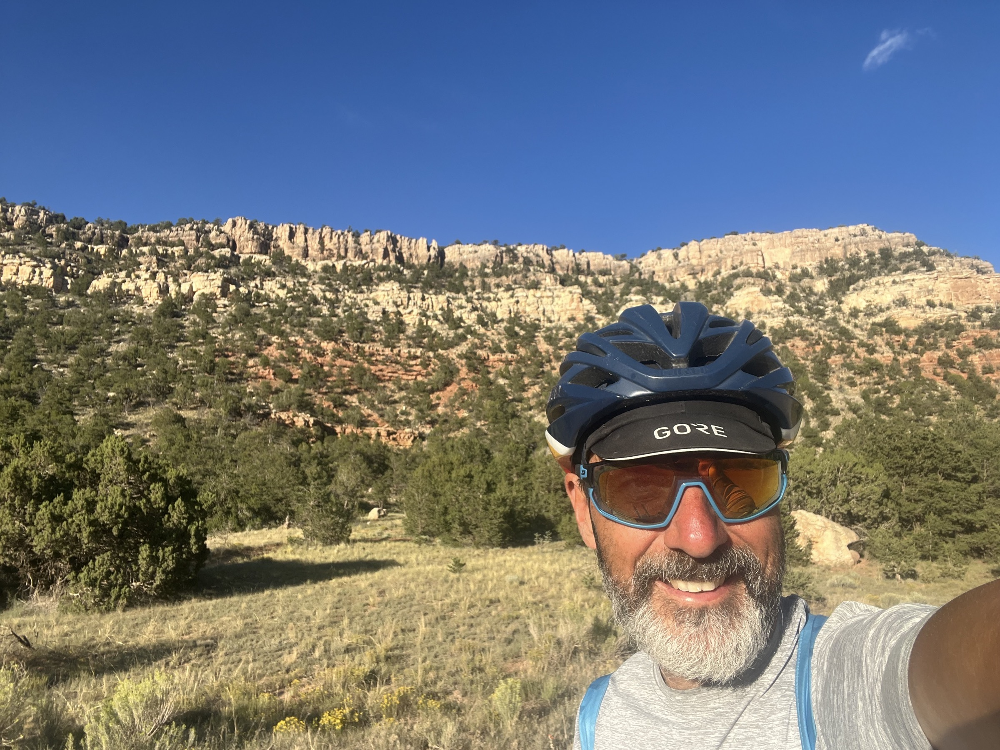

#  Grants

<figure markdown>
{ width=“300” }
</figure>

Je termine la traversée de Mesa Chivato et Chaco Mesa. Après le beau pic de Cerro Alesna, j'ai encore une montée dans les montagnes San Mateo puis j'arrive dans Grants. La route historique 66 longe la ville. Mes jambes ont pris cher. Après quelques courses je repars pour bivouaquer sur le chemin de Pie Town. Cela aura été une journée de transition.

<!-- more -->

# Montagnes San Mateo

La montée depuis mon bivouac est rude et pourtant pas difficile. Je sens mes jambes qui fatiguent plus que d'habitude. J'accuse le coup des deux derniers jours. Un zeste de peanut butter m'achève dans l'effort mais je suis récompensé par une longue descente.

# Grants

A l'entrée de la ville je longe une maison de redressement, bardée de barbelés et d'un mirador. Je fais des courses pour tenir 2 jours en autonomie et je m'accorde une pause pizza. Je lave mon vélo qui en a bien besoin. Puis c'est reparti.

# En route pour Pie Town

Je commence à planifier la fin du voyage. La frontière serait pour le 5 ou 6 septembre. Je contacte Jeffrey qui se spécialise dans l'assistance logistique pour ceux qui arrivent à Antelope Wells où il n'y a strictement rien et qui veulent pas repartir à vélo. À voir comment tout cela va se mettre en place.

Je m'arrête et dors juste avec ma tente mesh (moustiquaire). J'admire les étoiles au-dessus de ma tête !

!!! hint ""
    cliquez sur les photos pour voir les commentaires

!!! question ""
    🇫🇷 si vous avez été fidèle jusqu'ici, un commentaire est bienvenu! 🇺🇸 if you followed me until here, a comment will be welcome! [>> Click here](https://forms.office.com/r/5TiedXLRaN)

<figure markdown>

{ width=“300” }

{ width=“300” }

{ width=“300” }

{ width=“300” }

{ width=“300” }

</figure>

