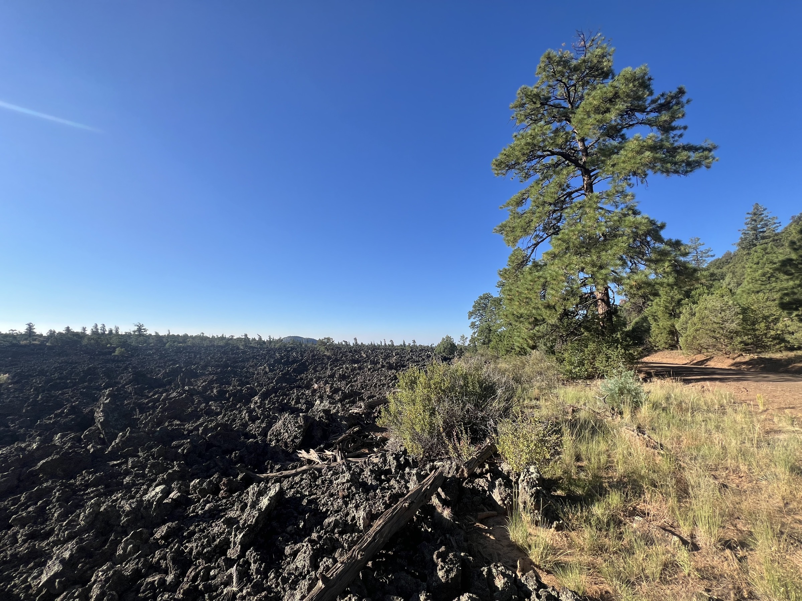

#  Pie Town and Toaster House

<figure markdown>
{ width=“300†}
</figure>

La trace m'emmène dans les badlands du parc Malpais. Le terrain est très volcanique. Je me prends beaucoup de pointes de cactus dans les pneus qui commencent à accuser les kilomètres. Sympa de dépasser un groupe de Français, un Suisse des Grisons et de retomber sur Sarah que j'ai croisé déjà. Tout ce petit monde se retrouve à Pie Town, dans le Toaster House...
<!-- more -->

# Badlands du Parc Malpais

Matinée dans le parc Malpais. Terrain volcanique mais surtout je vois des tâches blanches sur ma roue avant. Sur un vélo, un nouveau détail se doit d'être regardé assez vite. Il s'avère que ce sont des épines de cactus plantées dans le pneu. J'en retire une, fuite d'air direct qui se colmate avec le sealant, le liquide qui est dans le pneu (il n'y a plus de chambre à air si ce n'est de secours). Je retire les autres. Je repars et 5mn plus tard, une dizaine de nouvelles épines plantées 😳. À force de colmatages, le pneu commence à être mou et je regonfle. Je vois au passage que le pneu est bien usé, j'entame la partie gomme souple du profil 🌵😱. Faut que ça tienne encore 500 bornes!

# Pie Town

Un joli groupe se retrouve de manière impromptue (8 en tout). Pie Town se vante d'avoir de très bons gâteaux, concours prévu mi-septembre. Les 2 restaurants-cafés sont ouverts (alors que c'est labour day). Tout le monde en profite. Je discute avec Sarah que je croise pour la 3ème fois. Elle combine GDMBR et Tour Divide ce qui donne un parcours plus roulant. Mais elle est aussi rapide et sur Trackleader. Son copain vient la récupérer à la frontière plus tard que mon planning mais on va essayer de rouler ensemble jusque Silver City.

# Toaster House

C'est une maison à Pie Town qui est une donation. On y trouve de tout pour hikers et bikers. Et surtout l'entrée est bardée de (...) toasters! C'est simple mais cela permet d'avoir un toit, salle de bain, cuisine. On vient et on s'installe. C'est un peu étrange. On peut dormir dedans mais je plante ma tente (mesh) dehors. Plus simple. Demain, départ matinal, je dérangerai personne. Les prochaines étapes je veux faire tourner le chrono! Ce sera à nouveau sauvage (peu d'eau claire, pas de ravitaillement avant 260km, 3´800m D+, dernières grimpettes avant le grand plat qui m'emmène à la frontière).

!!! hint ""
    cliquez sur les photos pour voir les commentaires

!!! question ""
    🇫🇷 si vous avez été fidèle jusqu'ici, un commentaire est bienvenu! 🇺🇸 if you followed me until here, a comment will be welcome! [>> Click here](https://forms.office.com/r/5TiedXLRaN)

<figure markdown>

{ width=“300†}

{ width=“300†}

{ width=“300†}

{ width=“300†}

{ width=“300†}

{ width=“300†}

{ width=“300†}

</figure>

