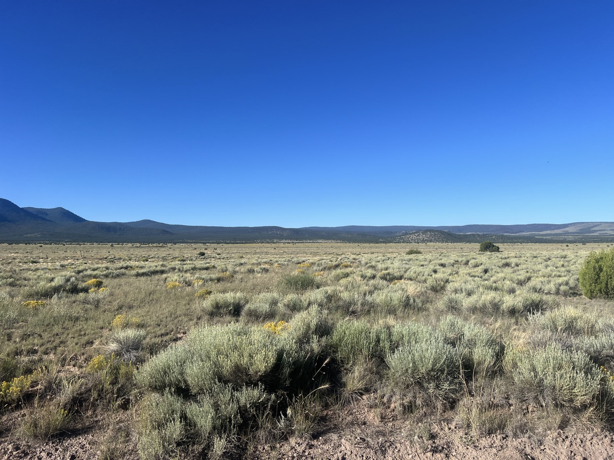
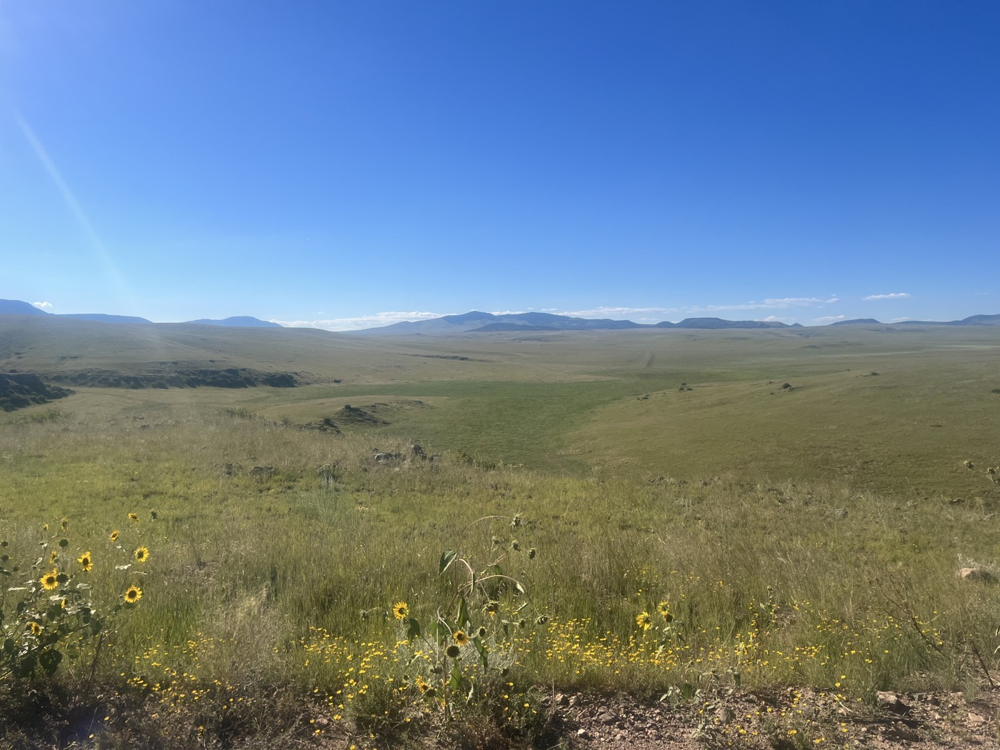
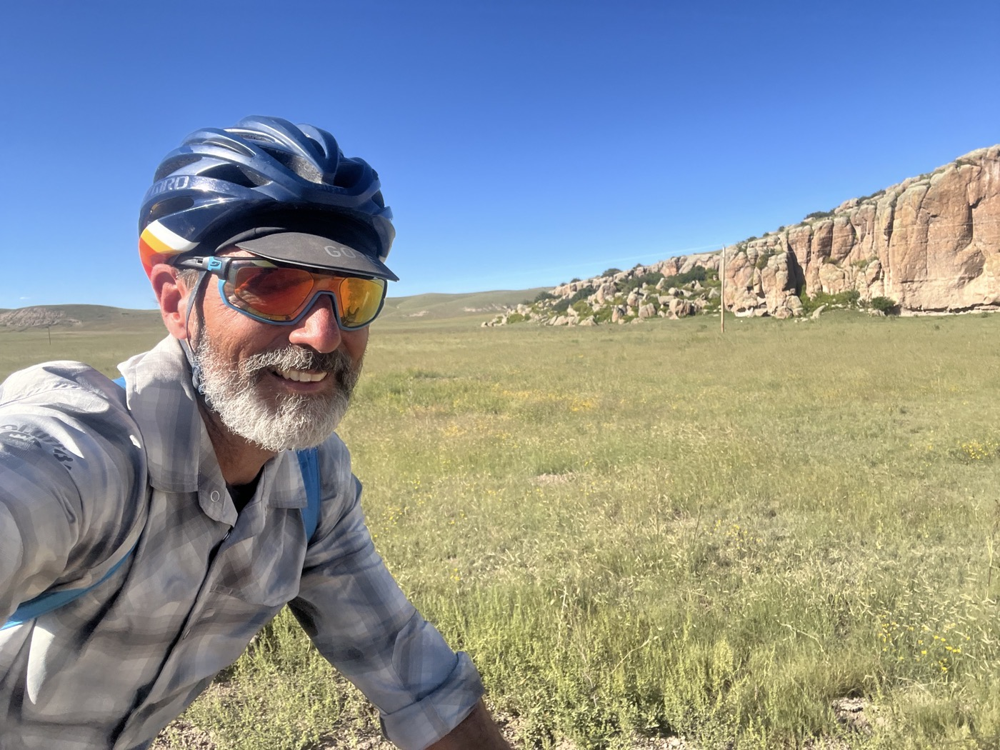
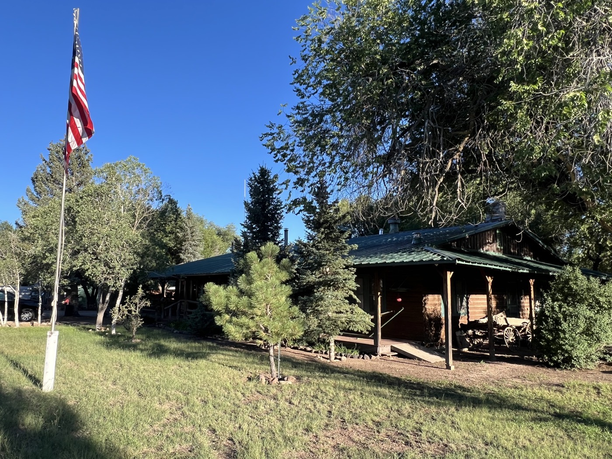
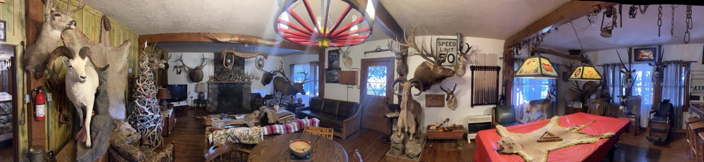
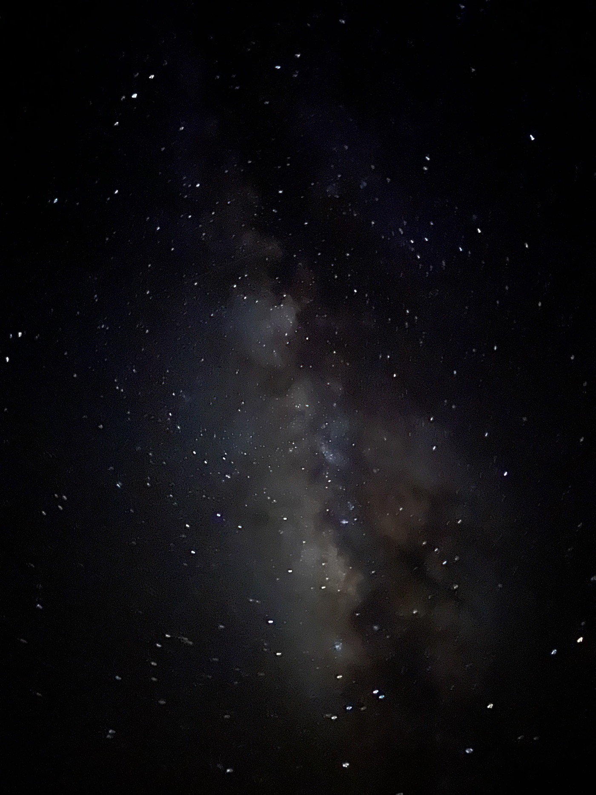

#  Beavercreek Ranch

<figure markdown>
{ width=“300” }
</figure>

La trace du jour nous emmène dans les plaines de San Agustin. La journée est magnifique, peu de dénivelé, nous avançons à un bon rythme avec Sarah. Mais le Suisse des Grisons nous dépasse,  on le retrouve 155km plus tard au Beavercreek Ranch. Il était dans l'équipe de Nino Schurter, ça explique un peu 😁. Le ranch héberge des chasseurs, il y a une salle des trophées qui fait réfléchir 🤔. Accueil impeccable autrement, demain on vise Silver City à 3. Sympa aussi de rouler à plusieurs.

<!-- more -->

# Paysage de plaines

Peu de dénivelé (1'200m, on se rattrapera demain) mais beaux paysages. Petite forêt mais surtout je retiens ces immenses étendues. Quelques falaises aussi. 

# Beavercreek Ranch

Sur le parcours l'eau est à nouveau limitée. Et vu la chaleur, je consomme vite. On décide de demander au ranch si on peut refaire le plein, car il y a un 2ème jour à gérer. Au final on peut camper sur place, se doucher, dîner et petit-déjeuner. Il y a un service car un groupe de chausseurs est sur le ranch, ils chassent l'Elan au tir à l'arc. Dans le ranch il y a une salle de trophées, je vous laisse découvrir en image.

# Voir Lactée

La soirée se termine par un concours photos. Il n'y a aucune lune et la Voie lactée est particulièrement visible. Avec nos téléphones mobiles et quelques réglages, le résultat est surprenant.

!!! hint ""
    cliquez sur les photos pour voir les commentaires

!!! question ""
    🇫🇷 si vous avez été fidèle jusqu'ici, un commentaire est bienvenu! 🇺🇸 if you followed me until here, a comment will be welcome! [>> Click here](https://forms.office.com/r/5TiedXLRaN)

<figure markdown>

{ width=“300” }

{ width=“300” }

{ width=“300” }

{ width=“300” }

{ width=“300” }

{ width=“300” }

{ width=“300” }

</figure>

