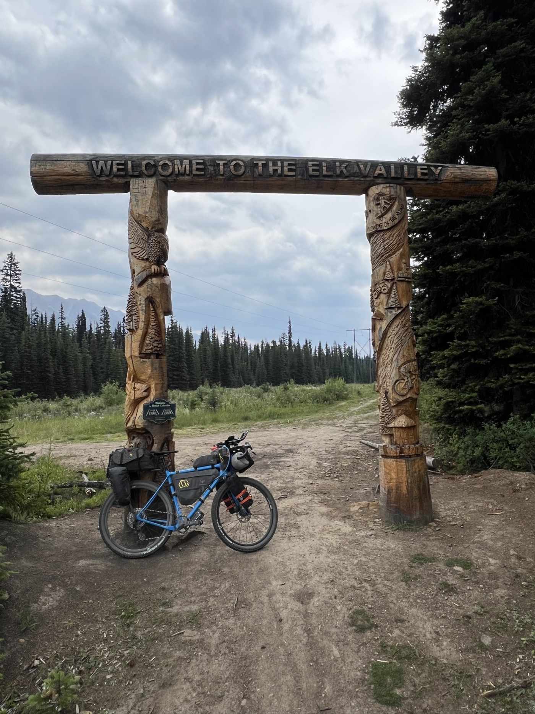
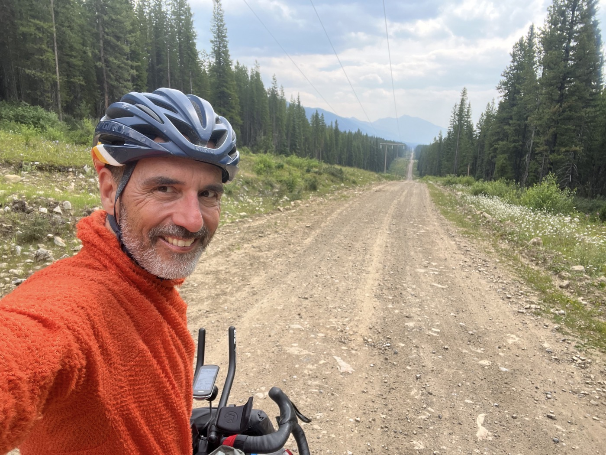

# the King

<figure markdown>
{ width=“300” }
</figure>

A peine parti, c'est la grosse rencontre du jour : mon 1er Grizzly. Ça claque direct, je vous dis pas après le pédalage va tout seul (adrénaline+joie). Mais le reste de la journée est aussi magnifique et surtout ça roule et je peux enfin augmenter ma moyenne.

<!-- more -->

Je quitte mon petit lac et reprend l'autoroute à gravier. Moins de voitures, il ralentissent au passage. Et là une dame que je croise crie "ouahouaw". C'est bruyant le gravier et les moteurs de 4x4. Mais au ton, ça sonnait pas vraiment comme un "bonne route". Je tergiverse et 5mn plus tard 2 voitures à l'arrêt. Serait-ce vraiment un ours? Je m'approche en me plaçant bien derrière la voiture pour me protéger. Punaise - c'est le gros calibre. Je prends vite des photos, top il lève la tête trop sympa. Mais il nous ignore totalement. Majestueux jusqu'au bout. Je file et ça pédale tout seul dis donc.

Après 30km je retrouve enfin de la piste cyclable puis du vrai trail. Et non seulement il y a le paysage, mais je m'éclate sur le vélo. Je vise les 120km. Le trail "Elk Pass" est superbement interminable, avec des petites montées et des longues descentes. 

J'arrive sur Elkford - un peu fatigué (après 7h sur le vélo et 120km). Hop et tiens, encore 6km de parcours VTT, style rodéo. Il y a pas à dire - il faut respecter mon vélo, il encaisse bien. 

Que me réservera la journée de demain? Dans 2 jours je pense passer la frontière avec les USA. Il faut aussi que j'augmente ma moyenne. Maintenant repos!

ps. Hier je n'avais aucune couverture de réseau mobile... parfois les nouvelles sont donc décalées. Mais les cartes GPS montrent toujours ma progression en temps réel!

<figure markdown>
{ width=“300” }
{ width=“300” }
{ width=“300” }
{ width=“300” }
{ width=“300” }
{ width=“300” }
{ width=“300” }
{ width=“300” }
{ width=“300” }
{ width=“300” }
{ width=“300” }
{ width=“300” }
</figure>

