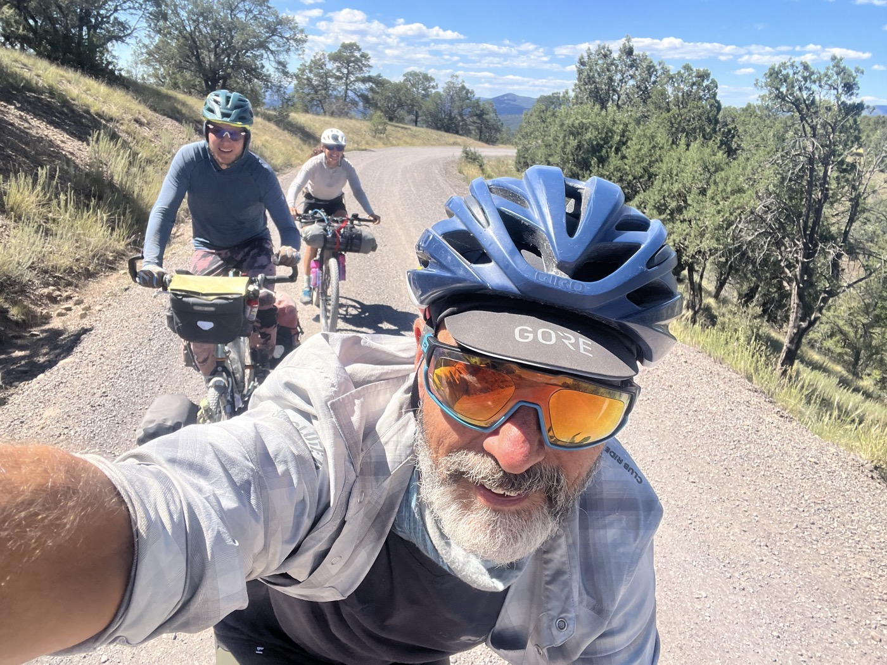
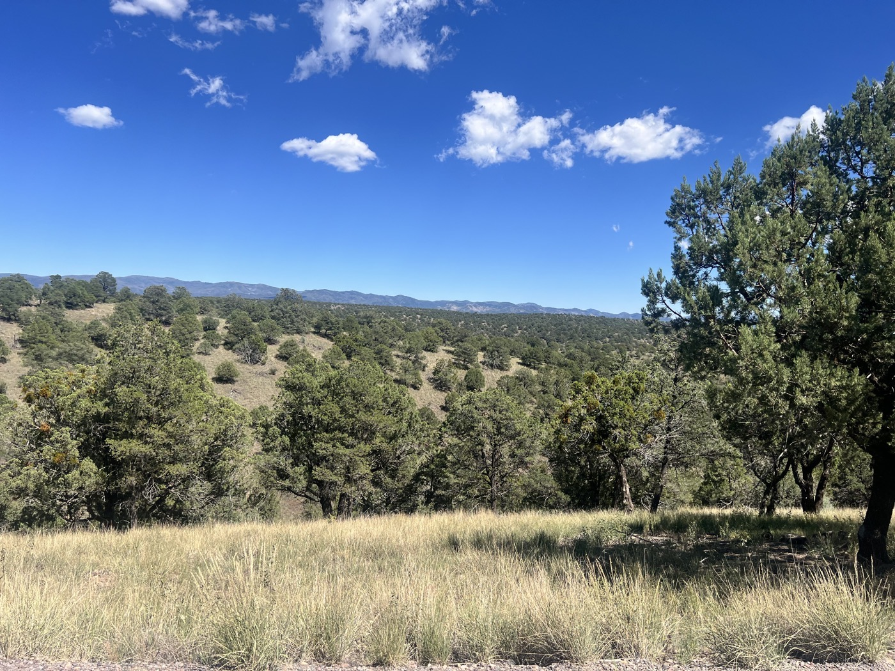
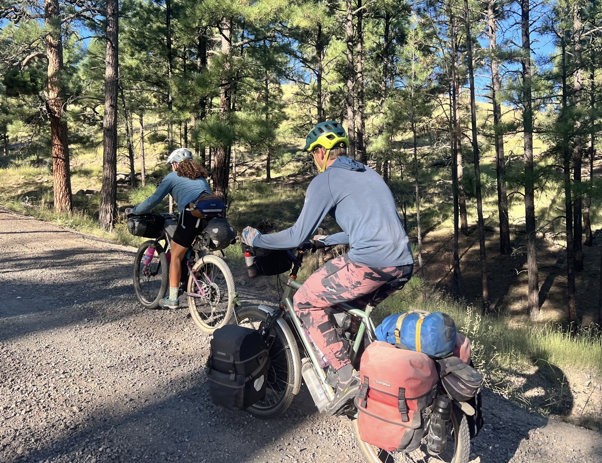
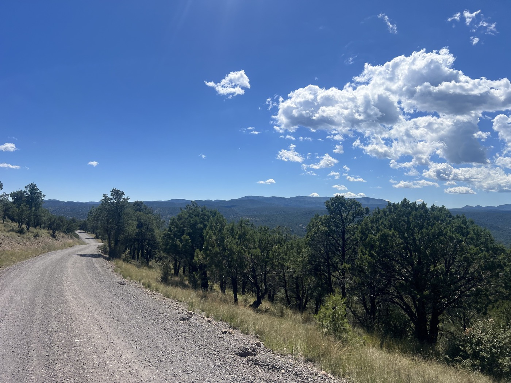
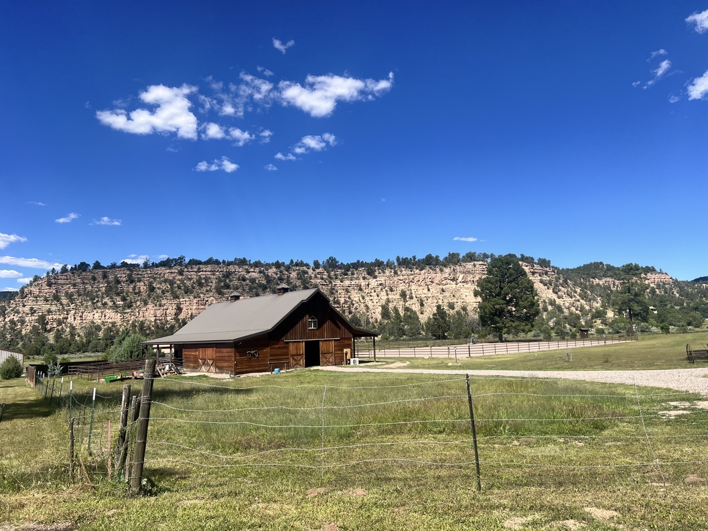
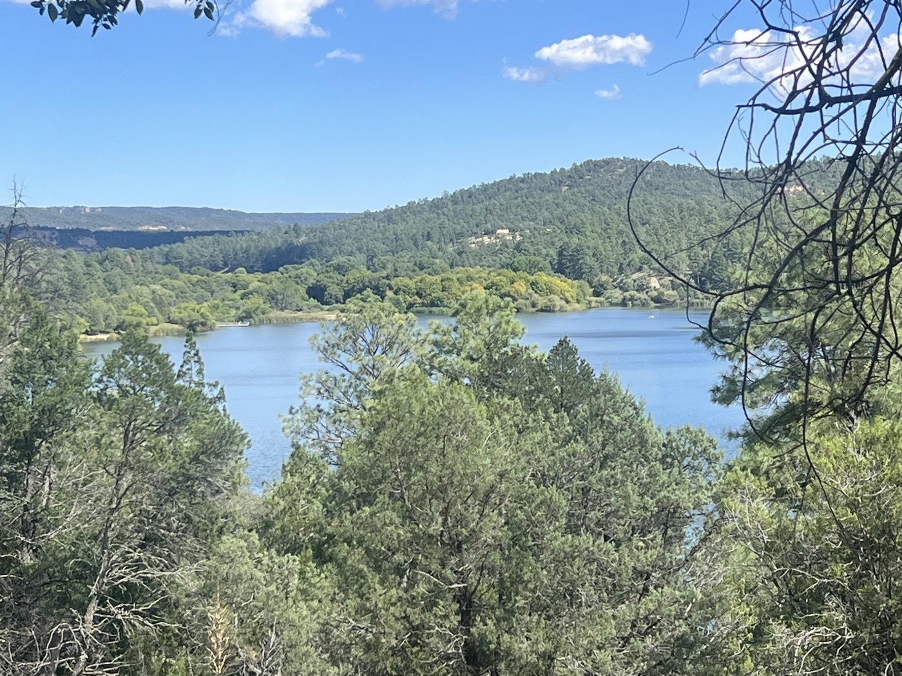

#  Camaraderie

<figure markdown>
{ width=“300” }
</figure>

Difficile de quitter Beaverhead. Dîner, petit-déjeuner et burritos à l'emporter, tout nous a été offert. Sarah insiste que l'endroit est probablement le plus proche du American way. On se lance sur Gila National Forest, enchaînement de montées et de descentes sur du gros gravier dans la chaleur. Cette dernière difficulté est épicée 🌶️.

<!-- more -->

# Une équipe qui dépote!

Et voilà 3 Great Dividers avec des parcours si différent. Chacun en solo. Mais pour cette journée - nous roulons ensemble. Chacun attaque la prochaine montée à tour de rôle, nos jambes bien entraînées tournent vite, on s'attend aux sommets. On pousse des cris dans les descentes, je vous dis pas le nombre de virages serrés dans la caillasse qui se négocient avec des freinages d'équilibriste 😅. Il y a pas à dire, la Divide a fait de nous des sacrés riders 💪.

# Camaraderie

Ensemble on est plus fort. Chacun se donne avec un respect immense pour les deux autres, la performance ne compte pas et néanmoins cette envie de donner ce qu'on a de meilleur nous transcende. Cette journée sous un gros soleil qui plombe sera un régal et mémorable. J'ai fait ce projet en solo mais je suis reconnaissant d'avoir aussi pu vivre cette journée avec mes camarades du jour. La communauté vélo a parlé à nouveau. Au passage - jetez un bon regard au vélo de Gian-Andrea. J'arrive à peine à le soulever ! Ce vélo a fait Australie, Tadjikistan, Canada, Norvège  et la Divide. Et pourtant Gian a fait une des grosses grimpettes du jour en tête. Énorme et très chouette que ce trio impromptu soit aussi cohérent (10 ans d'écart entre chacun de nous). On s'arrête à Lake Roberts et on dévalise les pots de glace du petit shop local (qui ouvre rien que pour nous). 

# Ce qui est devant 

La frontière est là. Chacun de nous sent un changement imminent approcher. Les émotions sont variées. Il reste une dernière montée puis Silver City, le désert et l'arrivée à Antelope Wells. Demain je fais mon marathon solo, je dors et termine vendredi matin. La logistique est en place, j'attends une dernière confirmation. Mais si tout va bien, je suis à San Diego samedi. Le vol de retour décolle le 10 septembre. Stay Tuned 🤞j'y suis presque! Espérez pour moi que je doive pas trop batailler contre le vent!

!!! hint ""
    cliquez sur les photos pour voir les commentaires

!!! question ""
    🇫🇷 si vous avez été fidèle jusqu'ici, un commentaire est bienvenu! 🇺🇸 if you followed me until here, a comment will be welcome! [>> Click here](https://forms.office.com/r/5TiedXLRaN)

<figure markdown>

{ width=“300” }

{ width=“300” }

{ width=“300” }

{ width=“300” }

{ width=“300” }

{ width=“300” }

</figure>

