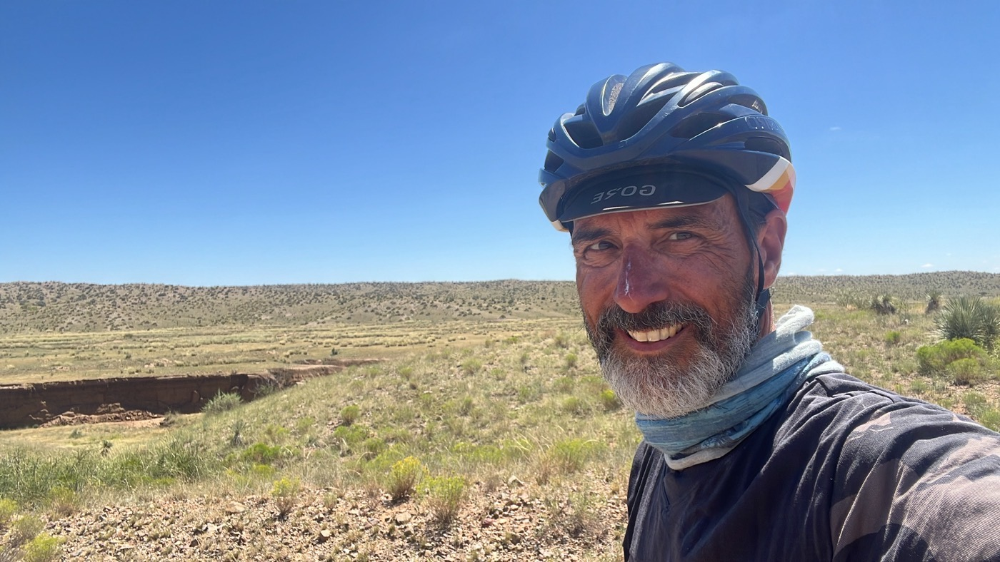
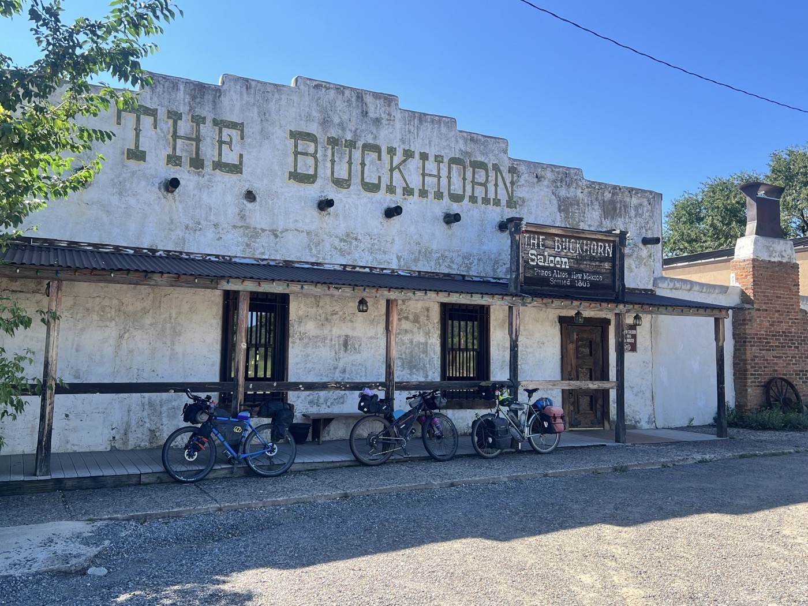
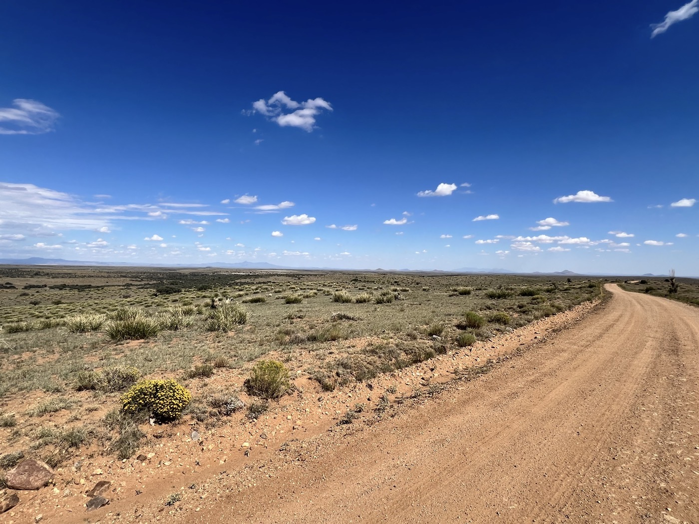
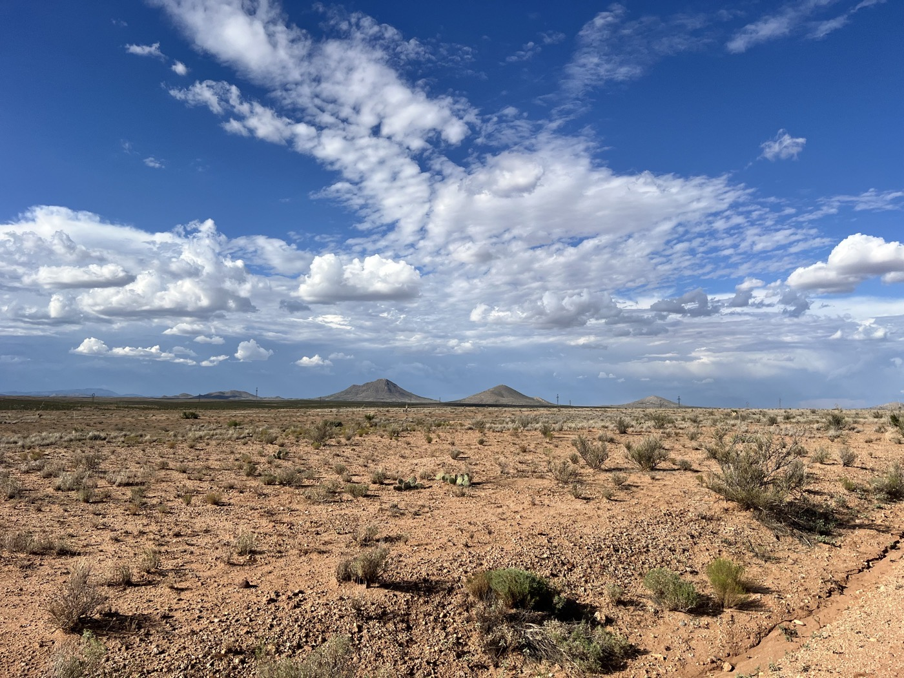
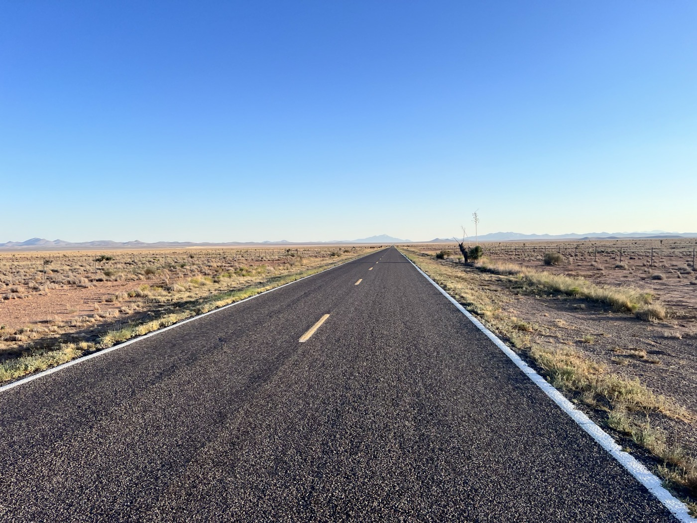
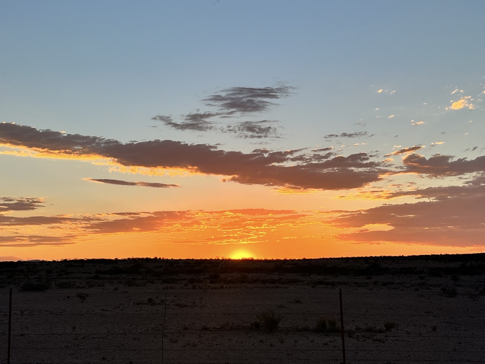

#  Hachita

<figure markdown>
{ width=“300” }
</figure>

Nous quittons Lake Roberts en trio pour une dernière montée, toujours aussi chouette. Étrange de voir sur le GPS la fin qui approche, les dernières montées se comptent sur les doigts de la main. On quitte les montagnes, forêts et Gila Parc définitivement. Je continue seul, passe Silver City (assez sympa au demeurant) et attaque mon marathon. 188km sous un soleil qui cogne. Vent difficile parfois mais OK. J'ai beaucoup bu. Je m'arrête nuit tombée à Hachita et tombe sur un groupe de Suisses partis fin juin. Il reste 70km 💪.

<!-- more -->

# Le trio se fait encore plaisir

Départ 8h et dernière côte (600m D+). Très belle montée sur route, paysages magnifiques sur des collines du parc Gila. Il fait vite chaud. Les adieux de font devant le saloon de Pinos Altos. Sarah et Gian vont encore prendre du repos à Silver City.

# Gros effort

Il me reste 155km à parcourir aujourd'hui. Je me lance, passe Silver City qui a un centre ville assez joli, qui rappelle Salida. Un bon point de chute. La sortie de ville se fait sur du petit chemin, single trail. Ceux qui font la trace ont été joueur. Pour finir sur des pistes sablonneuses dans un paysage désertique. Voyez les photos, je bois tout ce que je peux et continue de pédaler.

# Hachita 

J'arrive après le coucher du soleil et dort dans le community center avec 4 autres Suisses. Demain je serai très matinal. Je dois terminer le trait entamé aujourd'hui: 70km et j'arrive à la frontière avec le Mexique. Pas beaucoup d'heures de récupération mais l'excitation compensera. J'ai beaucoup de peine à me rendre compte que le compteur arrive à zéro. À se demander s'il y aura une suite 🤔😉! En tout cas je me réjouis aussi de retrouver famille et amis tout bientôt et j'ai bien envie d'un peu de repos 😁.

!!! hint ""
    cliquez sur les photos pour voir les commentaires

!!! question ""
    🇫🇷 si vous avez été fidèle jusqu'ici, un commentaire est bienvenu! 🇺🇸 if you followed me until here, a comment will be welcome! [>> Click here](https://forms.office.com/r/5TiedXLRaN)

<figure markdown>

{ width=“300” }

{ width=“300” }

{ width=“300” }

{ width=“300” }

{ width=“300” }

{ width=“300” }

{ width=“300” }

{ width=“300” }

{ width=“300” }

</figure>

