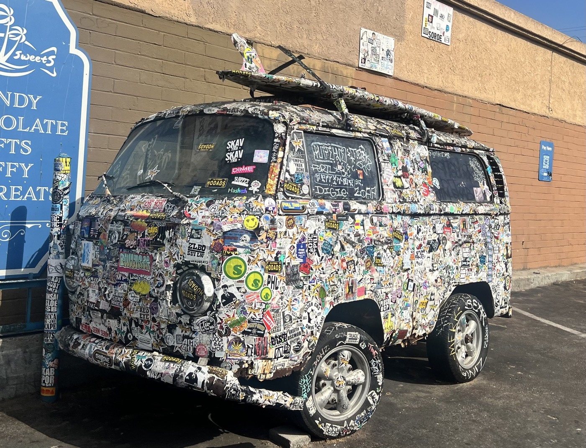
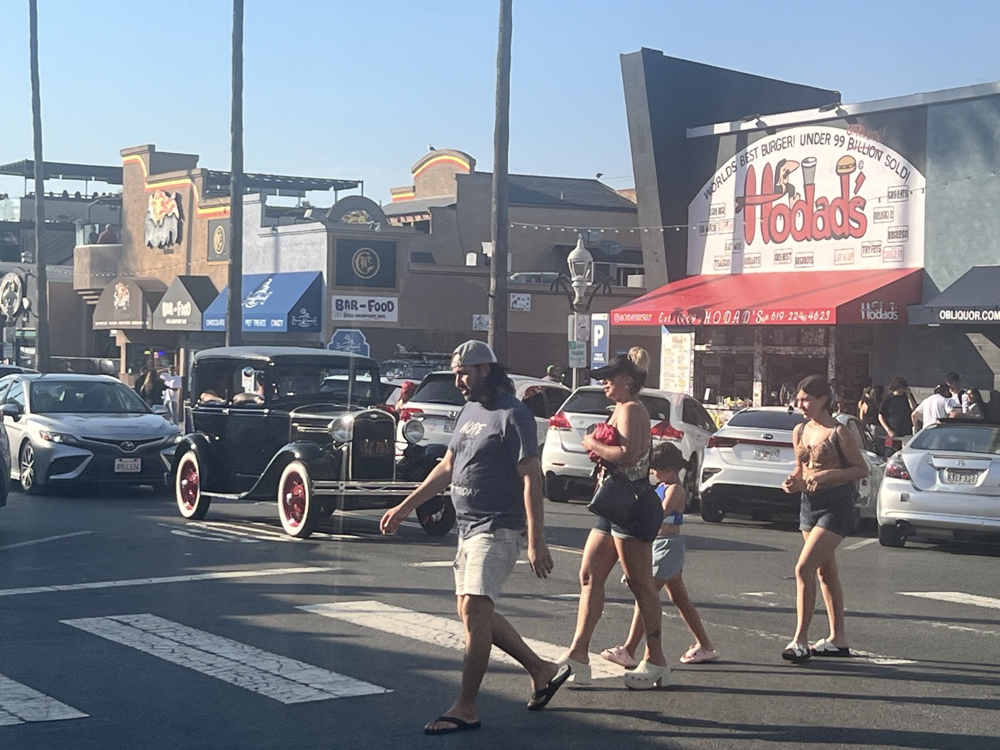
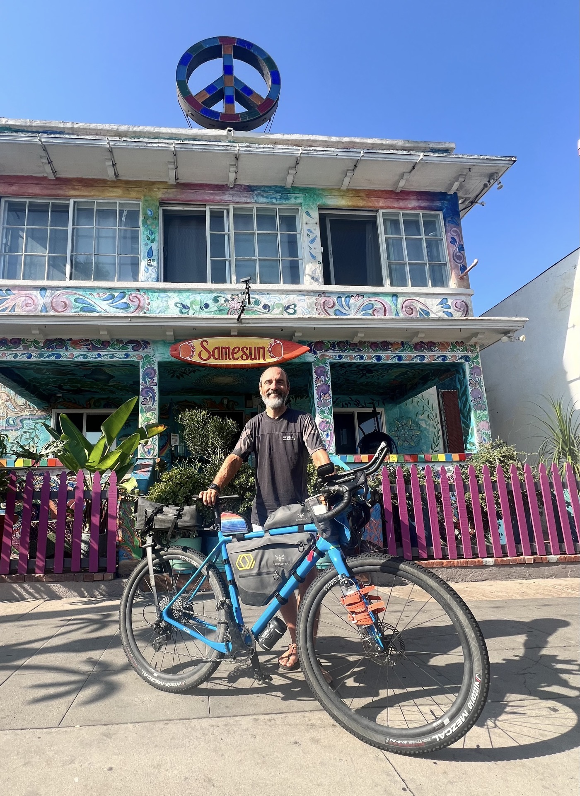
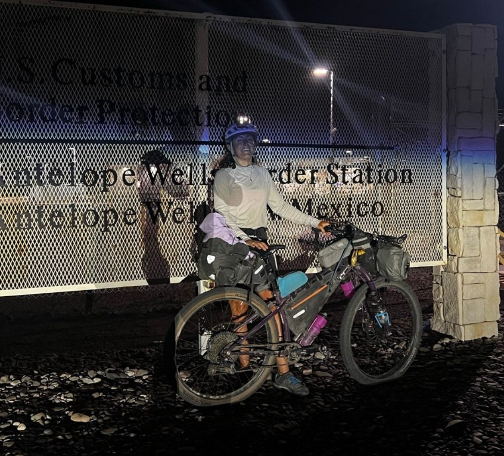
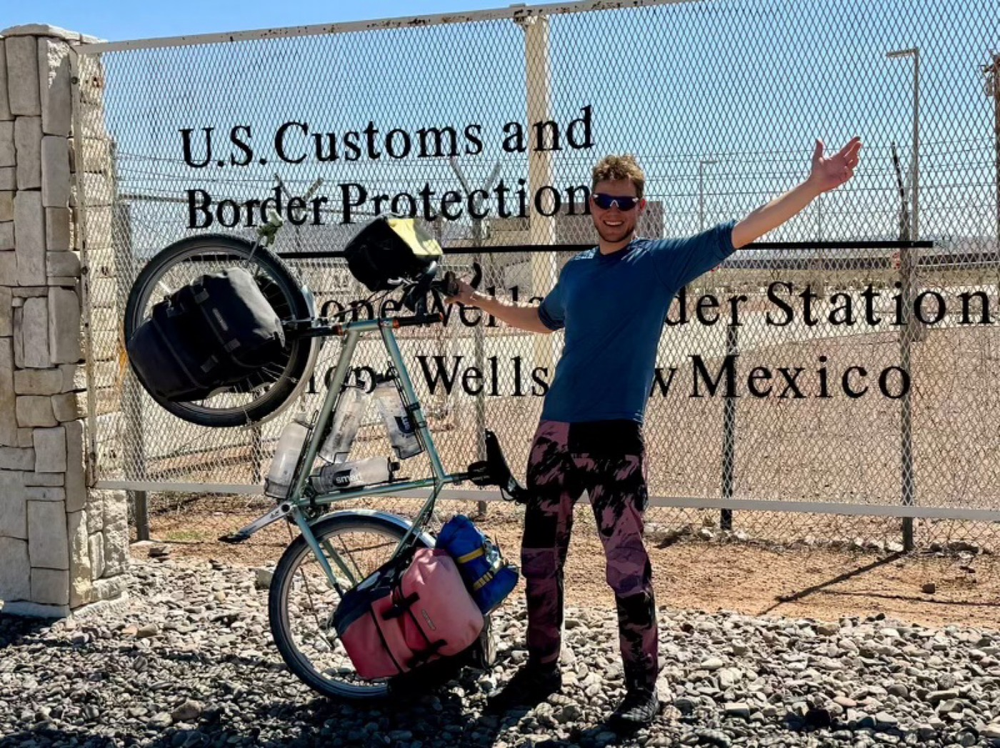

#  Sunset Post

<figure markdown>
{ width=“300” }
</figure>

San Diego vaut bien un détour! Je pose mon vélo Salida dans le quartier Ocean Beach. Beachfront : je suis à 50m de la plage. Ambiance détendue, alternative voire hippie, surf. Je fais de très chouettes rencontres, j'ai besoin de parler de mon aventure. Je fais aussi le plein de sensations sans être très entreprenant dans mes activités. 40 jours dans les étendues sauvages, on s'enivre vite dans une grande ville.Le corps me montre sa fatigue. Un beau blues en somme : je suis prêt pour le retour!

<!-- more -->

# Rock of Ages

C'est dimanche, je décide de visiter une église locale. Quelle organisation! J'estime à 2'000 personnes la participation. Et il y a un 2eme service qui enchaine! La louange est impressionante et me touche beaucoup. Tout est remarquablement orchestré. Je retiens différentes choses, mais surtout que faire de la place dans son esprit comme j'ai eu la chance de pouvoir le faire, nous rapproche de l'essentiel, avec un discernement plus aigu et un autre regard.Comment faire pour prolonger cela à mon retour? 🤔

# San Diego

Je découvre la ville. Je vous mets pas mal de photos pour le coup. Je me promène dans mon quartier 2 jours et m'occupe d'emballer le vélo le 3ème. Je fais connaissance avec Tim et Christel qui habitent ici depuis 6 ans. Un Français me parle de sa semaine au festival Burning Man dans le Nevada. Je tente une sortie vélo mais me rends compte que rouler en ville - c'est plus la Divide...  Je coupe court d'autant que j'ai de la peine à suivre. Il faut rester concentré pour suivre le parcours en ville! Les grands espaces me manquent déjà. En tout cas l'ambiance est à la détente.

# Camaraderie - wrap-up

Je relis avec plaisir mon blog-journal, je prends des nouvelles. K.K et Gomitha sont déjà supers actifs. John & John ont malheureusement abandonné assez vite (Ovando), mais devraient s'y remettre par sections. John-Père fait construire une maison près de Salida. Avec sa compagne ils ont gagné un voyage en Suisse, on risque de se revoir! Sarah est arrivée le même jour que moi dans la nuit après 215km 💪! Elle pense faire la version course dans les 2 prochaines années, elle rêve de décrocher le record féminin de 18 jours en fixed speed (sans dérailleur). Gian a terminé hier, j'espère rouler avec lui en Suisse ☺️.

# Et moi?

D'abord un gros (genre énormément gros) besoin de retrouver la famille 🥰.

Sur la forme, envie de passer voir un osthéo quand même histoire de tout remettre en place. Et aussi se tester sur les grimpettes à proximité (Barillette, Faucille etc...) puis faire des sorties avec les amis.

Sur le fond, je vais chercher une prochaine étape professionnelle plus en phase avec les priorités que je retiens de ma Divide (il faut rêver!). Ça va bien m'occuper aussi. Je voudrais reprendre le blog et le compléter sous forme de bilans, conseils et faire une traduction en anglais avant de le promouvoir pour donner envie à d'autres. Je voudrais regarder plus près les aspects nutrition vs. effort. Mais tout cela en restant dans l'esprit Divide : garder le focus, concentrer l'énergie là où il faut faire la différence, surmonter les défis, profiter. J'espère pas perdre ma forme trop vite!

Finalement il y a beaucoup à découvrir, l'aventure continue.

Encore merci à vous tous, spécialement ceux qui m'ont aussi envoi un petit mot. À très bientôt pour des hugs et des échanges plus interactifs 👊. Et surtout - dites moi quel sera votre prochain défi? 😉.

!!! hint ""
    cliquez sur les photos pour voir les commentaires

!!! question ""
    🇫🇷 si vous avez été fidèle jusqu'ici, un commentaire est bienvenu! 🇺🇸 if you followed me until here, a comment will be welcome! [>> Click here](https://forms.office.com/r/5TiedXLRaN)

<figure markdown>

{ width=“300” }

{ width=“300” }

{ width=“300” }

{ width=“300” }

{ width=“300” }

{ width=“300” }

{ width=“300” }

{ width=“300” }

{ width=“300” }

{ width=“300” }

{ width=“300” }

{ width=“300” }

{ width=“300” }

{ width=“300” }

{ width=“300” }

</figure>

