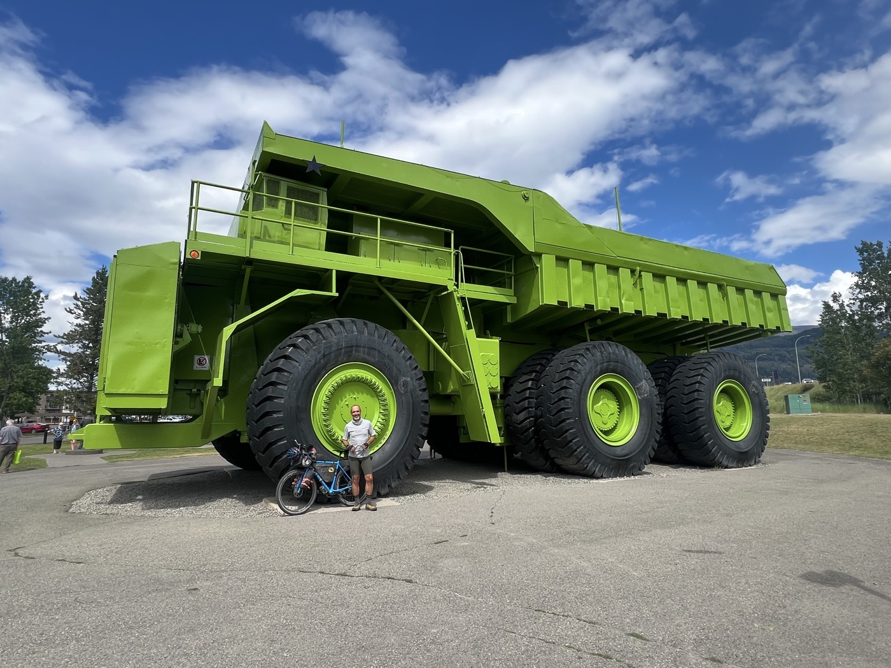
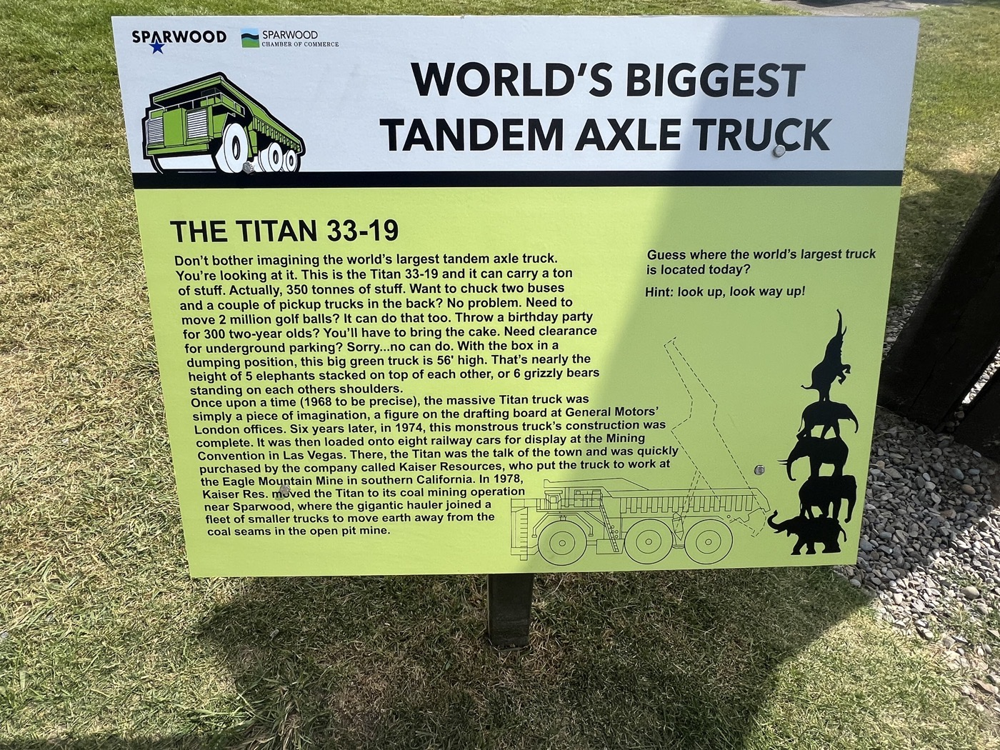
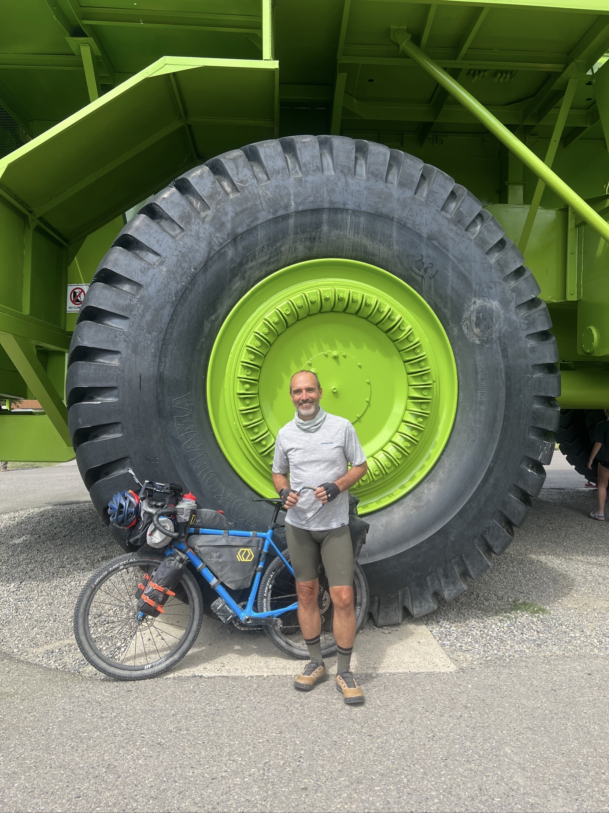
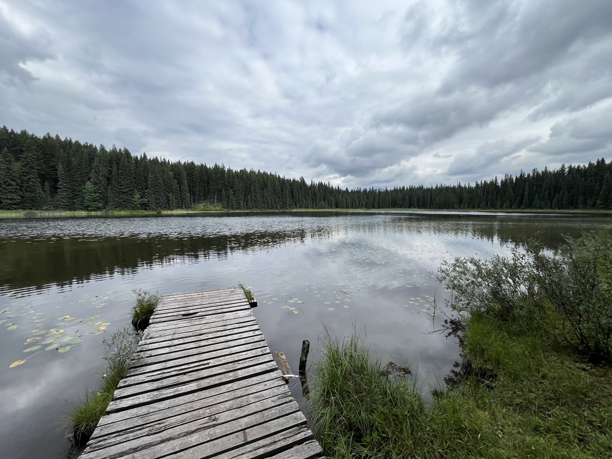
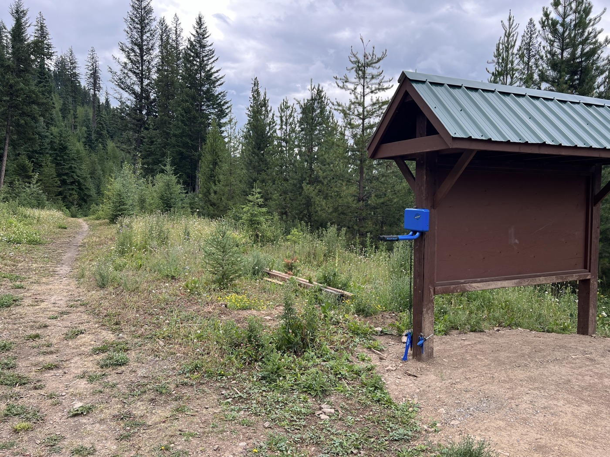
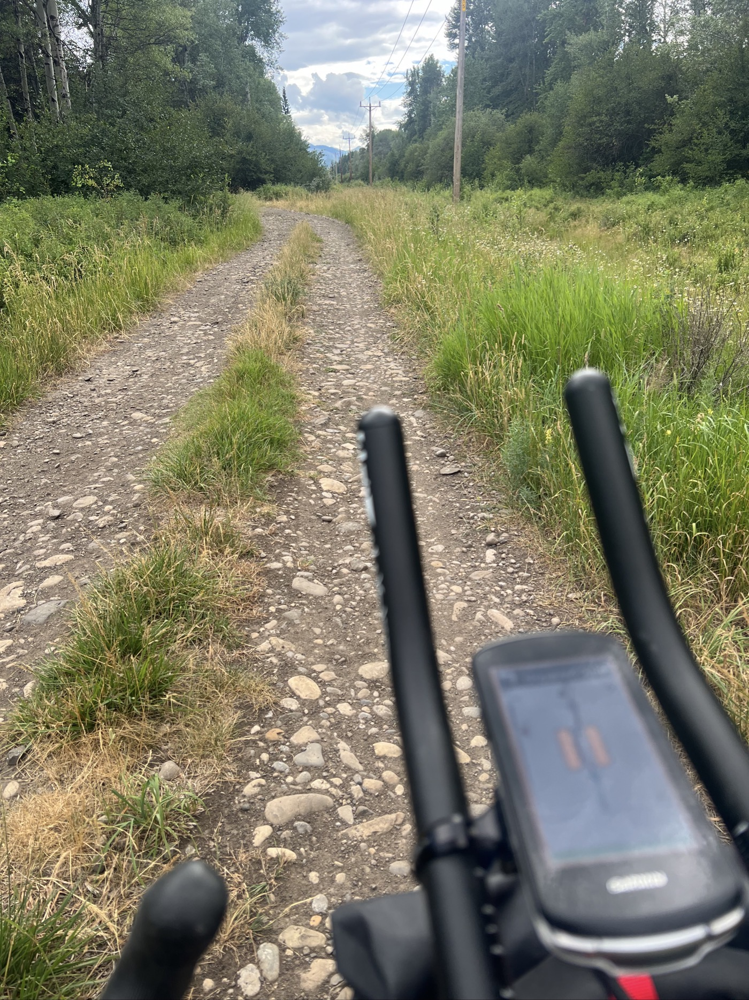
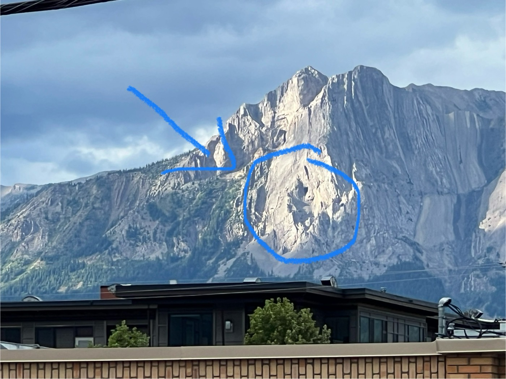

# the Titan

<figure markdown>
{ width=“300” }
</figure>

Le pneu arrière se dégonfle, du coup je vise Fernie où il y a des mécanos vélos. À Sparwood, je tombe sur Titan. Passage et photo obligés. Puis Fernie en donnant un coup de pompe tous les quelques km. Soirée sympa avec John et John, père et fils en route ensemble sur la Divide.

<!-- more -->

Nuit passée au motel, tenu par des Indiens (d'Inde donc) qui m'ont invité à manger dans leur cuisine. Très bon et végétarien pour changer !

En route pour Sparwood, mon pneu arrière se dégonfle. Tubeless pourtant et je ne trouve aucun trou ni fuite. Mais dès que je regonfle, rebelote après quelques km. Pas trop envie de sortir l'artillerie et mettre une chambre à air. Je vise Fernie comme terminus (50 km) il y a 3 bikeshops qui pourront regarder de près. Je regonfle au fur et à mesure - ça passe.

À Sparwood, je tombe sur Titan. Vous verrez les détails sur la photo de sa plaque mais c'est la 1ère fois que je me promène sous un camion. Il doit être dans le Guiness des records celui-là! Et c'est vrai - toute la région ici vit des mines de charbon. On voit des musées et des monuments. Puis on voit surtout Titan ☺️. Et la nuit on entend des trains de charbon interminables. J'ai vérifié, les plus longs ont 150 wagons et mesurent plus de 2.4km. C'est une autre dimension ici.

Arrivé à Fernie, je fais vérifier le vélo. Ils me disent que tout va bien, ils ont regonflé à bloc et remis du liquide tubeless. J'achète aussi une petite cartouche de gaz, utile pour refaire l'étanchéité je pense. Ça a l'air de tenir, je vais rester plus attentif.

Une habitante locale est fière de me montrer le fameux Ghost Rider - lorsque le soleil éclaire la montagne, on a l'ombre d'un cheval et de son cavalier  sortant de la montagne. Une spécialité locale, le nom est repris partout. Je mange avec John et John de New York, père et fils (62 et 28), qui suivent la divide. Très sympa! 

Sur le parcours du jour, je me suis bien flingué le dos sur les pavés de pierre. Respect pour tous ceux qui font Paris-Roubaix!

Nuit sous tente, je vise toujours les USA demain. John me dit que ça roule mieux après la frontière. J'espère!🤞 

<figure markdown>
{ width=“300” }
{ width=“300” }
{ width=“300” }
{ width=“300” }
{ width=“300” }
{ width=“300” }
{ width=“300” }
{ width=“300” }
</figure>

