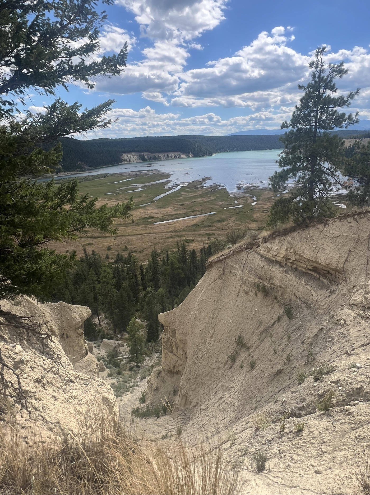
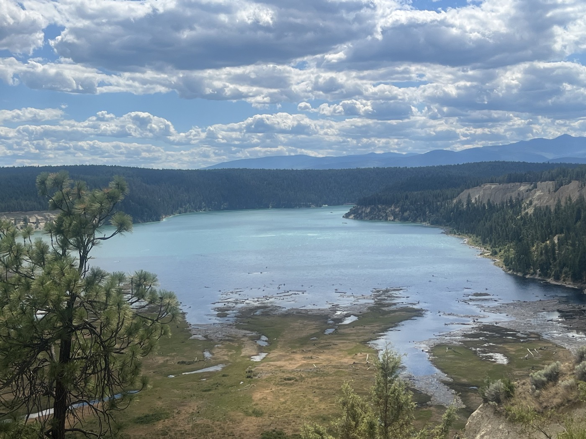
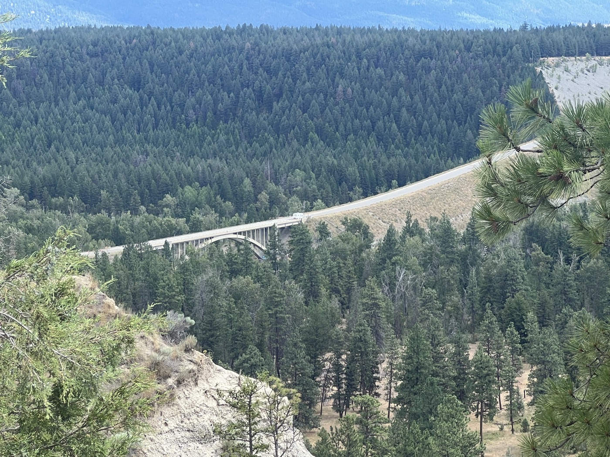
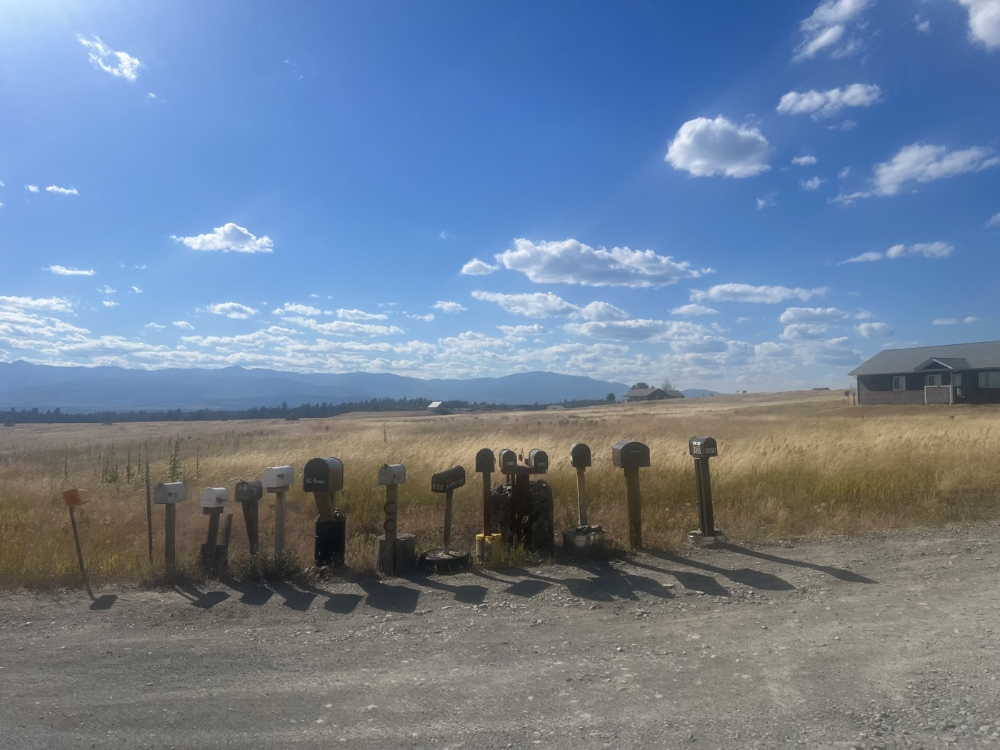
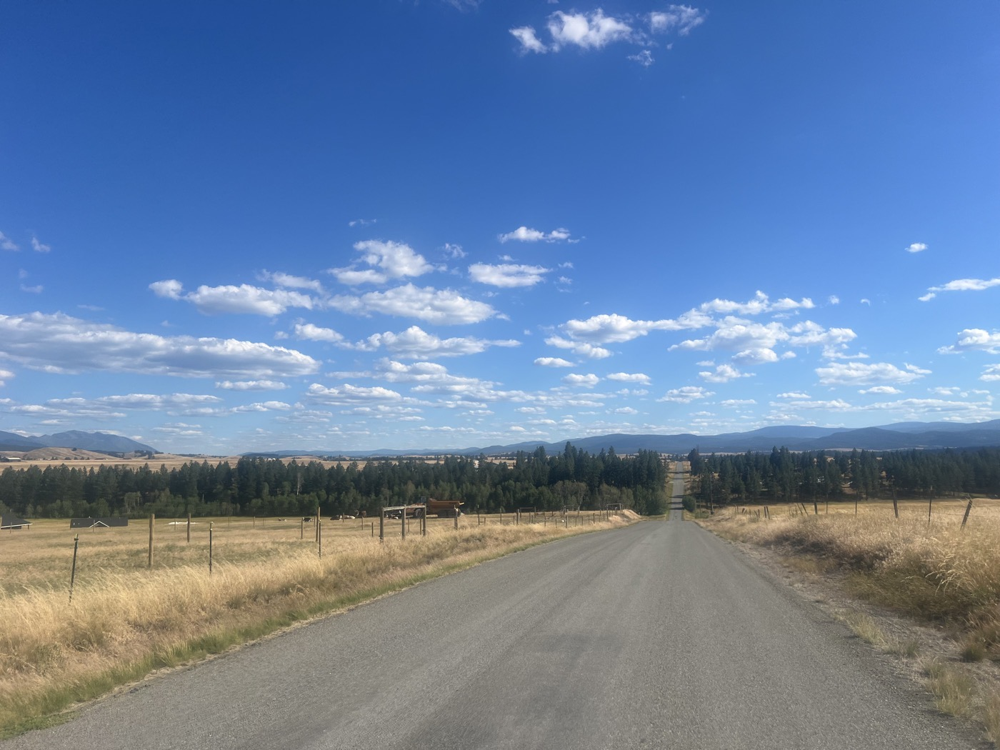
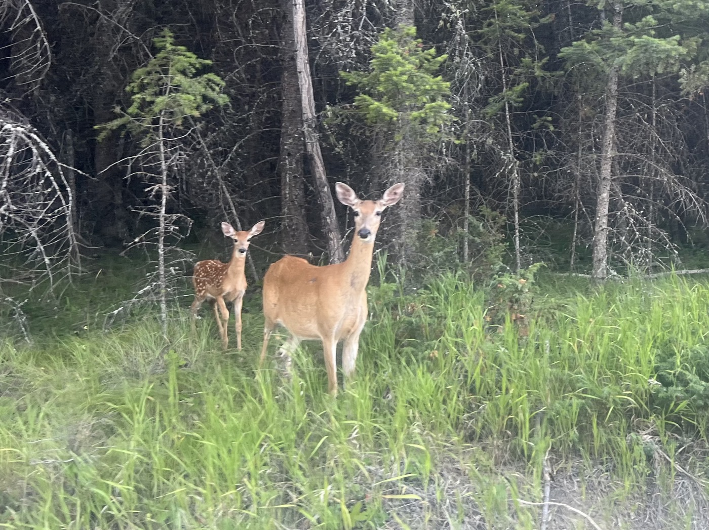
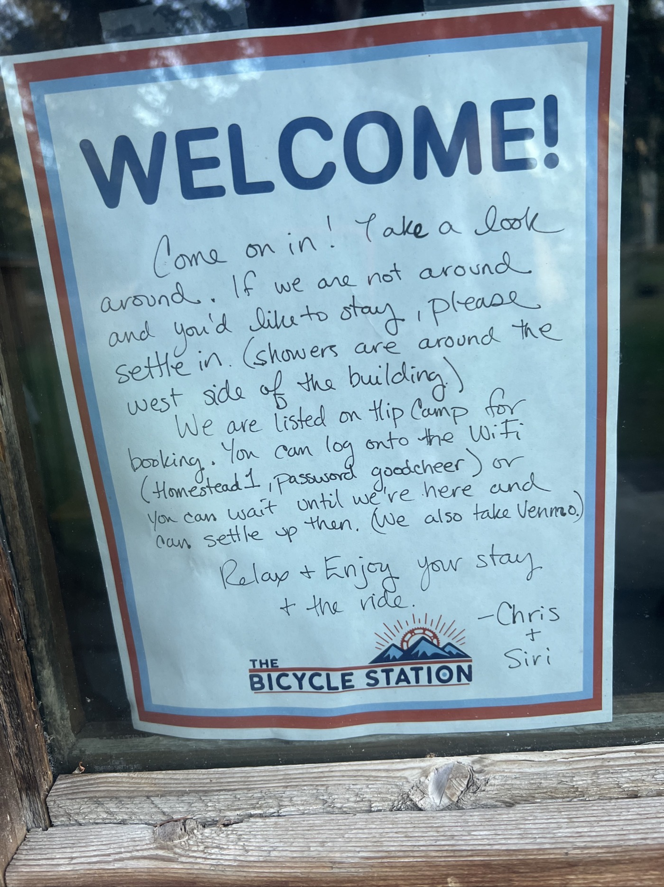
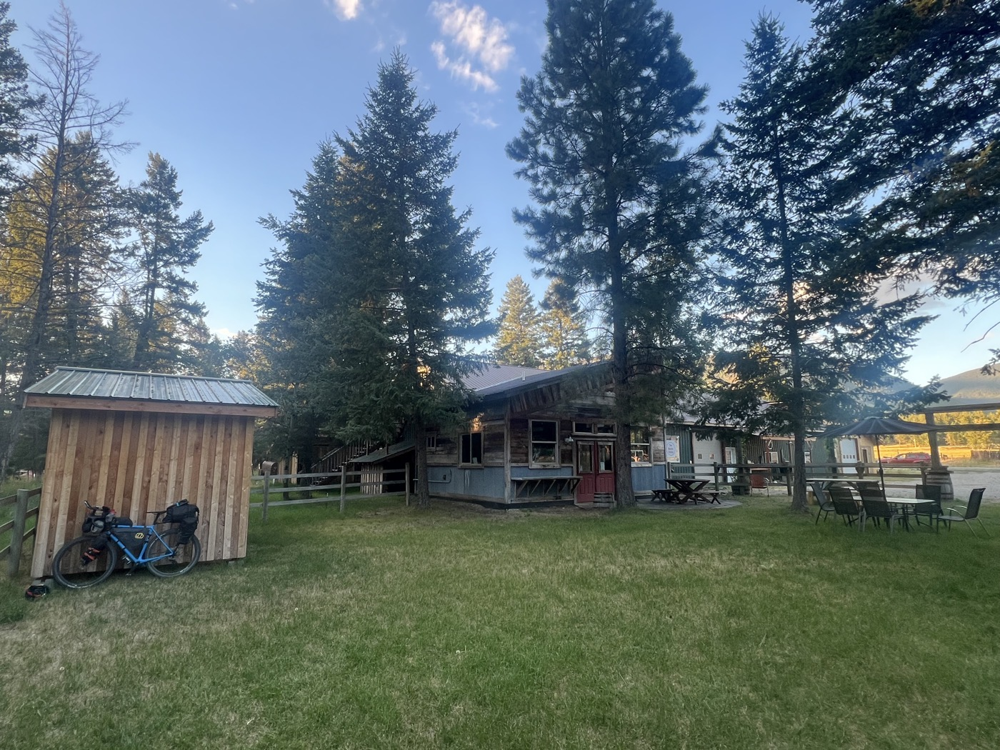

# 49ème parallèle

<figure markdown>
{ width=“300” }
</figure>

Er voilà j'ai passé la frontière. Et le paysage a bien changé. Des ranchs de partout. Une 1ère ville Eureka plutôt sympathique. Et surtout un camping pour cyclistes exceptionnel. J'ai pu rouler 130km avec 1'000m de D+. C'est top.

<!-- more -->

Dernière discussions avec John & John, j'adore comment ils me parlent de leur pays. Dommage qu'on avance pas au même rythme. Je rencontre encore 3 autres "Great Divider", on partage nos expériences. Ceux qui font la version sud vers le nord surtout partagent de bons tuyaux. Je me les note, j'essaierai de planifier mes arrêts en conséquence. Pour ce soir ils valident aussi mon choix : "the bicycle station".

Je dis au revoir aux Canada. Le passage de frontière s'est passé sans embrouille. A part le gabarit des gardes-frontières (très très costauds et très très tatoués). On fait pas le malin. Hop je reprends la route - le drapeau américain est omniprésent. Certains sont immenses. Me voici dans le Montana après les provinces Alberta et British Columbia du Canada, j'entre dans mon premier État américain.

Le paysage a bien changé. Beaucoup de prairies et d'herbe. Il fait 33 degrés! Je m'arrête dans la 1ere bourgade Eureka pour manger. J'ai jamais vu autant d'églises et appellations différentes. Sinon très joli. Le repas est le même des 2 côtés de la frontière : Burger (je vous reparlerai de la nourriture).

Justement la frontière - je me demandais pourquoi elle était tirée à la règle. Wikipédia m'apprends que c'est en fait le 49eme parallèle qui fixe la frontière. Du coup je suis exactement à la hauteur de Paris ce soir. Marrant.

J'arrive à mon campement : the bicycle station. Accueil réservé aux cyclistes. Il n'y a personne mais tout est ouvert. Ils ont aménagé des cabanons pour laisser le vélo et dormir à côté. Il y a des douches, un jardin, un atelier réparation de vélos. Une cuisine, frigo, salon. Et tout ça à disposition. Il y a quelques points de chute comme ça sur le trajet qui sont hors norme. Je fais finalement connaissance avec la propriétaire Siri qui vient de Norvège. C'est Chris son mari menuisier qui a tout amenagé. Un magnifique endroit - crève-cœur de déjà partir demain matin.

Sur le chemin, j'ai vu un nombre incroyable de biches et de cerfs. Au début j'ai pris des photos mais ils sont vraiment partout. Siri me confirme qu'ils sont bien sauvages mais sautent toutes les barrières pour aller chercher l'herbe bien verte. Je pense en avoir vu au moins 20 en 1 heure.

Demain je vais essayer de garder le même rythme! Bonne fête nationale Suisse 🇨🇭!

<figure markdown>
{ width=“300” }

{ width=“300” }

{ width=“300” }

{ width=“300” }

{ width=“300” }

{ width=“300” }

{ width=“300” }

{ width=“300” }

</figure>

