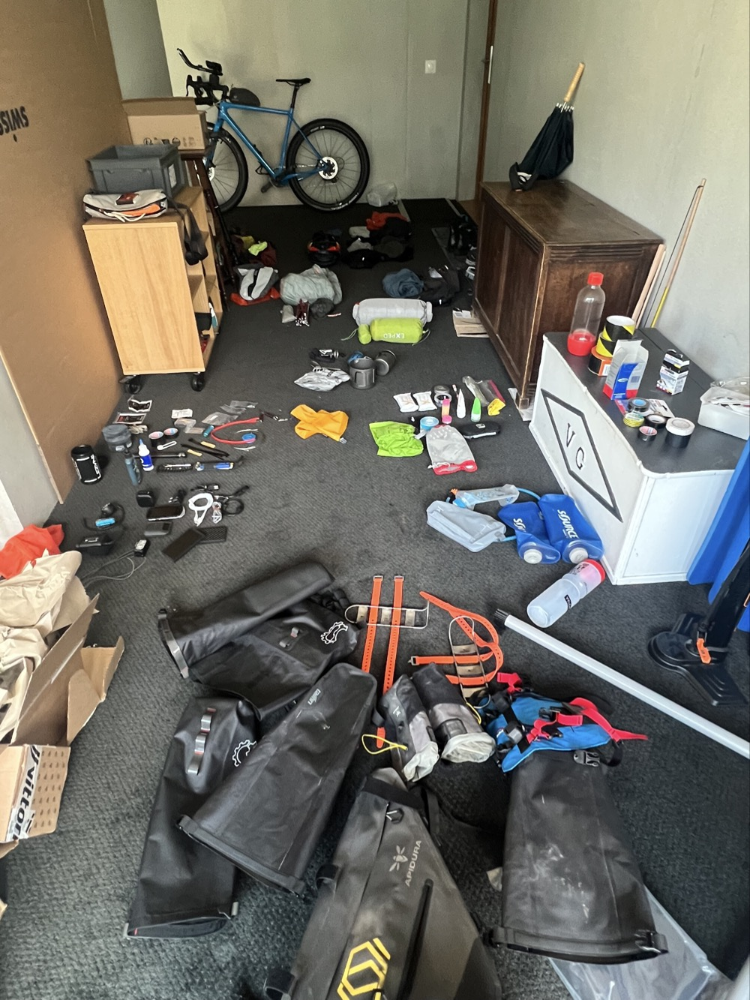

# J-1 : packing day

<figure markdown>
{ width=“300” }
</figure>

Wow I have been preparing for so long, yet this last day is so strange. Getting all my rig together, sort-off. Tomorrow onwards I will be on my own. 

Check-out the traditional rig pics in the preparation section. What are my (planned) essentials? What will be my proven and confirmed picks? And flops?

Also interestingly, it's not only about individual items but also about figuring a system to make it all work simply together.

<!-- more -->

