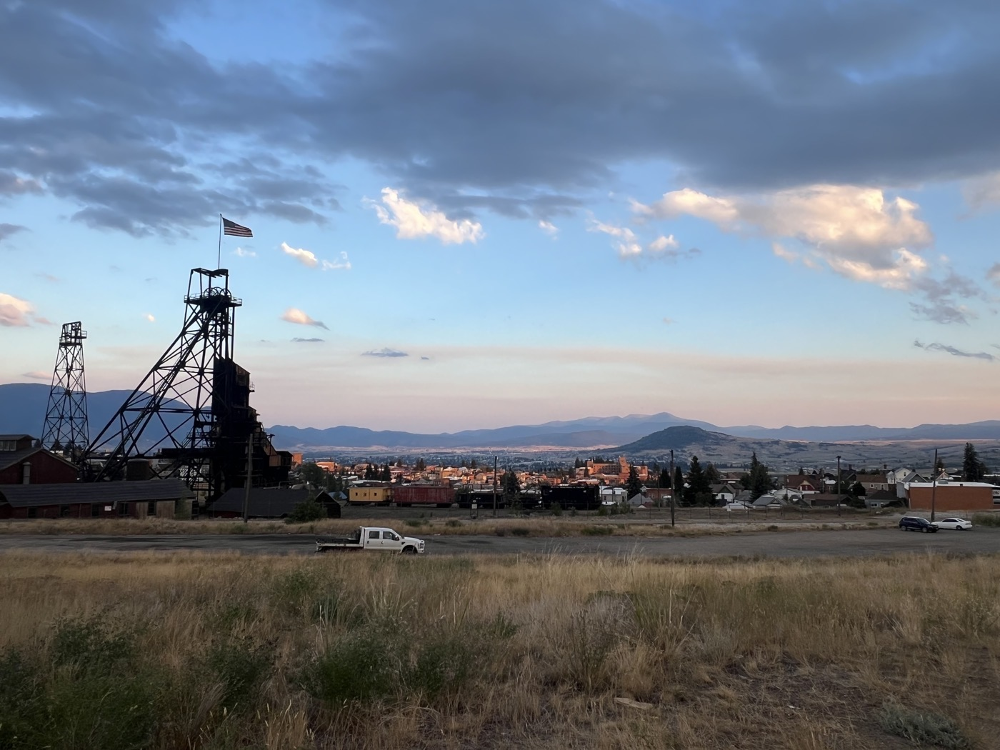
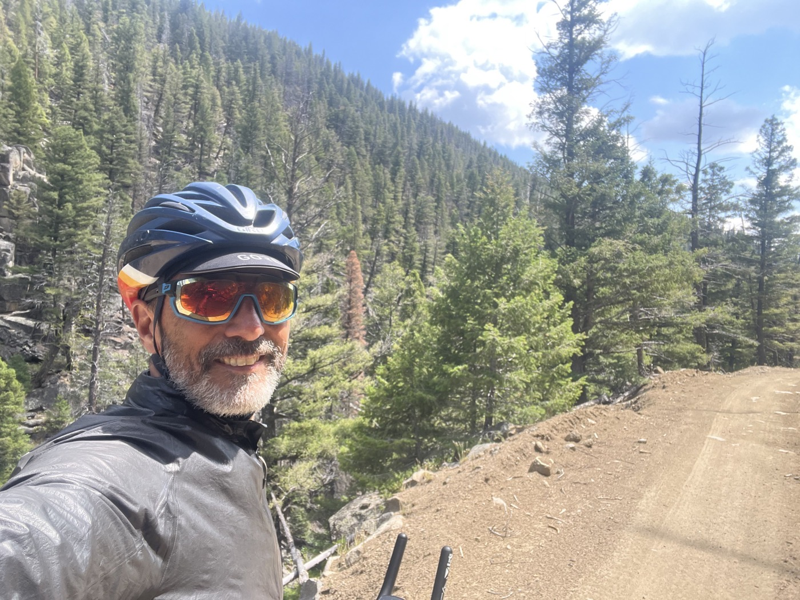
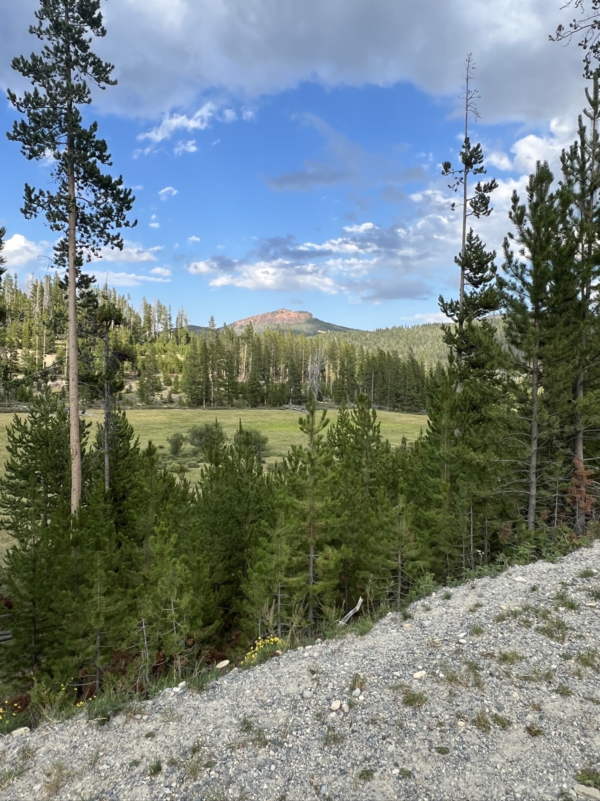
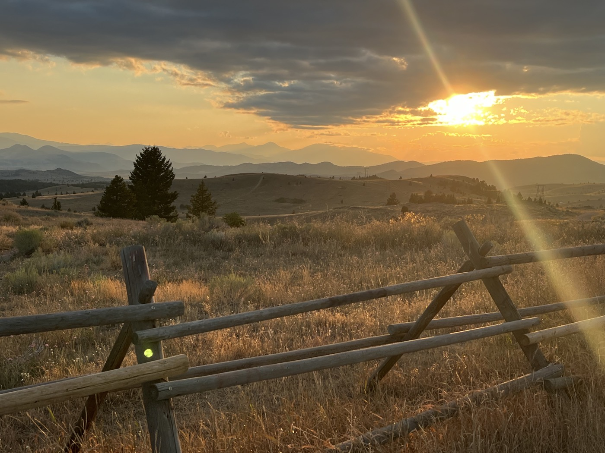
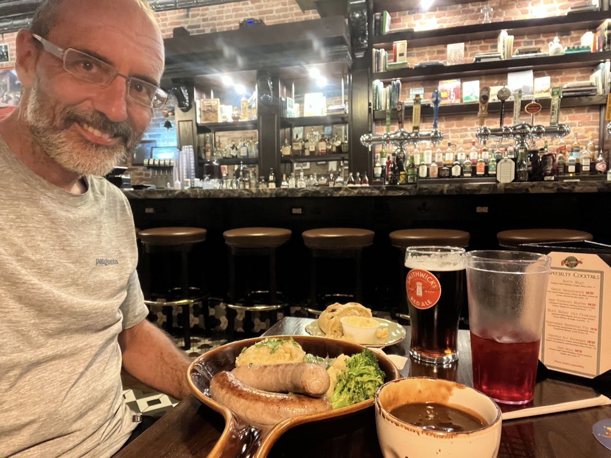

# Lava Mountain and Butte

<figure markdown>
{ width=“300” }
</figure>

Je quitte mon lac dans le brouillard pour m'attaquer à Lava Mountain. Passage difficile, je m'arrête à Basin pour reprendre des forces. Je poursuis sur Butte où j'arrive avec la tombée de la nuit. Je prends une chambre - besoin d'un bain et d'une grosse nuit!

<!-- more -->

# Lava Mountain

J'attaque la 1ère côte qui sur le papier n'avait rien de bien méchant. Mais je déchante rapidement. Il y a de gros cailloux et la pente devient très raide. Impossible de rouler là! Je descends et décide de pousser. Mon Garmin affiche noir (la couleur donc avec le % de pente). D'ailleurs il indique même plus la pente. Même pousser est super fatigant. J'essaie de remonter le plus souvent possible pour garder un rythme mais rien n'y fait. La fin devient meilleure - enfin je roule et je passe un groupe de 3 qui poussent aussi. 

Je me rends compte après coup que ce passage est un des plus difficiles. Et encore j'ai pris le chemin alternatif. Pour la course ils vont encore plus loin et le chemin est totalement impraticable, rempli de gros blocs de pierre et de troncs à passer en single trail. Il faut aimer...

Du coup j'ai une faim de loup et je m'arrête à Basin pour manger un burger. En fait c'était aussi mon petit déjeuner. Mauvaise idée. Gros passage à vide, la digestion est trop lourde. Je fais péniblement 15km puis m'arrête. Sieste de 30mn. Ça va mieux pas c'est pas le top.

# Butte

Je vise Butte qui se compare à Helena en taille. J'arrive sur le tard - ma moyenne est vraiment pas top. Je me prends une chambre à 20h30, on me recommande  le pub irlandais ☘️ Shawn O'Donnell's. Super authentique mais qui ferme à 21h. Je me grouille et entré dans le pub, je change de monde. Je mange un Bangers&Mash avec une 🍺 Smithwicks - la musique celtique donne du rythme. Je me sens mieux.

Butte est une ville minière, on voit encore des infrastructures. Et elle héberge une grande communauté irlandaise. Je prévois un bain chaud et une grosse nuit car les prochains jours sont sauvages. En tout cas 3 nuits sous tente et un seul point de ravitaillement. Je risque de pas avoir de réseau. Je pense aussi aller un peu plus lentement - j'ai compris que le Montana faisait partie des difficultés du parcours. On apprends 😉.

Demain Fleecer Ridge. Il paraît que la descente fait 30 degrés de pente. Je m'imagine faire des conversions à pied !

<figure markdown>
{ width=“300” }

{ width=“300” }

{ width=“300” }

{ width=“300” }

{ width=“300” }

{ width=“300” }

</figure>

<iframe src='https://connect.garmin.com/modern/activity/embed/16704580289' title='Day 13' width='405' height='500' frameborder='0'></iframe>

