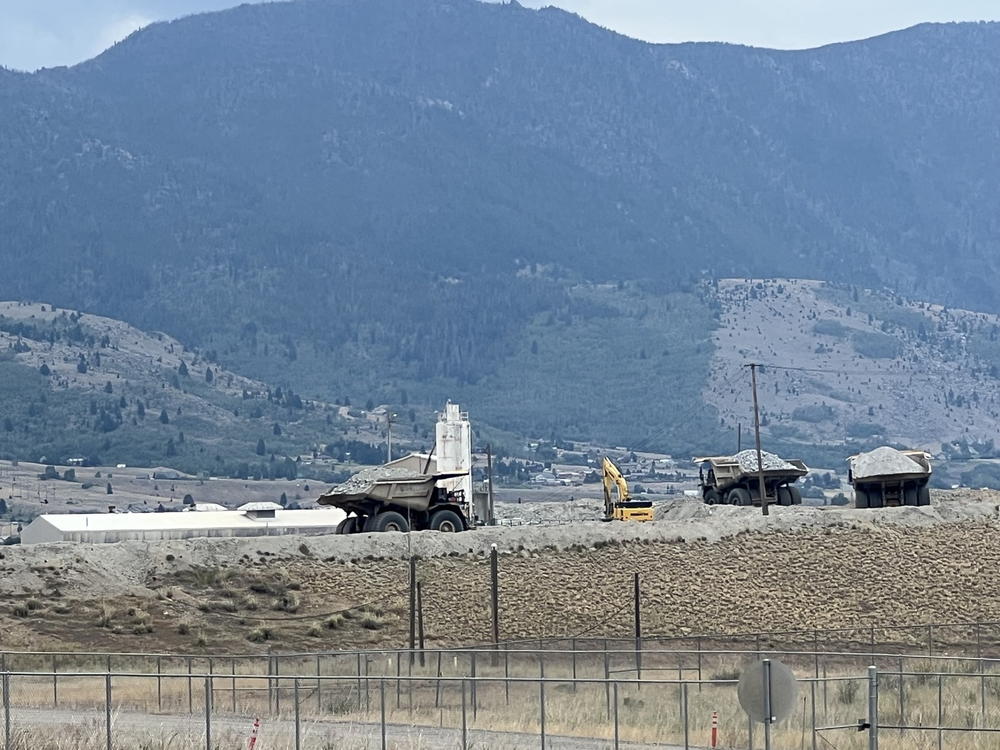
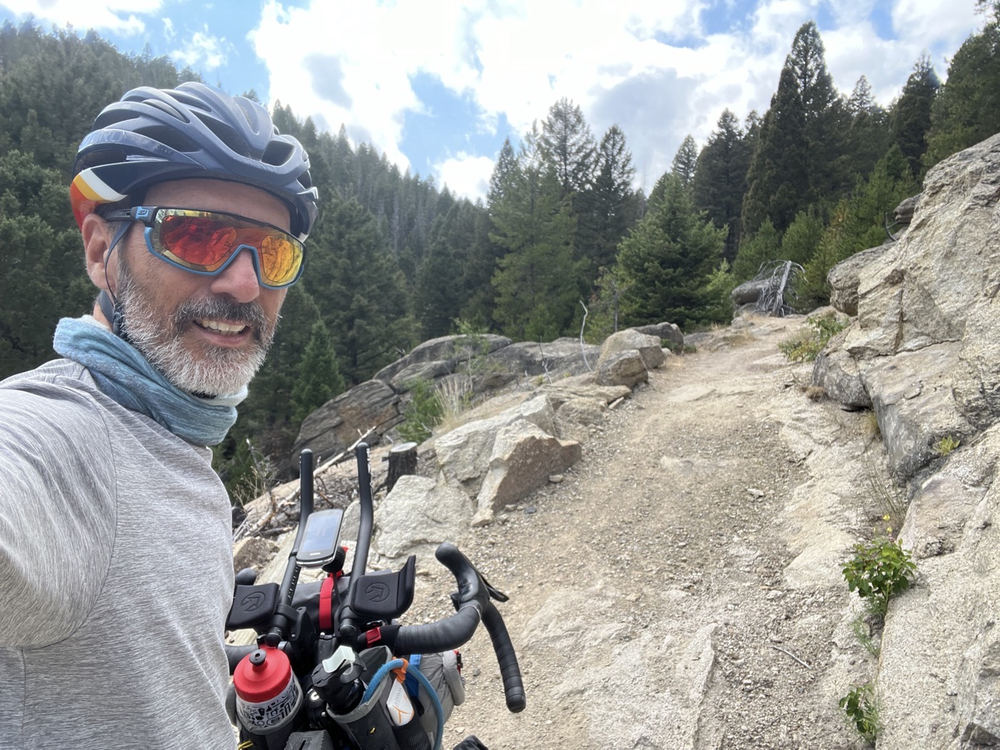
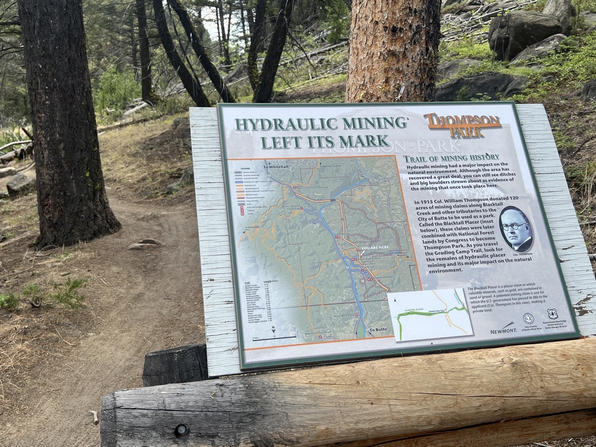
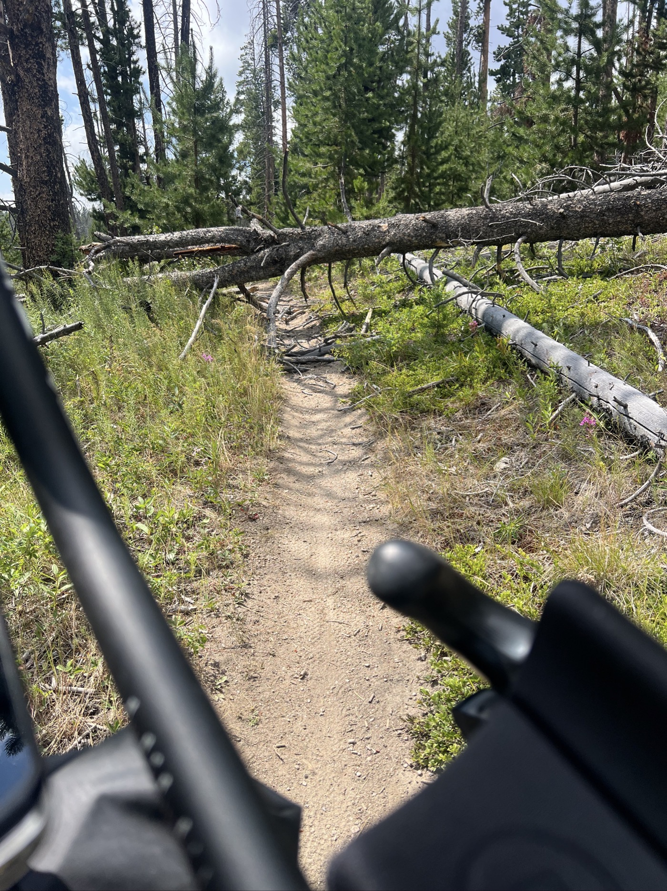
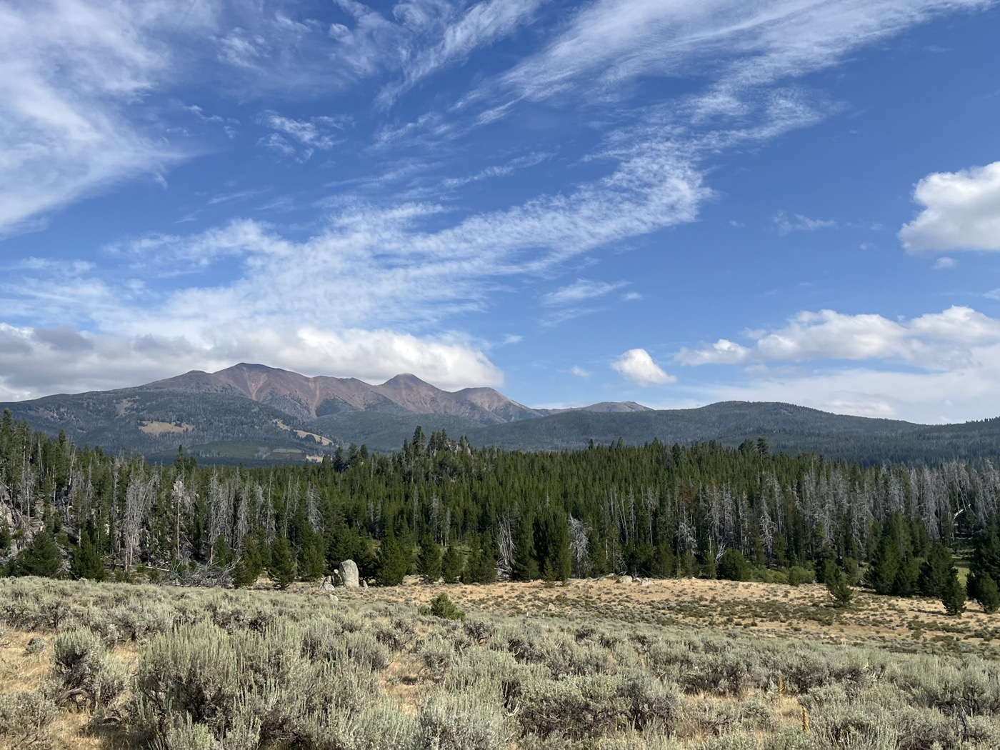
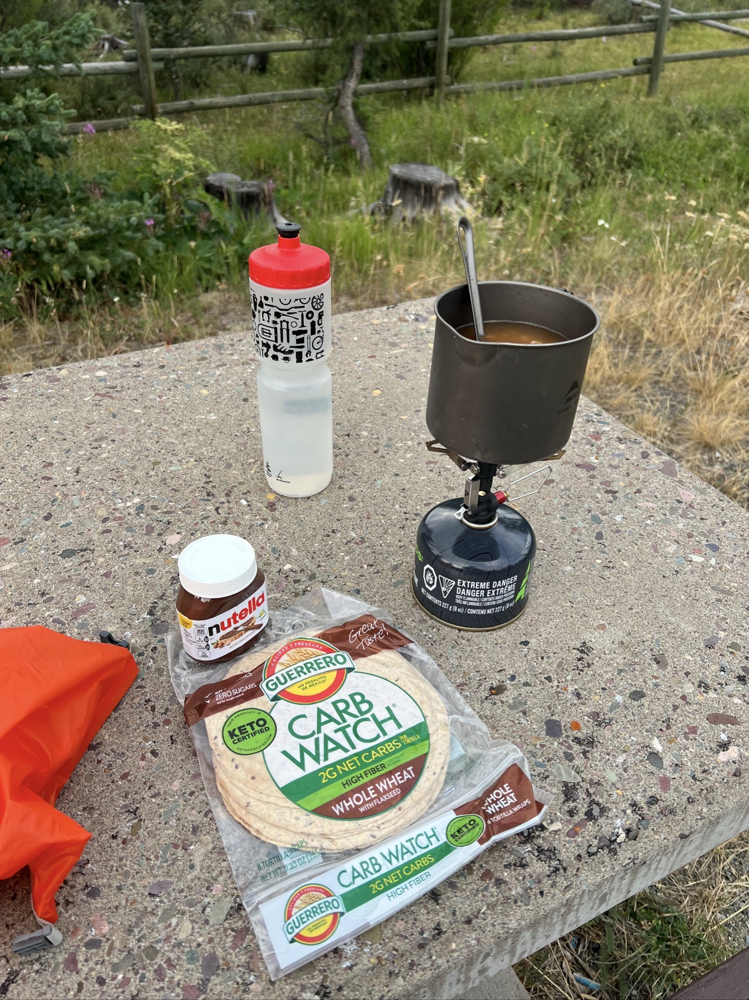

# 2 semaines

<figure markdown>
{ width=“300” }
</figure>

Je pars de Butte après avoir fait mes emplettes pour 3 jours et avoir déjeuné. Je vois encore de l'activité minière. Ça roule un bon moment puis c'est parti pour du single track dans le parc Thompson. J'entame la montée vers Fleecer Ridge mais les jambes ne veulent plus. Je choisi de remettre la partie dure à demain.

<!-- more -->

# Sortie de Butte

Butte est une mine à ciel ouvert. Il y a encore de l'activité, je vois des petits frères de Titan qui transportent du minerai. C'est étranges les minerais forment des couchent de couleur comme s'ils ne se mélangeaient pas. J'envoie un peu pour avancer mais je me prends un gros vent de face. Il faut composer.

# Parc Thompson

Le parcours nous fait traverser ce parc. Beau single trail ludique mais ces petites bosses à passer me flinguent un peu les jambes. Thompson faisait de l'extraction hydraulique ici (pour exploiter de l'or et des minéraux précieux). La sortie du parc me fait rouler sur une belle piste en descente, je dépasse 2 autres dividers (donc ceux qui font la Divide). Ça motive!

# Mes jambes lâchent

J'entame la montée vers Fleecer Ridge, 15km de montée. 5% de pente moyenne sauf qu'une fois passé l'entame (couleur verte), la pente ne fait qu'augmenter (je commence à connaître la chanson). Pas envie de faire les passages difficiles dans l'obscurité et je suis rincé. Comme par hasard, une option camping se présente. J'hésite puis choisis de m'arrêter. Je me rends compte que j'ai les fesses en feu et en plus ma digestion est pas top. Je prévois une grosse nuit en espérant que demain ça ira mieux. C'est dur mais on a le droit de se ménager.

<figure markdown>
{ width=“300” }

{ width=“300” }

{ width=“300” }

{ width=“300” }

{ width=“300” }

{ width=“300” }

{ width=“300” }

{ width=“300” }

</figure>

