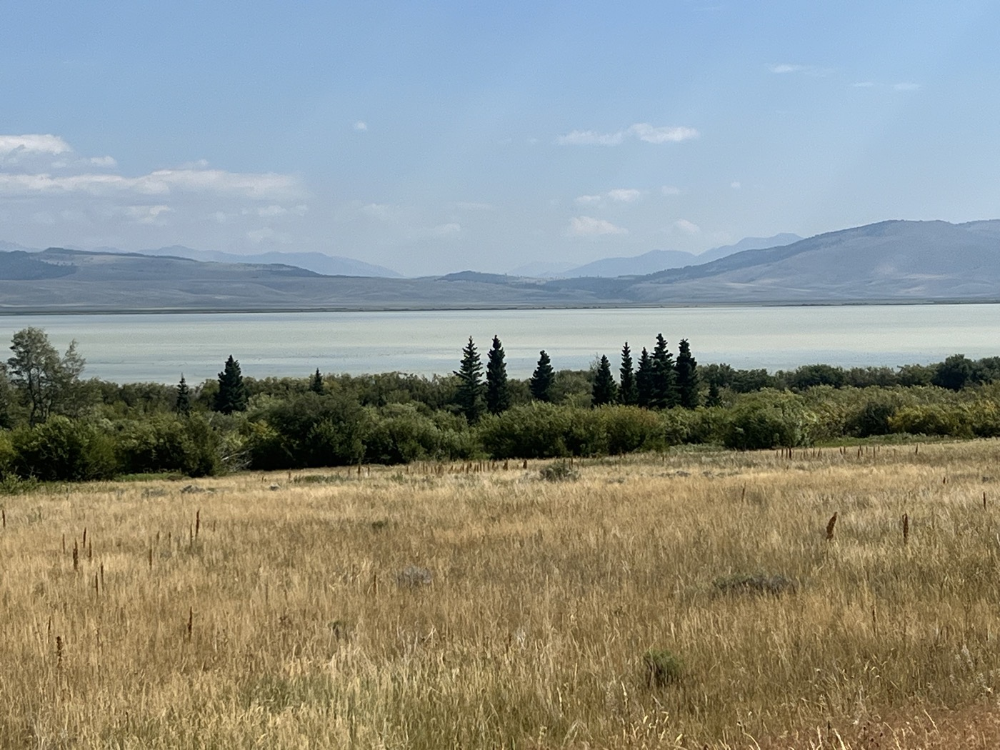
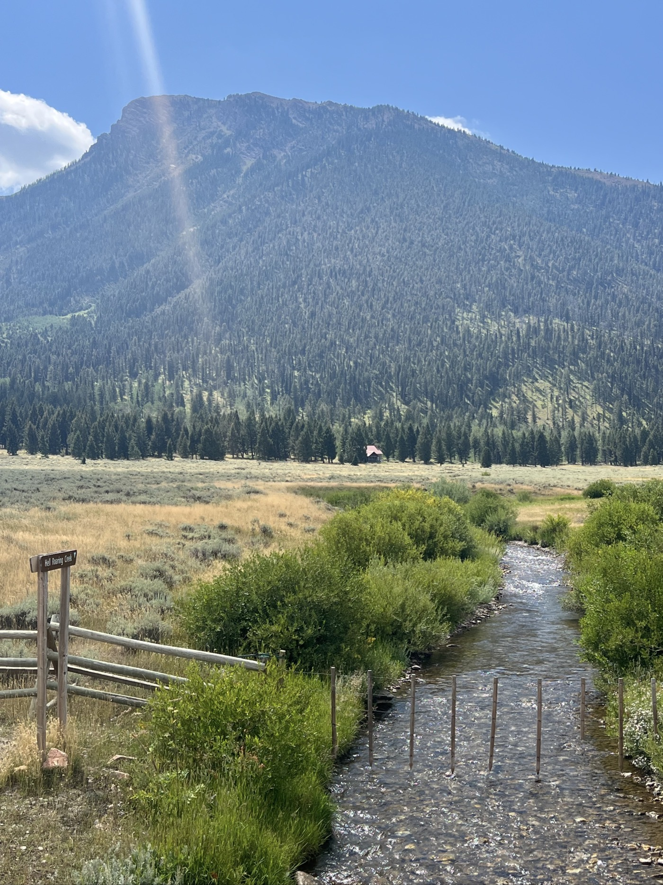
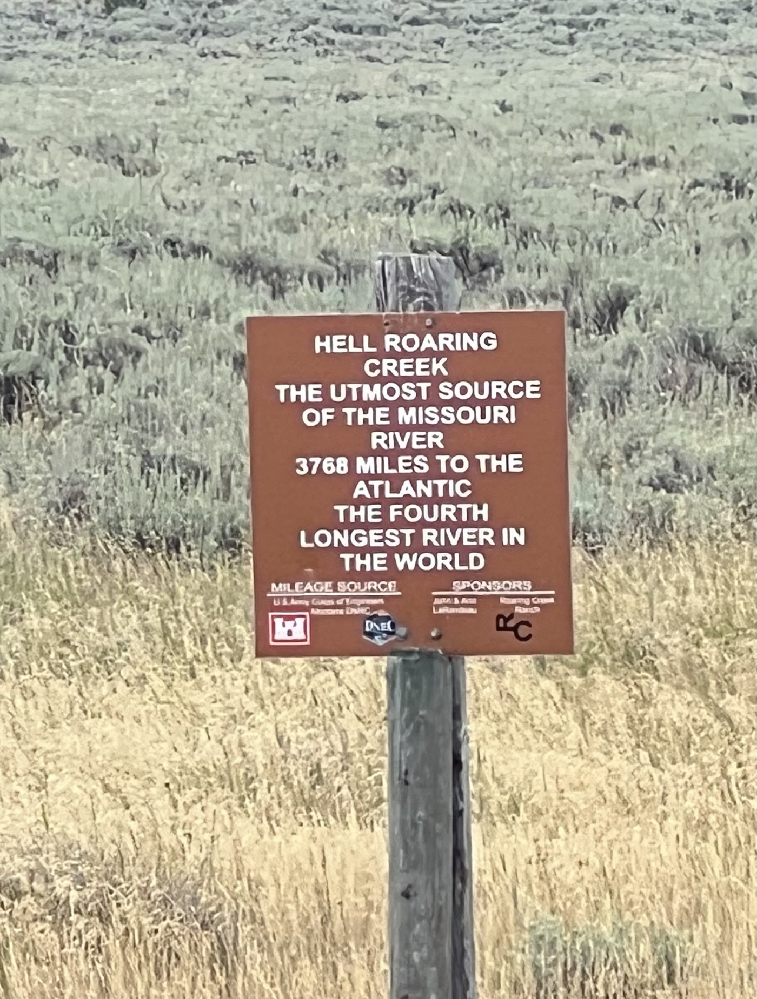
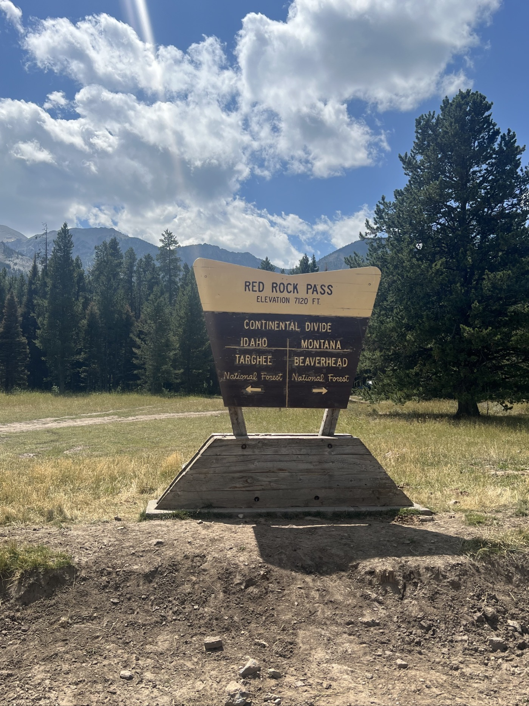
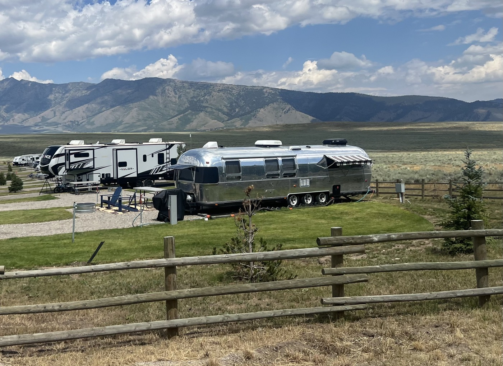
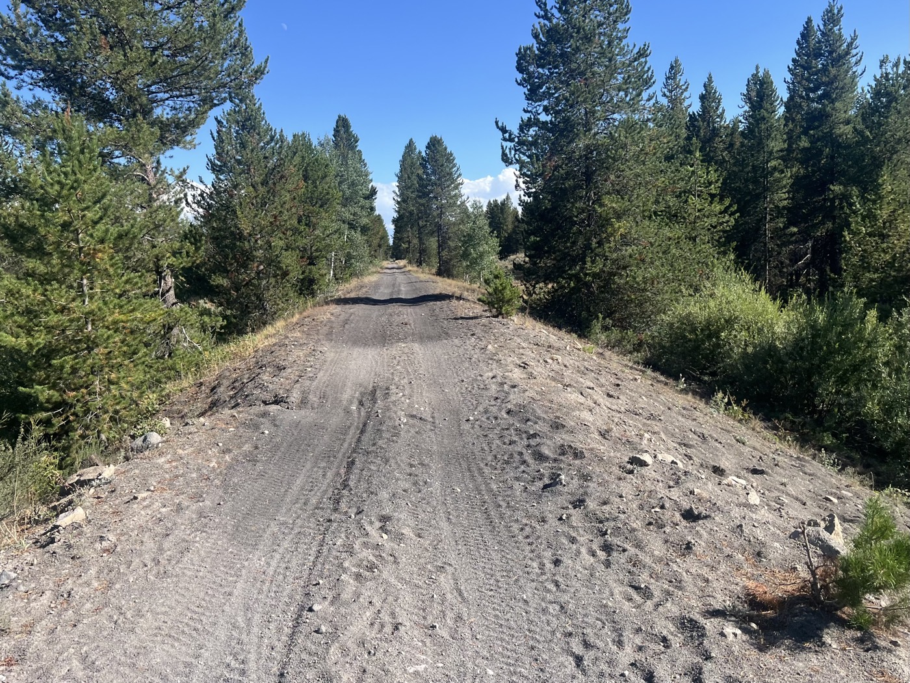
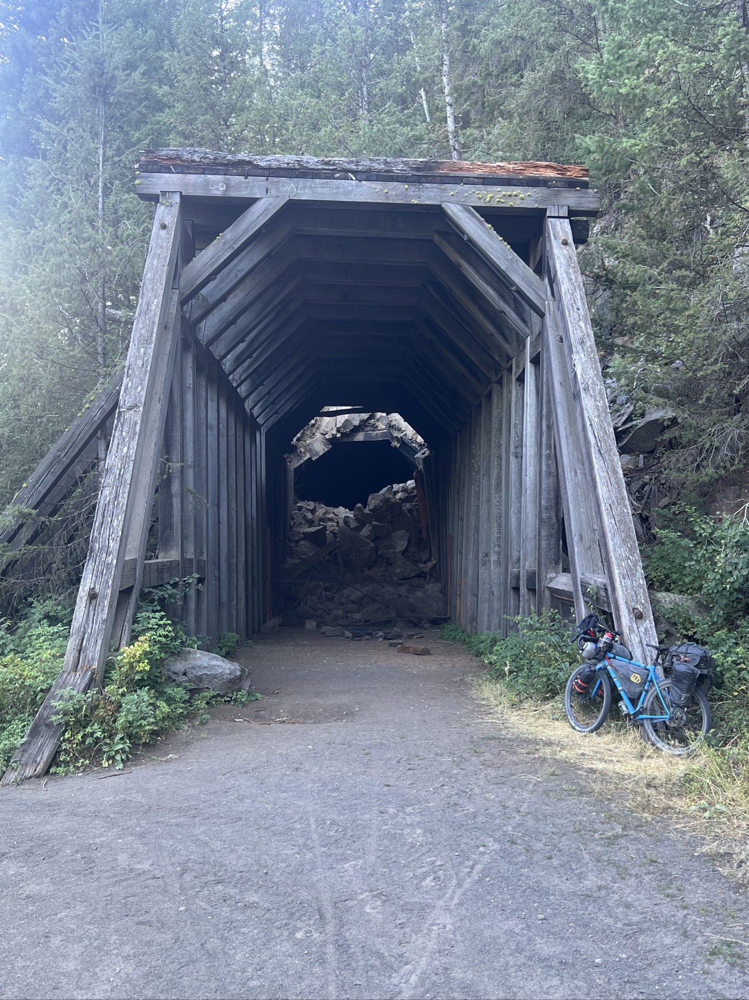
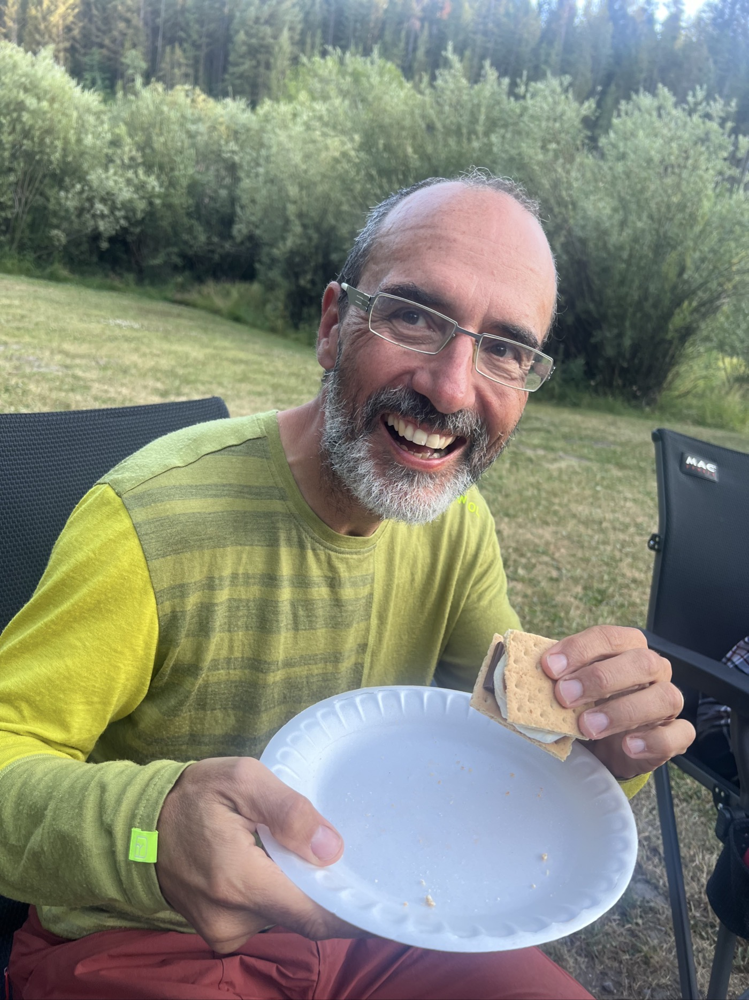

#  Old Oregon Short Line

<figure markdown>
{ width=“300” }
</figure>

Je longe la réserve naturelle de Red Rock Lakes, vent de face toute la journée. J'entre dans l'état Idaho! Puis je termine par un ancienne voie des chemins de fer qui amenait les touristes au Yellowstone Park. Je termine au Warm River Campground avec un super accueil.

<!-- more -->

# Au revoir Montana

Je longe la réserve de Red Rock Lakes toute la matinée - gros vent de face. J'évite un 1er serpent, je roule sur le second. Incroyable, je les vois toujours au dernier moment. Il paraît qu'on peut croiser le rattlesnake ici (à sonnette). Je croise la source du Missouri (qui se jette dans l'Atlantique), je suis bien sur la divide, la ligne de partage des eaux. 

# Hello Idaho!

Je passe un petit col, et me retrouve en Idaho. Le trail nous fait passer sur le petit coin nord-est de cet état. Je n'y passerai qu'une journée (75 miles). Demain j'entre dans le Wyoming, qui on me dit a encore moins d'habitants que le Montana.

# Old Oregon Short Line 

Je finis la journée sur un magnifique passage, sur sable volcanique assez mou et noir. Une ancienne voie de chemin de fer historique transformée en piste. Elle se termine par un tunnel (fermé), passage photo obligé. Le dernier bout longe la rivière Warm River qui est magnifique. Je m'arrête au camping au bord de la rivière.

# Super accueil

Même si pas gratis, la gardienne me trouve un plan à moitié prix. Et m'offre à boire et de quoi recharger mes accus-batteries. La place est top, au bord de la rivière. Je me baigne tout habillé, cela fera office de douche/lessive. L'eau est à 52 degrés Fahrenheit toute l'année d'où son nom. Elle ne gèle jamais 😄. Mes voisins m'invitent au repas, chouette famille. Chili, Corn bread et je découvre le Smore au dessert. Trop sympa.

Bien roulé aujourd'hui (140km) mais il reste encore beaucoup! Demain, un aperçu des Great Teton Park et des montagnes si la météo est bonne. Ensuite je m'enfonce dans le Wyoming...

<figure markdown>

{ width=“300” }

{ width=“300” }

{ width=“300” }

{ width=“300” }

{ width=“300” }

{ width=“300” }

{ width=“300” }

{ width=“300” }

{ width=“300” }

{ width=“300” }

{ width=“300” }

{ width=“300” }

</figure>

