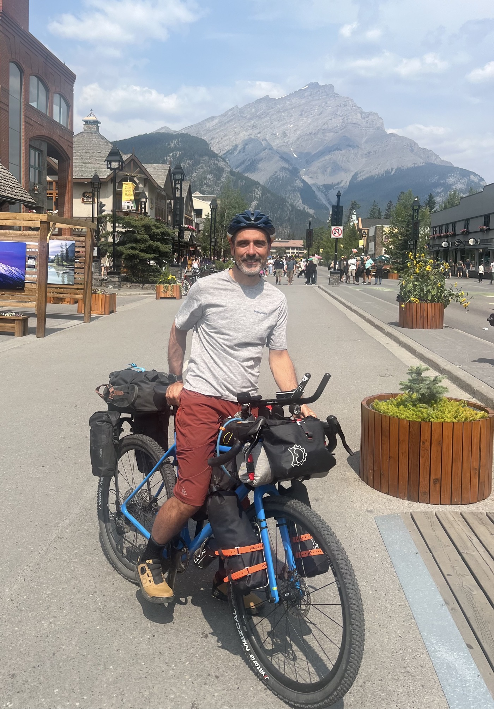
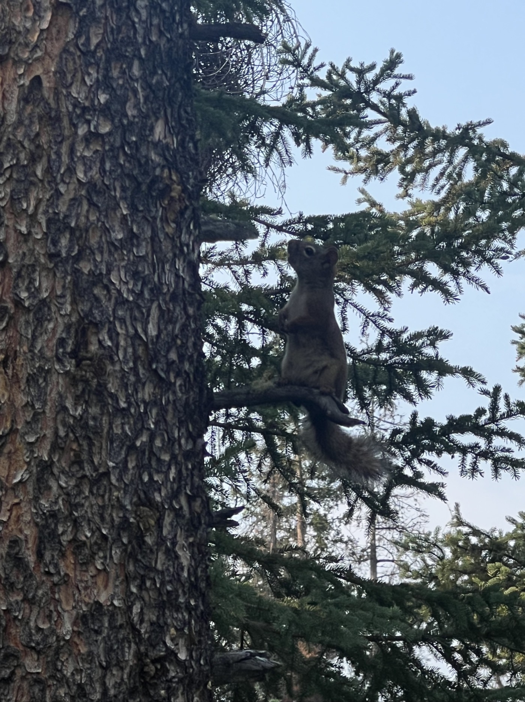
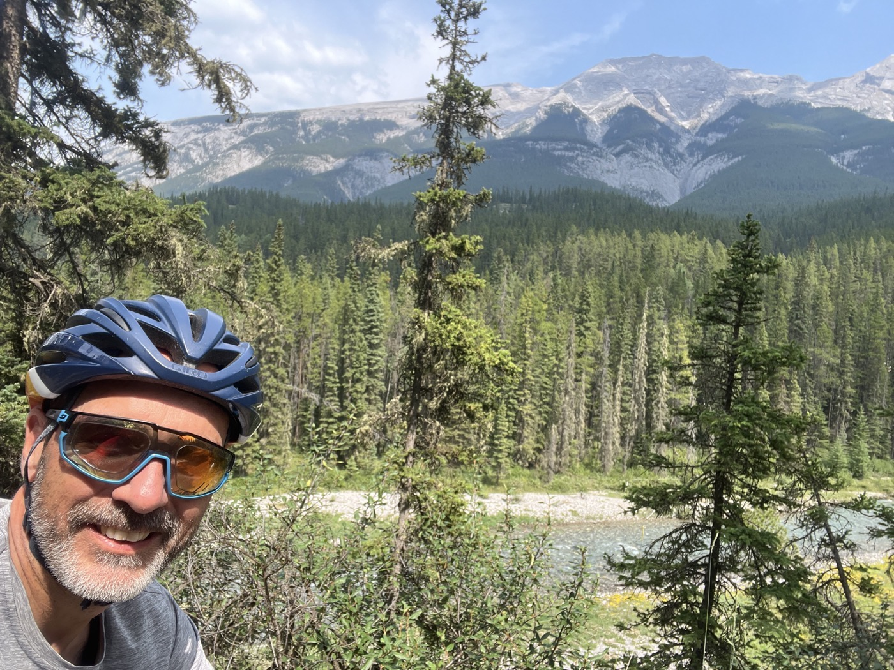
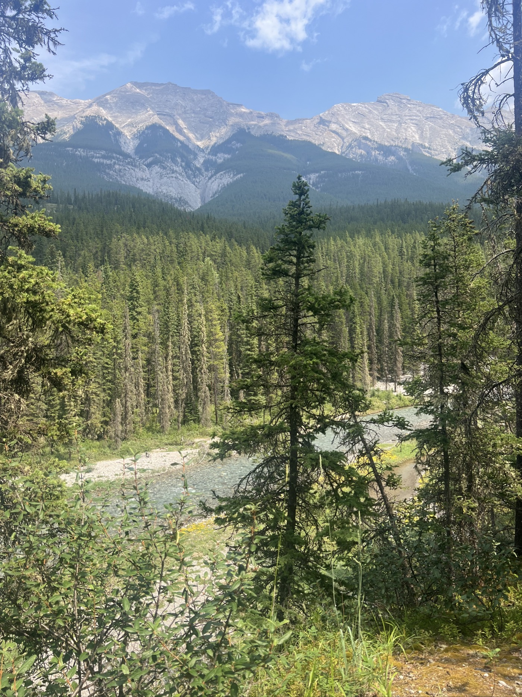
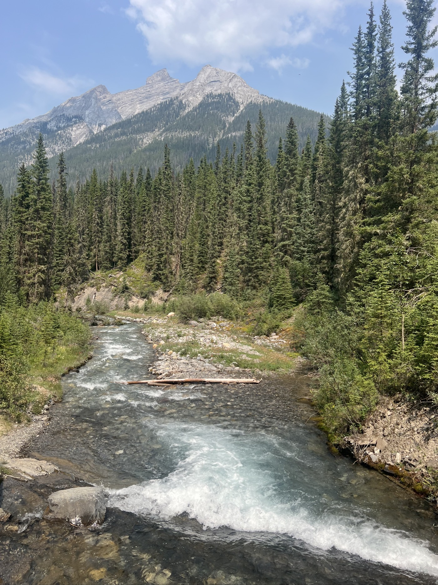
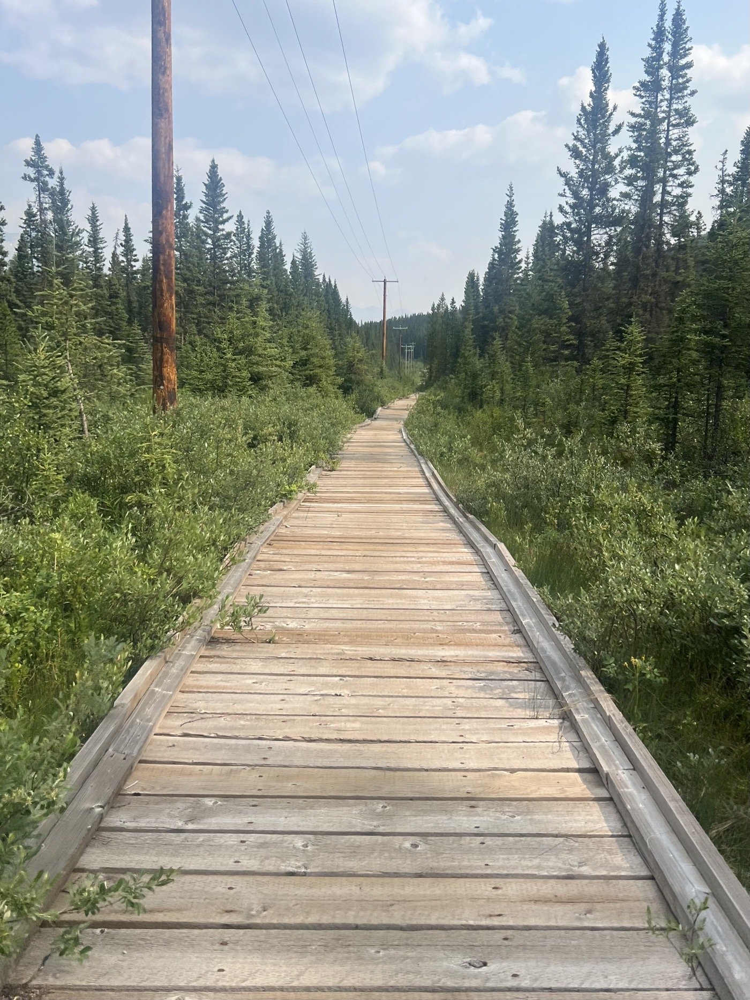
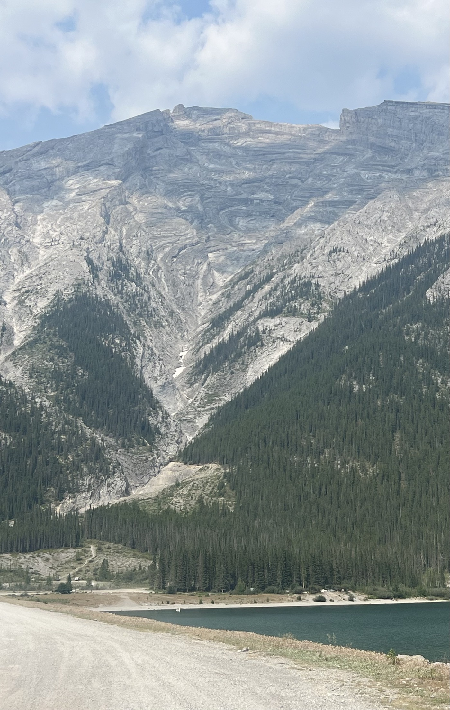
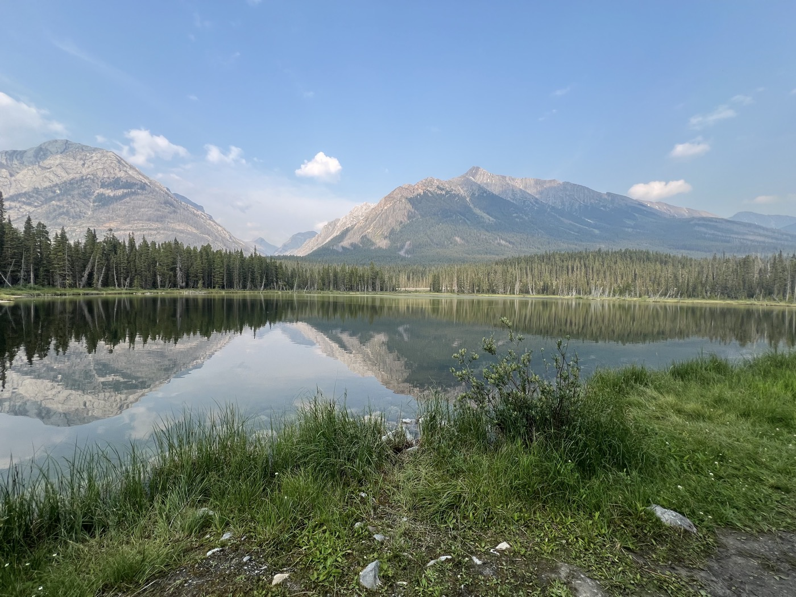

# Le jour du Grand Départ

<figure markdown>
{ width=“300” }
</figure>

Cette fois ça y est: c'est MON Grand Départ. Parcours idéal pour du gravel, paysages grandioses. Campement au bord du lac Spray Lake Reservoir, nous sommes juste 2 cyclistes. C'est top mais maintenant il faut avancer! Je découvre la solitude devant les grands espaces.

<!-- more -->

Départ en début d'après-midi le temps de faire quelques courses et télécharger les cartes détaillées Canada et USA sur mon GARMIN. Figurez-vous que je n'avais pas vérifié 🙃 avant d'embarquer. Et je vous dis pas la galère pour trouver une bonne âme et un ordi. Les cybercafés sont de l'histoire ancienne (il faut un ordi 😳). On me propose la bibliothèque communale (fermée). Bref tout est entré dans l'ordre grâce à Gayle 🙏 gente dame qui tient un magasin de flanelle. Improbable non?

Et sorti de la ville j'entre dans un autre monde. Un parcours de toute beauté, grandiose et pas un chat. Juste une perdrix qui s'envole (et me fiche une belle frousse).

Un parcours aussi avec des pièges. Sur le sable ça avance mais avec la vitesse on risque de mal estimer les creux qui parfois sont très raides et pourraient bloquer la roue avant. Sur les pierres ça secoue et certaines peuvent être grosses. On s'ennuie pas et je me rince les yeux de ces espaces sauvages.

Fin de journée sur "autoroute de gravier" (40m de large). Les 4x4 provoquent beaucoup de poussière. La piste est "gondolée" style papier carton. Ça secoue. Je comprends pourquoi il y a un marché pour les selles suspendues.

Je termine sur un camping réservé aux cyclistes. On s'auto-inscrit et on plante sa tente. C'est rudimentaire mais réservé aux "hikers/bikers" donc pas complet. WC sèches. Pas d'eau. Je vais filtrer l'eau du petit lac. Le tarif est toujours aux alentours de 30 $ canadiens. Je fais connaissance avec un Australien qui a commencé aujourd'hui aussi. Mais qui ira plus lentement (et plus loin). Il a un beau Surly cadre acier, cintre Jones Bar. J'apprends qu'en Australie après avoir travaillé 7 ans dans la même entreprise on a droit à 6 mois de congés payés. Ça fait réfléchir?

La tente est au bord du lac (les moustiques aussi) - c'est beau. La nuit est bien fraîche, je suis bien dans ma tente et dans mon quilt (je vous expliquerai une autre fois).

<figure markdown>
{ width=“300” }
{ width=“300” }
{ width=“300” }
{ width=“300” }
{ width=“300” }
{ width=“300” }
{ width=“300” }
{ width=“300” }
{ width=“300” }
{ width=“300” }
</figure>

