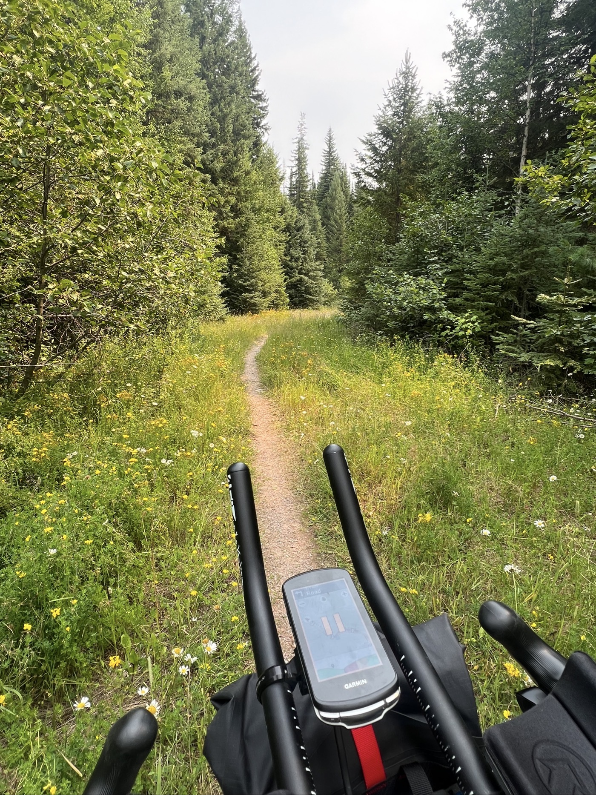
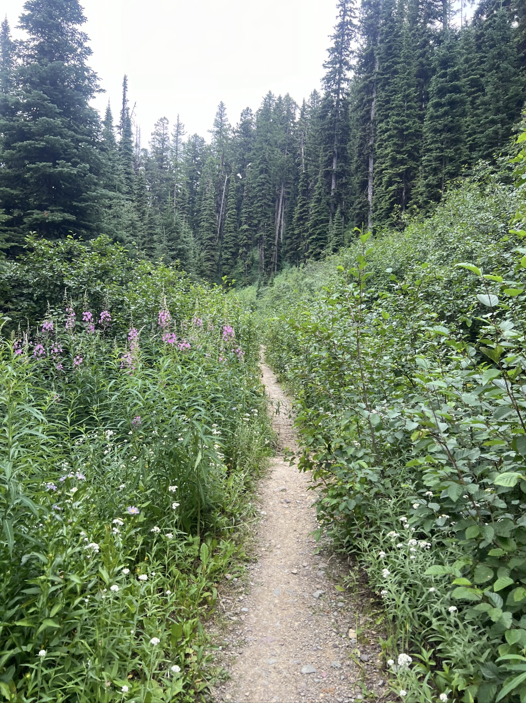
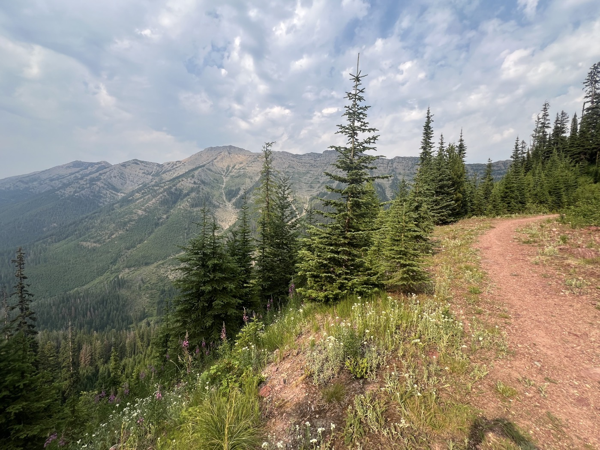
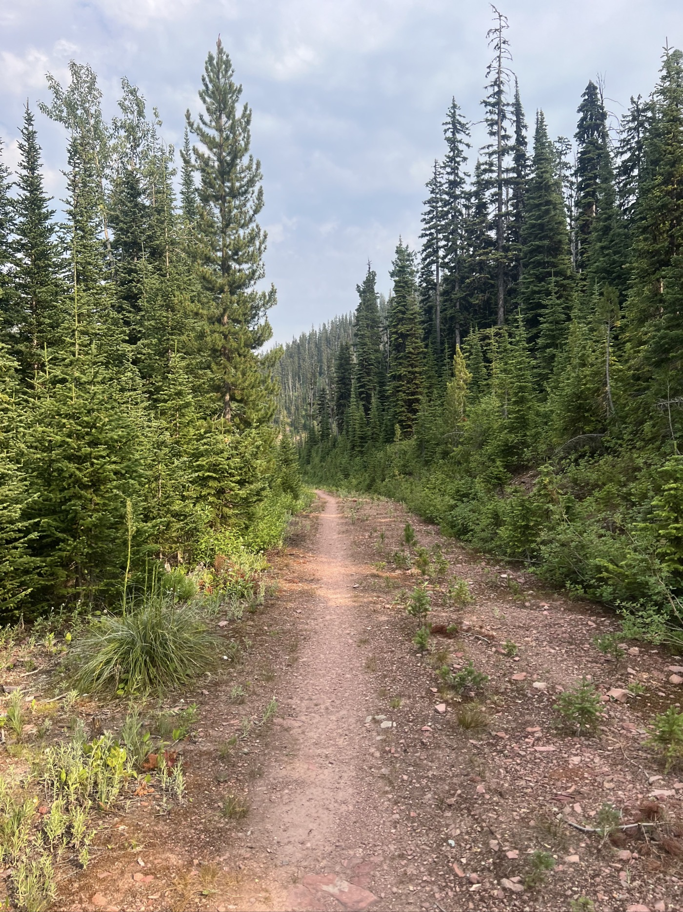
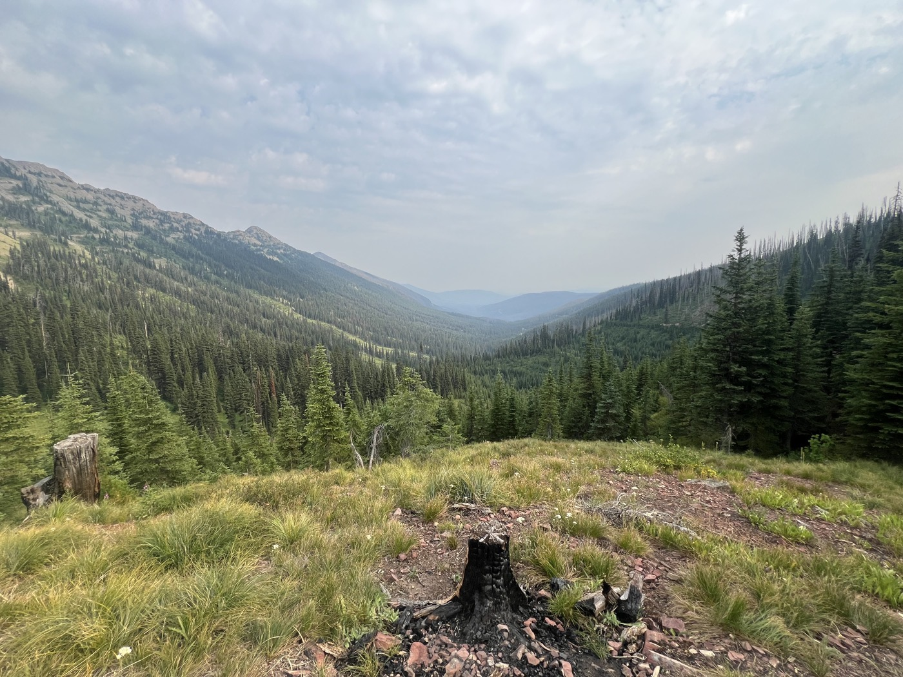
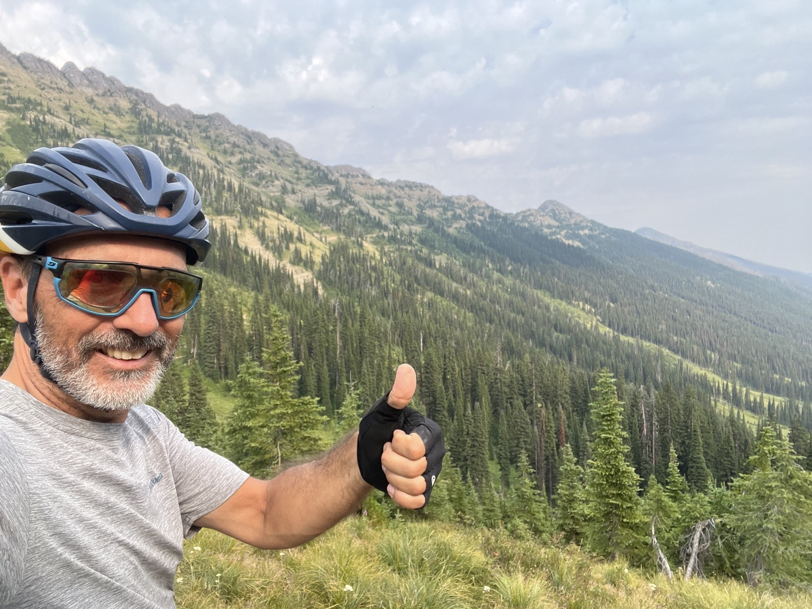

# 2075mD+

<figure markdown>
{ width=“300” }
</figure>

Je poursuis ma route, toujours sur gravier et sans passer aucune ville. Je vise Seeley au bord d'un lac. Gros dénivelé : je passe les 2´000m de montée en tout (Dénivelé+). Je me dépêche tellement d'arriver que je manque la sortie et termine à nouveau dans un camping sauvage. Une famille de lièvres m'accueille - il y a une autre tente avec une Canadienne. Ma plus grosse journée avec 8h15 en selle.

<!-- more -->

Je réalise que j'aime bien prendre mon temps le matin. Je pars vers les 10h du coup je me rends compte que même si je vais vite, je mets longtemps à rattraper mes 2 Américains matinaux. Je suis sûr que La Fontaine faisait du vélo 😉! Demain, c'est dit, je démarre à 9h!

Toute la journée est sur gravier et il y a 2 montées. Longues avec des parties raides. Je vais tranquille, vu la chaleur je trempe la tête dans les rivières et je fais le plein d'eau en la filtrant. Hier je l'ai pas fait mais l'Américain (toujours le même) m'a rappelé qu'il y a une bactérie qui prends 2 semaines à faire effet. Même dans l'eau de ruisseau en montagne. Bref, il faut être plus sage.

La 2ème montée est interminable et je puise dans les réserves. Récompense à la descente avec un single trail, une trace étroite et animée sur une longue descente. Sur la fin, tout a brûlé, je note qu'il y a peu d'animaux aussi.

J'ai tellement envie d'arriver que j'en oublie de regarder ma carte. Je loupe la ville de Seeley, tant pis je campe et mange du lyophilisé. Entouré d'une famille de lièvres pas peureux du tout!

<figure markdown>
{ width=“300” }

{ width=“300” }

{ width=“300” }

{ width=“300” }

{ width=“300” }

{ width=“300” }

{ width=“300” }

</figure>

