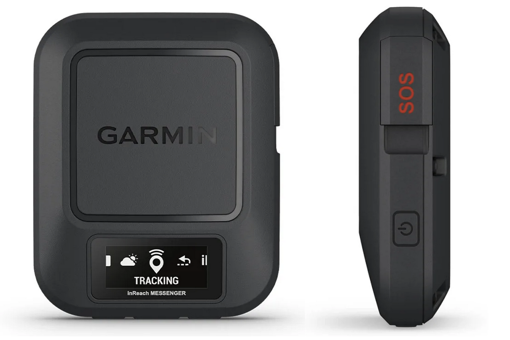

# GARMIN inReach/Messenger

Equipped with a [Messenger device] (https://www.garmin.com/en-US/p/793265) which is a GPS tracker from Garmin.

The device is sending a periodic signal (every 30 minutes but it is configurable with a trade-off for autonomy) which enables the remote geolocalisation. As a result, the position can be checked and my track can be looked-up.

In addition, the device has an emergency function which allows to call for help a/o rescue. GARMIN's helpcenter will then get in touch with rescue teams whilst sharing the localisation.

Additional features are also available, all via satellite (weather forecast, messaging). This particular device is very easy to use through the companion app on the mobile phone.

# LiveTrack Mapshare

If you click on the following link, you'll access a map that displays the trace and the last known location.

[LIVETRACK inReach](https://share.garmin.com/3f)