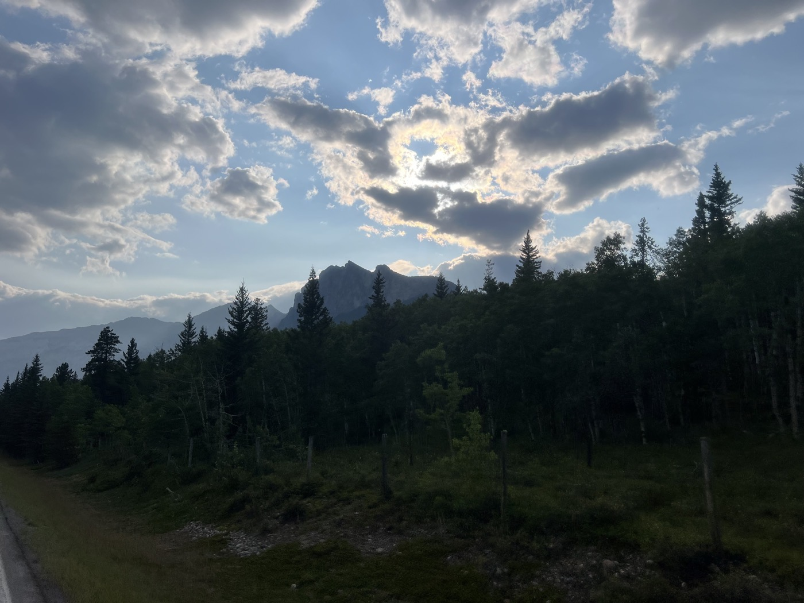

# 1. Not Showing Off on the First Day

<figure markdown>
{ width=“300” }
</figure>

Due to forest fires in Jasper, I decided to bike to Banff. But the acclimatization period is tricky. **30 km/h** headwind all day long... To reach the first parks and discover Canadian camping.

<!-- more -->

# Another World

Banff is actually the starting city I aimed for, the one that also gives the "Grand Departure" to the [Tour Divide](https://fr.wikipedia.org/wiki/Tour_Divide?wprov=sfti1) (the racing version of my GDMBR route). The departure takes place on the second Friday of June. There’s no specific logistics other than registering on TrackLeader with a GPS tracker and following the race rules (self-sufficient, any assistance must be accessible to all participants). The best riders go day and night.

In principle - 140 km on the road - that seemed doable to me. But not at all!

First: leaving Calgary was a bit (...) difficult. In Canada, bicycles are categorized as pedestrians. So the Komoot route has me following pedestrian paths. Pedestrian crossings, etc... at first, it was no fun.

Then - I hit the highway. Because in Canada, bicycles ride on the shoulder (how one goes from pedestrian to vehicle is quite transparent in this story). And you should see the size of what passes by at 100 km/h on a Friday night. By the way, the distances are in km on the signs?

Anyway: here I am on the highway, and I'm not getting anywhere. My bike already weighs a ton (I hadn’t trained much with extra weight). So the headwind (and gusts) is quite terrible. In fact, I have to pedal downhill to make progress. And in my mind, I see the goal Banff getting further and further away.

No problem, there are campsites along the way. But also many signs for [Stoney Nation](https://fr.wikipedia.org/wiki/Stoneys?wprov=sfti1) and First Nations. Prohibited access, no drugs. Charming.

I hang on and take a break at 2 PM. It’s the Olympic Games ceremony: I quickly watch the live stream while having some Pad Thai, and I see a blue man (painted blue) singing lying down. I didn't insist - I changed the channel. But Valérie tells me that the ceremony is great, especially the finale.

To top it off - I discover that all the campgrounds are "full." Well, often. Even for a bike with a one-person tent. The search for a camping spot is open! In the end, I discover the "first come / first serve" formula. We look for a spot, register (pen and form), and give our credit card number. Then the manager drives by and validates everything.

# Anecdote of the Day

I had spot 100. The campgrounds are actually huge, the spots are immense, the cars are enormous, etc... I had to occupy 10% of my spot (without exaggerating).

I return from the restrooms, and a lady with two children that I pass says to me: "Just so you know, we just saw a bear at spot 96." So, four spots away from my tent! I ask if there are any guidelines in this case. The answer is to shout and have bear spray. Well, I specifically came to the campground because I didn’t have (yet) my spray!

End of the story: the campground staff passes by, checks my spot registration, and casually mentions that there's a bear roaming. And they sell me a spray. With a payment terminal in their car... they are formidable indeed.

I fall asleep at 1300m - the temperatures are cool.

<figure markdown>
{ width=“300” }

{ width=“300” }

{ width=“300” }

{ width=“300” }

{ width=“300” }

{ width=“300” }

{ width=“300” }

{ width=“300” }

{ width=“300” }

{ width=“300” }

{ width=“300” }

{ width=“300” }
</figure>
