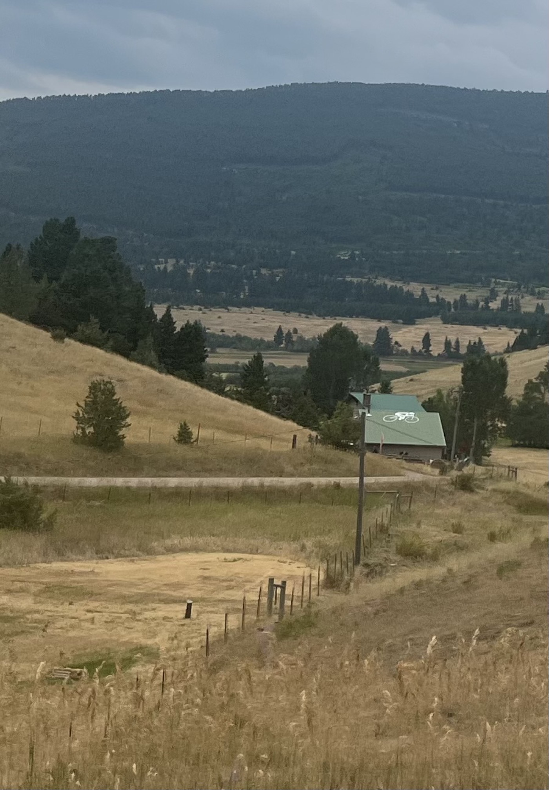
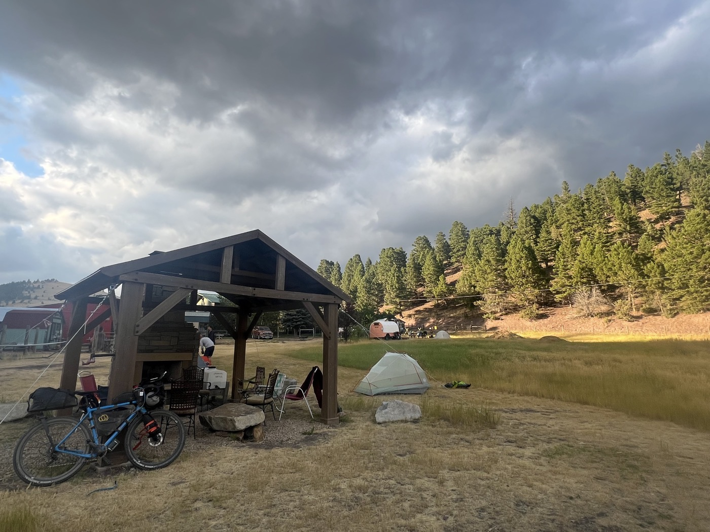

# Alpaca Farm 

<figure markdown>
{ width=“300†}
</figure>

I leave at 9:03 AM ☺️ and aim for the Lama Ranch—a must-stop on the Divide. I plan to spend a rest day there. To get there, I have to detour around the fire via the highway. Then there’s one last big climb just after Lincoln, on gravel, of course.

<!-- more -->

I enjoy my first stop in Ovando for a proper breakfast. Omelette, sausages, bowl of fruit, pancakes. It’s incredible how much energy biking requires; the ladies at the service look wide-eyed. Plus, the place is typical; I see the first cowboy hats. The whole village gathers after church. At the same time, it’s drizzling a bit.

I continue on the highway in the rain for 40 km. It’s intense; big trucks pass by at 70 mph / 110 km/h. Sometimes they come really close, especially when there’s a guardrail. I comfort myself by saying that I did well to take my rear red light to be highly visible. I push on the pedals.

After three-quarters of the journey, I stop to drink. I want to admire my beautiful rear light. But lo and behold, it’s dead. The battery is empty. I realize that sometimes we base our hopes on illusions...

I arrive in Lincoln; a large campsite has been set up for "firefighters." It now spans 73 hectares and is growing. I hope the rain will help. Visibility has been poor in recent days, but the air quality remains okay.

I call the Lama Ranch—now Alpaca—to announce my arrival. It’s a very well-known place. They offer everything. The cabins are occupied, but I can pitch my tent. I step on the gas for one last climb (which ends at over 10%), the descent is beautiful, and I almost arrive without pedaling at Barbara and John’s. In 2023, they hosted 662 Divide cyclists. Everything is provided; I’ll tell you more tomorrow...

I find myself in a community; we talk bikes, coffee, and tips. The place is 👍. I’m not far from Helena, but still far from leaving Montana.

<figure markdown>
{ width=“300†}

{ width=“300†}

{ width=“300†}

{ width=“300†}

{ width=“300†}

{ width=“300†}

{ width=“300†}

{ width=“300†}

</figure>
