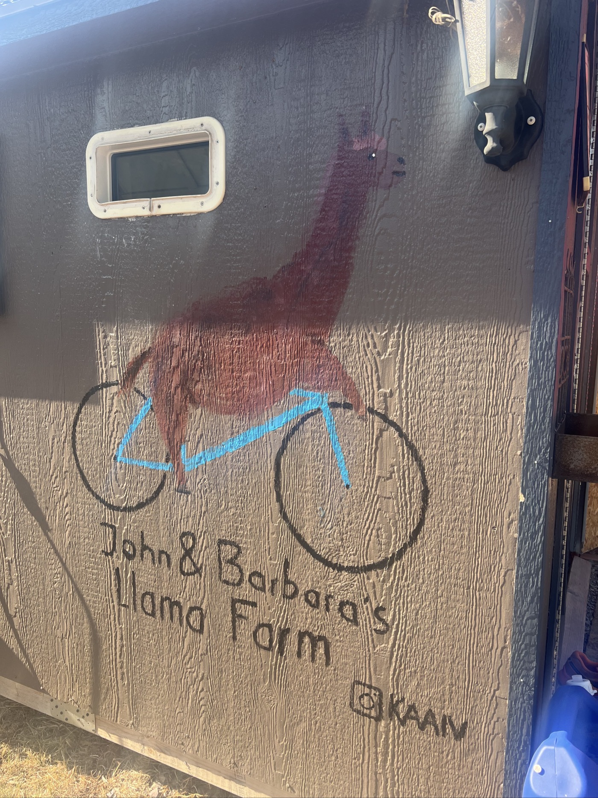

# 11. The 1,000 km mark

<figure markdown>
{ width=“300†}
</figure>

Rest day. Sunny and super peaceful. A time for exchanges and sharing with other cyclists. The hospitality is fantastic, and the place is magical. My odometer shows 1,046 km since Calgary: I’ve crossed the thousand mark 💪! I try to project the challenges and options ahead of me. Bike maintenance ✅. And most importantly, recovery 😌 before hitting the road towards Helena. In the end, there’s still a long way to go to leave Montana...

<!-- more -->

Today, I talk with Gabriel (CH), Sam (USA), John (USA), Kai (NL), Clotaire (FR), Franklin (USA), Canny (USA), Cathy, and Owen (USA). We’re all "SoBo," meaning South Bounders: we’re following the route from north to south. So, we’re doing everything in reverse of the NoBo. You following along? 😜

There are some great stories. Of course, there’s biking. But also other topics. With John, we discuss the USA. The concept of individual freedom, the fact that states can vote for laws that differ from federal laws (cannabis is legal in Montana). Even the mayor can still differentiate locally. This is especially true in "frontier states" like Alaska or Montana.

This flexibility and diversity allow many Americans today to choose a place that suits their aspirations. As a result, they move a lot. The sparsely populated states make a lot of effort to be attractive because more population means more federal weight. It resembles Switzerland but on a much larger scale, with only one language. It’s better to respect personal space: there are many “Private/No Trespassing” signs that must be respected here.

John, Kai, and Clotaire impress me; they’ve been nomads for years or for many years. John explains that in the USA, many people live in their “RV.” Recreational Vehicle, meaning American-sized camper van. Wikipedia confirms: 1 million Americans **live** in their RVs, out of 11 million RV owners. One million is the population of Montana...

Back to our Alpacas. We are at John and Barbara's. They met in 2015 when John was following the GDMBR as a NoBo. They are dedicated to creating this welcoming atmosphere. Everything is super well thought out—simple but great when you’re on a bike. There are several cabins, small independent houses (6) that can each accommodate 2 to 4 people. Otherwise, there’s camping. Each cabin has a kitchen and supplies. There are dry toilets outside and an outdoor shower facing the horses ☺️. The Alpacas roam around us. This morning, there were departures, and I chose to settle into the "Roter Schuppen" cabin, which just became available. The most beautiful one is “the Cabin.” I took some photos for you.

On the porch, there’s a fridge with a selection of cans and sandwiches. Everyone cooks for themselves—a simple and warm community spirit. We eat together. There’s a place to work on the bike; I attempt to clean it using a "sprinkler," which means a grass sprinkler that turns 360°. My bike looks great. I do, too, in the process.

Kai found a set of paints on the trail a week ago and created a mural. A bit of the blue from my bike will remain for posterity. Life is simple.

Clotaire is working on a film about his journey; I hope to share the link with you in a few days. He loves coffee and tattoos. He’s excellent at flying drones (and at coffee-making).

Everyone here has their own journey and follows their own path, and there is a lot of tolerance and mutual respect. I find it healthy.

I’ve rested well: tomorrow it’s back at it 💪! After a stop in Helena, I plan to continue to find a campsite.

Tonight it rains, but I have a roof over me! It will cool down in the coming days. It’s hard to take stock; there are still big steps ahead of me. More tomorrow!

P.S. EVERYTHING is free at the Alpaca farm. Thank you 🙏 John and Barbara. And thanks to everyone for the moments.

<figure markdown>
{ width=“300†}

{ width=“300†}

{ width=“300†}

{ width=“300†}

{ width=“300†}

{ width=“300†}

{ width=“300†}

{ width=“300†}

</figure>
