# Helena et Park Lake

<figure markdown>
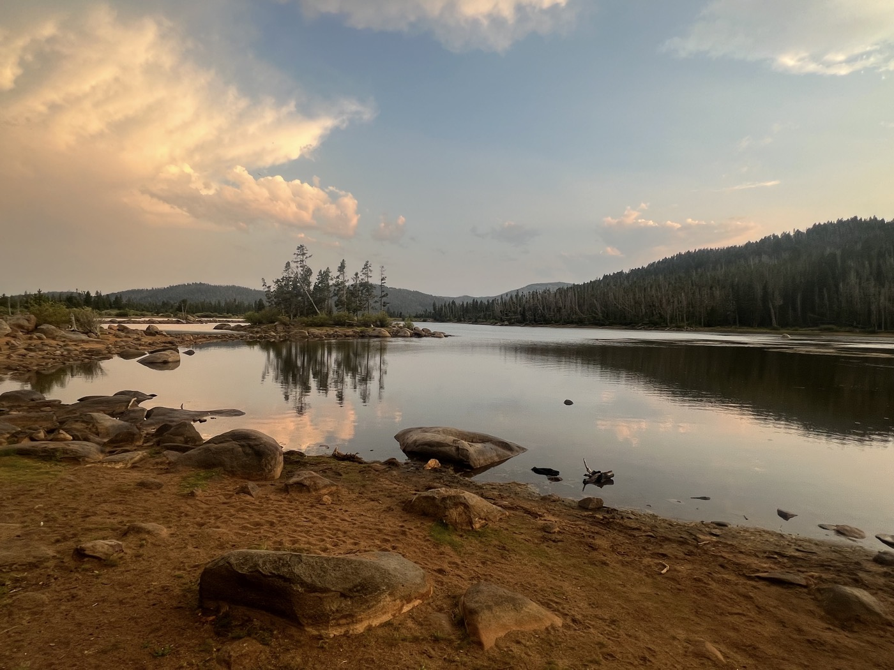{ width=“300” }
</figure>

Je reprends la route et retrouve vite mes marques. Le repos a fait du bien. J'arrive à Helena, je passe au bike shop pour faire un petit entretien. Puis je repars, pour arriver en fin de journée sur un lac sauvage magnifique et rien que pour moi 🤩. Météo capricieuse. 100km et 2'000mD+.

<!-- more -->

# Au revoir le Lama (Alpaca) ranch

Je tente mes premiers pancakes et je suis franchement content. Accompagné d'un café fraîchement moulu par notre  barista Clotaire. Que demander de plus pour entamer la journée. Évidemment un départ avant 10h n'est pas possible...
Je fais un big hug à chacun. Spécialement à John Keller notre hôte. 

# Le trajet

Première montée pour viser Helena à 60km. Surprise après 35mn, un orage de grêle soudain. Puis pluie et 15mn plus tard soleil? Que pasa?

La descente est un peu dangereuse, il y a des creux traversant très piégeux. Je dérape une fois. Je dois ralentir (j'adore les descentes). Les derniers kilomètres sont le long de l'autoroute mais il y a de la place et j'avance bien. Arrivée à Helena je suis un peu déçu. Je passe au bike shop, je retrouve John pour une bière Blackfoot (bière locale du nom de la réserve indienne proche) puis je repars. Je veux avancer et atteindre le lac Park Lake où on peut camper. Le lac est un bijou. Je me baigne bien sûr - il y a personne! 

# Côté vélo 

Nettoyage de chaîne et réglage dérailleur ont fait du bien au ranch hier. Les sensations sont bonnes aujourd'hui. Je prends moins d'eau en essayant de m'approvisionner au fur et à mesure. Du coup je suis plus léger 😉. Ça avance bien. À Helena je fais changer le fond de jante de la roue arrière. Hier, au soleil, le liquide sortait par les trous des rayons et le long de la jante 😆. Choc. Ça tenait encore mais je préfère pas prendre de risque. Le bike shop s'appelle The Garage. Ils m'ont pris de suite - vélo prêt et nettoyé en 45mn. Génial. Je vous ai aussi mis une photo de ce qui s'appelle "washboard". C'est la piste qui fait la tôle ondulée. C'est horrible en descente, tout le vélo tremble et on peut difficilement freiner, il y a pas de contact. Très très désagréable!

# Pensées du jour

J'apprécie d'avoir pu prendre la distance. Beaucoup de choses ne me manquent pas du tout. Les essentiels demeurent. La famille, les enfants, ma foi, les amis. Je passe mon temps à réfléchir l'esprit beaucoup moins pollué. Cela fait de la place et un sentiment de liberté grandit chaque jour. Les paysages aident...

Il reste le défi sportif aussi. Pour arriver à rouler et traverser les US en 30 jours, il faut rester focus. Tous ceux que je rencontre prévoient le double. Certaines bonnes idées ne sont pas assez utiles... je les laisse pour plus tard. Il y a un espèce de filtre qui s'installe et cela me permet de rester serein aussi.

À demain!

<figure markdown>
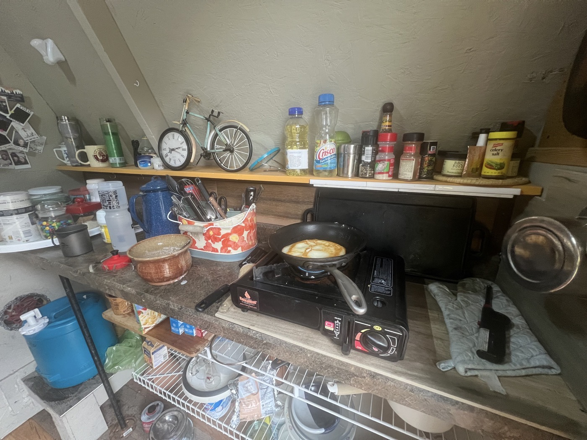{ width=“300” }

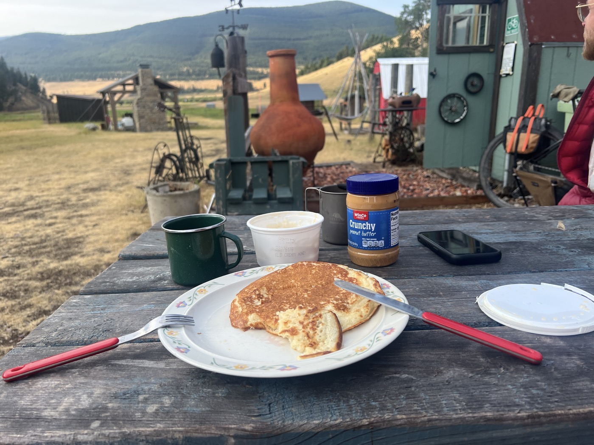{ width=“300” }

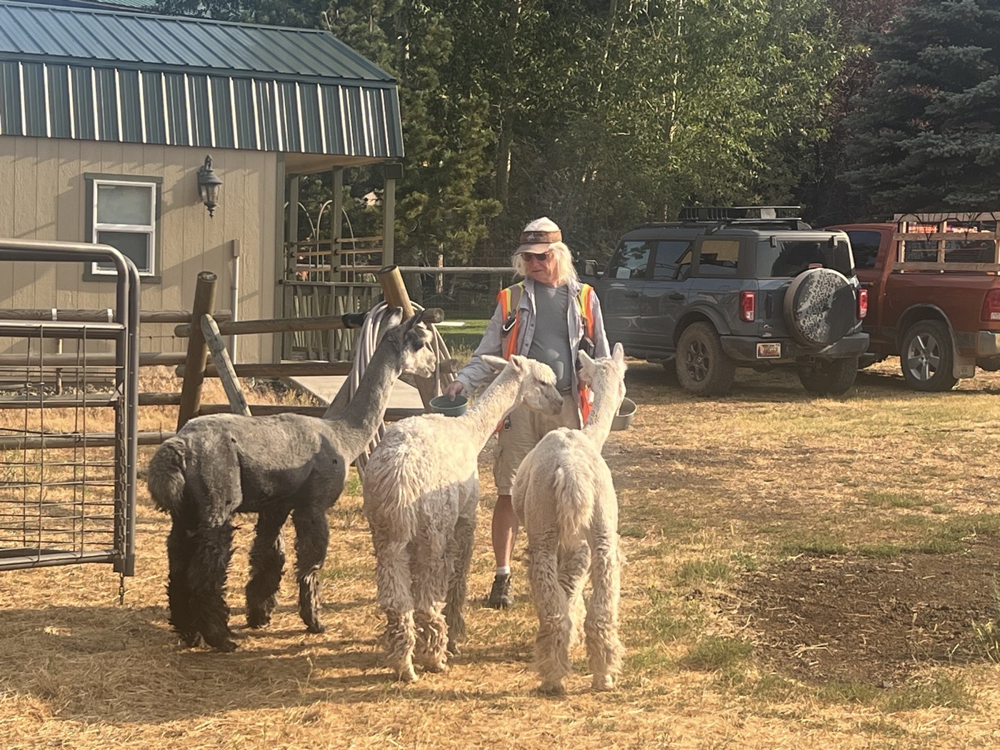{ width=“300” }

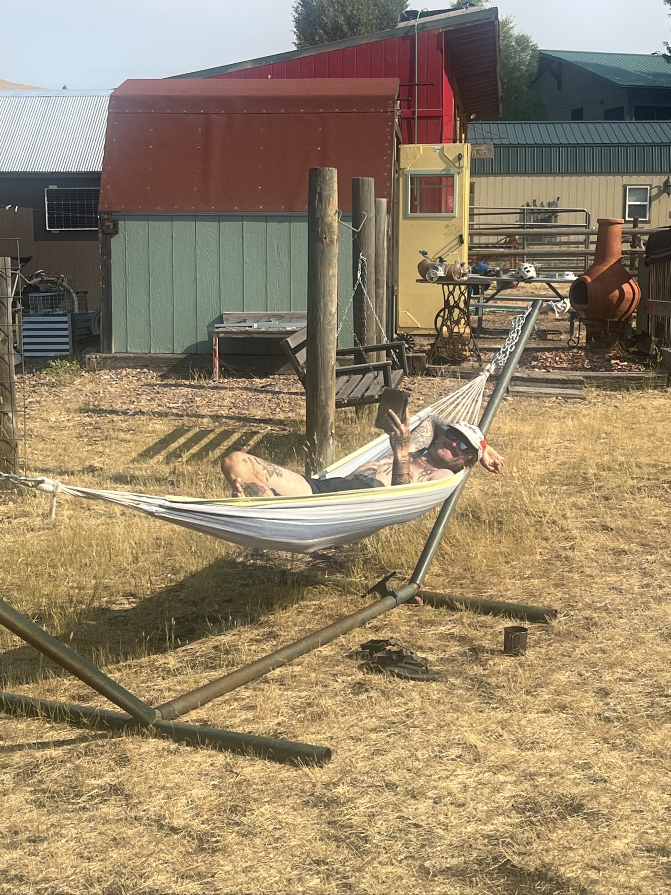{ width=“300” }

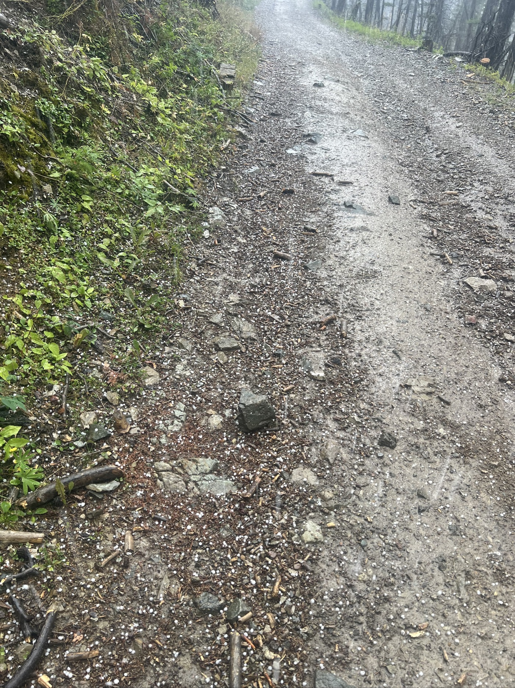{ width=“300” }

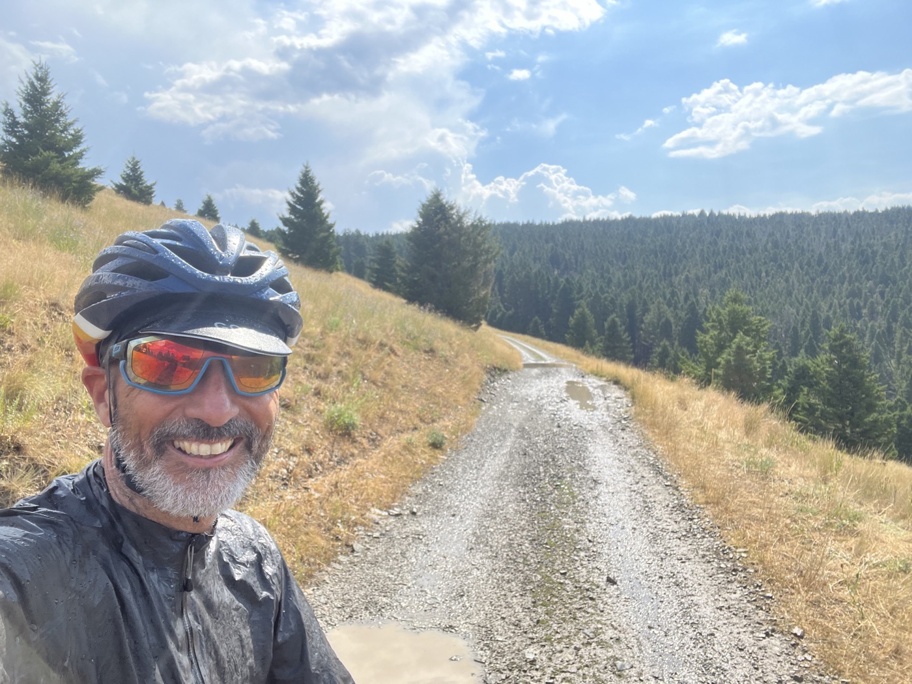{ width=“300” }

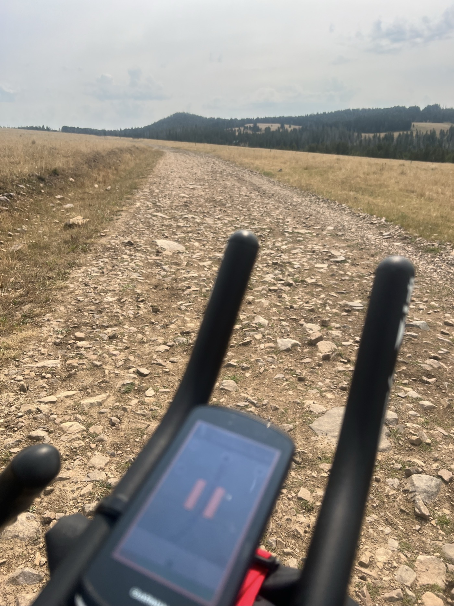{ width=“300” }

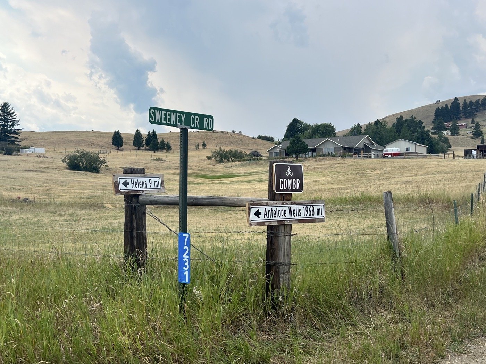{ width=“300” }

{ width=“300” }

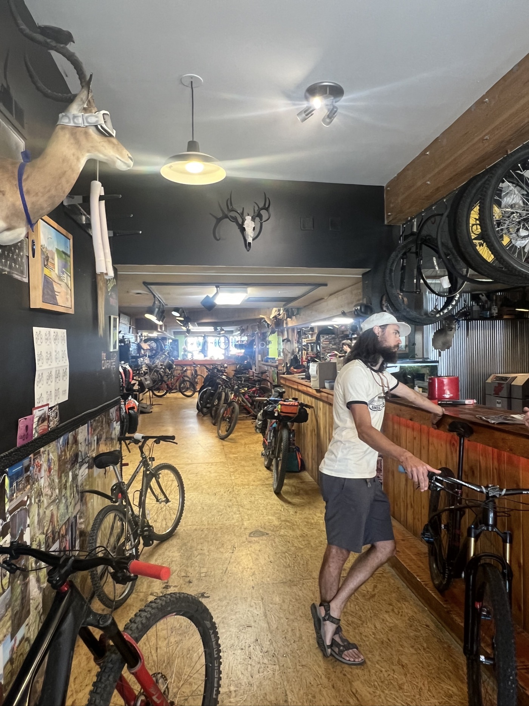{ width=“300” }

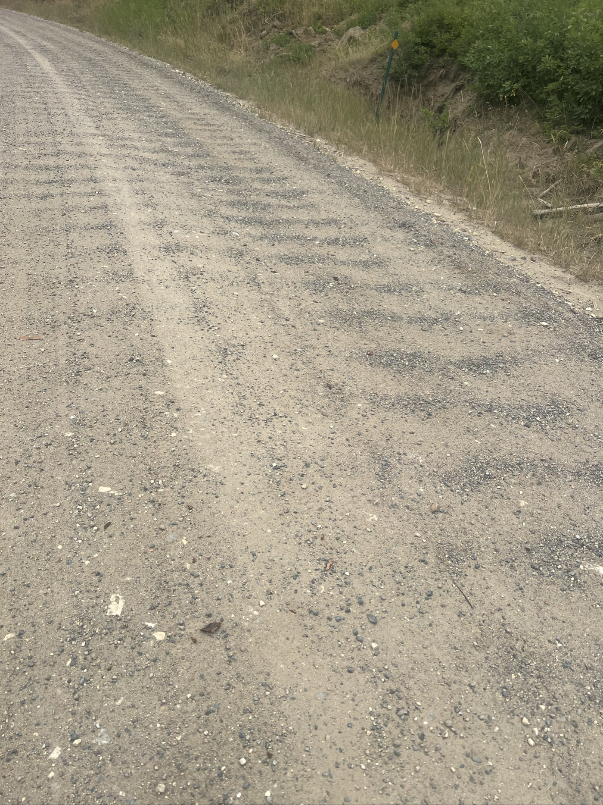{ width=“300” }

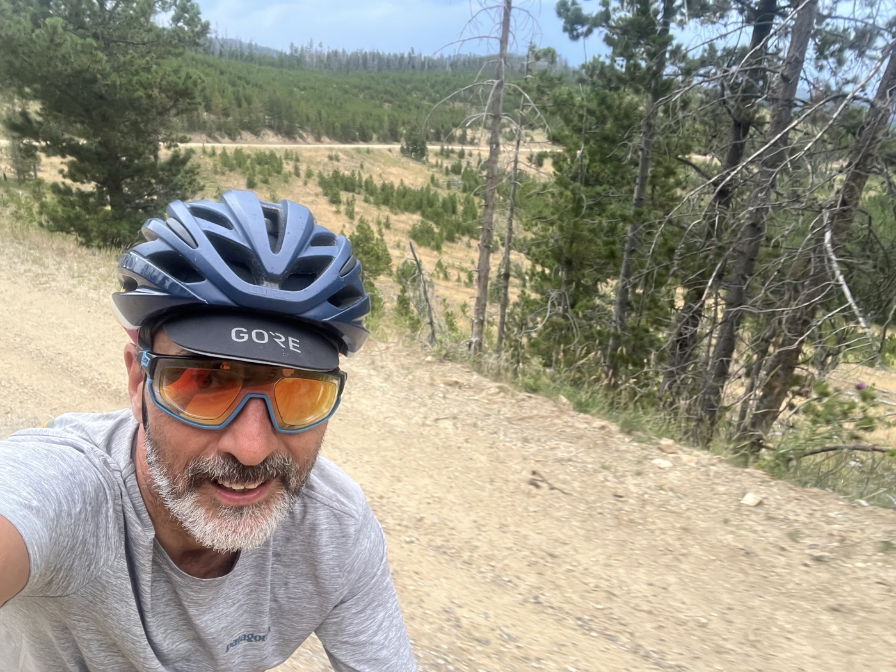{ width=“300” }

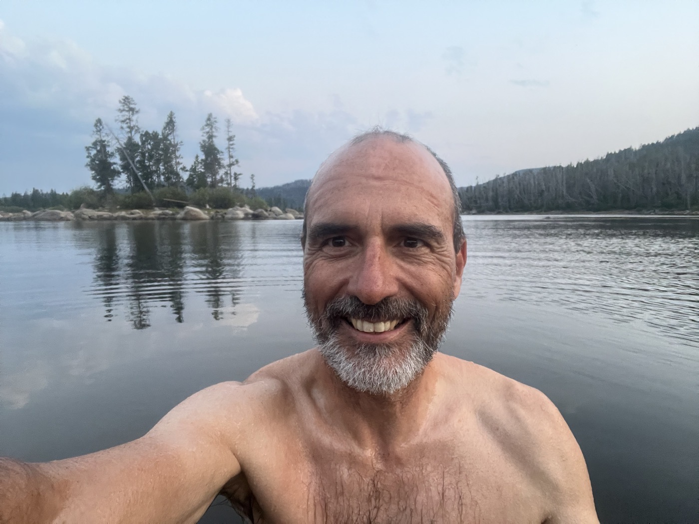{ width=“300” }

</figure>

