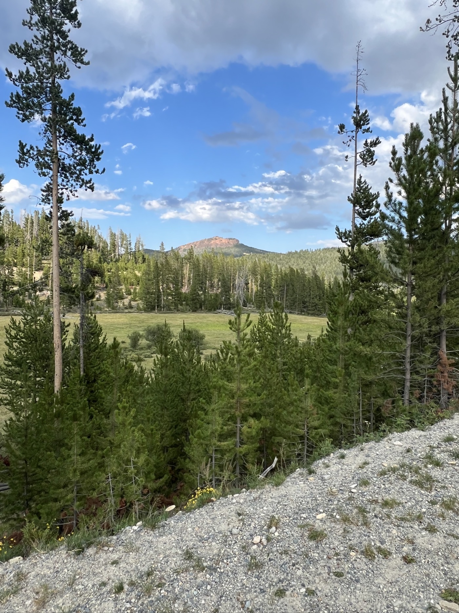
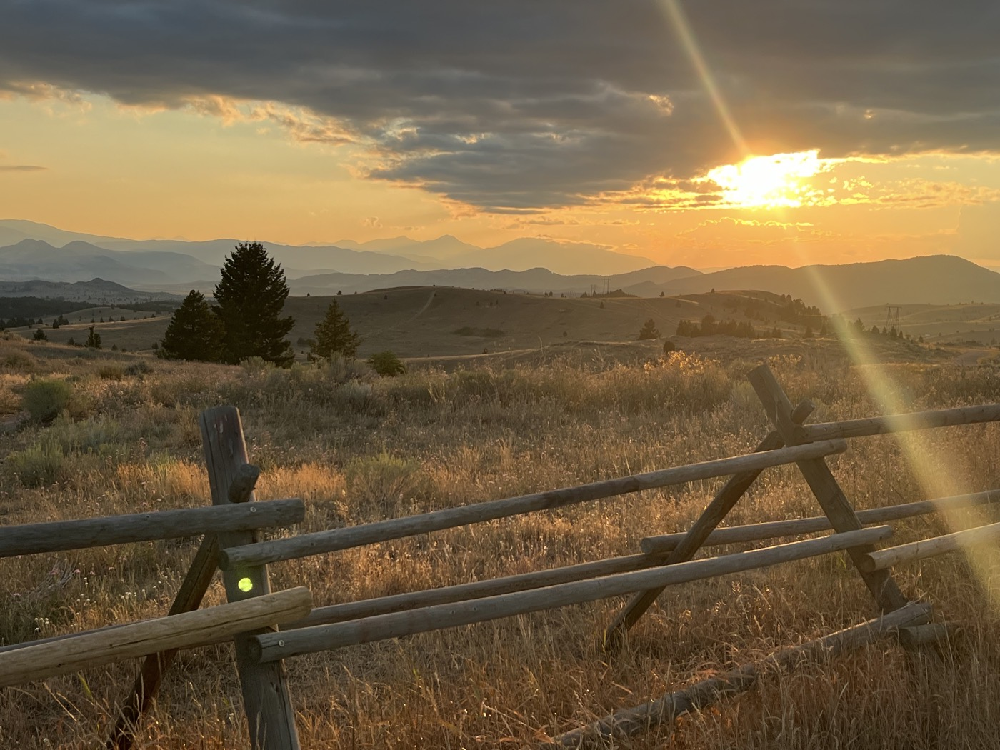
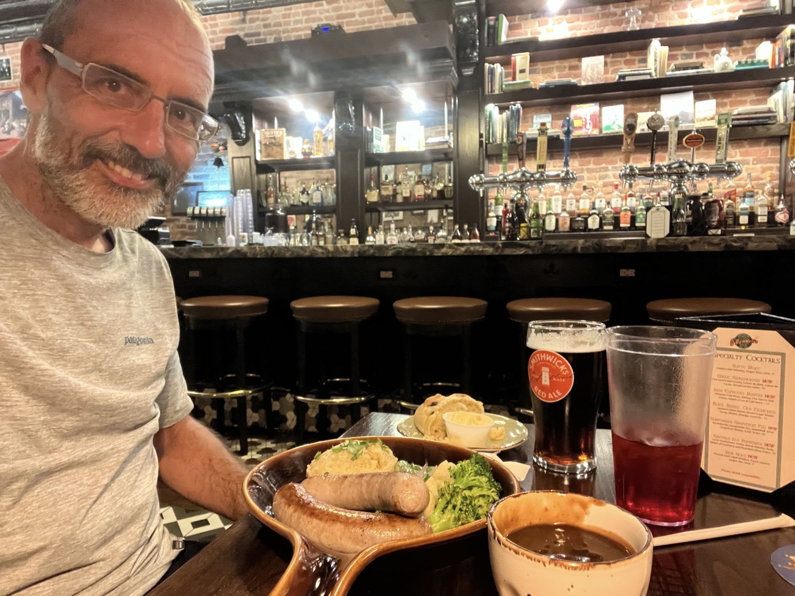

# Lava Mountain and Butte

<figure markdown>
{ width=“300†}
</figure>

I leave my lake in the fog to tackle Lava Mountain. It’s a tough stretch, so I stop in Basin to regain my strength. I continue on to Butte, arriving as night falls. I book a room—I need a bath and a good night's sleep!

<!-- more -->

# Lava Mountain

I tackle the first climb, which on paper didn’t look too tough. But I quickly realize my mistake. There are big rocks, and the slope becomes very steep. It’s impossible to ride there! I get off and decide to push. My Garmin displays black (the color indicating slope percentage). In fact, it doesn’t even show the slope anymore. Even pushing is extremely tiring. I try to get back on the bike as often as possible to maintain a rhythm, but nothing works. The end gets better—I can finally ride again and pass a group of three who are also pushing.

I realize afterward that this section is one of the most difficult. And I took the alternative route. For the race, they go even further, and the path is completely impassable, filled with large stones and logs to navigate on single track. You have to love it...

As a result, I’m ravenous and stop in Basin for a burger. In fact, that was also my breakfast. Bad idea. I hit a major slump; the digestion is too heavy. I barely make it 15 km before stopping. I take a 30-minute nap. I feel better, but it’s not ideal.

# Butte

I aim for Butte, which is comparable in size to Helena. I arrive late—my average speed is really not great. I book a room at 8:30 PM; I’m recommended the Irish pub ☘️ Shawn O'Donnell's. Super authentic, but it closes at 9 PM. I hurry, and upon entering the pub, I enter another world. I have Bangers & Mash with a 🍺 Smithwick's—the Celtic music sets the rhythm. I feel better.

Butte is a mining town, and you can still see the infrastructure. It also hosts a large Irish community. I plan for a hot bath and a big night because the next few days will be wild. In any case, it’s three nights under the tent and only one resupply point. I might not have any network. I also think I’ll take it a bit slower—I’ve realized that Montana is part of the course's challenges. We learn 😉.

Tomorrow is Fleecer Ridge. I hear the descent has a 30-degree slope. I imagine having to make foot conversions!

<figure markdown>
{ width=“300†}

{ width=“300†}

{ width=“300†}

{ width=“300†}

{ width=“300†}

{ width=“300†}

</figure>
