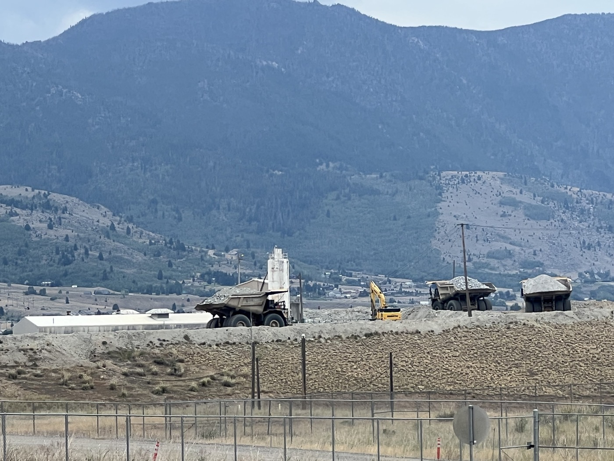
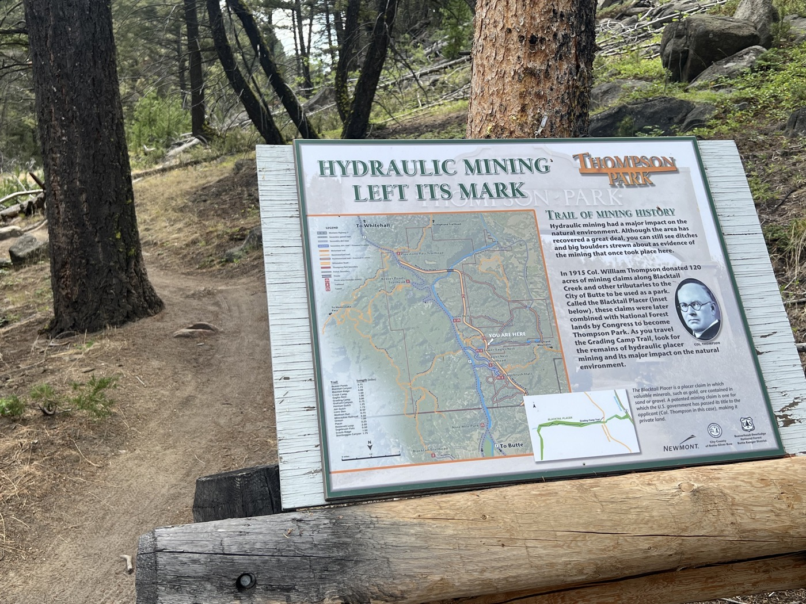
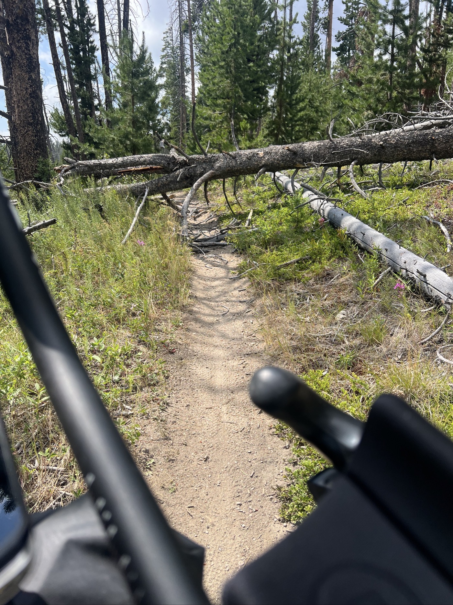
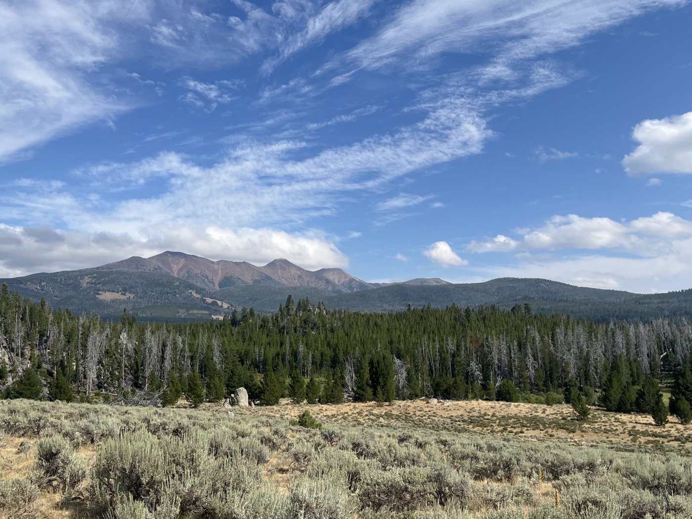
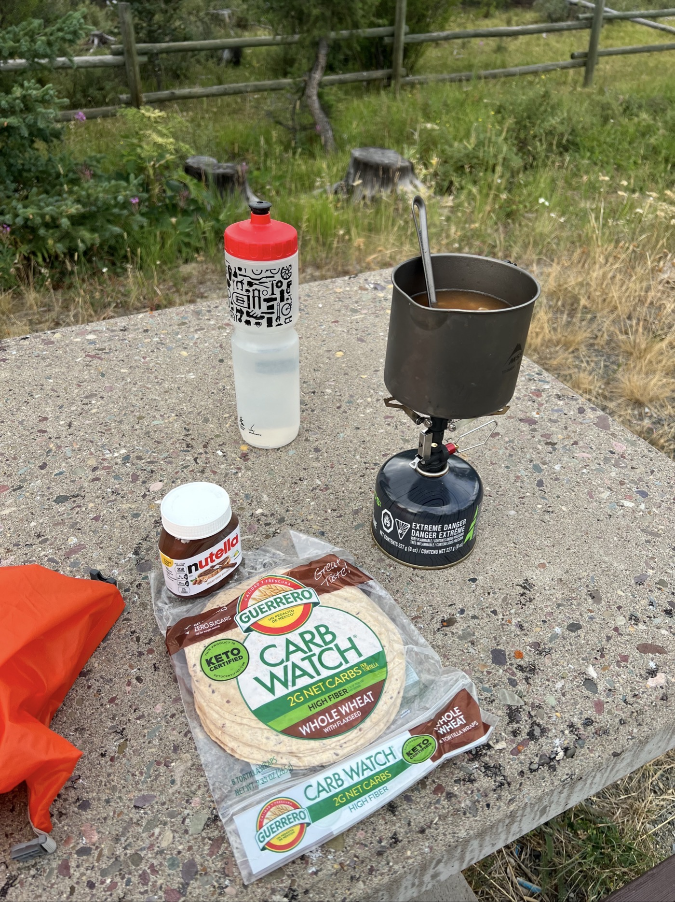

# 14. It's been 2 Weeks

<figure markdown>
{ width=“300†}
</figure>

I leave Butte after doing my shopping for 3 days and having breakfast. I still see mining activity. I ride for a good while, then it’s off to single track in Thompson Park. I start the climb to Fleecer Ridge, but my legs won’t cooperate. I choose to postpone the tough part to tomorrow.

<!-- more -->

# Leaving Butte

Butte is an open-pit mine. There’s still activity; I see little brothers of Titan transporting ore. It’s strange how the ores form color layers as if they don’t mix. I push a bit to keep moving but get a strong headwind. I have to adapt.

# Thompson Park

The route takes us through this park. Beautiful, fun single trail, but these little hills are tiring my legs a bit. Thompson did hydraulic extraction here (to mine gold and precious minerals). The park exit takes me on a nice downhill track, and I pass two other Dividers (those doing the Divide). That’s motivating!

# My Legs Give Out

I start the climb to Fleecer Ridge, 15 km of ascent. An average slope of 5%, but once I get past the start (green area), the incline only increases (I’m starting to know the drill). I don’t want to tackle the difficult sections in the dark, and I’m exhausted. Coincidentally, a camping option appears. I hesitate and then choose to stop. I realize I have a burning sensation in my backside, and my digestion isn’t great either. I plan for a big night, hoping tomorrow will be better. It’s tough, but it’s okay to take it easy.

<figure markdown>
{ width=“300†}

{ width=“300†}

{ width=“300†}

{ width=“300†}

{ width=“300†}

{ width=“300†}

{ width=“300†}

{ width=“300†}

</figure>
