# Fleecer Ridge

<figure markdown>
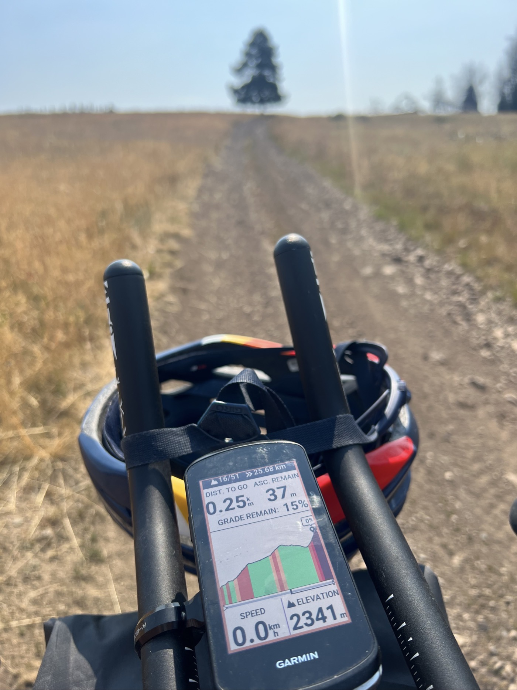{ width=“300” }
</figure>

This time I tackle Fleecer Ridge. It’s crazy (especially the descent). I arrive at Wise River to follow a beautiful river, this time on the road (my backside appreciates it). Camping at Elkhorn Spring. A hot spring nearby. It’s tempting because it’s cold at 2,300 m. But I prefer to rest.

<!-- more -->

# 15%

I start the second part of the climb; it’s going well. But I see the final jump coming—10%, then 11%, then... 15%! Let’s just say I push the bike on foot, but it doesn’t budge.

It’s mainly the descent that’s scary. At first, I’m careful, and I can manage it on the bike. But the slope steepens, the terrain is super loose, and there are rocks too. I finish with 2 conversions in the grass; I almost wiped out 3 times, though. For NoBo (North Bounders going the opposite direction), I hear they have to drop their bags and make the climb in multiple stages. It’s said the slope is 30%... I wonder how they manage it during the race?

# Pizza

I arrive at Wise River, and I get a pizza. I’ve learned: I eat a small quarter and take the rest with me. It’ll be a change from my noodles.

Around here, there’s still a fire, but it’s under control. All along the road, they’re cutting down trees to prevent it from rekindling and/or spreading (I theorize). In the end, a bit of road feels good; I manage to cover 80 km and over 1,000 m of elevation gain.

# Camping

Anecdote: I barely arrive at the campground when an American calls out to me (from his little golf cart; in fact, he’s the caretaker). He tells me I don’t have to pay ($15) because Dividers deserve to be accommodated for free. Well, I can tell you, that feels great. I almost want to puff out my chest 😅. In general (also on the road), there’s a lot of respect shown for those who take on the Divide.

<figure markdown>
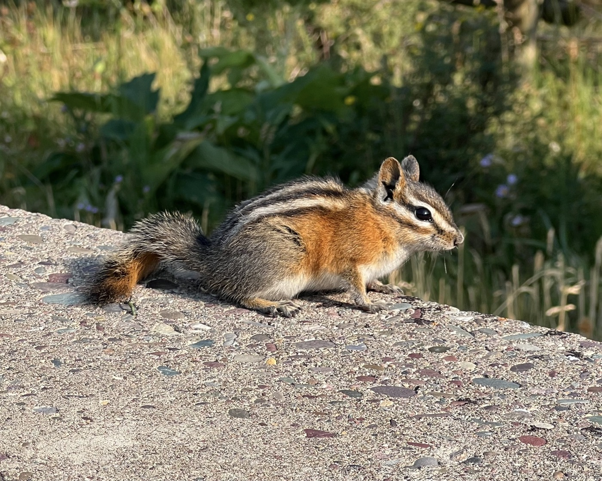{ width=“300” }

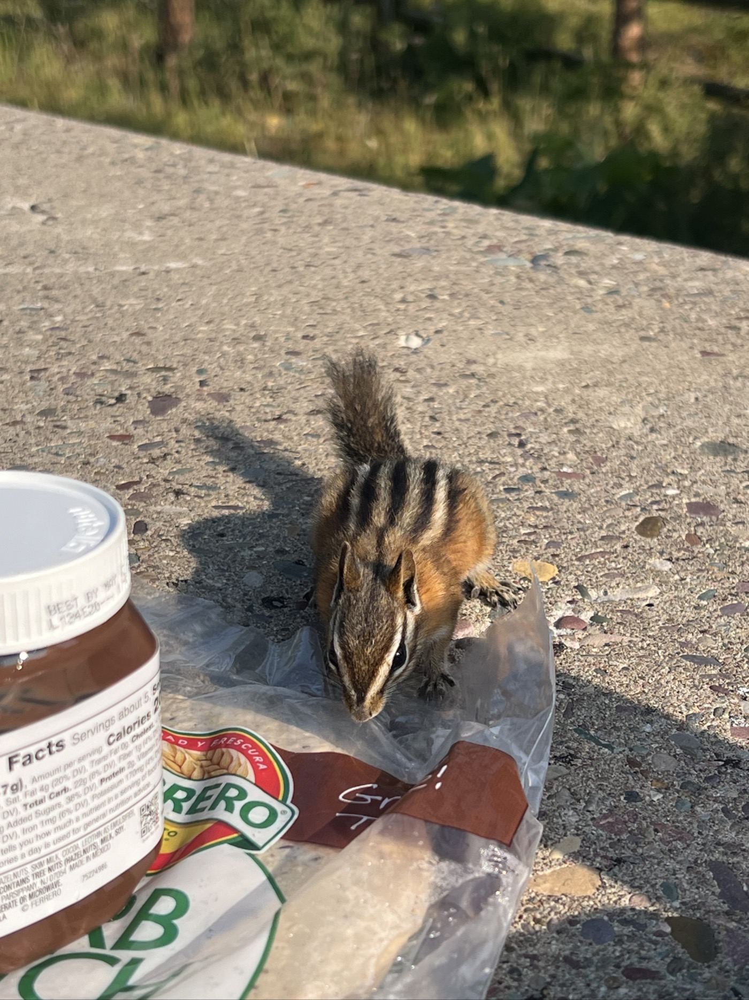{ width=“300” }

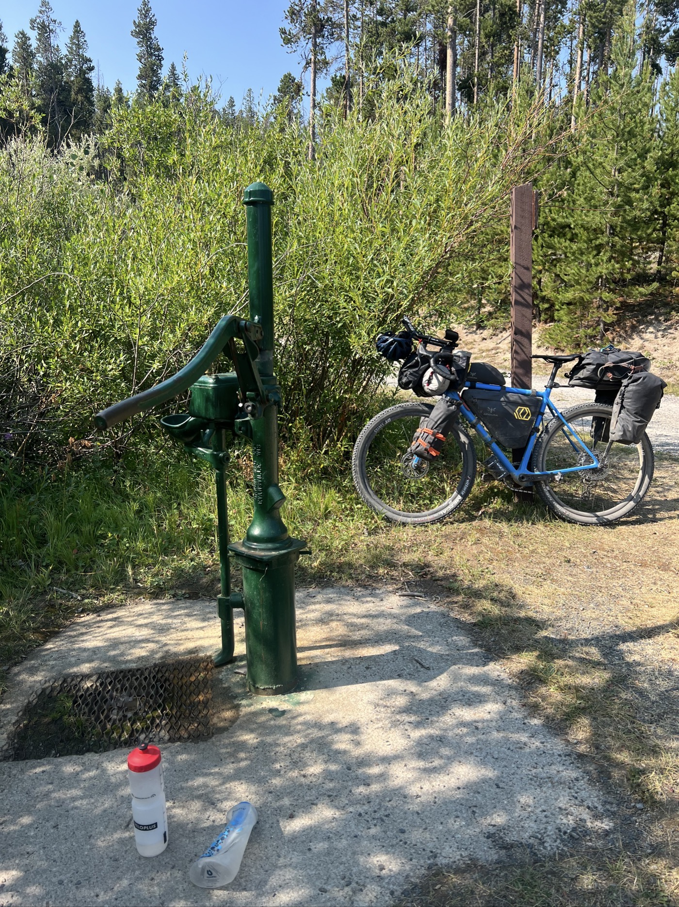{ width=“300” }

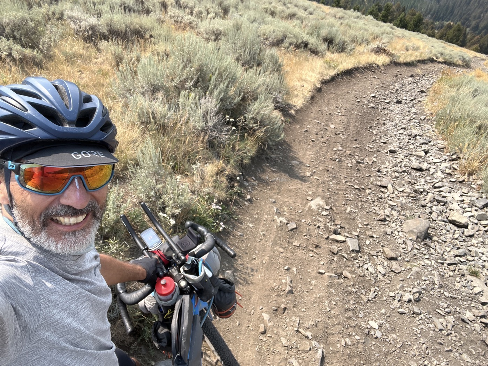{ width=“300” }

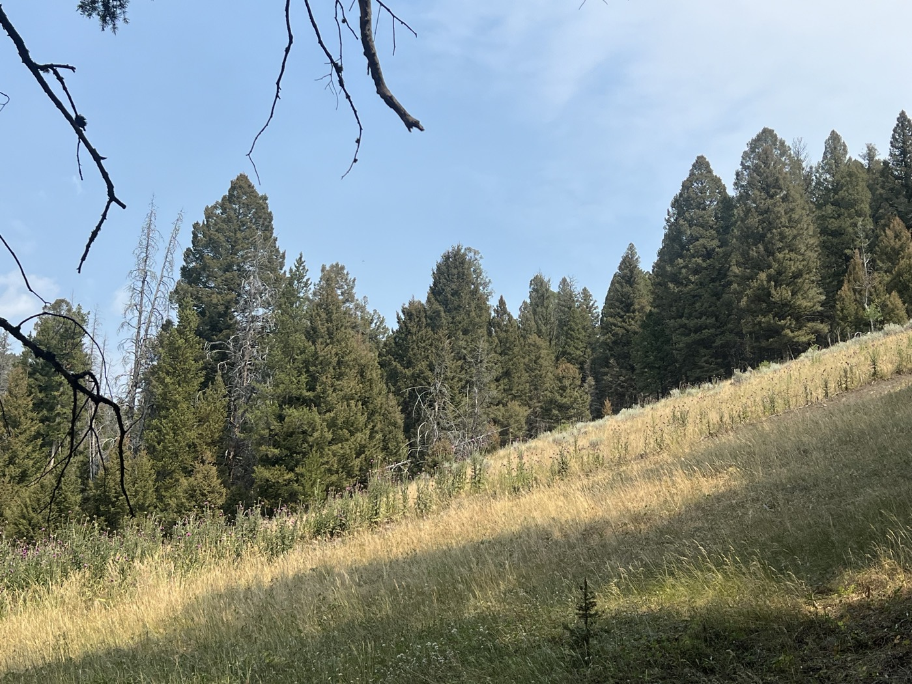{ width=“300” }

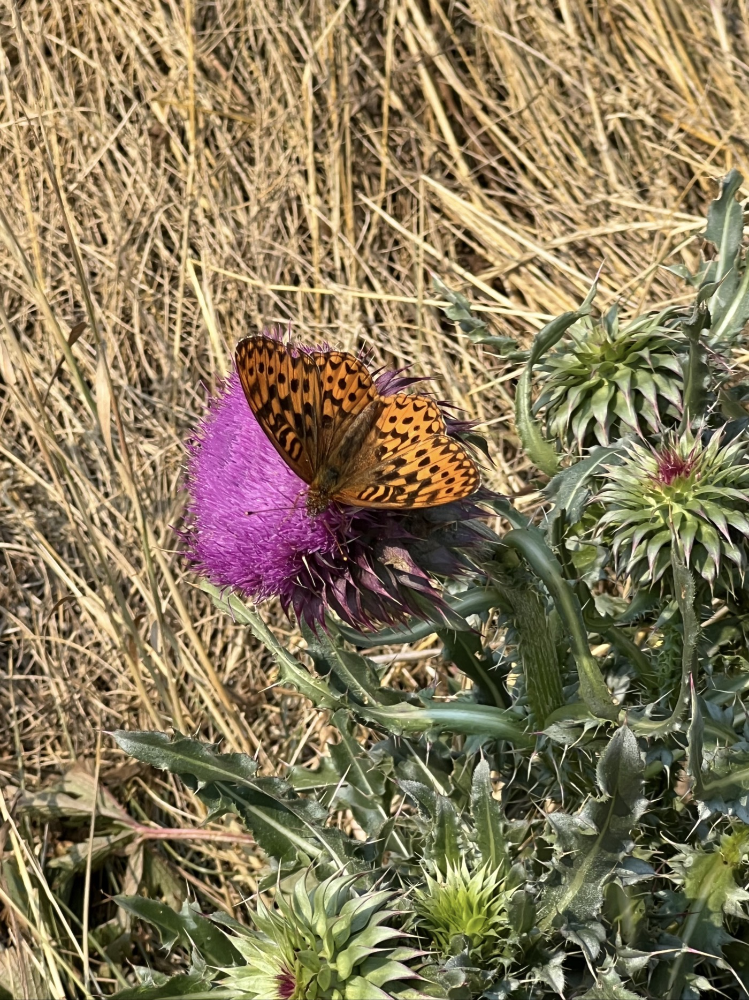{ width=“300” }

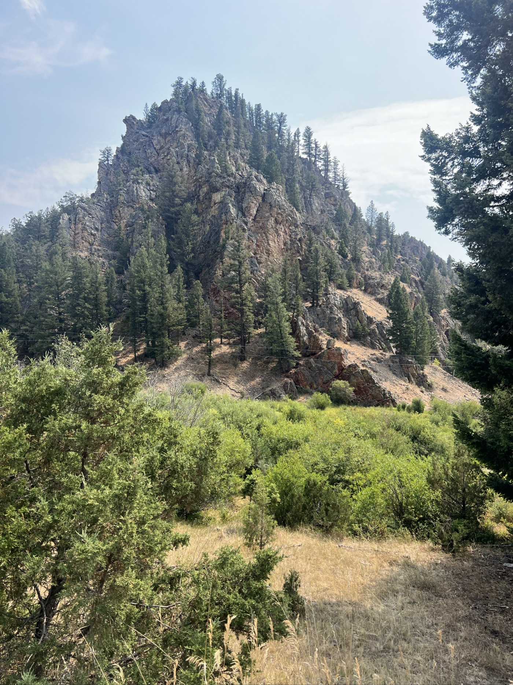{ width=“300” }

{ width=“300” }

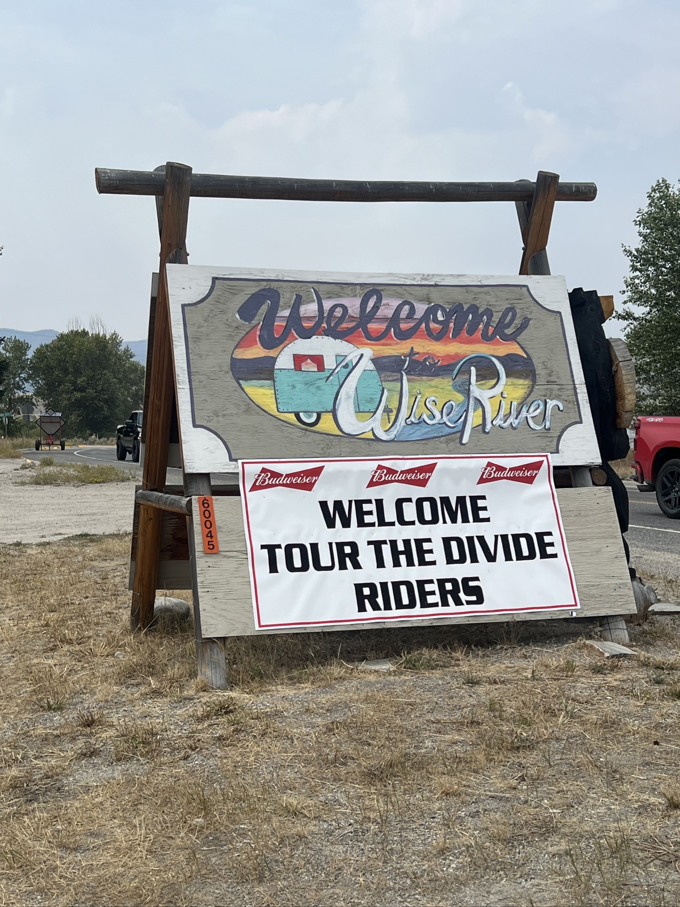{ width=“300” }

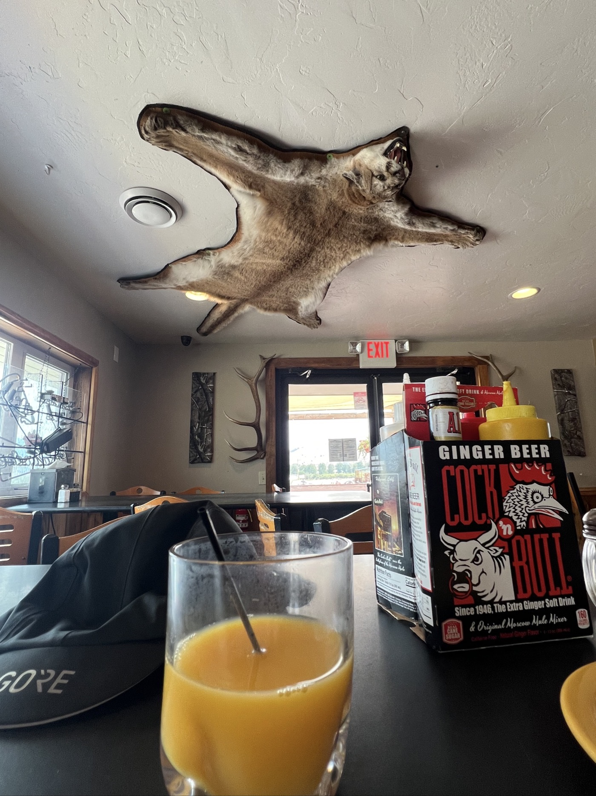{ width=“300” }

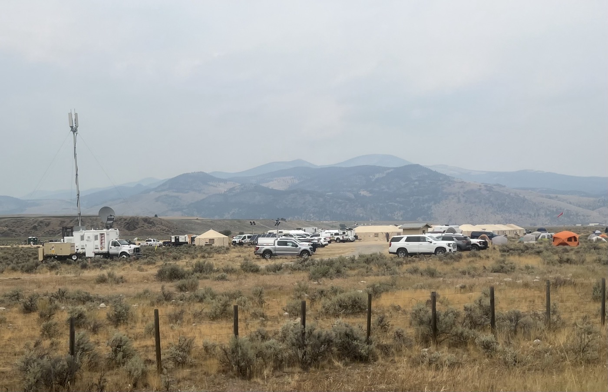{ width=“300” }

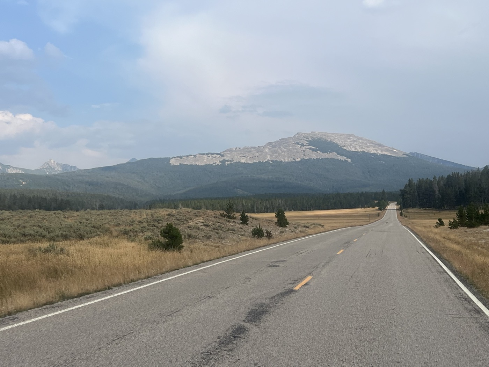{ width=“300” }

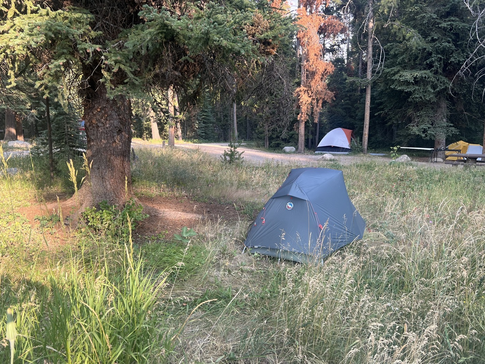{ width=“300” }

</figure>
