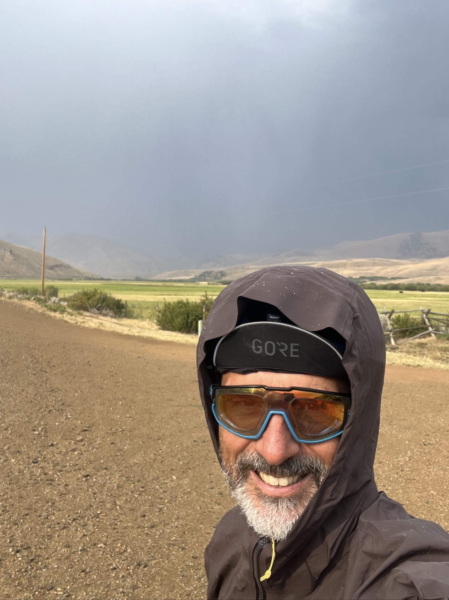

# 16. Storms

<figure markdown>
{ width=“300†}
</figure>

A restless night due to the storm; I dry my tent and set off. I stop at Ma Barnes, a little gem. After a good stretch on the road, it’s time for endless gravel. I’m making good progress; there aren’t any major climbs. I pitch my tent just before the hail starts falling. Phew!

<!-- more -->

# Restless Night

Seeing my tent illuminated by lightning with thunderclaps that make the mattress shake definitely wakes you up! I count the seconds; it’s very close. I feel like I’m in the heart of the action. Not super reassuring, but my tent is waterproof, and I’m surrounded by trees. Eventually, it passes.

# Ma Barnes

As expected, I’m quite lost, and this resupply point is very welcome. It’s a mini convenience store, but there’s an incredible variety in small quantities. I catch up on my breakfast with some juice, then chocolate milk. An apple and oatmeal will boost my energy. Unfortunately, there are no more gas canisters; another divider took the last one yesterday 🙃. The lady is super helpful; she really has (almost) everything in a small space. I notice the first Israeli flag outside.

# On the Road Again

The trail seems endless, but the landscape has changed a lot. You wouldn’t think I’m still at 2,000 m. It’s very dry, like garrigue. Sometimes it rains, and the difference is striking. I don’t see anything except a few cows. It’s still stormy, but very localized. I often escape the heavy rain. But at the end of the day, I take precautions. I pitch the tent and eat in front of a concert of lightning. I end up in the tent as it hails again! The temperature drops quickly 🥶.

<figure markdown>
{ width=“300†}

{ width=“300†}

{ width=“300†}

{ width=“300†}

{ width=“300†}

{ width=“300†}

{ width=“300†}

</figure>
