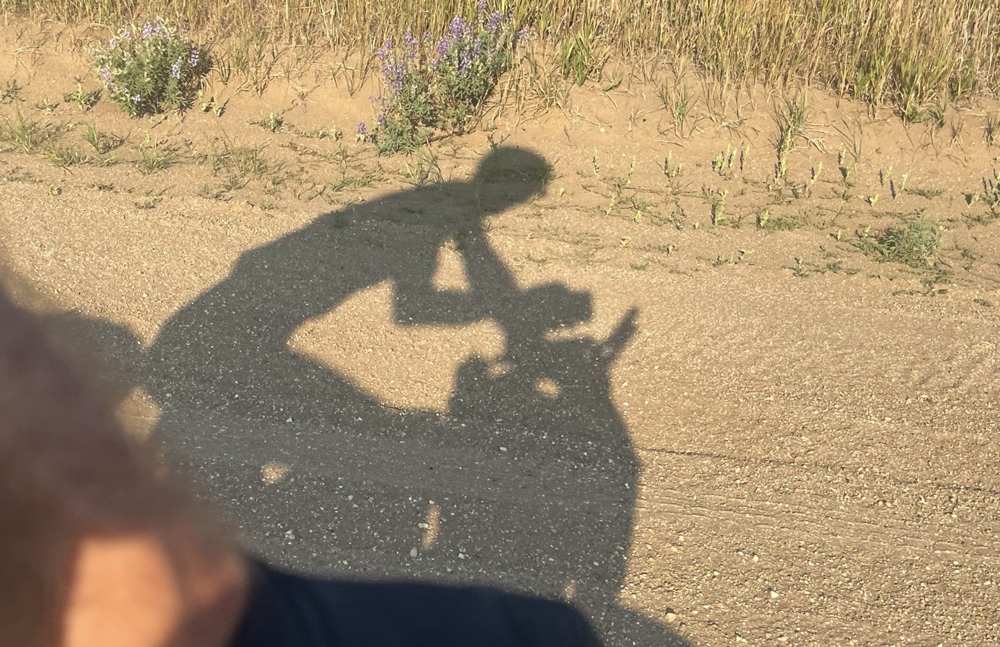

# Today is a Good Day

<figure markdown>
{ width=“300†}
</figure>

There was a storm during the night, but it’s beautiful upon waking. I set off, and for once, there’s no long exhausting climb. I can finally stretch my legs (130 km, 1,000 m of elevation gain). My legs are holding up, and the weather is fantastic. I am about to leave Montana for a brief passage through Idaho and then into Wyoming.

<!-- more -->

# Brave Big Agnes

I wake up in the night with the tent shaking all over the place. Strong winds and rain. It’s impressive to see how flexible the structure is; I worry about my stakes: will they hold? What’s my Plan B if the tent takes off? Well, it seems to be holding up, and as incredible as it may sound, I fall back asleep. Upon waking, it’s chilly, but I’m pleased to see that the tent is still securely attached and that the stakes are intact. A preview of Colorado, perhaps? Big Agnes (the brand of the tent, the most popular among Dividers) has proven to be brave. The tent is a super important element—it’s my refuge.

# A Route Made for Me

The trail has a profile of gentle hills. I encounter small climbs, nice descents that get me going, and long straight stretches. I pass through Cabesone Canyon, follow the Big Sheep River, and go through Lima. Great, I can buy some gas. I finish the day with a new wild bivouac at over 2,000 m in altitude. No signal, so updates will be delayed again. Since Butte, I’ve been self-sufficient; thankfully, I have batteries to recharge my phone and GPS (for 3 days).

# Anecdotes 

This is the first time I see firearms for sale at a gas station on the side of a highway 🤣. Of course, it’s adorned with hunting trophies. Otherwise, I have to acknowledge the cleanliness in all areas. Zero waste, with many signs inviting everyone to take everything back with them. This seems to be largely respected, and I adhere to the rule as well.

<figure markdown>
{ width=“300†}

{ width=“300†}

{ width=“300†}

{ width=“300†}

{ width=“300†}

{ width=“300†}

{ width=“300†}

{ width=“300†}

{ width=“300†}

{ width=“300†}

{ width=“300†}

{ width=“300†}

</figure>
