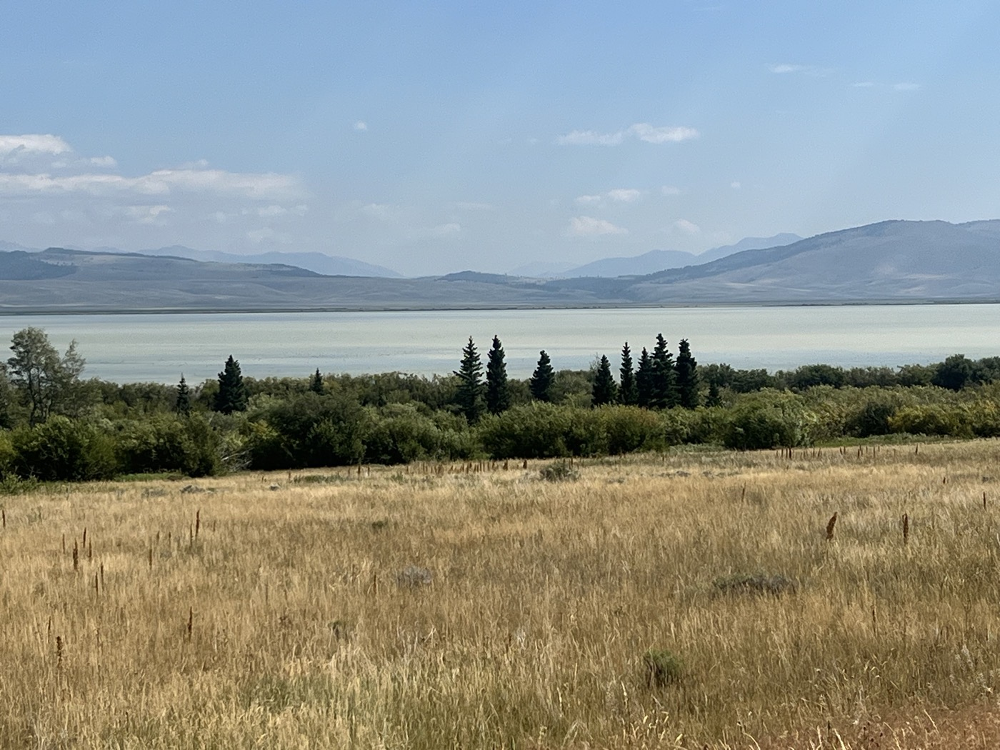
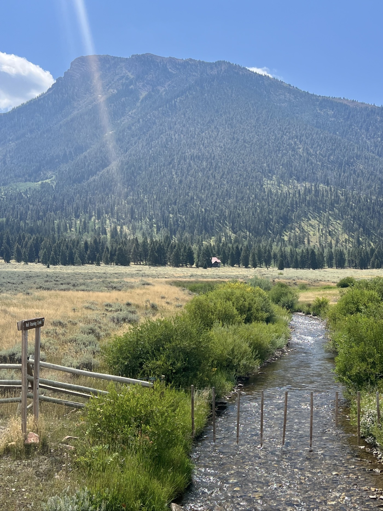
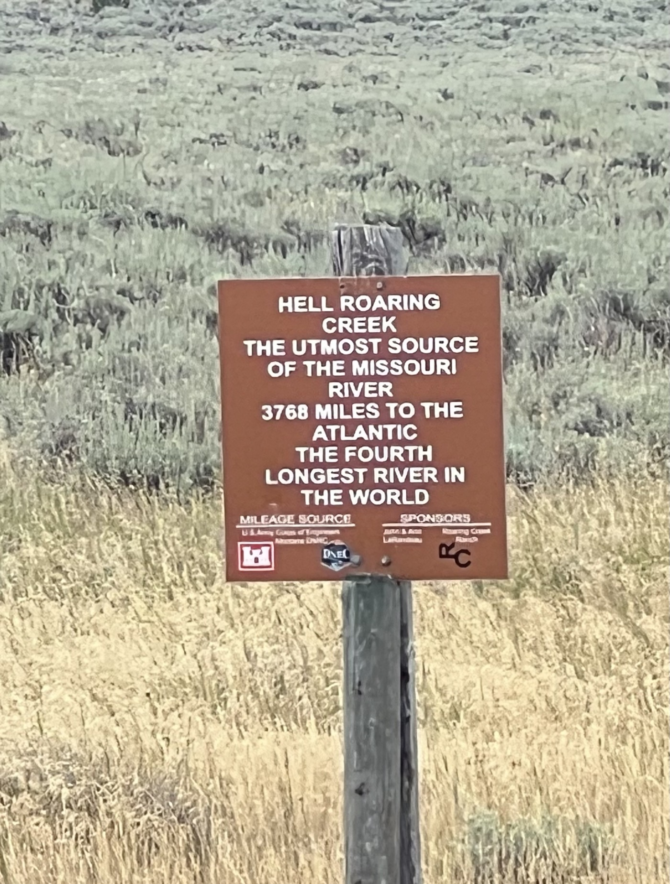
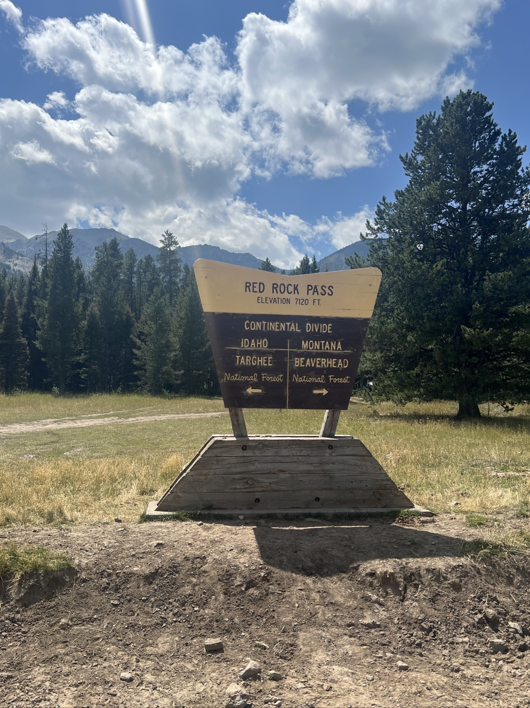
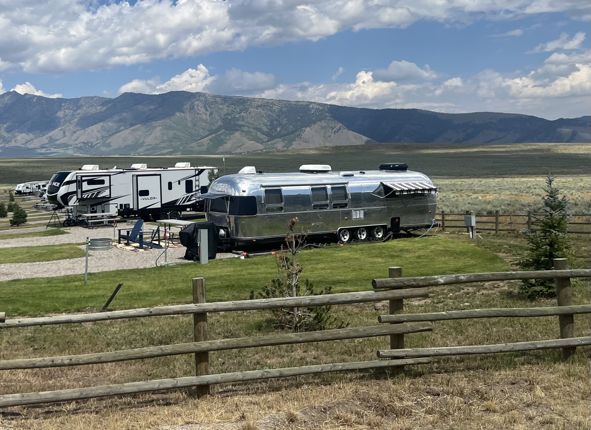
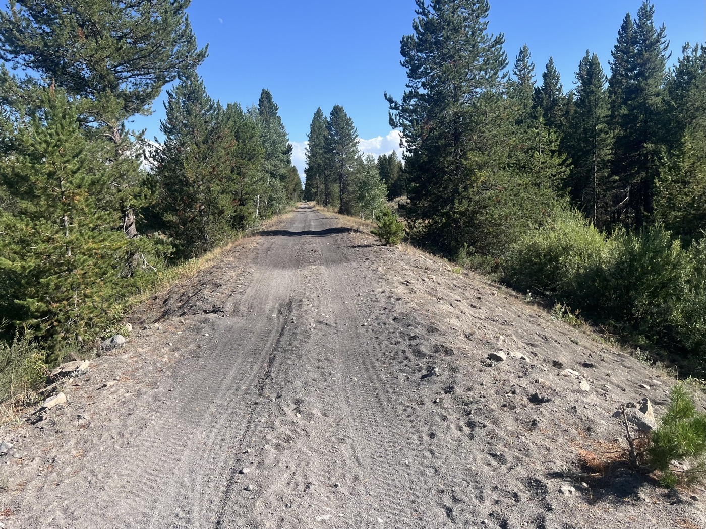
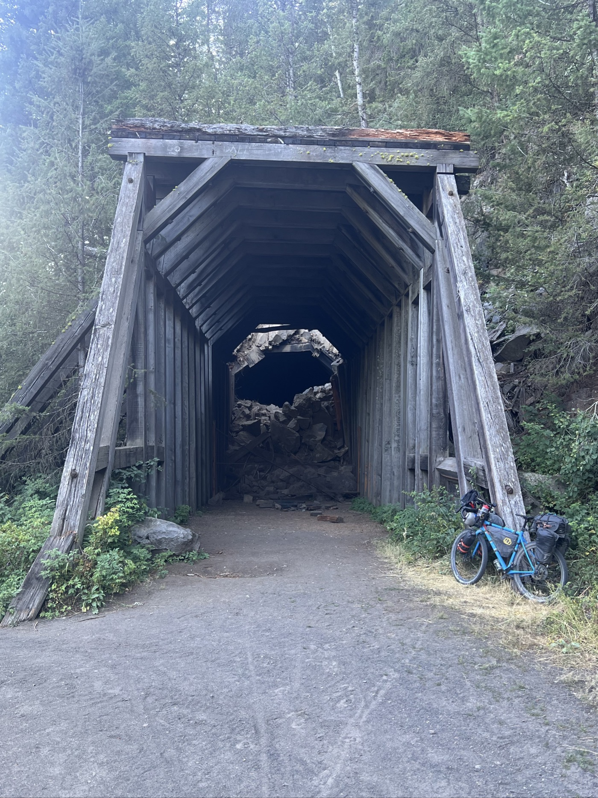
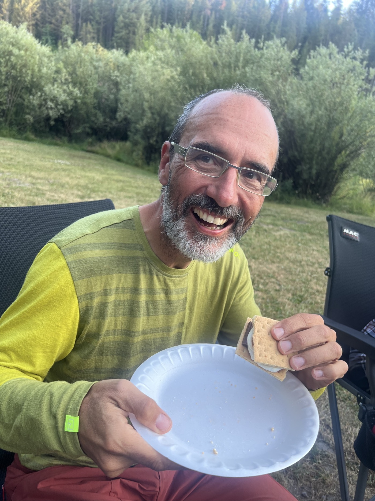

# 18. Old Oregon Short Line

<figure markdown>
{ width=“300†}
</figure>

I ride along the Red Rock Lakes Wildlife Refuge, battling a headwind all day. I enter the state of Idaho! Then I finish on an old railroad track that used to bring tourists to Yellowstone Park. I end up at the Warm River Campground with a great welcome.

<!-- more -->

# Goodbye Montana

I follow the Red Rock Lakes Refuge all morning—strong headwind. I avoid the first snake and run over the second one. Incredible; I always see them at the last moment. Apparently, you can encounter rattlesnakes here. I cross the source of the Missouri River (which flows into the Atlantic), and I’m right on the divide, the watershed line.

# Hello Idaho!

I pass a small pass and find myself in Idaho. The trail takes us through the northeastern corner of this state. I will only spend a day here (75 miles). Tomorrow I’ll enter Wyoming, which I’m told has even fewer inhabitants than Montana.

# Old Oregon Short Line 

I finish the day on a magnificent stretch of soft black volcanic sand. An old historic railway transformed into a trail. It ends with a tunnel (closed), a mandatory photo spot. The last stretch runs alongside the beautiful Warm River. I stop at the campground by the river.

# Great Welcome

Even though it’s not free, the caretaker finds me a half-price deal. And offers me a drink and a way to recharge my batteries. The spot is great, right by the river. I swim fully clothed; it serves as a shower/laundry. The water is 52 degrees Fahrenheit year-round, hence its name. It never freezes 😄. My neighbors invite me to dinner, a lovely family. Chili, cornbread, and I discover S’mores for dessert. So nice!

I rode well today (140 km), but there’s still a lot to go! Tomorrow, a glimpse of Grand Teton Park and the mountains if the weather is good. Then I’ll plunge into Wyoming...

<figure markdown>

{ width=“300†}

{ width=“300†}

{ width=“300†}

{ width=“300†}

{ width=“300†}

{ width=“300†}

{ width=“300†}

{ width=“300†}

{ width=“300†}

{ width=“300†}

{ width=“300†}

{ width=“300†}

</figure>
