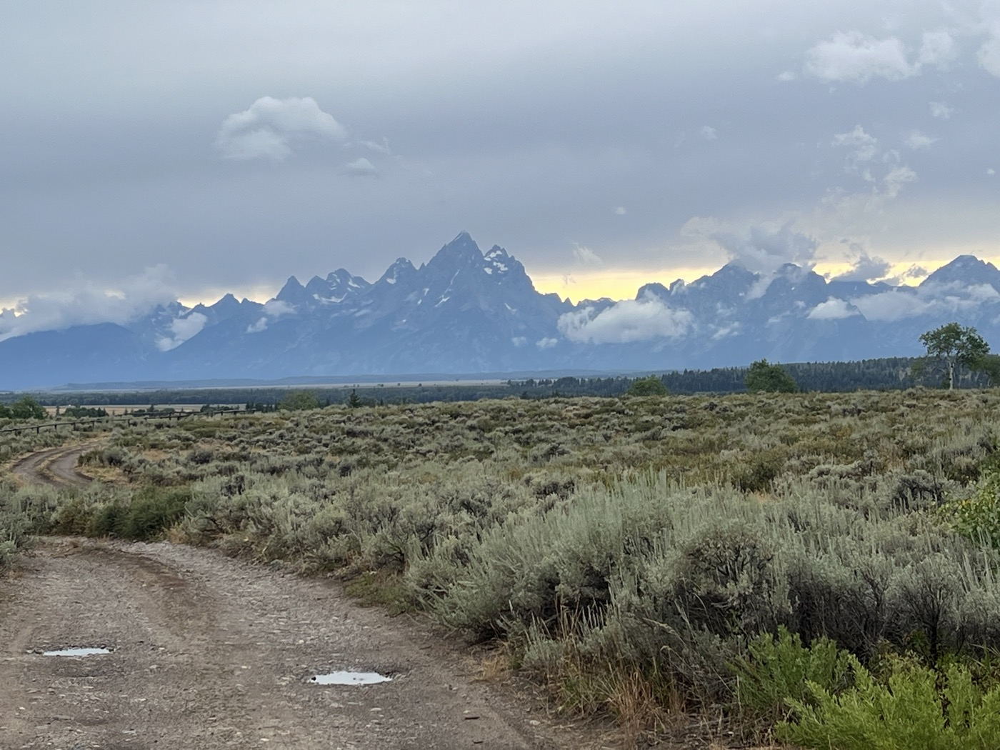
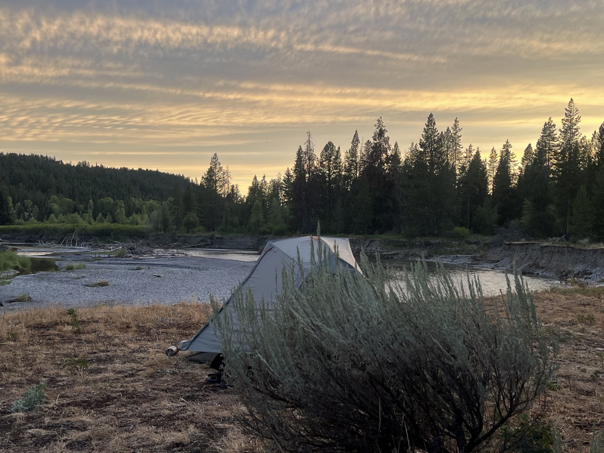

# 19. Welcome to Wyoming

<figure markdown>
{ width=“300†}
</figure>

I leave Warm River under heavy rain. I’ve pulled out all the stops for my clothing. It rains all morning (50 km and 900 m of elevation gain). I reach the summit with a bit of sunshine. I continue on to Grand Teton Park, then follow Buffalo Fork to end up at a... dream bivouac.

<!-- more -->

# Goodbye Idaho

I leave Idaho under heavy rain. It’s the perfect opportunity to test my pants, the jacket with a hood that covers the helmet, and of course, my waterproof socks. It’s a big climb, and I start off in the mud. Well, it just won’t budge! I’m pedaling, though! The mud is everywhere, and I’m slipping. It’s also clogging up around my wheel. I took a photo to show you (once I’m out of the muck). I should mention that I didn’t put a foot down!

That said, the climb is long. I save my sandwich for when I reach the top—it motivates me. The sun even honors me with an appearance, but overall, the day will remain very cloudy.

# Hello Wyoming!

I continue by changing parks: a brief passage through the John D. Rockefeller State Park (it’s going well, but it has burned quite a bit...). Then I arrive at Colton Bay, Jackson Lake, and the mountain ranges hidden by clouds, including Grand Teton, which gives its name to the park. On the road, there are many tourists; between Grand Teton and Yellowstone, there’s plenty to see. Given the weather, I decide to keep going and aim for the start of the next big climb to bivouac. The mountains and lake look very beautiful—but we can compare them to Lake Geneva and the Alps 💪. Still, everything here is wild 😉.

# Robert

I arrive in the area to stop and start looking for a spot. A big 4x4 pulls up next to me and asks if I’m looking for a place to sleep. Apparently, there’s a dream spot 300 m away. It’s little used since it’s not accessible by car. They escort me by car, and indeed, the spot is free and (...) beautiful. We shake hands with Robert, who comes from the Netherlands with his wife also in the car. Handshakes have a special meaning here. It’s a sign of respect more marked than in our culture (after all, we don’t know each other). He invites me to come over for a hot shower at his place tomorrow morning. I take note of the directions; I think a shower will be welcome. I just hope it doesn’t rain again. In any case, hats off to him for bringing me to this bivouac 🙏.

# Anecdote

I was wondering how these big ranches operate? Huge gates, enormous houses, endless lands. A few cows and...? How does it work? I’m explained at the campsite that a cow is worth about $2,000. They breed their herds and then sell them. Often for several generations, so the properties are no longer or are little indebted. The herds (which I’ve never really seen) can number in the thousands. These big owners are indeed quite well-off, and their ranches certainly show it.

# Tomorrow

Shower if all goes well 😉. Big and long climbs for a change. My next town should be Pinedale in about 2 days before crossing a desert (the Great Divide Basin). It will be a significant moment; we’ll talk more about it later. So I’ll continue the routine: bivouac and no network. I’ll just try to synchronize the blog when I pass through a covered area.

P.S. The waterproof socks work. Worn all day in damp shoes, and my feet come out dry. Thanks, Maxime!

<figure markdown>

{ width=“300†}

{ width=“300†}

{ width=“300†}

{ width=“300†}

{ width=“300†}

{ width=“300†}

{ width=“300†}

{ width=“300†}

{ width=“300†}

{ width=“300†}

{ width=“300†}

</figure>
