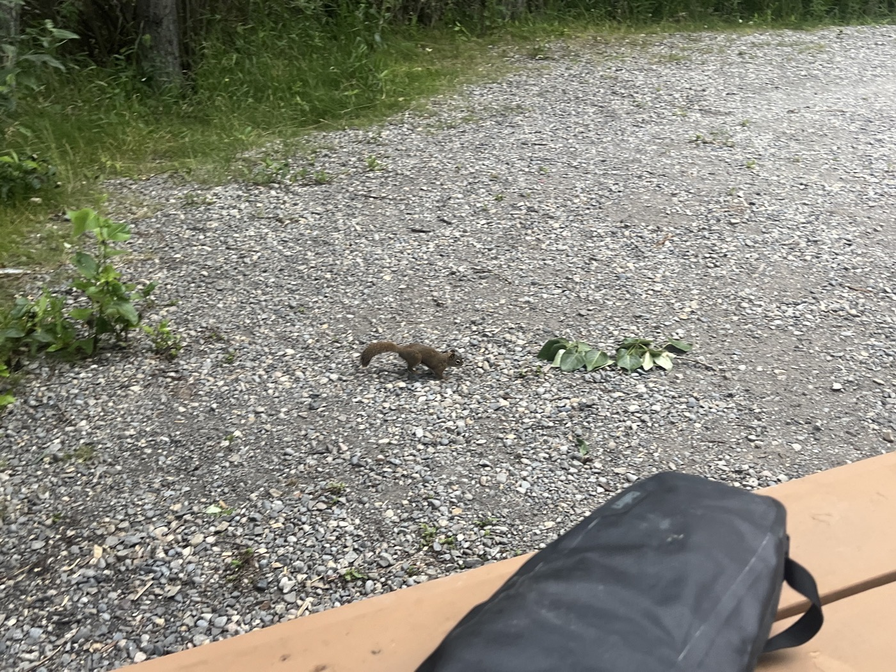
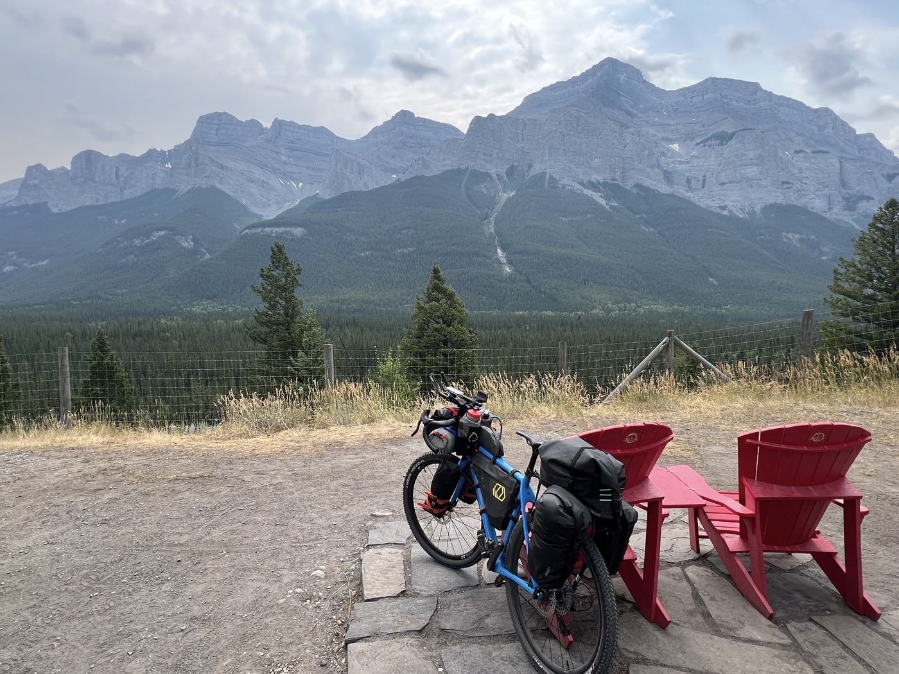

# Arrival in Banff

<figure markdown>
{ width=“300†}
</figure>

This time I will arrive in Banff! But with serious gravel (hike-a-bike style) to avoid the highway and the wind, then a top bike path. Good reception upon arrival, luck for camping.

<!-- more -->

Let’s dare: I choose the Gravel mode on Komoot to avoid the route along the highway and the wind. 10km longer via the TCT. So I find myself on tough terrain. Bear warning signs (it's berry season too) and hiking trails. I come across hikers (again) and then no one, with completely impassable sections. I get off my bike and push, carry, lift, and even climb stairs! And this is called the Transcontinental Canadian Trail (TCT)? There are even signs warning for cyclists. But it must be outdated 😅. So this is what "hike a bike" means in the land of maple.

I’m so happy to get out; my average speed took a huge hit. But the rest is magnificent (still TCT), this time it's a paved bike path.

Arriving in Banff - I start looking for a kind soul at the camping reception. "Everything is full"... but with a phone call, they are waiting for me 2km away for a spot - too good. I can't tell you the pleasure of the shower. Besides that, I had to walk almost 1 km between the entrance and my spot... in the middle of trees. The Canadians who come here must have a shock!

The day allowed me to find my bearings. Routines are starting to set in. I enjoy Banff a bit; I want one last check of the bike. It must have shaken in the plane; I tightened the derailleur cable and the front brake is a bit soft. I prefer the opinion of a seasoned expert before heading south and hitting the trail.

Lots of tourists in Banff, a beautiful town with Canmore as well. The visibility isn't great - they say it's smoke from Jasper.

See you tomorrow!

Ps: click on the photos to also see the comments 
<figure markdown>
{ width=“300†}

{ width=“300†}

{ width=“300†}

{ width=“300†}

{ width=“300†}

{ width=“300†}

{ width=“300†}

{ width=“300†}

{ width=“300†}

{ width=“300†}

{ width=“300†}
</figure>
